# Walkthrough JEINS — Da dove parto?

Hub unico per scegliere il percorso senza confondere **junior dev**, **design engineer**, **mid operativo** e **senior backend**.

---

## Mappa dei track

```mermaid
flowchart TB
    subgraph entry [Ingresso]
        PERCORSI[00-PERCORSI.md]
        FND[FOUNDATIONS<br/>PRE-DE-A]
    end
    subgraph craft [Craft e consegna]
        DE[DESIGN-ENGINEER<br/>PRE-DE-B + cap 0–10]
        ML[MID-LEVEL<br/>cap 0–10]
        FE[frontend<br/>moduli 1–7]
    end
    subgraph depth [Profondità]
        BE[BACKEND<br/>architettura server]
    end
    PERCORSI --> FND
    FND --> DE
    FND --> ML
    DE --> ML
    FE --> DE
    ML --> BE
```



| Cartella | Pubblico | Da → A (expertise) |
|----------|----------|---------------------|
| [FOUNDATIONS](./FOUNDATIONS/00-INDICE.md) | Mai usato git/React in produzione | **PRE-DE-A:** zero dev pratico → pronto per repo JEINS |
| [DESIGN-ENGINEER](./DESIGN-ENGINEER/00-INDICE.md) | Sa React base, **zero design engineering** | **PRE-DE-B** + craft → design engineer junior su JEINS |
| [MID-LEVEL](./MID-LEVEL/00-INDICE.md) | Junior sintassi React+Node | → **Mid autonomo** feature E2E |
| [frontend](./frontend/00-INDICE.md) | Studente / junior | → ingegnere FE che ragiona trade-off |
| [BACKEND](./BACKEND/00-INDICE.md) | Mid in transizione | → senior architettura server |

---

## Scegli il profilo

| Profilo | Parti da | Percorso |
|---------|----------|----------|
| **A** — Zero programmazione / mai git | [FOUNDATIONS](./FOUNDATIONS/00-INDICE.md) cap **0→4**, poi MID-LEVEL cap00 (rinforzo) | 3–5 settimane (~8–10 h/sett.) |
| **B** — Sa React a lezione, mai JEINS | [MID-LEVEL cap00](./MID-LEVEL/cap00-onboarding-mappa-repo.md) | 2–3 giorni |
| **C** — Sa React, **zero design engineering** | [PRE-DE-B](./DESIGN-ENGINEER/cap00-pre-de-b-fondamenta-design-engineering.md) → DESIGN-ENGINEER cap00→10 | 4–6 settimane |
| **D** — Vuole consegnare feature (DB→API→UI) | [MID-LEVEL](./MID-LEVEL/00-INDICE.md) cap0→1→2–5→9 | parallelo a C se tocca UI |
| **E** — Vuole architettura FE teorica | [frontend](./frontend/00-INDICE.md) | dopo B o in parallelo a C |
| **F** — Vuole profondità server | [BACKEND](./BACKEND/00-INDICE.md) | dopo D stabile |

**Regola:** non esiste la cartella `junior/` — “junior” è uno stadio, non una materia. Ogni track ha il proprio indice `00-INDICE.md`.

---

## PRE-DE-A vs PRE-DE-B (suddivisione)

| Blocco | Dove | Contenuto |
|--------|------|-----------|
| **PRE-DE-A** | `walkthrough/FOUNDATIONS/` cap **0–4** | Git, React/TS, HTTP/`apiCall`, avvio, prima modifica View |
| **PRE-DE-B** | `DESIGN-ENGINEER/cap00-pre-de-b-…` | Cos’è un design engineer, gerarchia, stati, feedback — **senza** aprire ancora `index.css` |

Dopo PRE-DE-A + PRE-DE-B: [DESIGN-ENGINEER cap00 mappa UI](./DESIGN-ENGINEER/cap00-come-usare-mappa-ui.md) → cap 1–10.

---

## Percorsi consigliati (timeline)

### Università — semestre UI / product engineering

```
Settimane 1–2:  FOUNDATIONS (PRE-DE-A) se profilo A, altrimenti MID-LEVEL cap00
Settimane 3–4:  PRE-DE-B + DESIGN-ENGINEER cap00–3
Settimane 5–7:  DESIGN-ENGINEER cap4–7 + MID-LEVEL cap01 (feature piccola)
Settimane 8–10: DESIGN-ENGINEER cap8–10 (capstone) + MID-LEVEL cap09 (PR)
```

### Tirocinio — prima feature in 2 settimane

```
Giorno 1–2: MID-LEVEL cap00 + cap01
Parallelo:  DESIGN-ENGINEER cap00-pre-de-b + cap02–3 (token/primitivi)
Giorno 3+:  MID-LEVEL cap02–4–9 con checklist DESIGN-ENGINEER cap09
```

---

## Link rapidi agli indici

| Track | Indice |
|-------|--------|
| Fondamenta dev (PRE-DE-A) | [FOUNDATIONS/00-INDICE.md](./FOUNDATIONS/00-INDICE.md) |
| Design Engineer | [DESIGN-ENGINEER/00-INDICE.md](./DESIGN-ENGINEER/00-INDICE.md) |
| Mid-Level playbook | [MID-LEVEL/00-INDICE.md](./MID-LEVEL/00-INDICE.md) |
| Frontend architecture | [frontend/00-INDICE.md](./frontend/00-INDICE.md) |
| Backend architecture | [BACKEND/00-INDICE.md](./BACKEND/00-INDICE.md) |

Documentazione di riferimento (non percorso guidato): `docs/`, `ARCHITETTURA.md`.

---

## Rubrica tutor — FOUNDATIONS (PRE-DE-A v2)

Usa [FOUNDATIONS/00-INDICE.md](./FOUNDATIONS/00-INDICE.md) per il dettaglio. Valutazione minima per **promuovere** al track successivo:

| Cap | Gate (tutti obbligatori per profilo A) |
|-----|----------------------------------------|
| 0 | PR draft git senza file sensibili |
| 1 | `npm run build` ok + spiega props vs state |
| 2 | GET `/api/clients` in Network, mock off |
| 3 | Esercizio Clienti 6 passi + log BE rimosso |
| 4 | PR solo View/Page; zero fetch in View |

**Promosso a PRE-DE-B / MID-LEVEL cap01 quando:** 5/5 gate ✅ + colloquio 10 min (traccia Page→hook→apiCall→route a voce).

---

*Hub percorsi v2 — maggio 2026*
