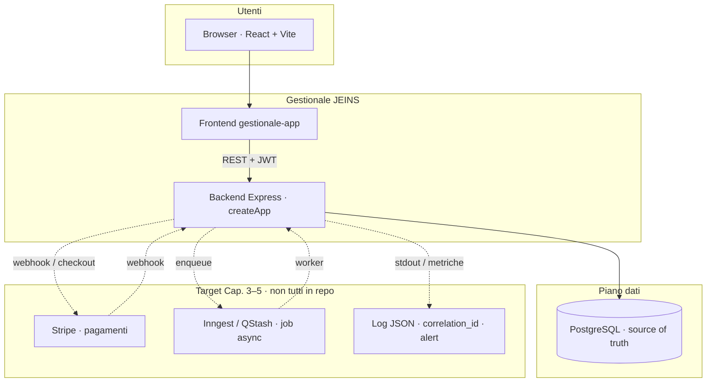
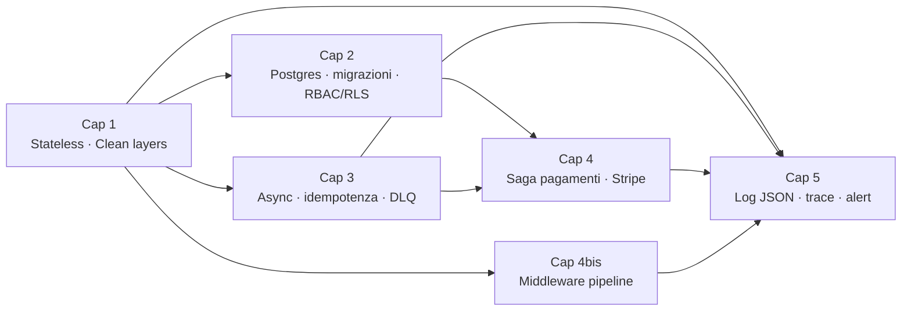

# Architecture & Engineering Manual — Backend Gestionale JEINS

**Pubblico:** developer mid-level in transizione verso Senior.  
**Non è:** un tutorial Node/Express, né una reference API riga-per-riga.  
**È:** un manuale su *perché* il sistema è così, *dove* rompe sotto carico, e *cosa* non è ancora stato costruito.

**Convenzioni del manuale**

- Ogni capitolo apre con **contesto architetturale** e chiude con **limiti noti + segnali d’allarme operativi**.
- I frammenti di codice citati sono solo **punti di ancoraggio** (bootstrap, auth, pool, migrazioni), non walkthrough completi.
- Le sezioni *Trade-off / Alternative scartate* e *Sotto carico ×100* sono obbligatorie dove indicate nell’indice.
- Documentazione esistente in `docs/` e `ARCHITETTURA.md` viene **referenziata**, non duplicata pedissequamente.
- Ogni capitolo redatto include **diagrammi Mermaid** (container, pattern, sequenze, stati) per la lettura ad alto livello.

---

## Panorama architetturale (mappe Mermaid)

### Sistema e confini (C4 semplificato)

### Pattern trasversali per capitolo

| Capitolo | Diagrammi principali |
|----------|----------------------|
| 1, 1bis, 2bis | Container, scale, layer, C4, failure matrix |
| 2, 8–10 | Pool, N+1, migrazioni, locking |
| 3, 3bis, 27 | Async, lifecycle, resilienza |
| 4, 4bis | Stripe saga, middleware pipeline |
| 5, 5bis, 25 | O11y, auth sequence |
| 6–7, 21–22 | Threat model, RBAC, REST |
| 11–20 | Moduli dominio (panorama) |
| 23–28, APPENDICI | Deploy, test, roadmap |

---

## Parte I — Sistema e confini

### Capitolo 1 — Fondamenta architetturali e flusso della richiesta ✅
📄 `01-fondamenta-architetturali-e-flusso-richiesta.md` · **Mermaid:** container, scale, layer, middleware, sequence request  
1.1 Modello stateless (Express vs Next Route Handler / Server Actions)  
1.2 Ciclo di vita richiesta e catena middleware  
1.3 Clean Architecture sul bordo HTTP (`routes` → `services` → `lib` → DB)  
1.4 Stato in memoria: cosa è vietato, eccezione `last_seen` throttle  
1.5 Errori classici di accoppiamento + checklist code review  
1.6 Trade-off monolite / JWT / SQL in route · **×100**  

### Capitolo 1bis — Contesto, obiettivi e vincoli del dominio ✅
📄 `01bis-contesto-dominio-vincoli.md`  
1.1 Business · 1.2 Confini · 1.3 Monolite modulare · 1.4 Vincoli Render · 1.5 Trade-off decomposizione  

### Capitolo 2 — Il livello dati: architettura, stato e type-safety ✅
📄 `02-livello-dati-architettura-stato-type-safety.md` · **Mermaid:** stack oggi/target, pool, N+1, Expand–Contract, RLS ibrido, optimistic lock, decision tree  
2.0 Stato reale (pg + SQL) vs target (Drizzle, Supabase RLS)  
2.1 Postgres come source of truth e pool `pg`  
2.2 Drizzle schema-first vs Prisma/TypeORM · E2E type safety  
2.3 N+1 · `attachTodosToProjects` e review query count  
2.4 Migrazioni zero-downtime Expand–Contract vs `ALTER` attuali  
2.5 Supabase RLS vs RBAC Node · modello ibrido  
2.6 Optimistic locking (`version`)  
2.7 Decision matrix · segnali d’allarme  

### Capitolo 2bis — Vista C4 (Container & Component) ✅
📄 `02bis-vista-c4-componenti.md`  
2.1 Container · 2.2 Component map · 2.3 E2E sequence · 2.4 Failure esterni · 2.5 ×100  

---

## Parte II — Runtime, async e modello di esecuzione

### Capitolo 3 — Motori asincroni ed event-driven design ✅
📄 `03-motori-asincroni-event-driven.md` · **Mermaid:** sync/async boundary, failure sequence, Inngest+QStash, idempotenza 3 livelli, DLQ  
3.0 Limiti request/response sincrono · cosa resta in HTTP  
3.1 Inngest vs QStash · ruoli e diagrammi  
3.2 **Dogma idempotenza** · `processed_jobs`, unique, provider keys  
3.3 Retry · backoff · jitter · errori transient vs permanent  
3.4 DLQ · replay · servizi terzi down  
3.5 Gap JEINS · roadmap minima  
3.6 **×100** · checklist review  

### Capitolo 3bis — Processo Node, bootstrap e lifecycle ✅
📄 `03bis-processo-node-lifecycle.md`  
3.1 server vs createApp · 3.2 Event loop · 3.3 Env · 3.4 Graceful shutdown gap · 3.5 Dev vs prod  

### Capitolo 4 — Transazioni distribuite e interazioni esterne (Stripe) ✅
📄 `04-transazioni-distribuite-interazioni-esterne.md` · **Mermaid:** ledger distribuito, stati payment, saga, race webhook, reconciliation, idempotenza  
4.0 Due ledger (Stripe vs Postgres) · stati payment vs contract  
4.1 Webhook: firma raw body, `event.id`, ACK 200 veloce  
4.2 Race webhook vs redirect success · poll · `sessions.retrieve`  
4.3 Timeout DB post-incasso · outbox · reconciliation · alert `reconcile_required`  
4.4 Idempotency-Key API Stripe + UNIQUE dominio · anti doppio addebito  
4.5 Gap JEINS (`contracts` manuali) · roadmap implementazione  

### Capitolo 4bis — Middleware chain come pipeline di sicurezza ✅
📄 `04bis-middleware-pipeline-sicurezza.md`  
4.1 Ordine `app.js` · 4.2 Perché l’ordine · 4.3 requestLog/PII · 4.4 Error handler · 4.5 Fallimenti · 4.6 ×100  

### Capitolo 5 — Osservabilità e telemetria ✅
📄 `05-osservabilita-telemetria.md` · **Mermaid:** pilastri o11y, stack ingest, console vs JSON, correlation, alert routing  
5.0 Perché `console.log` fallisce (serverless, N istanze, correlazione)  
5.1 Logging JSON (Pino) · livelli · campi · ×100 eventi/min  
5.2 Correlation ID · AsyncLocalStorage · `pg` / Drizzle · Inngest · Stripe metadata  
5.3 Alerting: rumore vs incidente · pool `pg` · SLO 5xx · multi-window  
5.4 Gap JEINS (`requestLog` testuale) · roadmap  

---

## Parte III — Sicurezza e identità

### Capitolo 5bis — Autenticazione: JWT, cookie, refresh ✅
📄 `05bis-autenticazione-jwt-cookie.md`  
5.1 Bearer + cookie · 5.2 Moduli auth · 5.3 Scadenze · 5.4 Flussi · 5.5 Trade-off · 5.6 Fallimenti · 5.7 ×100  

### Capitolo 6 — Registrazione elevata e superficie di abuso ✅
📄 `06-registrazione-elevata-abuso.md`  

### Capitolo 7 — Autorizzazione (RBAC) e accesso alle risorse ✅
📄 `07-autorizzazione-rbac.md`  

---

## Parte IV — Strato dati e persistenza

### Capitolo 8 — PostgreSQL come source of truth ✅
📄 `08-postgresql-source-of-truth.md`  

### Capitolo 9 — Strategia di migrazione e evoluzione schema ✅
📄 `09-strategia-migrazione-schema.md`  

### Capitolo 10 — Transazioni, consistenza e optimistic locking ✅
📄 `10-transazioni-consistenza-locking.md`  

---

## Parte V — Dominio applicativo (moduli API)

### Capitoli 11–20 — Moduli API (consolidato) ✅
📄 `11-20-dominio-applicativo-moduli-api.md`  
CRM · progetti · contratti · board · calendario · poll · messaggi · HR · utenti · activities  

---

## Parte VI — Contratti API e validazione

### Capitolo 21 — Design REST pratico ✅
📄 `21-design-rest-validazione.md`  

### Capitolo 22 — Paginazione, filtri e limiti ✅
📄 `22-paginazione-filtri.md`  

---

## Parte VII — Qualità, test e operazioni

### Capitolo 23 — Strategia di test ✅
📄 `23-strategia-test.md`  

### Capitolo 24 — Deploy e runtime produzione ✅
📄 `24-deploy-configurazione-produzione.md`  

### Capitolo 25 — Osservabilità operativa (supplemento) ✅
📄 `25-osservabilita-operativa.md` → vedi anche [Cap. 5](./05-osservabilita-telemetria.md)  

---

## Parte VIII — Scalabilità, resilienza e evoluzione

### Capitolo 26 — Collo di bottiglia ×100 ✅
📄 `26-collo-bottiglia-traffico.md`  

### Capitolo 27 — Pattern di resilienza ✅
📄 `27-pattern-resilienza.md`  

### Capitolo 28 — Roadmap e debito tecnico ✅
📄 `28-roadmap-debito-tecnico.md`  

---

## Parte IX — Appendici ✅

📄 `APPENDICI.md` — A mappa file · B endpoint · C RBAC · D glossario · E checklist · F migrazioni SQL  

---

## Ordine di redazione proposto (dopo approvazione indice)

| Fase | Capitoli | Motivo |
|------|----------|--------|
| **A** | 1–5, 1bis, 2bis, 3bis, 4bis, 8–10 | ✅ Completata |
| **B** | 5bis–7, 21–22 | ✅ Completata |
| **C** | 11–20 (file consolidato) | ✅ Completata — espandibile per-modulo in sprint |
| **D** | 23–28, Appendici | ✅ Completata |

---

## Elenco file manuale

| File | Capitolo |
|------|----------|
| `00-INDICE.md` | Indice |
| `01` … `05` | Fondamenta, dati, async, Stripe, o11y |
| `01bis` … `05bis` | Contesto, C4, lifecycle, middleware, auth |
| `06` … `10` | Sicurezza, dati ops, transazioni |
| `11-20` | Domini API |
| `21` … `28` | REST, test, deploy, scala, roadmap |
| `APPENDICI.md` | A–F |

---

*Stato documento: **indice completo** — tutti i capitoli dell’indice hanno un file dedicato o sezione consolidata (11–20). Profondità maggiore possibile in sprint futuri su singoli domini API.*
