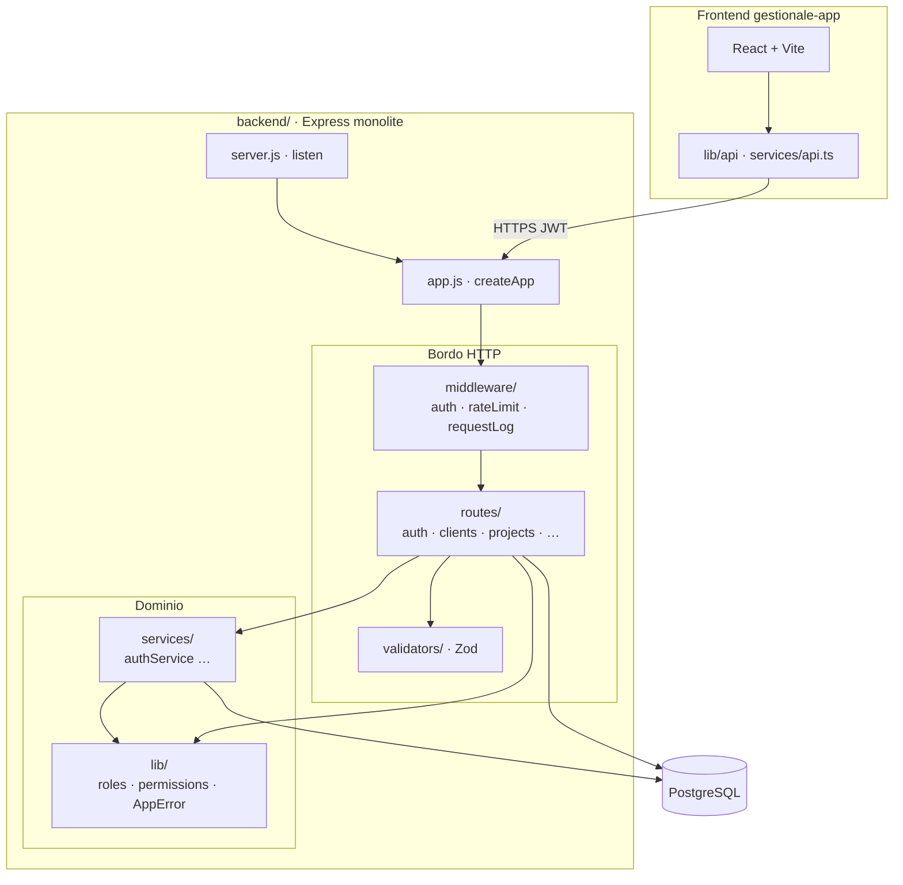
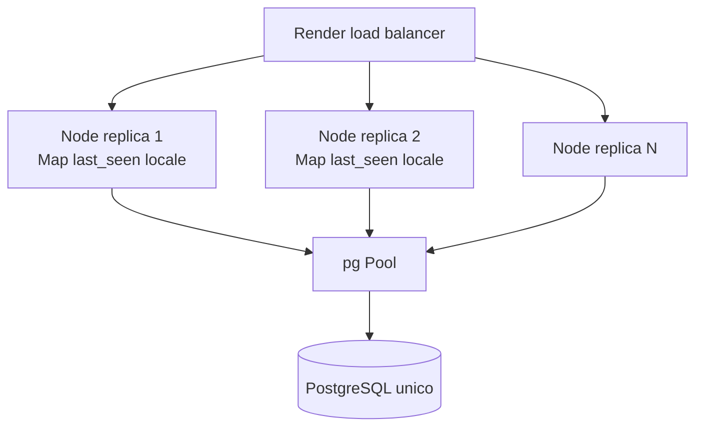
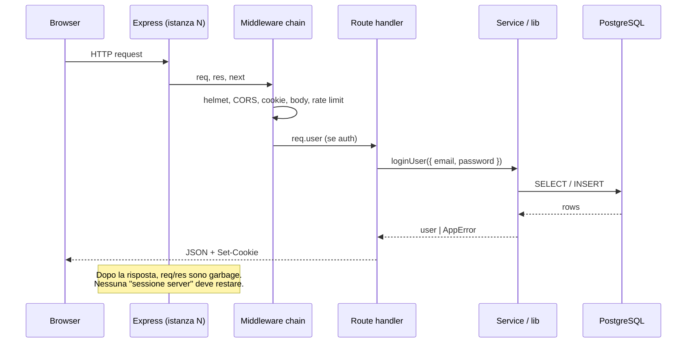
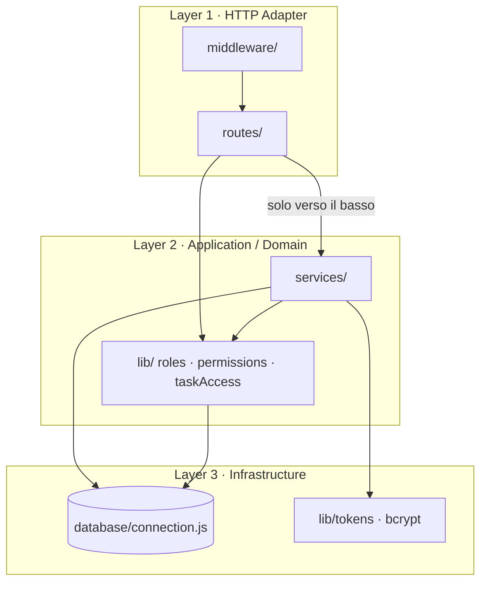
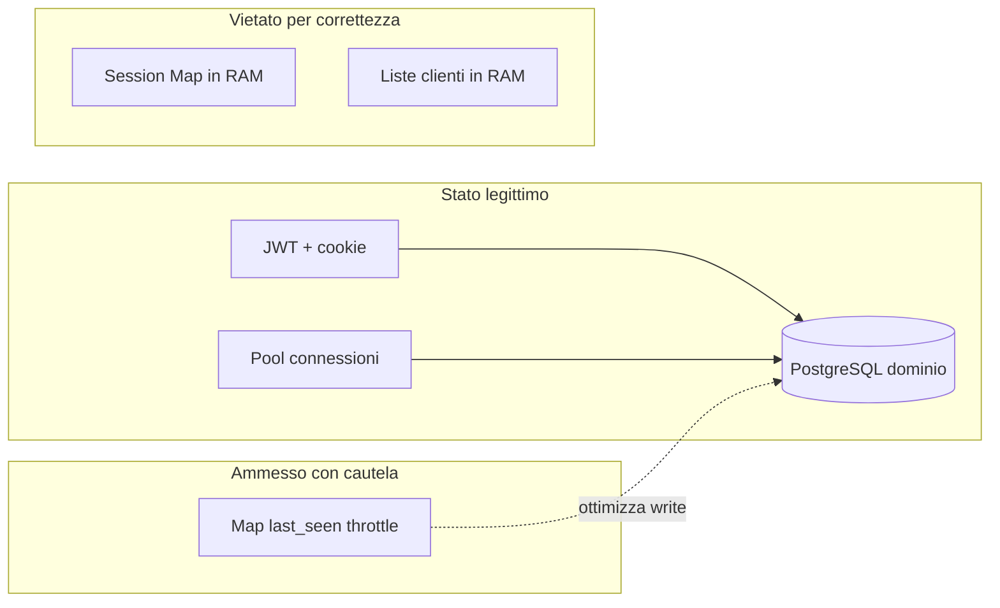
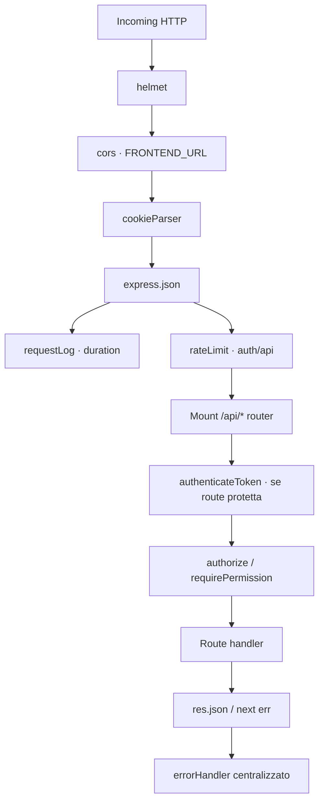
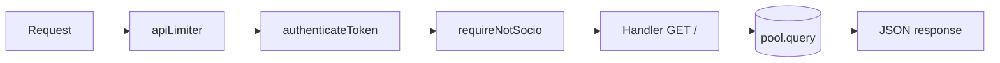

# Capitolo 1 — Fondamenta architetturali e flusso della richiesta

> **Prerequisito mentale:** leggi questo capitolo come se stessi facendo code review a un junior che confonde “il server” con “una sessione utente persistente”.  
> **Nota di onestà architetturale:** Gestionale JEINS **non** gira su Next.js. Il backend è **Node.js + Express** deployato su Render; il frontend è **React + Vite**. I concetti che userai in produzione su **Route Handler / Server Actions** (Next.js App Router) o su **funzioni serverless/edge** sono **gli stessi vincoli fisici** che governano Express: **nessuno stato affidabile tra due richieste HTTP**.

### Mappa componenti (alto livello)



---

## 1.1 Perché parliamo di “serverless” anche su un monolite Express

“Serverless” non significa “senza server”. Significa:

1. **Unità di lavoro = singola richiesta** (o singola invocazione di funzione).
2. **Il runtime può essere riciclato o distrutto** in qualsiasi momento dopo la risposta.
3. **La scalabilità orizzontale** aggiunge *N* copie identiche dello stesso codice, **senza coordinamento in RAM** tra di esse.

Su Render oggi hai un processo Node long-lived (`server.js` → `app.listen`). Su Vercel con Next.js avresti istanze effimere per ogni Route Handler. La differenza operativa è **quanto spesso** il processo muore; la differenza **ingegneristica** è **zero**: se metti stato in una `Map` globale, stai scommettendo che tutte le richieste dello stesso utente finiscano sulla stessa istanza — scommessa che in orizzontale **perdi**.

| Concetto | Next.js (App Router) | Questo progetto (Express) |
|----------|----------------------|---------------------------|
| Entry point HTTP | `app/api/.../route.ts`, Server Actions | `routes/*.js` montati in `app.js` |
| Composizione app | middleware Next, `middleware.ts` edge | catena `app.use(...)` in `createApp()` |
| “Dove muore la richiesta” | fine handler / `return Response` | `res.json()` / `next(err)` |
| Stato condiviso vietato | tra invocazioni Lambda-like | tra richieste sullo **stesso** processo *e* tra repliche |

**Trade-off:** monolite Express long-lived vs funzioni isolate. Il monolite riduce cold start e semplifica il pool DB; aumenta il rischio che un anti-pattern in memoria “funzioni finché non scaliamo”.

### Scale orizzontale: perché la RAM non è condivisa



Ogni replica esegue lo **stesso** `createApp()` ma **non** vede la RAM delle altre. Stato dominio solo in **PG** (o store esterno esplicito: Redis, coda).

---

## 1.2 Il ciclo di vita di una richiesta (modello stateless)

Ogni `POST /api/auth/login` o `GET /api/clients` segue lo stesso contratto:



### Fasi obbligatorie (indipendenti dal framework)

| Fase | Responsabilità | Deve sapere di HTTP? |
|------|----------------|----------------------|
| **Trasporto** | TLS, CORS, cookie, header | Sì (limitato) |
| **Sicurezza perimetrale** | rate limit, helmet, validazione input | Sì |
| **Identità** | JWT/cookie → `req.user` | Sì |
| **Autorizzazione** | RBAC, permessi su risorsa | Raramente (meglio in service) |
| **Caso d’uso** | regole di business | **No** |
| **Persistenza** | SQL transazionale | **No** (solo tramite port) |
| **Risposta** | status code, shape JSON, cookie | Sì (solo nel bordo) |

**Regola Senior:** tutto ciò che serve per rispondere alla richiesta *corrente* deve essere **ricostruibile** da: header/cookie/body + database + secret env. Se manca uno di questi, la richiesta deve fallire in modo esplicito (401/403/400), non “funzionare a volte” grazie a RAM.

### Cosa succede in `server.js` vs `createApp()`

```54:117:backend/app.js
export function createApp() {
    const app = express();
    app.use(helmet({ crossOriginResourcePolicy: { policy: 'cross-origin' } }));
    // ... middleware globali ...
    app.use('/api/auth', authRoutes);
    app.use('/api/clients', clientsRoutes);
    // ... error handler, 404 ...
    return app;
}
```

`createApp()` **non** apre la porta: costruisce solo il grafo middleware+route. È lo stesso motivo per cui in Next separeresti “definizione app” da “avvio runtime”: i test (`app.test.js`) importano l’app **senza** bind su `:3000`. In serverless non ascolti porte: esporti un handler. Il pattern è identico: **bootstrap ≠ business logic**.

---

## 1.3 Clean Architecture sul bordo HTTP: chi fa cosa

Non stiamo implementando un DDD completo con Use Case interface e repository ovunque. Stiamo applicando una **regola di dipendenza** pragmatica, adatta a un team piccolo:



**Regola:** `routes` non importano `pool` per logica complessa se esiste (o dovrebbe esistere) un `*Service` — oggi il rispetto è **parziale** (auth sì, molti domini no).

### Analogia Next.js (per chi arriva dal frontend App Router)

| Layer JEINS | Equivalente mentale Next.js | Errore tipico del junior |
|-------------|----------------------------|---------------------------|
| `routes/auth.js` | Route Handler `POST` / Server Action wrapper | SQL e `bcrypt` dentro il file `route.ts` |
| `services/authService.js` | funzione in `lib/auth.ts` richiamata da server | `cookies()` e `pool.query` mescolati |
| `validators/authSchemas.js` | Zod schema + parse in bordo | validazione solo lato client |
| `middleware/auth.js` | `middleware.ts` o guard in layout server | query utente ripetuta in ogni route a mano |

**Perché separare Route da business pura**

1. **Testabilità:** `loginUser` si testa con `node --test` senza supertest e senza mock di `req/res`.
2. **Riuso:** la stessa logica può servire CLI (`scripts/create_admin_user.js`), job futuri, o un secondo adapter (GraphQL, queue worker) senza copia-incolla.
3. **Sicurezza:** il bordo HTTP è dove sbagli status code e leakage di stack trace; isolandolo, il service lancia `AppError` e il bordo traduce in HTTP **una volta sola** (pattern ancora in evoluzione nel repo).
4. **Deploy:** in un mondo serverless, il bundle del Route Handler deve restare sottile per cold start; la logica pesante sta in moduli importati tree-shakeable.

### Esempio **corretto** (auth): bordo sottile, service spesso

**Bordo** — orchestra, non decide regole di registrazione:

```40:44:backend/routes/auth.js
router.post('/register', registerLimiter, validateBody(registerSchema), async (req, res, next) => {
    try {
        const { name, email, password, area, managerCode } = req.body;
        const user = await registerUser({ name, email, password, area, managerCode });
        sendAuthSuccess(res, user, 201);
```

**Service** — conosce utenti, ruoli, DB; ignora Express:

```8:30:backend/services/authService.js
export async function registerUser({ name, email, password, area, managerCode }) {
    const roleResult = await resolveRegistrationRole(managerCode);
    if (roleResult.error) {
        throw new AppError(roleResult.error, roleResult.status);
    }
    // ... duplicate email, hash password, INSERT ...
    return result.rows[0];
}
```

**Lib** — meccanismi riusabili (`registrationRoles`, `tokens`, `permissions`).

Questo è il pattern che vuoi replicare su **ogni** dominio. Oggi **non** è uniforme: vedi §1.6.

---

## 1.4 Perché il backend non deve tenere stato in memoria

### Il problema in una frase

Se la verità è nella RAM del processo, **non hai un source of truth** — hai una cache non invalidata che mente quando:

- Render avvia una seconda istanza;
- fai deploy rolling (due versioni per secondi);
- il processo crasha e riparte vuoto;
- in futuro sposti API su worker serverless.

### Cosa è **ammesso** in memoria (e cosa no)

| In RAM | Ammesso? | Condizione |
|--------|----------|------------|
| Pool connessioni `pg` | Sì | è **cache di connessioni**, non di dominio; stato ricostruibile |
| Config env (`dotenv`) | Sì | immutabile a runtime |
| `Map` utente → timestamp `last_seen` | **Attenzione** | vedi sotto — è ottimizzazione, non verità |
| “Lista clienti corrente” | **No** | deve stare in PostgreSQL |
| Sessioni utente server-side | **No** (scelta progetto) | usiamo JWT + reload ruolo da DB |
| Rate limit in-memory default | Fragile | con più istanze il limite si moltiplica |

### Debito tecnico reale nel repo: throttle `last_seen`

```5:14:backend/middleware/auth.js
const LAST_SEEN_INTERVAL_MS = 60_000;
const lastSeenUpdatedAt = new Map();

async function touchLastSeen(userId) {
    const now = Date.now();
    const prev = lastSeenUpdatedAt.get(userId) || 0;
    if (now - prev < LAST_SEEN_INTERVAL_MS) return;
    lastSeenUpdatedAt.set(userId, now);
    await pool.query('UPDATE users SET last_seen = NOW() WHERE user_id = $1', [userId]);
}
```

**Code review Senior:**

- **Pro:** riduce write DB su ogni request autenticata (problema reale sotto traffico).
- **Contro:** la `Map` cresce con utenti distinti; su istanze multiple il throttle **non è globale** (ogni replica fa fino a 1 write/minuto per utente → accettabile per presenza, inaccettabile per billing).
- **Se scala ×100:** sposta debounce su Redis `SET last_seen:{userId} NX EX 60` o accetta write batch/async su coda.

**Lezione:** non è “vietato RAM”, è vietato che **la correttezza del sistema dipenda da RAM**. Qui la correttezza della presenza online non dipende dalla Map: al massimo fai qualche `UPDATE` in più.

### Dove vive lo stato **legittimo** in questo sistema

| Stato | Dove | Perché |
|-------|------|--------|
| Sessione auth | JWT (claim) + cookie httpOnly + riga `users` | verificabile senza sticky session |
| Permessi effettivi | derivati da `role`/`area` in DB a ogni `authenticateToken` | revoca ruolo non richiede invalidare tutti i JWT immediatamente se ricarichi ruolo (trade-off: JWT ancora valido fino a scadenza — vedi Cap. 5) |
| Dati di dominio | PostgreSQL | ACID, query, vincoli |
| Idempotenza / job | **non implementati** | gap architetturale |



---

## 1.5 Flusso end-to-end commentato: `GET /api/clients`

### Pipeline middleware globale (`app.js`)

Ordine reale che ogni richiesta attraversa — **non** arbitrario (Cap. 4bis approfondisce failure modes):





1. **`apiLimiter`** — protegge il perimetro `/api` (non sostituisce auth).
2. **`authenticateToken`** — estrae token, verifica firma, **ricarica utente dal DB** (`loadUser`), popola `req.user`. Nessun “utente loggato” globale.
3. **`requireNotSocio`** — decisione RBAC nel bordo (accettabile per dichiaratività route; alternativa: un solo `authorize('viewClients')`).
4. **Handler** — oggi contiene **SQL inline** (accoppiamento da ridurre).

Il handler legge `req.query`, costruisce `WHERE` in base a `req.user.role`, esegue query. Tutto ciò che serve è arrivato su `req` in questa richiesta o nel DB — **non** in variabili globali di modulo (eccetto pool).

---

## 1.6 Errori classici di accoppiamento (checklist da code review)

### ❌ 1. Logica di business nel route handler

**Sintomo:** file `routes/clients.js` con 200 righe di SQL, branching ruoli, mapping JSON.

**Perché è grave:** non testi senza HTTP; duplichi regole in `routes/projects.js`; in Server Actions Next duplicheresti tra `route.ts` e `action.ts`.

**Direzione corretta:** `clientsService.list(user, pagination)` → route di 10 righe.

---

### ❌ 2. `req` / `res` passati al service

**Sintomo:** `async function createClient(req, res)`.

**Perché è grave:** il dominio dipende da Express; in serverless non esiste `res.cookie` nel core.

**Corretto:** `createClient({ userId, role, area }, payload)` → il route imposta cookie/header.

---

### ❌ 3. Variabili globali mutabili per “sessione”

**Sintomo:** `let currentUser`, `global.sessions = {}`, array in memoria con push su login.

**Perché è grave:** con 2 istanze, utente A logga su istanza 1 e la richiesta successiva va su istanza 2 → 401 o dati di un altro utente.

**Corretto:** JWT + DB, oppure Redis session store **esterno** al processo.

---

### ❌ 4. Assumere che il processo Node sia uno solo

**Sintomo:** file upload in `/tmp` locale referenziato da URL senza object storage; lock in-memory per “evitare doppio click”.

**Sotto ×100:** due tab, due istanze → race. Usa vincolo DB (`version`, `UNIQUE`) o coda.

---

### ❌ 5. Side effect nascosti nell’import

**Sintomo:** `import './database/connection.js'` che al load fa `pool.query('SELECT NOW')` e logga.

**Nel repo:** il pool è creato a import — accettabile, ma ogni test/import avvia side effect; preferibile lazy connect esplicito in bootstrap.

---

### ❌ 6. Error handling duplicato e incoerente

**Sintomo:** ogni route con `if (error instanceof AppError)` copia-incollato; alcune route `return res.status(500)` senza `next(error)`.

**Direzione:** middleware error handler unico (già in `app.js`) + route che fa solo `next(err)`.

---

### ❌ 7. Confondere “validazione” con “autorizzazione”

**Sintomo:** Zod controlla email/password ma il ruolo `Admin` arriva dal body.

**Nel repo (corretto):** `registerUser` ignora ruolo client; `resolveRegistrationRole(managerCode)` decide.

---

## 1.7 Trade-off espliciti di questa fondazione

| Scelta | Vantaggio | Costo / limite |
|--------|-----------|----------------|
| Monolite Express | debug semplice, un deploy, pool condiviso | blast radius deploy unico |
| JWT stateless | scale orizzontale facile | revoca fine-grained difficile senza denylist/short TTL |
| SQL in route (stato attuale) | velocità delivery | debito test e duplicazione |
| `createApp()` factory | test senza porta | non è ancora full DI container |
| Reload ruolo da DB a ogni request | RBAC aggiornato | +1 query hot path (collo sotto ×100) |
| Nessuna coda eventi | meno moving parts | operazioni lunghe bloccano request |

**Alternative scartate (per ora):**

- **Sticky session** su load balancer — compensa stato in RAM invece di eliminarlo.
- **Microservizi per dominio** — overhead operativo non giustificato dalla scala team/traffico.
- **GraphQL BFF** — duplicazione contratto con frontend già allineato su REST.

---

## 1.8 Sotto carico ×100: cosa rompe per primo

Ordine realistico **senza** cambiare codice:

1. **PostgreSQL** — connessioni pool esaurite, query N+1 (`attachTodosToProjects`), assenza read replica.
2. **`authenticateToken` + `loadUser`** — query utente su ogni endpoint protetto.
3. **Processo Node singolo su Render** — CPU event loop satura prima di “scalare bene” se handler fanno lavoro sincrono pesante (bcrypt batch, JSON enormi).
4. **Rate limiter in-memory** (se esteso per IP) — non coordinato tra repliche.
5. **Logging sincrono** su stdout (`requestLog`) — I/O blocca event loop.

**Cosa *non* esplode subito:** separazione `authService` — è già pronta per estrarre hot path in worker.

---

## 1.9 Standard minimo prima di approvare una PR (bordo HTTP)

Usa questa checklist come Senior sul diff:

- [ ] Il route **non** introduce `Map` / array globali per dati utente o dominio.
- [ ] Input validato al bordo (Zod o equivalente); nessun campo di sicurezza (`role`) fidato dal client.
- [ ] Regole di business chiamano `services/*` o `lib/*` testabili senza Express.
- [ ] Errori propagati con `next(err)` o `AppError` — shape JSON coerente.
- [ ] Query parametrizzate (`$1`) — mai concatenazione stringhe SQL con input utente.
- [ ] Autorizzazione esplicita (`authorize`, `requirePermission`, `canAccess*`) prima di write.
- [ ] Risposta HTTP tradotta nel route; service restituisce dati o lancia errori di dominio.
- [ ] Se aggiungi cache in RAM, documenta **cosa succede con 2 istanze** e perché la correttezza non dipende da essa.

---

## 1.10 Collegamenti e prossimi capitoli

- **[Cap. 1bis](./01bis-contesto-dominio-vincoli.md)** — dominio e vincoli.
- **[Cap. 2bis](./02bis-vista-c4-componenti.md)** — vista C4 e component map.
- **[Cap. 4bis](./04bis-middleware-pipeline-sicurezza.md)** — middleware e failure modes.
- **[Cap. 5bis](./05bis-autenticazione-jwt-cookie.md)** — JWT, refresh, cookie.
- **Documentazione operativa:** `docs/RBAC.md`, `ARCHITETTURA.md`, `docs/ROADMAP-BACKEND.md`.

---

### Sintesi da incollare nella testa

> **Una richiesta HTTP non è una stanza in cui vivi: è un incidente che attraversa il datacenter e deve uscire con una risposta.**  
> Il route handler è la portineria; il service è il contratto; PostgreSQL è la memoria.  
> Se la tua feature funziona solo perché “ieri era nel singleton”, non è pronta per Render né per Vercel.

---

*Capitolo 1 — bozza v1. Allineato al codice in `backend/` a maggio 2026.*
