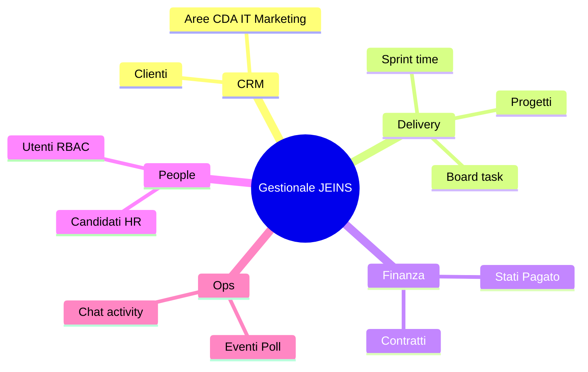
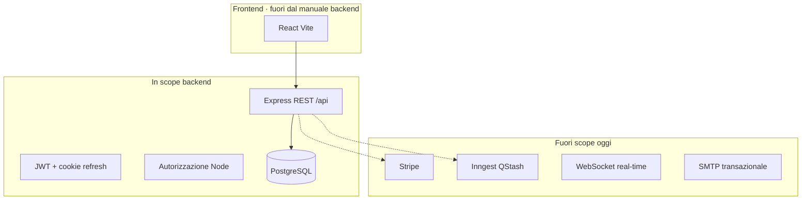

# Capitolo 1bis — Contesto, obiettivi e vincoli del dominio

> **Prerequisito:** [Cap. 1](./01-fondamenta-architetturali-e-flusso-richiesta.md)  
> **Riferimenti:** `ARCHITETTURA.md`, `docs/GLOSSARY.md`, `docs/RBAC.md`

---

## 1bis.1 Problema di business

Gestionale JEINS è il **sistema operativo** di un’associazione che gestisce:

| Area | Entità principali | Valore per l’organizzazione |
|------|-------------------|----------------------------|
| Commerciale | `clients`, stati pipeline | prospect → attivo |
| Delivery | `projects`, `todos`, `tasks`, board | esecuzione e visibilità |
| Finanza | `contracts` (contratto/fattura/preventivo) | tracciamento incassi (oggi manuale) |
| People | `users`, `candidates`, `onboarding` | accessi e recruiting |
| Coordinamento | `events`, `polls`, RSVP, `messages` | calendario e decisioni |

Il backend **non** è un CRM SaaS multi-tenant: è **un tenant** (l’associazione), con ruoli interni (`Socio`, `Responsabile`, `Admin`, `CDA`, …).

---

## 1bis.2 Confini del sistema

| Responsabilità | Dove vive |
|----------------|-----------|
| Validazione form UX | Frontend |
| Regole business e permessi | Backend (+ vincoli DB) |
| Persistenza | PostgreSQL |
| File statici UI | Render static site / CDN frontend |

---

## 1bis.3 Stile architetturale attuale

**Monolite modulare Express** — un processo, molte route per dominio, **non** microservizi, **non** event-driven in produzione.

**Vantaggi per team piccolo:** un deploy, un log stream, debug lineare.  
**Limiti:** blast radius del deploy, scalabilità verticale del processo Node prima di estrarre servizi.

---

## 1bis.4 Vincoli espliciti

| Vincolo | Implicazione |
|---------|--------------|
| Deploy Render | `migrate:deploy && npm start`, health `/health` |
| Nessun Redis / broker | rate limit e `last_seen` throttle in RAM per replica |
| Backend JavaScript | type-safety E2E parziale |
| PostgreSQL unico primary | no read replica nel design |
| Documentazione in `docs/` | manuale backend non sostituisce runbook operativi |

---

## 1bis.5 Trade-off: monolite vs servizi

| Quando il monolite basta | Quando decomporre |
|--------------------------|-------------------|
| < ~50 req/s sostenuti, team < 5 dev | isolare pagamenti (PCI), PDF pesanti, notifiche massive |
| RBAC in un solo posto | team autonomi per dominio con release indipendenti |
| Un DB transazionale | bisogno di datastore specializzati (search, analytics) |

**Regola JEINS:** non estrarre microservizio finché un **collo misurato** (Cap. 26) non giustifica il costo ops.

---

*Capitolo 1bis — v1*
