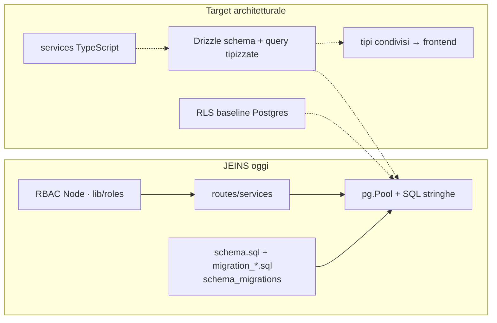
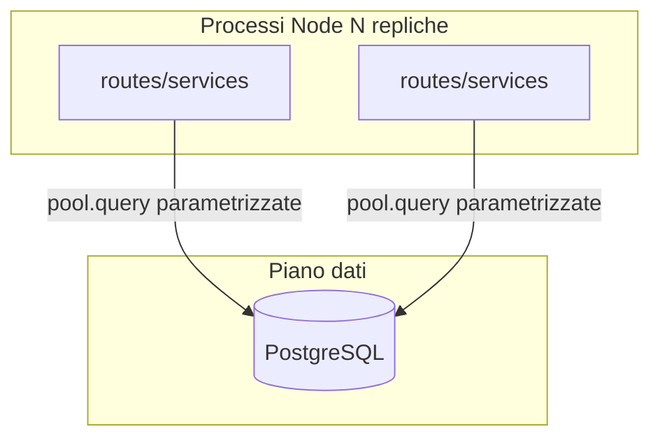
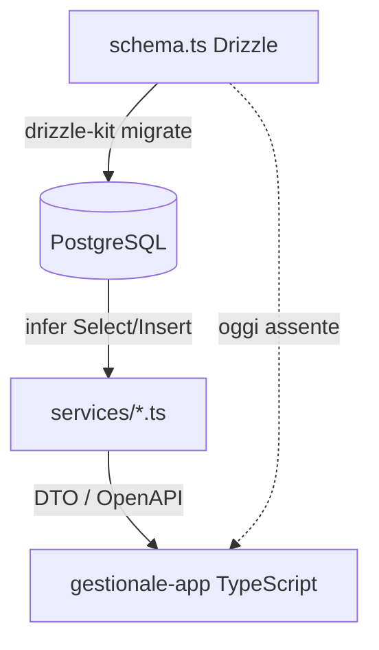
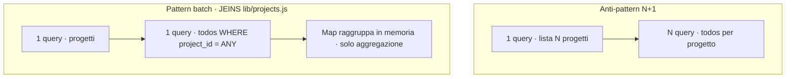
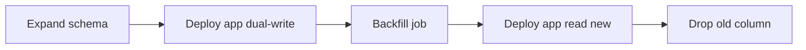
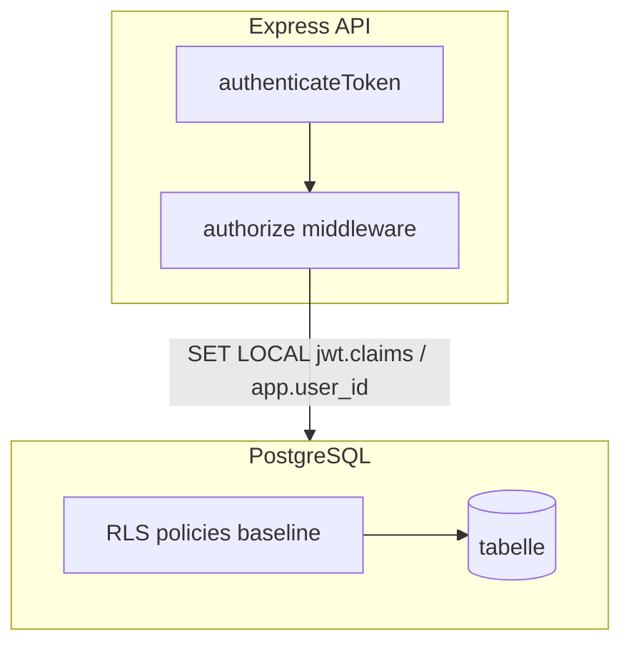
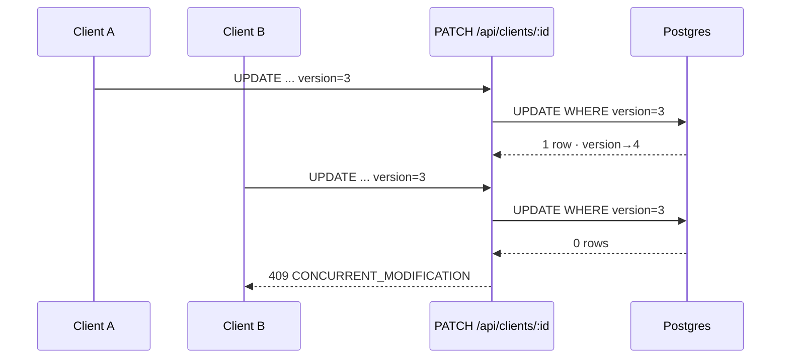
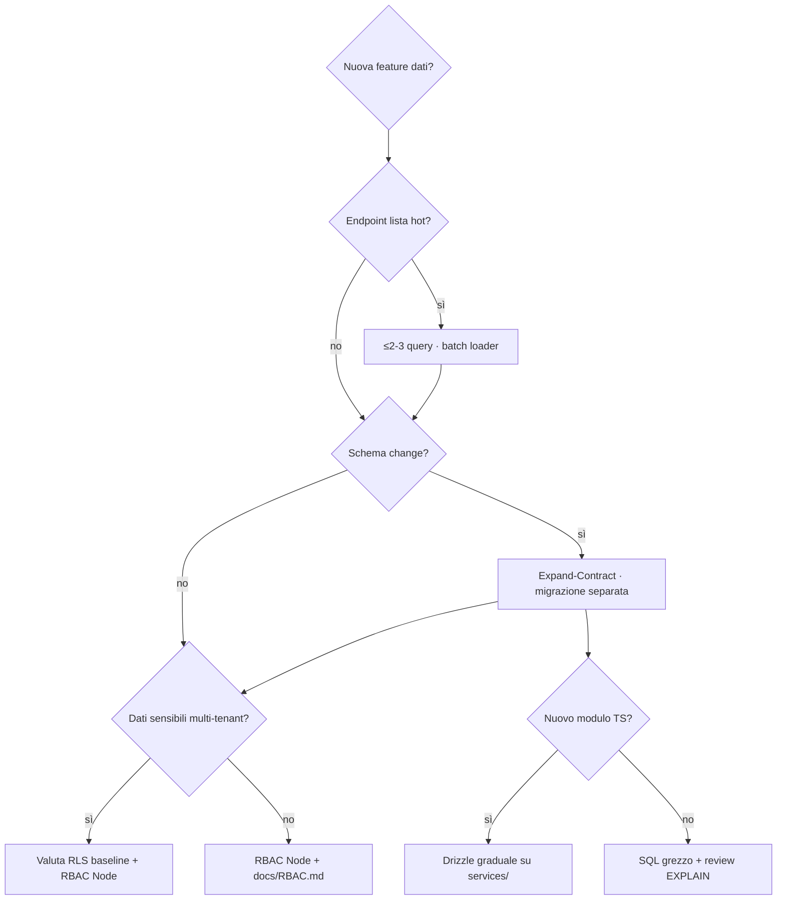

# Capitolo 2 — Il livello dati: architettura, stato e type-safety

> **Prerequisito:** [Capitolo 1 — Fondamenta e flusso richiesta](./01-fondamenta-architetturali-e-flusso-richiesta.md)  
> **Pubblico:** mid-level che conosce SQL ma tratta il database come “dettaglio implementativo” invece che come **sistema distribuito con lock, vincoli e politiche di accesso**.

---

## 2.0 Stato reale vs ecosistema target (leggilo prima di tutto)

Questo capitolo tratta **Postgres, Drizzle ORM e Supabase (RLS)** perché formano lo stack dati che molti team associano a prodotti moderni TypeScript. **Gestionale JEINS oggi non li usa tutti come path principale.**

| Componente | Nel manuale (concetti) | **In questo repo (maggio 2026)** |
|------------|------------------------|----------------------------------|
| **PostgreSQL** | Source of truth, ACID, migrazioni | ✅ `pg.Pool`, SQL in `routes/*` e `services/*` |
| **Drizzle ORM** | Schema-first, query tipizzate | ❌ non è il path di runtime; storico `database/drizzle/` rimosso/non attivo |
| **Supabase** | Hosting Postgres + RLS | ⚠️ Postgres può essere su Render/**o** Supabase come host; **RLS non è abilitata** — RBAC in Node (`middleware/authorize.js`, `lib/roles.js`) |
| **Type-safety E2E** | TS ↔ schema | Parziale: backend **JavaScript**; frontend TypeScript con tipi manuali / API |

**Perché scrivere comunque di Drizzle e RLS:** sono le decisioni che un Senior valuta *prima* di accumolare 15 file `routes/*.js` con SQL inline. Il capitolo separa **principio ingegneristico** da **debito attuale**, così sai cosa difendere in review e cosa migrare senza finta narrativa.

### Stack dati: oggi vs target



---

## 2.1 Postgres come unico stato autoritativo del dominio

### Cosa non è il database in questo sistema

PostgreSQL **non** è una cache del backend. Non è un dump temporaneo finché “sincronizziamo Redis”. È il posto dove:

- vivono vincoli (`CHECK` su status cliente, `UNIQUE` email utente);
- si definiscono cascate (`ON DELETE CASCADE` da `clients` a `projects`);
- si serializzano scritture concorrenti (row lock su `UPDATE` con `version`);
- si sopravvive al restart di qualsiasi istanza Node.



### Pool `pg`: cosa cacheggia (e cosa no)

```14:17:backend/database/connection.js
const pool = new Pool({
    connectionString: process.env.DATABASE_URL,
    ssl: process.env.NODE_ENV === 'production' ? { rejectUnauthorized: false } : false
});
```

Il pool tiene **connessioni TCP** aperte al server Postgres — non righe di `clients`. Ogni richiesta HTTP che fa `pool.query` prende una connessione, invia SQL, restituisce il risultato.

**Trade-off:**

| Scelta | Pro | Contro |
|--------|-----|--------|
| Pool condiviso modulo singleton | latenza bassa, meno handshake TLS | tutte le route condividono lo stesso limite connessioni |
| Nuova connessione per query | isolamento | devastante per performance |
| PgBouncer / Supavisor (Supabase) | migliaia di client logici → poche connessioni reali | altro componente da configurare |

**Sotto carico ×100:** il primo muro è `max_connections` Postgres + dimensione pool Node × numero repliche Render. Se ogni istanza apre 20 connessioni e hai 50 repliche, hai già superato un DB modesto.

### “Stato” nel livello dati

| Tipo di stato | Dove | Chi lo interpreta |
|---------------|------|-------------------|
| Righe business | tabelle | query SQL |
| Sessione utente | JWT + cookie + riga `users` | Node (`authenticateToken` ricarica ruolo) |
| Schema version | `schema_migrations` | `run-sql-migrations.js` |
| Presenza `last_seen` | colonna `users.last_seen` | Node con throttle RAM (eccezione Cap. 1) |
| Permessi effettivi | derivati da `role`/`area` | **Node**, non policy Postgres |

**Regola Senior:** se due istanze Node possono divergere sulla “verità” perché una policy esiste solo in RAM o solo in codice non deployato, non è stato dati — è un bug di distribuzione in attesa.

---

## 2.2 Drizzle ORM: perché lo stack “schema-first SQL-like” esiste

Drizzle non è “un altro ORM”. È un **query builder + schema DSL** che genera SQL e tipi TypeScript dallo **stesso artefatto** (`schema.ts` → migrazioni Drizzle Kit).

### Il problema che risolve (rispetto al nostro SQL grezzo)

Oggi in JEINS:

```26:31:backend/routes/projects.js
        const result = await pool.query(
            `SELECT ... FROM projects ...`,
            params,
        );
        const projectsWithTodos = await attachTodosToProjects(result.rows);
```

Funziona. Ma:

- il contratto colonna (`"contactPerson"` vs `contact_person`) vive nella stringa SQL;
- il refactor rename colonna **non** fallisce a compile-time nel backend JS;
- il junior duplica query con leggere variazioni (`WHERE` dimenticato, tipo UUID sbagliato).

**Drizzle punta a:** `db.select().from(projects).where(...)` con autocomplete su colonne reali.

### Confronto spietato: Drizzle vs Prisma vs TypeORM

| Criterio | **Drizzle** | **Prisma** | **TypeORM** |
|----------|-------------|------------|-------------|
| Filosofia | SQL esplicito, schema in TS | Schema Prisma → client generato | Decorator/classi “magiche” |
| Query visibili | Sì, `.toSQL()` | Nasconde dietro client | Spesso difficile da prevedere |
| Migrazioni | SQL generato, editabile | `prisma migrate` | Variegato, spesso fragile |
| Runtime | Leggero (no engine in-process) | Engine query translation | Reflection/metadata pesante |
| N+1 | Possibile se abusi `relational API` | **Famoso** con `include` annidati | `relations` lazy/eager confusion |
| Adozione in JEINS | Candidato futuro | Non presente | Non presente |

**Perché un Senior scarta spesso Prisma su prodotti SQL-seri:**

1. **Magia delle relazioni:** `include: { projects: { todos: true } } }` genera JOIN o N query a seconda versione/contesto — difficile da profilare in incident.
2. **Cold start / bundle:** client generato pesante; in serverless conta.
3. **Escape hatch:** quando la query è non banale, finisci in `$queryRaw` senza tipi — metà dei benefici persi.

**Perché Drizzle è preferibile *quando* adotti un ORM qui:**

- Resti **vicino al SQL** che già avete in `migration_*.sql`.
- Il team che scrive `pool.query` oggi capisce domani `db.select` senza cambiare mental model.
- Schema-first: le migrazioni partono dal codice versionato, non da drift tra DB staging e “verità” in produzione.

**Perché *non* abbiamo ancora Drizzle in produzione (trade-off onesto):**

- Migrazione costa: 15+ router con SQL inline.
- Backend in **JS**, non TS — type-safety E2E richiede `backend` in TypeScript o package condiviso `@gestionale/db-types`.
- Runner migrazioni già custom (`schema_migrations` + file SQL ordinati) — introdurre Drizzle Kit è un secondo sistema finché non consolidi.

### End-to-end type safety: cosa significa davvero



**Senza questo filo (stato JEINS):** il frontend crede che `client.version` esista perché “l’API ieri la restituiva”. Il backend JS non ti ferma. Il DB ha la colonna solo se `migration_add_version_optimistic_locking.sql` è stata applicata su **quel** ambiente.

**Oggi il vincolo è operativo:** `npm run migrate:sql` + discipline umana.

---

## 2.3 Il problema N+1: non è colpa dell’ORM, è colpa del grafo

### Definizione operativa

Hai **N+1** quando:

1. una query carica una lista (`N` progetti);
2. per ogni elemento fai un’altra query (todos, assignees, partecipanti).

Costo: `1 + N` round-trip al DB. Con latenza 2 ms sembra nulla; con 500 progetti e pool saturo è un incidente.



### Pattern corretto già presente nel repo

```4:27:backend/lib/projects.js
/** Carica todos per più progetti in una query (evita N+1). */
export async function attachTodosToProjects(projects) {
    const ids = projects.map((p) => p.id);
    const todosResult = await pool.query(
        `SELECT ... FROM todos WHERE project_id = ANY($1::uuid[]) ...`,
        [ids],
    );
    // raggruppa in Map per projectId
}
```

Questo è il **batch loader** manuale — esattamente ciò che un ORM “relation” dovrebbe fare *se* configurato con join o `inArray`.

### Come N+1 nasce con ORM “comodi”

**Junior con Prisma:**

```ts
const projects = await prisma.project.findMany();
for (const p of projects) {
  p.todos = await prisma.todo.findMany({ where: { projectId: p.id } });
}
```

**Junior con Drizzle relational API senza pensare:**

```ts
const projects = await db.query.projects.findMany({ with: { todos: true } });
// Drizzle può fare 2 query o 1 JOIN — DEVI guardare il SQL generato in review
```

**Senior:** per endpoint hot path (`GET /api/projects`), **obbliga** una prova:

- log `EXPLAIN ANALYZE` in staging;
- test di carico con 200+ progetti finti;
- massimo **2 query** documentate nel PR (lista + batch figli).

### Altre mine N+1 nel perimetro JEINS (non ancora sistemate ovunque)

| Endpoint area | Rischio | Mitigazione |
|---------------|---------|-------------|
| `GET /api/projects` | todos — **mitigato** con `attachTodosToProjects` | mantieni |
| Board tasks + assignees + subtasks | alto | `JOIN` o CTE + json aggregation |
| `GET /api/events` + partecipanti | medio | `WHERE event_id = ANY($1)` |
| Activity feed | medio-alto | paginazione keyset + limit stretto |
| `authenticateToken` + `loadUser` | **1 query per ogni request** | cache breve Redis / JWT claims minimal + refresh ruolo async |

**Lezione da code review:** “Ho usato l’ORM quindi va bene” non passa. Passa: “ecco il SQL, ecco il conteggio query per request”.

---

## 2.4 Migrazioni e zero-downtime: Espandi–Contrai (Expand–Contract)

### Perché `ALTER TABLE` “semplice” non è innocuo

Nel repo, l’ottimistic locking è stato aggiunto così:

```5:18:backend/database/migration_add_version_optimistic_locking.sql
ALTER TABLE projects 
ADD COLUMN IF NOT EXISTS version INTEGER DEFAULT 1;
-- ... stesso per clients, contracts, tasks, events
UPDATE projects SET version = 1 WHERE version IS NULL;
```

Su tabelle **piccole** (associazione, migliaia di righe): ok.  
Su tabelle **grandi** in produzione, alcuni `ALTER` su Postgres:

- richiedono **lock** esclusivo (a seconda versione PG e tipo modifica);
- riscrivono la tabella (`ADD COLUMN` con default in versioni vecchie era particolarmente costoso);
- bloccano scritture durante rewrite;
- fanno esplodere I/O e replication lag su read replica.

**Questo non è zero-downtime.** È “downtime accettabile di domenica mattina”. Per un gestionale interno può bastare; per Senior devi saperlo nominare.

### Pattern Espandi–Contrai (multi-stage deployment)

Obiettivo: cambiare schema **senza** richiedere che app vecchia e nuova si fermino insieme.

Esempio: rinominare concetto `status` cliente → nuova enum `lifecycle_stage`.

| Fase | Database | App deploy | Descrizione |
|------|----------|------------|-------------|
| **1 — Expand** | Aggiungi colonna `lifecycle_stage` nullable, **senza** droppare `status` | v1 legge/scrive solo `status` | DB compatibile con vecchio codice |
| **2 — Dual write** | Trigger o app scrive **entrambe** | v2 scrive `status` + `lifecycle_stage` | backfill batch notturno allinea storico |
| **3 — Dual read** | — | v2 legge `lifecycle_stage`, fallback `status` se null | verifica parità |
| **4 — Contract (read)** | App smette di leggere `status` | v3 solo `lifecycle_stage` | ancora colonna vecchia presente |
| **5 — Contract (drop)** | `DROP COLUMN status` | v3 | solo quando **nessuna** replica v1/v2 |



**Perché non saltare fasi:** se droppi `status` mentre un’istanza Node vecchia è ancora in rotazione su Render, ottieni `500` SQL error fino a drain completo — **non** un graceful degradation.

### Collegamento al runner JEINS

```17:28:backend/scripts/run-sql-migrations.js
const MIGRATION_FILES = [
    'migration_000_shared_functions.sql',
    'migration_add_last_seen.sql',
    'migration_add_version_optimistic_locking.sql',
    // ...
];
```

Ogni file è **una transazione** (`BEGIN` … `COMMIT`). Bene per atomicità, male se metti Expand + Contract nello **stesso** file: non puoi deployare codice intermedio.

**Regola Senior per questo repo:**

1. Una migrazione = una fase Expand **o** una fase Contract, mai entrambe nello stesso release train.
2. Migrazione Contract richiede checklist: “tutte le istanze ≥ commit X?” (metriche versione build, non speranza).
3. `ALTER ... VALIDATE CONSTRAINT` / `NOT VALID` su Postgres per FK pesanti — stesso spirito expand.

### Operazioni particolarmente pericolose

| Operazione | Rischio | Alternativa expand-contract |
|------------|---------|----------------------------|
| `ALTER COLUMN TYPE` | rewrite completo | nuova colonna + backfill + swap |
| `SET NOT NULL` su colonna vuota | lock + fallisce se dati sporchi | backfill prima, poi `NOT NULL` in step 2 |
| `ADD COLUMN DEFAULT` su milioni righe | storico PG: rewrite | add nullable → backfill batch → attach default |
| `CREATE INDEX` senza `CONCURRENTLY` | lock scritture | `CREATE INDEX CONCURRENTLY` (fuori transazione!) |
| `DROP COLUMN` | app vecchia rompe | drop solo dopo contract deploy |

**Nota:** `CREATE INDEX CONCURRENTLY` **non** può stare dentro la transazione del runner attuale — richiederebbe script separato o eccezione nel runner. È un gap operativo da documentare nel PR di migrazione.

### Rollback: la verità scomoda

Le migrazioni SQL qui sono **forward-only**. Rollback = nuova migrazione compensatoria, non `git revert` del file SQL già applicato su produzione (riga in `schema_migrations`).

**Dead-letter del deploy:** se `migrate:deploy` fallisce a metà su Render, l’app non parte (`render.yaml`: migrate prima di `start`). Bene per coerenza schema, male se la migrazione non è idempotente — scrivi migrazioni **idempotenti** (`IF NOT EXISTS`) come già fai per colonne/trigger.

---

## 2.5 Supabase e Row Level Security (RLS)

### Cosa vende Supabase (oltre al Postgres gestito)

- Postgres compatibile + connection string
- Auth integrata (spesso accoppiata a JWT Supabase)
- **RLS:** policy `USING` / `WITH CHECK` sulle tabelle
- Storage, Realtime, Edge Functions — fuori scope JEINS oggi

La documentazione ops del progetto cita Supabase come **possibile host** del DB (`docs/data/Backup-Recovery.md`), non come client `@supabase/supabase-js` nell’API Express.

### Cos’è RLS in una frase

> Ogni query eseguita con un certo **ruolo Postgres** (`authenticated`, `service_role`) vede solo le righe per cui le policy restituiscono true — **indipendentemente** da quante `WHERE` dimentichi nel codice applicativo.

Esempio concettuale per `clients`:

```sql
ALTER TABLE clients ENABLE ROW LEVEL SECURITY;

CREATE POLICY clients_select_area ON clients
  FOR SELECT
  USING (
    area = current_setting('app.area', true)
    OR current_setting('app.role', true) IN ('Admin', 'CDA')
  );
```

L’app, prima della query business, imposta:

```sql
SET LOCAL app.area = 'Marketing';
SET LOCAL app.role = 'Responsabile';
```

(oppure usa `SET` via Supabase JWT claims → `auth.uid()` lookup su tabella profilo).

### Perché *vorresti* delegare autorizzazione a Postgres (RLS)

| Motivo | Spiegazione |
|--------|-------------|
| **Difesa in profondità** | Un `pool.query` dimenticato in una nuova route non espone tutto il dataset |
| **Client diretti** | Dashboard SQL, BI, script ETL ereditano stesse policy se non usano `service_role` |
| **Meno duplicazione** | Oggi RBAC è in `lib/roles.js` **e** deve essere replicato mentalmente in ogni route |
| **Audit centralizzato** | Policy in migrazioni SQL reviewable come schema |

### Perché JEINS **oggi** autorizza in Node (e quando ha senso)

Implementazione attuale:

- `authenticateToken` → `req.user` con `role`, `area`;
- `requireNotSocio`, `canAccessClientInArea`, `requirePermission` sulle route;
- documentazione matrice in `docs/RBAC.md`.

**Vantaggi del modello app-level (per questo prodotto):**

1. **Un solo deploy** Express — nessun obbligo di passare da PostgREST o Supabase client.
2. **RBAC ricco e contestuale** (“può editare task se assignee”) si esprime più facilmente in JS che in policy SQL per ogni tabella.
3. **Registrazione con `managerCode`**, cookie httpOnly custom, refresh token — flusso auth **non** è quello standard Supabase Auth senza integrazione esplicita.
4. **Team piccolo:** policy RLS × 20 tabelle = costo manutenzione alto; un bug in policy SQL è **silenzioso** (0 righe) vs 403 esplicito in Node.

**Svantaggi (da Senior, da non nascondere):**

- Ogni nuova route è un test di sicurezza umano.
- Accesso `DATABASE_URL` service bypassa tutto RBAC applicativo (script, leak env).
- Frontend mock / admin dev possono mascherare buchi fino a produzione.

### Modello ibrido che scalerebbe (senza big-bang Supabase)



1. **RLS “baseline”:** isolamento multi-tenant leggero (`created_by`, `area`) — difficile da dimenticare.
2. **Node “fine policy”:** task assignee, billing Tesoreria, RSVP call.
3. **Connessione DB:** ruolo Postgres limitato per app runtime; `service_role` solo migrazioni.

Migrare tutto a “solo RLS” è un **rewrite di sicurezza**, non un toggle. Migrare tutto a “solo Node” su dataset sensibili con molti script SQL è **debito cumulativo**.

### Supabase Auth vs auth JEINS

| | Supabase Auth | JEINS attuale |
|---|---------------|---------------|
| Token | JWT Supabase con `sub` | JWT proprio (`lib/tokens.js`) |
| Ruolo | `app_metadata` / tabella profilo | colonna `users.role` |
| Refresh | SDK Supabase | `POST /api/auth/refresh` + cookie |
| RLS integration | nativa (`auth.uid()`) | **non cablata** |

Unificare richiede o migrare identità su Supabase, o tenere JWT JEINS e impostare `SET LOCAL` con claim custom — RLS non “arriva gratis” con Express + `pg` senza quel ponte.

---

## 2.6 Consistenza applicativa oltre lo schema: optimistic locking

Lo schema aggiunge `version` con trigger:

```28:34:backend/database/migration_add_version_optimistic_locking.sql
CREATE OR REPLACE FUNCTION increment_version()
RETURNS TRIGGER AS $$
BEGIN
    NEW.version = OLD.version + 1;
    RETURN NEW;
END;
```

L’app deve fare:

```sql
UPDATE clients SET name = $1, ...
WHERE client_id = $2 AND version = $3
RETURNING *;
```

Se `rowCount === 0` → `409 CONCURRENT_MODIFICATION` (pattern documentato in `docs/backend/Optimistic-Locking.md`).

**Trade-off vs locking pessimistico (`SELECT FOR UPDATE`):**

| | Optimistic | Pessimistic |
|---|------------|-------------|
| Throughput | alto | basso sotto contesa |
| UX conflitto | merge / retry | attesa lock |
| Adatto a JEINS | board drag, edit cliente | pagamenti (se mai critici) |

**Stato dati:** la verità di “chi ha vinto” è nel DB (`version`), non in RAM — allineato al Capitolo 1.



---

## 2.7 Decision matrix: cosa fare su JEINS (prossimi 6 mesi)



| Domanda | Raccomandazione pragmatica |
|---------|---------------------------|
| Adottare Drizzle? | Sì **graduale** se passi `services/` a TypeScript: inizia da `auth` + `clients`, non big-bang 15 route |
| Restare su SQL grezzo? | Accettabile finché PR obbligano batch loader e `EXPLAIN` su endpoint lista |
| Spostare RBAC su RLS? | Solo baseline (area/tenant); regole business restano Node finché team < ~5 dev backend |
| Supabase come host? | OK Postgres; **non** obbliga RLS — è scelta separata |
| Zero-downtime migrazioni? | Obbligatorio naming Expand/Contract in PR; vietare `DROP` + `ALTER` distruttivo nello stesso release di codice |
| Type-safety E2E | Package condiviso `types` generato da Drizzle o da OpenAPI — altrimenti TS frontend è teatro |

---

## 2.8 Segnali d’allarme (review dati)

- [ ] Endpoint lista: più di **2–3 query** per request senza giustificazione scritta nel PR.
- [ ] Migrazione con `DROP COLUMN` / `ALTER TYPE` nella stessa release del codice che smette di usarla.
- [ ] `CREATE INDEX` dentro transazione runner su tabella grande (blocco produzione).
- [ ] Nuova tabella sensibile senza decidere esplicitamente: RLS sì/no + matrice `docs/RBAC.md` aggiornata.
- [ ] Query stringhe con interpolazione `${userInput}` — solo `$1`, sempre.
- [ ] Assunzione “staging ha le migrazioni” senza riga in `schema_migrations` verificata in deploy log.

---

## 2.9 Collegamenti

- **Capitolo 8–9 (indice):** Postgres pool e runner migrazioni in profondità operativa.
- **Capitolo 7:** RBAC Node vs permessi derivati.
- **Capitolo 10:** transazioni e optimistic locking casi limite.
- `docs/backend/Database-Migrations.md` — procedure (parzialmente obsoleta sul versioning: oggi esiste `schema_migrations`).
- `docs/data/Database-Schema.md` — modello entità.

---

### Sintesi

> **I dati non sono un dettaglio ORM:** sono il sistema più lento e più persistente che hai.  
> **Drizzle** ti compra tipi e SQL leggibile; **non** ti compra N+1 gratis.  
> **Expand–Contract** ti compra deploy senza paura; `ALTER` su tabella piena ti costa domenica e reputazione.  
> **RLS** è firewall nel motore; **Node RBAC** è policy di business — su JEINS hai il secondo, e devi sapere quando aggiungere il primo senza raccontarti favole.

---

*Capitolo 2 — bozza v1. Allineato al codice `backend/database/`, `lib/projects.js`, runner migrazioni; Drizzle/Supabase RLS trattati come decisioni architetturali con gap esplicito sul main attuale.*
