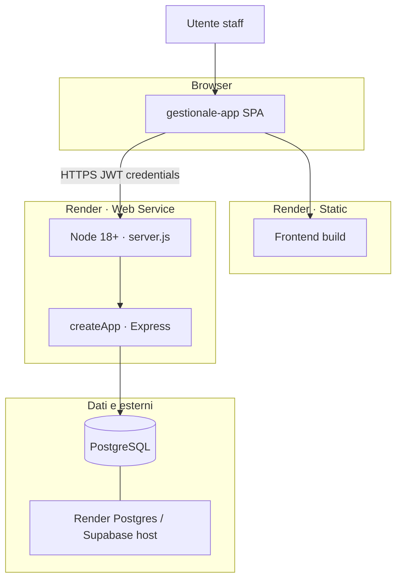
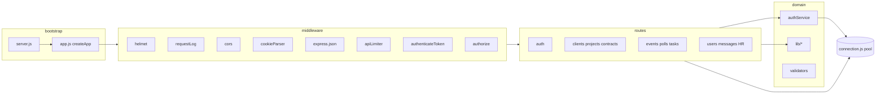
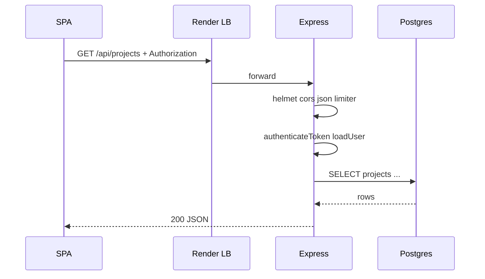
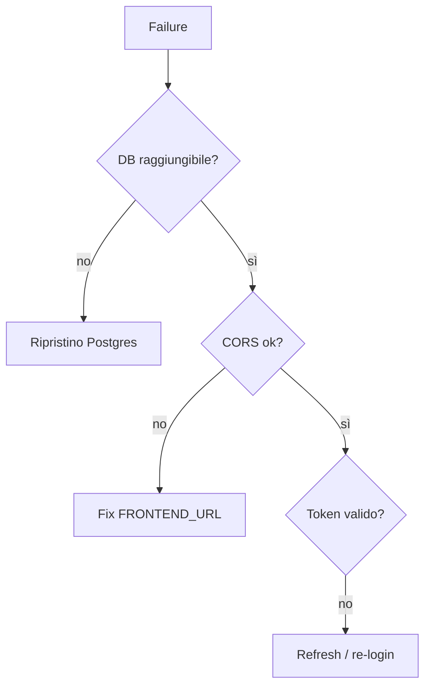

# Capitolo 2bis — Vista C4 (Container & Component)

> **Prerequisito:** [Cap. 1](./01-fondamenta-architetturali-e-flusso-richiesta.md), [Cap. 2](./02-livello-dati-architettura-stato-type-safety.md)

---

## 2bis.1 Diagramma container

---

## 2bis.2 Component map (backend)

| Path | Ruolo architetturale |
|------|----------------------|
| `server.js` | bind porta, smoke DB |
| `app.js` | composizione middleware + mount route + error handler |
| `routes/*` | adapter HTTP (target: sottili) |
| `services/*` | use case (oggi: principalmente auth) |
| `lib/*` | policy, token, pagination, access helpers |
| `middleware/*` | cross-cutting per request |
| `database/*` | schema, migrazioni, pool |

---

## 2bis.3 Flusso request/response (end-to-end)

Tempo dominante tipico: **DB + JSON serialize**, non CPU Express.

---

## 2bis.4 Failure esterni

| Punto | Sintomo | Prima azione |
|-------|---------|--------------|
| PostgreSQL down | `/health` `db: error`, 500 su API | status Render DB, `DATABASE_URL` |
| TLS / cert | connessione rifiutata | SSL mode prod in pool |
| CORS prod | 403 Origin | `FRONTEND_URL` lista esatta |
| JWT_SECRET rotato | mass 403 token | logout globale, re-login |
| Deploy rolling | 502 brevi | health check, drain |

---

## 2bis.5 Sotto carico ×100 — saturazione

Ordine tipico (allineato Cap. 1 §1.8):

1. **PostgreSQL** — pool, query N+1, lock  
2. **`loadUser` per request** — query utente ripetuta  
3. **Event loop Node** — bcrypt, JSON grandi, log sincrono  
4. **Rate limit in-memory** — non globale tra repliche  

**Backpressure:** assente — Express accetta fino a saturazione; mitigazione = limiter + pool max + scale orizzontale stateless.

---

*Capitolo 2bis — v1*
