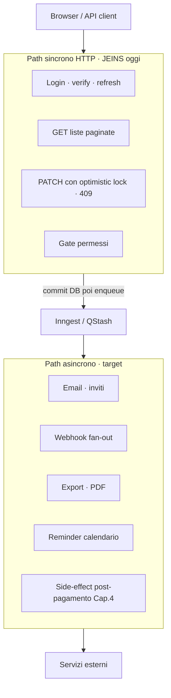
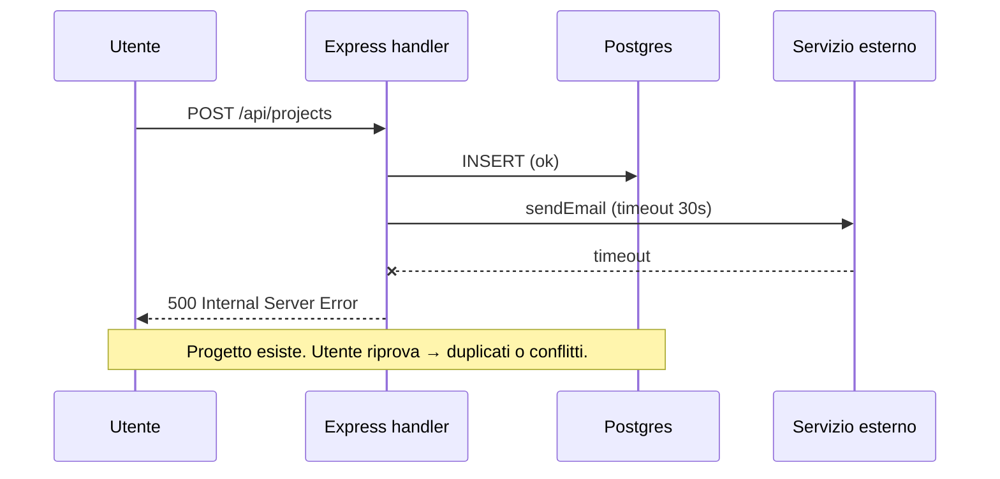
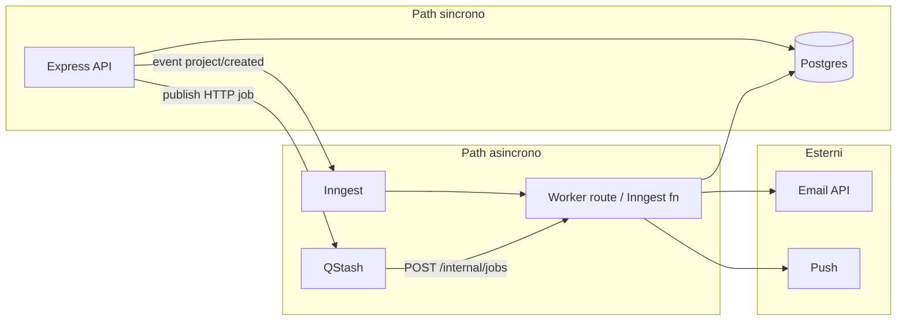
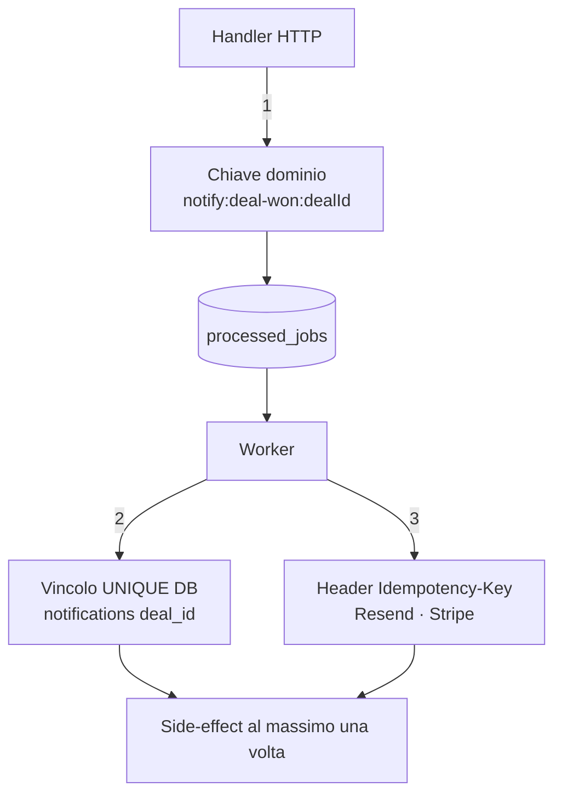
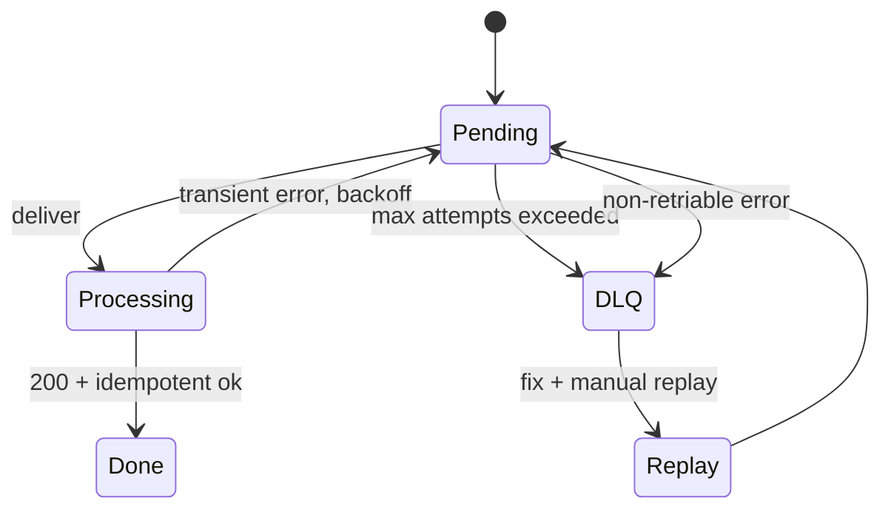

# Capitolo 3 — Motori asincroni ed event-driven design

> **Prerequisiti:** [Cap. 1 — Flusso richiesta](./01-fondamenta-architetturali-e-flusso-richiesta.md), [Cap. 2 — Livello dati](./02-livello-dati-architettura-stato-type-safety.md)  
> **Riferimenti implementativi:** [Inngest](https://www.inngest.com/) (orchestrazione step + retry), [QStash](https://upstash.com/docs/qstash) (HTTP queue / delay / DLQ su Upstash).  
> **Stato JEINS oggi:** API Express **sincrone**; **nessun** worker Inngest/QStash in repo. Questo capitolo definisce il **target di affidabilità** e cosa non fare nel request path attuale.

---

## 3.0 Perché questo capitolo esiste

L’affidabilità di un gestionale non si misura solo con “la GET risponde 200”. Si misura quando:

- l’utente chiude il tab mentre partiva un’email di invito;
- Resend è down per 90 secondi;
- Render riavvia l’istanza a metà di un batch notturno;
- lo stesso webhook di pagamento arriva **due volte** per retry del provider.

Senza un piano **event-driven** esplicito, risolvi tutto nel handler HTTP con `await sendEmail()` — e credi di avere un sistema robusto finché non vedi doppie notifiche o timeout a 30s.

### Confine architetturale: cosa resta sincrono



---

## 3.1 I limiti del request/response sincrono

### Il contratto HTTP che stai violando senza accorgertene

Un client HTTP (browser, `fetch`, mobile) assume:

1. invia richiesta;
2. attende **una** risposta entro timeout (browser ~30–120s, load balancer spesso **30–60s**);
3. interpreta status + body come esito dell’operazione.

Il tuo `POST /api/projects` oggi può fare:

```text
validazione → INSERT project → INSERT todos default → attachTodos → (futuro) email team
```

Se “email team” impiega 8s e il DB 2s, l’utente vede **10s** di spinner. Se Resend non risponde, vedi **500** anche se il progetto **è stato creato** — il peggior UX possibile: dati persistiti, UI che dice errore.



### Cosa deve restare sincrono (poca latenza, risposta definitiva)

| Operazione | Perché nel path HTTP |
|------------|----------------------|
| Login / refresh token | il client ha bisogno del token **ora** |
| Lettura lista clienti (paginata) | semantica query/response |
| PATCH stato task con optimistic locking | conflitto 409 va tornato subito |
| Validazione permessi RBAC | gate prima di side-effect |

**Regola:** il path sincrono deve fare solo ciò che serve per costruire la **risposta corretta e minimale** al client. Tutto il resto è candidato async.

### Cosa spostare su motore asincrono

| Operazione | Perché async |
|------------|--------------|
| Email transazionali (invito, reset password, digest) | provider SMTP/API lento o down |
| Notifiche push / in-app fan-out | N destinatari, non bloccare POST |
| Generazione PDF / export CSV grandi | CPU + I/O, rischio timeout |
| Webhook verso CRM esterni | retry necessario, non affidabile al primo colpo |
| Ricostruzione search index / analytics | eventual consistency accettabile |
| Thumbnail / virus scan upload | durata imprevedibile |
| Reminder calendario (“call tra 15 min”) | scheduling nativo (delay) |

**Nel codice JEINS attuale:** activity feed, messaggi, `last_seen` sono sincroni su DB — accettabile a basso traffico. **Non** significa che invii email nel handler: oggi semplicemente non le invii; il rischio emerge appena aggiungi `await` senza coda.

### Latenza vs affidabilità

| Strategia | Latenza percepita | Affidabilità side-effect |
|-----------|-------------------|-------------------------|
| Tutto in HTTP | bassa se mondo perfetto | **bassa** (timeout = stato incerto) |
| HTTP + fire-and-forget `setImmediate` | bassa | **pessima** (crash = perso, no retry) |
| HTTP + coda (QStash / Inngest) | bassa (202 Accepted) | **alta** se idempotente |
| Polling client su job status | media | alta con job store |

**Trade-off consigliato per JEINS:**

```http
HTTP 202 Accepted
{ "projectId": "...", "jobId": "enqueue-abc" }
```

oppure, se il client non gestisce job:

```http
HTTP 201 Created
{ "project": { ... } }   // solo persistenza core
```

e la coda elabora “notifica team” in background — **mai** il contrario (201 solo se email partita).

---

## 3.2 Architettura event-driven di riferimento (Inngest + QStash)

Non sono l’unica coppia possibile (SQS+Lambda, BullMQ+Redis, Temporal…). Sono utili perché mappano bene su **stack piccolo + deploy Render/Vercel** senza gestire RabbitMQ.

### Ruoli complementari

| Tool | Modello | Punto di forza |
|------|---------|----------------|
| **Inngest** | funzioni dichiarative con step, eventi tipizzati, retry per step | orchestrazione complessa, cron, fan-out, “saga light” |
| **QStash** | HTTP POST ritardati / retry verso URL worker | enqueue semplice da Express senza SDK pesante |



### Pattern A — Inngest (evento di dominio)

Dopo `INSERT` progetto nel service:

```ts
// Concettuale — non presente nel repo oggi
await inngest.send({
  name: 'project/created',
  data: { projectId, actorId, clientId },
  id: `project-created:${projectId}`, // dedup lato Inngest
});
```

Worker (Inngest function):

```ts
inngest.createFunction(
  { id: 'notify-team-on-project', retries: 5 },
  { event: 'project/created' },
  async ({ event, step }) => {
    const members = await step.run('load-members', () => loadMembers(event.data.projectId));
    await step.run('send-emails', () => sendEmailsIdempotent(members, event.data));
  },
);
```

**Perché `step.run`:** ogni step ha retry **indipendente**. Se email fallisce, non ripeti `load-members` (a meno che non sia voluto). È il compromesso tra “script monolitico” e saga distribuita.

### Pattern B — QStash (job HTTP one-shot)

Dallo stesso handler Express:

```ts
await qstash.publishJSON({
  url: `${process.env.INTERNAL_BASE_URL}/internal/jobs/notify-project`,
  body: { projectId, actorId },
  headers: { 'Idempotency-Key': `notify-project:${projectId}` },
  retries: 5,
  delay: 0,
});
```

Route interna protetta (secret header, non pubblica):

```js
router.post('/internal/jobs/notify-project', verifyQStashSignature, async (req, res) => {
  await notifyProjectTeam(req.body); // deve essere idempotente
  res.status(200).json({ ok: true });
});
```

**Quando preferire QStash:** pochi job, team già comodo con route Express, vuoi enqueue con una chiamata HTTP senza introdurre runtime Inngest.

**Quando preferire Inngest:** workflow multi-step, schedule (“ogni lunedì digest”), branching, osservabilità step-level.

**Anti-pattern:** usare **entrambi** per lo stesso evento senza ownership — doppia notifica garantita.

---

## 3.3 Il dogma dell’idempotenza

### Definizione operativa (non accademica)

> Un job è **idempotente** se eseguirlo 1 volta o 7 volte con lo stesso **idempotency key** produce **lo stesso effetto osservabile** che eseguirlo 1 volta.

“Osservabile” = righe DB, email inviata, addebito, messaggio Slack — non “abbiamo chiamato la funzione”.

### Perché il retry è inevitabile

| Causa | Chi ritenta |
|-------|-------------|
| Timeout rete client → API | browser (doppio POST) |
| API crash dopo INSERT, prima di risposta | client non ha ricevuto 201 → ripete |
| QStash non riceve 200 dal worker | QStash ritenta |
| Inngest step fallisce | Inngest ritenta step |
| Deploy rolling kill processo | messaggio torna in coda |

**Non puoi dire “evitiamo i retry”.** Puoi solo dire **“i retry sono sicuri”**.

### Tre livelli di idempotenza (implementa almeno due)

#### Livello 1 — Chiave di business (obbligatoria)

Tabella dedup (nome esempio):

```sql
CREATE TABLE processed_jobs (
  idempotency_key VARCHAR(255) PRIMARY KEY,
  handler VARCHAR(80) NOT NULL,
  processed_at TIMESTAMPTZ DEFAULT NOW(),
  result JSONB
);
```

All’inizio del worker:

```js
async function runIdempotent(key, handler, fn) {
  const inserted = await pool.query(
    `INSERT INTO processed_jobs (idempotency_key, handler)
     VALUES ($1, $2)
     ON CONFLICT DO NOTHING
     RETURNING idempotency_key`,
    [key, handler],
  );
  if (!inserted.rows.length) {
    return { skipped: true }; // già fatto
  }
  try {
    const result = await fn();
    await pool.query(
      `UPDATE processed_jobs SET result = $1 WHERE idempotency_key = $2`,
      [JSON.stringify(result), key],
    );
    return result;
  } catch (e) {
    await pool.query(
      `DELETE FROM processed_jobs WHERE idempotency_key = $1`,
      [key],
    ); // permetti retry solo su fallimento reale
    throw e;
  }
}
```

**Chiave per “deal vinto” / notifica:**

```text
notify:deal-won:{dealId}
email:project-created:{projectId}
```

Mai `Date.now()` nella key.

#### Livello 2 — Vincoli DB (obbligatoria dove possibile)

```sql
CREATE UNIQUE INDEX uq_notifications_deal_once
  ON notifications (deal_id, template_id)
  WHERE template_id = 'deal_won';
```

Se il secondo insert arriva → `23505` → trattalo come successo.

#### Livello 3 — API provider idempotency header

Resend/Stripe supportano `Idempotency-Key`. Usalo **in aggiunta**, non al posto del DB: il provider e il tuo DB possono divergere.

### Esempio narrativo: “deal vinto”

**Senza idempotenza:**

1. `POST /api/deals/:id/close` → INSERT stato + `await sendSlack()`.
2. Slack timeout → API ritorna 500.
3. Utente clicca di nuovo → seconda notifica Slack.
4. QStash ritenta il job vecchio → terza notifica.

**Con idempotenza:**

1. HTTP fa solo transazione DB + `inngest.send({ id: 'deal-won:'+dealId })`.
2. Worker `deal-won` controlla `processed_jobs` / unique su `notifications`.
3. Retry Inngest step `send-slack` — key uguale → Slack ignora o DB blocca duplicato.

### Errori da junior in review

| Errore | Sintomo |
|--------|---------|
| `INSERT` senza unique, “controlliamo prima con SELECT” | race tra due worker |
| Key = `userId + timestamp` | ogni retry è “nuovo” |
| Delete idempotency record su qualsiasi errore | retry storm infinito su bug permanente |
| Non delete record su errore transiente | retry bloccato per sempre |
| Side-effect **prima** del commit DB | email partita, transazione rollback |

**Ordine sacro:** **commit transazione dominio → enqueue → worker legge stato committed**.

### Pattern idempotenza (tre livelli)



| Livello | Dove | Protegge da |
|---------|------|-------------|
| 1 | `processed_jobs` + chiave stabile | retry job, doppio enqueue |
| 2 | `UNIQUE` / `ON CONFLICT` | race due worker |
| 3 | API provider | retry HTTP verso Stripe/Resend |

---

## 3.4 Retry, backoff e Dead-Letter Queues

### Chi fa cosa (separazione responsabilità)

| Layer | Responsabilità |
|-------|----------------|
| **HTTP API** | validazione, persistenza core, enqueue evento |
| **Queue / Inngest** | scheduling retry, backoff, max attempts |
| **Worker** | idempotenza, chiamata esterni, classificazione errore |
| **DLQ** | messaggi “tossici” fuori dal path caldo |
| **Umano / runbook** | ispeziona DLQ, fix dati, replay manuale |

### Tipi di errore — la distinzione che salva il sistema

| Tipo | Esempi | Azione |
|------|--------|--------|
| **Transiente** | 503 Resend, timeout DNS, deadlock DB | retry con backoff |
| **Permanente** | email malformata, template mancante, 400 “invalid recipient” | **no** retry infinito → DLQ |
| **Bug** | `undefined is not a function` | DLQ + alert + fix deploy |

Il worker **deve** classificare:

```js
if (err.statusCode === 400 && err.code === 'INVALID_EMAIL') {
  throw new NonRetriableError(err.message); // Inngest: non ritentare
}
throw err; // ritentabile
```

QStash: risposta **410** o body specifico per “non ritentare” (vedi docs versione corrente) — **leggi il contratto** del provider, non assumere.

### Backoff strategies

| Strategia | Formula (tentativo n) | Pro | Contro |
|-----------|------------------------|-----|--------|
| **Fixed** | 5s sempre | semplice | thundering herd se provider torna su |
| **Linear** | `n * 5s` | prevedibile | lento su errori lunghi |
| **Exponential** | `min(cap, base * 2^n)` | standard industria | può sembrare “lento” all’utente |
| **Exponential + jitter** | `random(0, delay)` | evita sincronizzazione retry | tuning necessario |

**Default ragionato per JEINS (notifiche email):**

```text
base = 2s, factor = 2, max = 30min, jitter = ±20%, maxAttempts = 8
```

**Perché jitter:** se Resend cade e 500 job ripartono insieme al secondo 60, **uccidi** di nuovo Resend.

**Inngest:** configurazione retry a livello function/step (`retries: 5` + backoff gestito dalla piattaforma).

**QStash:** header / opzioni retry con backoff (consultare doc Upstash; concetto: `Retry-After` progressivo).

### Dead-Letter Queue (DLQ)

Quando `attempts >= max`:

1. il messaggio esce dalla coda calda;
2. finisce in **DLQ** (topic separato, tabella `failed_jobs`, dashboard Inngest “failed”);
3. parte **alert** (email ops, Slack, PagerDuty — non notifica utente finale).



**Cosa deve contenere un record DLQ:**

| Campo | Perché |
|-------|--------|
| `idempotency_key` | replay sicuro |
| payload JSON originale | debug |
| `handler` | routing |
| `last_error` | messaggio + stack |
| `attempts` | audit |
| `first_seen_at` / `last_seen_at` | correlazione incident |

**Replay manuale:** solo dopo fix root cause; replay con **stessa** idempotency key se l’effetto non era stato applicato; nuova key solo se vuoi **forzare** re-invio consapemente.

### Servizio terze parti down per ore

| Fase | Comportamento |
|------|----------------|
| 0–30 min | retry backoff, coda cresce |
| 30 min–2h | alert, metriche depth coda |
| > 2h | valuta circuit breaker: smetti di accodare nuovi email job? accetta solo digest? |
| recovery | drain coda a rate limit (es. 10 email/s) per non saturare provider appena tornato |

**Non fare:** retry infinito senza DLQ — è un memory leak distribuito.

---

## 3.5 Integrazione con JEINS oggi (gap e roadmap minima)

### Stato attuale (maggio 2026)

- Tutte le route in `backend/routes/*` sono **request-driven** sincrone.
- Nessuna tabella `processed_jobs` / `failed_jobs`.
- Nessun endpoint `/internal/jobs` firmato.
- Rate limit su login (`rateLimit.js`) — **non** sostituisce coda notifiche.

### Operazioni che **non** devi aggiungere nel handler senza coda

Prima implementazione email/notifiche per:

- nuovo progetto;
- invito evento / RSVP bulk;
- chiusura contratto / deal;
- reminder call.

### Roadmap minima (ordine che rispetta il dogma)

| Step | Deliverable |
|------|-------------|
| 1 | Tabella `processed_jobs` + helper `runIdempotent` in `lib/` |
| 2 | Route interna `POST /internal/jobs/*` + verifica firma QStash **o** SDK Inngest |
| 3 | Un solo evento pilota: `project/created` → email team |
| 4 | Metriche: `job_enqueued`, `job_failed`, `dlq_depth` |
| 5 | Estensione ad altri domini |

### Contratto API verso il frontend

Se introduci async:

- documenta se `201` implica solo DB o anche notifica;
- opzionale `jobId` per polling;
- **non** nascondere errori async nel successo HTTP salvo product decision esplicita.

---

## 3.6 Confronto Inngest vs QStash vs “Redis queue fai-da-te”

| Criterio | Inngest | QStash | BullMQ + Redis |
|----------|---------|--------|----------------|
| Ops overhead | basso (SaaS) | bassissimo | medio-alto (Redis HA) |
| Step workflow | nativo | manuale (più route) | manuale |
| Delay / schedule | nativo | nativo | nativo |
| Osservabilità | UI step | dashboard Upstash | DIY |
| Vendor lock-in | medio | medio | basso (self-host) |
| Costo a basso volume | spesso gratis tier | spesso gratis tier | costo Redis 24/7 |
| Adatto a JEINS team piccolo | ✅ orchestrazione | ✅ enqueue veloce | solo se già avete Redis |

**Scelta pragmatica:** inizia con **QStash** se vuoi 1–3 job HTTP dal Express esistente su Render; aggiungi **Inngest** quando hai ≥2 workflow multi-step o cron complessi.

---

## 3.7 Sotto carico ×100

| Scenario | Senza async | Con async mal progettato | Con async + idempotenza |
|----------|-------------|-------------------------|------------------------|
| 100 POST/s con email in handler | pool + thread bloccati, timeout | coda esplode, doppie email | API veloce, worker scale separato |
| Spike notifiche | 500 a utente | retry storm | jitter + rate limit drain |
| DB lento | tutto appeso su HTTP | worker amplifica pressione DB | backpressure: pause enqueue |

**Scale worker:** QStash chiama URL → servono **più istanze** worker o concurrency limitata per non superare `max_connections` Postgres (Cap. 2).

---

## 3.8 Checklist code review (job async)

- [ ] Il handler HTTP **non** chiama direttamente provider esterni lenti.
- [ ] Esiste `idempotency_key` stabile per evento di business.
- [ ] `processed_jobs` o vincolo `UNIQUE` copre il side-effect.
- [ ] Transazione DB commit **prima** di enqueue.
- [ ] Errori 4xx business classificati non-retriable.
- [ ] Max attempts + DLQ configurati (non retry infinito).
- [ ] Backoff con jitter su code path transiente.
- [ ] Endpoint worker autenticato (firma QStash / secret Inngest).
- [ ] Replay documentato in runbook incident.
- [ ] Test: esegui worker due volte → un solo side-effect osservabile.

---

## 3.9 Collegamenti

- **Cap. 1:** stateless HTTP, niente stato job in RAM del processo API.
- **Cap. 2:** `processed_jobs` come tabella Postgres, transazioni, unique constraints.
- **Cap. 27 (indice):** resilienza — aggiornare “DLQ: N/A” quando step 4 roadmap completata.
- **Cap. 10 (indice):** transazioni e race — allineare con idempotenza write.

---

### Sintesi

> **Il request/response è un contratto di latenza, non di affidabilità.**  
> **Inngest e QStash** sono modi per spostare il tempo e il rischio fuori dal percorso critico dell’utente.  
> **Idempotenza** non è un nice-to-have: è l’unica cosa che rende i retry innocui.  
> **DLQ + backoff con jitter** è come distingui un incidente gestibile da un loop che spamma il mondo.

---

*Capitolo 3 — bozza v1. Pattern Inngest/QStash come riferimento architetturale; implementazione non presente nel backend JEINS al momento della stesura.*
