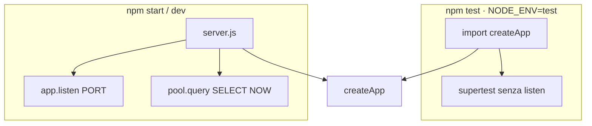
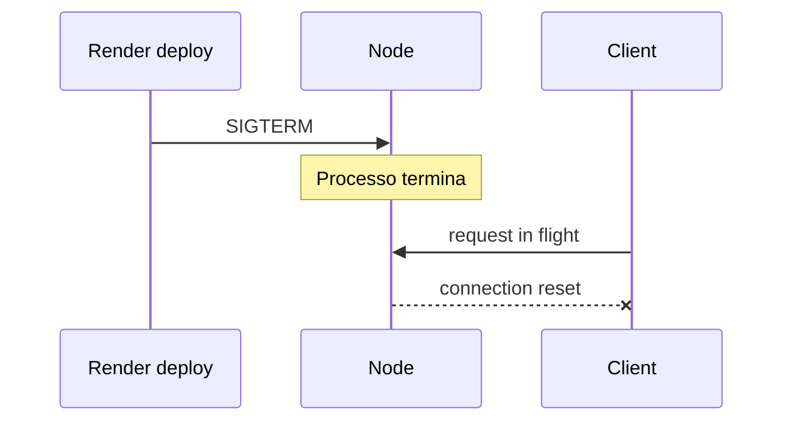

# Capitolo 3bis — Processo Node, bootstrap e lifecycle

> **Prerequisito:** [Cap. 1](./01-fondamenta-architetturali-e-flusso-richiesta.md)  
> **Ancoraggio codice:** `backend/server.js`, `backend/app.js`

---

## 3bis.1 `server.js` vs `createApp()`

| File | Fa | Non fa |
|------|-----|--------|
| `createApp()` | middleware + route + error handler | `listen()` |
| `server.js` | `listen`, log porta, test DB | definire route |

**Perché separare:** test importano app senza bind; stesso pattern di handler serverless export.

---

## 3bis.2 Concorrenza Node

- **Un thread**, event loop I/O-bound.  
- Handler `async` liberano il loop durante attesa `pool.query`.  
- **Nessun worker thread** per CPU — PDF, bcrypt, JSON enormi **bloccano** il loop.

**×100:** molti request lunghi → coda latenza su **tutte** le route, non solo quella lenta.

---

## 3bis.3 Variabili d’ambiente

| Variabile | Criticità | Fail mode attuale |
|-----------|-----------|-------------------|
| `DATABASE_URL` | bloccante | pool error a runtime |
| `JWT_SECRET` | bloccante auth | verify fallisce |
| `FRONTEND_URL` | CORS prod | 403 origin |
| `ELEVATED_REGISTRATION_CODE_HASH` | registrazione elevata | disabilitata (log) |
| `ACCESS_TOKEN_EXPIRES` / `REFRESH_TOKEN_EXPIRES` | auth | default in `tokens.js` |

**Gap:** nessun schema Zod/env all’avvio — fail **al primo login**, non al boot.

**Target Senior:** `lib/env.js` con validazione una volta in `server.js`.

---

## 3bis.4 Graceful shutdown — gap

**Stato oggi:** nessun handler `SIGTERM` / `SIGINT` che:

1. smette di accettare connessioni  
2. attende request in flight  
3. `pool.end()`  

**Rischio:** deploy rolling → 502 sporadici.  
**Mitigazione minima:** handler che chiude pool dopo timeout 10–30s.

---

## 3bis.5 Trade-off dev vs prod

| | Dev `npm run dev --watch` | Prod Render |
|---|---------------------------|-------------|
| Processi | 1, reload | N repliche |
| Log | verbose, body log | solo requestLog testuale |
| CORS | permissivo se non in lista | strict in production |

---

*Capitolo 3bis — v1*
