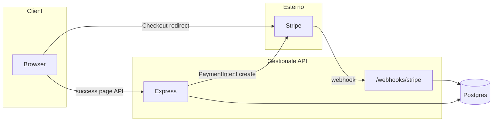
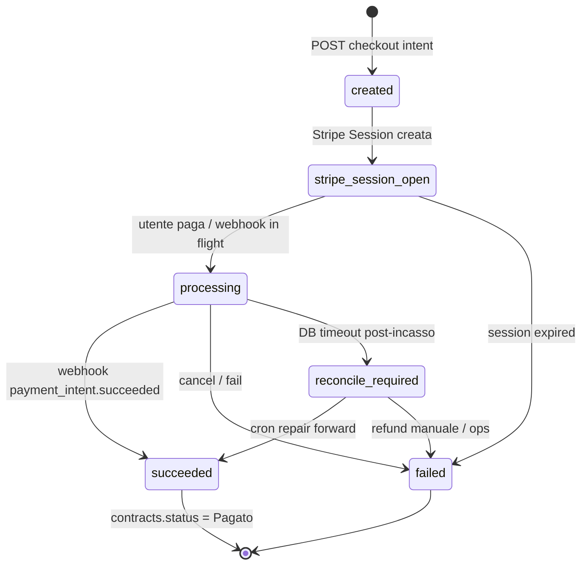
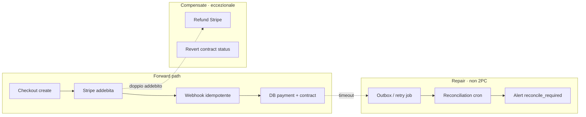
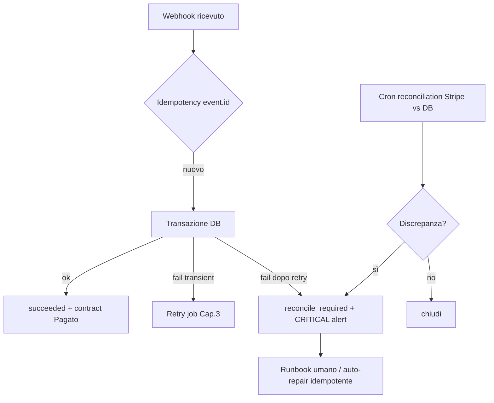
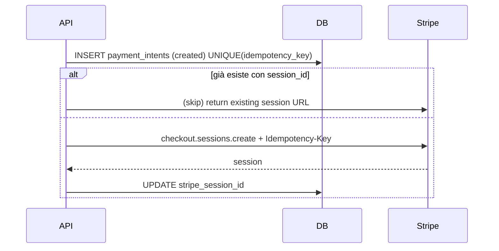
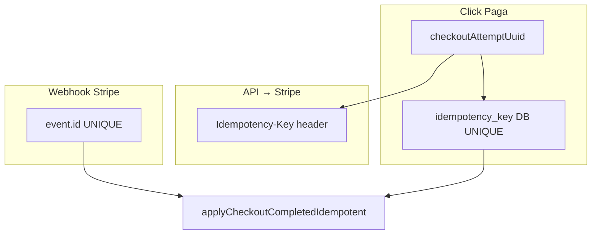

# Capitolo 4 — Transazioni distribuite e interazioni esterne (Stripe)

> **Prerequisiti:** [Cap. 2 — Livello dati](./02-livello-dati-architettura-stato-type-safety.md), [Cap. 3 — Motori asincroni](./03-motori-asincroni-event-driven.md)  
> **Caso guida:** pagamenti con **Stripe** (Checkout / Payment Intent) collegati a entità di business tipo *deal* / *contratto* (nel gestionale: tabella `contracts`, stati fino a `Pagato`).  
> **Stato JEINS oggi:** fatturazione **interna** (`backend/routes/contracts.js`), **nessuna** integrazione Stripe, **nessun** endpoint webhook. Il capitolo definisce il design **obbligatorio** prima di incassare soldi veri.

---

## 4.0 Perché i pagamenti sono un problema distribuito, non un `UPDATE`

Quando accetti pagamenti:

- **Stripe** è un sistema transazionale autonomo (ledger carte, addebiti, rimborsi).
- **Il tuo Postgres** è un altro sistema transazionale.
- **Il browser** è un terzo canale asincrono e inaffidabile (chiude tab, doppio click, back).

Non esiste una transazione ACID che attraversi Stripe e il tuo DB. Esiste **saga + idempotenza + riconciliazione**. Chi ti vende “2PC tra Postgres e Stripe” sta semplificando un problema NP-hard della vita reale.



**Obiettivo ingegneristico:** l’utente viene addebitato **al massimo una volta** per un intento di pagamento, e il gestionale riflette **entro minuti** lo stato `Pagato` anche se il mondo è incoerente per secondi.

---

## 4.1 Modello di stato: separa “intento”, “incasso”, “business”

Non mescolare “l’utente ha cliccato Paga” con “Stripe ha movimentato denaro” con “il contratto è Pagato”.

### Stati consigliati (tabella dedicata, non solo colonna su `contracts`)

Esempio tabella `payment_intents` (nome indicativo):

| Stato | Significato |
|-------|-------------|
| `created` | record locale creato, nessuna chiamata Stripe ancora |
| `stripe_session_open` | Checkout Session / PI creato su Stripe |
| `processing` | webhook `payment_intent.processing` o equivalente |
| `succeeded` | webhook conferma successo (source of truth incasso) |
| `failed` | pagamento fallito o annullato |
| `reconcile_required` | incoerenza rilevata (vedi §4.4) |

Il contratto (`contracts.status`) passa a **`Pagato`** solo quando `payment_intents.status = succeeded` **e** il link contratto è validato (importo, valuta, `client_id`).

**Oggi in JEINS:** `contracts.status` può essere impostato a mano via API (`PATCH`) senza rail di pagamento — accettabile per gestione associativa interna; **inaccettabile** se domani quel campo implica incasso Stripe.

### Macchina a stati: `payment_intents` vs `contracts`



**Regola:** `contracts.Pagato` è effetto collaterale di `succeeded`, non stato indipendente cliccabile dal client.

### Pattern saga (compensazione distribuita)



---

## 4.2 Webhook Stripe: firma crittografica (necessaria ma insufficiente)

### Validazione firma — il minimo sindacale

Stripe firma il body **raw** con `Stripe-Signature` (HMAC SHA-256, secret `whsec_...`).

**Errore da junior #1:** montare `express.json()` globale **prima** del webhook e poi verificare su `req.body` già parsato — la firma non combacia mai, o peggio combaci su JSON re-serializzato diverso.

**Pattern corretto:**

```js
// Route dedicata — raw body
router.post(
  '/webhooks/stripe',
  express.raw({ type: 'application/json' }),
  async (req, res) => {
    const sig = req.headers['stripe-signature'];
    let event;
    try {
      event = stripe.webhooks.constructEvent(
        req.body, // Buffer
        sig,
        process.env.STRIPE_WEBHOOK_SECRET,
      );
    } catch (err) {
      return res.status(400).send(`Webhook Error: ${err.message}`);
    }
    // ACK veloce + lavoro async (Cap. 3)
    await enqueueStripeEvent(event);
    return res.json({ received: true });
  },
);
```

| Step | Perché |
|------|--------|
| `constructEvent` | autentica origine + timestamp anti-replay (tolleranza clock, es. 300s) |
| Rispondere **200** rapidamente | Stripe ritenta se timeout; non fare email nel handler sincrono |
| Enqueue evento | elaborazione idempotente fuori dal request path |

**Errore da junior #2:** rispondere 500 su evento già processato (idempotente) → retry storm. Rispondere 200 se `event.id` già in `processed_jobs`.

### Idempotenza evento webhook (livello Stripe)

Ogni `event` ha `id` globale (`evt_...`). **Chiave primaria:**

```text
stripe-event:{event.id}
```

```sql
INSERT INTO stripe_events (event_id, type, payload)
VALUES ($1, $2, $3)
ON CONFLICT (event_id) DO NOTHING;
```

Se `ON CONFLICT DO NOTHING` → esci con 200: Stripe ha già vinto, tu non ripeti side-effect.

**Non confondere** con idempotency key delle API POST verso Stripe (§4.5): sono due livelli diversi.

---

## 4.3 Race condition: webhook prima del redirect “success”

### Scenario classico

1. Utente completa 3DS su Stripe.
2. Stripe invia `checkout.session.completed` al webhook — **latenza 200–800 ms**.
3. Il browser viene reindirizzato a `/pagamento/success?session_id={CHECKOUT_SESSION_ID}` — può arrivare **dopo** o **prima** del webhook.
4. La success page chiama `GET /api/payments/status?session_id=...` e trova ancora `processing` → panico utente.

```mermaid
sequenceDiagram
    participant U as Browser
    participant ST as Stripe
    participant WH as Webhook handler
    participant API as API success page
    participant DB as Postgres

    U->>ST: Completa pagamento
    par Webhook path
        ST->>WH: checkout.session.completed
        WH->>DB: mark succeeded (idempotent)
    and Redirect path
        ST->>U: redirect success URL
        U->>API: GET payment status
        API->>DB: read status
    Note over U,DB: Ordine non garantito
```

### Regole di prodotto + API (non solo “aspetta”)

| Regola | Implementazione |
|--------|-----------------|
| **Webhook è source of truth per `succeeded`** | la success page **non** marca Pagato da sola |
| Success page **poll** con backoff | `processing` → ritenta ogni 1s, max 30s |
| Endpoint **sync da Stripe** (fallback) | `stripe.checkout.sessions.retrieve(session_id)` se DB ancora `processing` dopo N secondi |
| UX onesta | “Stiamo confermando il pagamento…” non errore rosso |
| Mai doppio POST “conferma pagamento” | bottone disabilitato; idempotency key lato client |

**Codice concettuale success page backend:**

```js
async function getPaymentStatus(sessionId, userId) {
  const row = await loadPaymentBySessionId(sessionId);
  if (row.status === 'succeeded') return { status: 'succeeded', contractId: row.contract_id };

  // Fallback controllato — non scrive Pagato senza match Stripe
  const session = await stripe.checkout.sessions.retrieve(sessionId);
  if (session.payment_status === 'paid') {
    // Opzione A: solo lettura — webhook farà UPDATE idempotente a breve
    // Opzione B: upsert idempotente stesso codice del webhook (condividi funzione)
    await applyCheckoutCompletedIdempotent(session, 'poll-fallback');
    return getPaymentStatus(sessionId, userId);
  }

  return { status: 'processing' };
}
```

**Errore da junior #3:** sulla success page fai `UPDATE contracts SET status='Pagato'` senza verificare `session.amount_total` vs contratto — vulnerabilità importo.

**Errore da junior #4:** credere che il redirect porti `?success=true` — **mai** fidarsi della query string; usa solo `session_id` / `payment_intent` verificato server-side.

### Concorrenza webhook vs poll fallback

Due writer possono correre: webhook handler e `retrieve` sulla success page.

**Un solo punto di scrittura business:**

```js
async function applyCheckoutCompletedIdempotent(stripeSession, source) {
  return runIdempotent(`checkout:${stripeSession.id}`, 'stripe.checkout.completed', async () => {
    // SELECT ... FOR UPDATE payment_intents WHERE stripe_session_id = ...
    // verifica amount, currency, metadata.contract_id
    // UPDATE payment_intents SET status = 'succeeded'
    // UPDATE contracts SET status = 'Pagato' WHERE ...
  });
}
```

`runIdempotent` = pattern Cap. 3. `FOR UPDATE` = evita due transazioni che passano entrambe il check “non ancora succeeded”.

---

## 4.4 Stripe ha addebitato, il DB ha fatto timeout: compensazione e alert

### Il fallimento che devi pianificare

1. `payment_intent.succeeded` arriva via webhook.
2. Inizi transazione Postgres: aggiorni `payment_intents`, poi `contracts`.
3. Il DB va in timeout / connessione cade / deploy kill a metà commit.
4. Stripe mostra pagamento **captured**; il tuo DB dice `processing` o non ha riga.

**Non è edge case:** è condizione normale sotto carico o deploy.

### Cosa NON fare

| Anti-pattern | Perché |
|--------------|--------|
| Rimborsare automaticamente al primo timeout DB | peggio del problema se il commit è poi riuscito in retry |
| Ignorare e sperare reclamo cliente | debito operativo |
| Scrivere solo log senza stato `reconcile_required` | nessuno chiude il loop |

### Architettura a tre linee di difesa



#### Linea 1 — Transazione DB corta e focalizzata

- Solo tabelle payment + contract nel commit.
- Niente email/Slack nel transazione.
- Indice su `stripe_session_id` / `payment_intent_id`.

Se fallisce → **non** rispondere 500 a Stripe se l’evento non è persistito: meglio persistere evento raw in `stripe_events` con `processed_at NULL` e retry (outbox pattern).

**Outbox minimo:**

```sql
-- dentro stessa transazione del mark succeeded (ideale)
INSERT INTO stripe_events (event_id, type, payload, processed_at) ...
-- oppure tabella outbox: process_after commit
```

#### Linea 2 — Job di retry (Cap. 3)

Worker ricarica eventi `stripe_events WHERE processed_at IS NULL` o `payment_intents WHERE status = processing AND stripe says paid`.

#### Linea 3 — Reconciliation schedulata (obbligatoria in produzione)

Cron (Inngest scheduled / QStash / `node-cron` su worker dedicato):

```text
Ogni 15 min:
  - lista payment_intents in processing > 10 min
  - per ciascuna: stripe.paymentIntents.retrieve(pi_id)
  - se Stripe = succeeded e DB no → applyCheckoutCompletedIdempotent (repair)
  - se Stripe = failed e DB succeeded → CRITICAL (incasso fantasma o bug)
```

**Alert critico** (PagerDuty / email ops):

- `payment_intents.reconcile_required` > 0
- mismatch importo metadata vs contratto
- webhook non ricevuti per > X ore con sessioni aperte (config Stripe Dashboard)

### Compensazione (“rollback” distribuito)

Nel mondo distribuito la compensazione non è `ROLLBACK` SQL su Stripe.

| Situazione | Azione |
|------------|--------|
| Addebito duplicato (due PI) | rimborso Stripe + indagine idempotency key |
| Addebito ma contratto sbagliato | rimborso o transfer manuale + fix metadata |
| DB non aggiornato, Stripe ok | **repair forward** (allinea DB), non rimborso |
| DB Pagato, Stripe non incassato | blocca erogazione servizio + indagine (raro se webhook-driven) |

**Principio:** *repair forward* quando l’incasso è reale e il cliente ha ricevuto valore; *refund* quando hai addebitato senza diritto o doppio addebito.

### Timeout mentre salvi il deal

Se “deal” = contratto JEINS:

1. Stripe metadata: `{ contractId, userId, idempotencyKey }` sulla Session.
2. Webhook legge metadata e aggiorna **prima** `payment_intents`, poi `contracts`.
3. Se timeout dopo `payment_intents` succeeded ma prima di `contracts`:

   - transazione unica evita stato intermedio **se** progettato insieme;
   - se split in due transazioni → stato `payment_succeeded_contract_pending` + job che completa.

**Mai** lasciare `contracts` Pagato senza riga `payment_intents.succeeded` — è il caso che esplode in audit contabile.

---

## 4.5 Idempotency keys nei pagamenti (analisi rigorosa)

### Due mondi, due chiavi

| Livello | Chi ha la chiave | Scopo |
|---------|------------------|--------|
| **API verso Stripe** | tu (`Idempotency-Key` header) | stessa richiesta HTTP retry → **una** Session/PI |
| **Webhook da Stripe** | Stripe (`event.id`) | stesso evento retry → **una** elaborazione side-effect |
| **Tuo dominio** | tu (`payment:{contractId}:{attempt}`) | stessa intenzione utente → una riga `payment_intents` |

### API Stripe — non addebitare due volte per retry di rete

Esempio creazione Checkout Session:

```js
const idempotencyKey = `checkout:${contractId}:${userId}:${checkoutAttemptId}`;
// checkoutAttemptId = UUID generato al click "Paga" e salvato in DB PRIMA della chiamata Stripe

const session = await stripe.checkout.sessions.create(
  {
    mode: 'payment',
    line_items: [...],
    metadata: { contractId, userId, idempotencyKey },
    client_reference_id: contractId,
  },
  { idempotencyKey },
);
```

**Proprietà Stripe (da ricordare in review):**

- Stessa key + stessi parametri → stessa risposta (anche a distanza di ore, entro finestra Stripe).
- Stessa key + parametri diversi → errore — **non riusare key** su importi diversi.

**Flusso sicuro al click “Paga”:**



Vincolo DB:

```sql
CREATE UNIQUE INDEX uq_payment_intents_idempotency
  ON payment_intents (idempotency_key);
CREATE UNIQUE INDEX uq_payment_intents_stripe_session
  ON payment_intents (stripe_session_id)
  WHERE stripe_session_id IS NOT NULL;
```

### Unicità dell’intento utente

Definisci cos’è “un pagamento”:

- **Un** click su “Paga contratto X” = un `checkoutAttemptId` (UUID).
- Refresh pagina success non crea nuovo attempt.
- Nuovo click dopo fallimento = **nuovo** `checkoutAttemptId` (nuova key) — è un nuovo tentativo legittimo.

**Errore fatale:** idempotency key = `contractId` sola → secondo tentativo legittimo dopo fallimento bloccato o peggio riusa sessione vecchia.

### Doppio addebito reale (due chiavi diverse)

Può succedere se:

- utente apre due tab e clicca Paga due volte (due `checkoutAttemptId`);
- bug frontend che genera due POST create-session.

Mitigazione:

- UI: disabilita bottone; mostra “pagamento in corso” se esiste `payment_intents` non terminale per quel contratto;
- regola business: `UNIQUE (contract_id) WHERE status IN ('created','stripe_session_open','processing')` (partial unique index) — **una** sessione aperta per contratto.

### Rimborso e idempotenza

`stripe.refunds.create` con idempotency key separata `refund:{paymentIntentId}:{reasonCode}`.

### Tre chiavi, tre mondi (sintesi pattern)



---

## 4.6 Endpoint e responsabilità nel gestionale (mappa target)

| Endpoint | Auth | Ruolo |
|----------|------|--------|
| `POST /api/contracts/:id/checkout` | utente + RBAC billing | crea session Stripe, idempotency |
| `GET /api/payments/session/:id/status` | utente | poll stato, fallback retrieve |
| `POST /webhooks/stripe` | firma Stripe | ingresso eventi, enqueue |
| `POST /internal/jobs/stripe-event` | secret interno | process idempotente (Cap. 3) |
| `POST /admin/reconcile/payments` | admin | forza reconciliation (audit log) |

**Webhook route:** fuori da `authenticateToken` JWT; fuori da CORS browser; rate limit dedicato; body raw.

**Allineamento RBAC attuale:** `canAccessBilling` / ruolo Tesoreria (`docs/RBAC.md`) deve gateare creazione checkout; Socio **non** avvia incasso.

---

## 4.7 Testing e osservabilità (minimo professionale)

| Test | Cosa verifica |
|------|----------------|
| Stripe CLI `stripe listen --forward-to` | firma + handler |
| Fixture `checkout.session.completed` × 2 | una sola riga Pagato |
| Webhook prima di GET status | poll restituisce succeeded |
| GET status prima di webhook | fallback retrieve o processing |
| Kill DB mid-transaction (chaos) | reconciliation ripristina |
| Idempotency-Key duplicate POST | stessa `session.url` |

Metriche:

- `stripe_webhook_lag_seconds`
- `payment_reconcile_required_count`
- `payment_db_apply_duration_ms`

---

## 4.8 Gap JEINS oggi e ordine di implementazione

| Oggi | Rischio |
|------|---------|
| `contracts.status = 'Pagato'` manuale | nessuna garanzia incasso |
| Nessun `payment_intents` | impossibile correlare Stripe |
| Nessun webhook | nessuna source of truth esterna |

**Ordine consigliato:**

1. Tabella `payment_intents` + `stripe_events` + vincoli UNIQUE.
2. Webhook raw + verifica firma + enqueue (Cap. 3).
3. `applyCheckoutCompletedIdempotent` condivisa webhook + poll.
4. Checkout endpoint con Idempotency-Key Stripe.
5. Success page poll + UX.
6. Cron reconciliation + alert `reconcile_required`.
7. Solo allora: marketing “paga online”.

---

## 4.9 Checklist code review (pagamenti)

- [ ] Webhook usa `express.raw`, non `json()` globale.
- [ ] `constructEvent` con secret corretto per ambiente (test vs live).
- [ ] `event.id` persistito con UNIQUE prima di side-effect.
- [ ] Success page non marca Pagato senza Stripe allineato.
- [ ] `Idempotency-Key` su **ogni** POST mutante verso Stripe.
- [ ] Chiave idempotency dominio include attempt UUID, non solo `contractId`.
- [ ] Importo e valuta verificati contro `contracts.amount`.
- [ ] Transazione DB breve; outbox/retry se fallisce.
- [ ] Reconciliation cron documentata in runbook.
- [ ] Nessun secret `whsec_` / `sk_live_` in log (Cap. 4 middleware logging).

---

## 4.10 Collegamenti

- **Cap. 3:** retry webhook, DLQ, `processed_jobs`.
- **Cap. 2:** transazioni, `FOR UPDATE`, partial unique indexes.
- **Cap. 10 (indice):** optimistic locking su `contracts.version` — compatibile con update Pagato se stesso flusso.
- **Cap. 13 (indice):** dominio contabilità JEINS attuale.

---

### Sintesi

> **Stripe e Postgres non condividono transazione.** Il webhook è la verità dell’incasso; la success page è UX e fallback.  
> **La firma webhook** ti salva dagli attaccanti, non dalla race con il browser.  
> **Idempotency key** su API Stripe + `event.id` + vincoli UNIQUE sul dominio = tre cinture.  
> **Timeout DB dopo addebito** si chiude con outbox, retry e reconciliation — non con panico e non con refund automatico.

---

*Capitolo 4 — bozza v1. Pattern Stripe generali; integrazione non presente nel repository JEINS alla stesura. “RestyDeals” / deal mappati su `contracts` e pagamenti futuri.*
