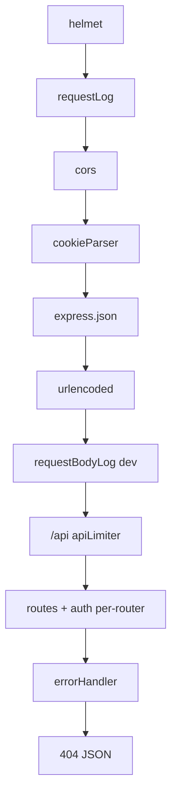

# Capitolo 4bis — Middleware chain come pipeline di sicurezza

> **Prerequisito:** [Cap. 1 §1.5](./01-fondamenta-architetturali-e-flusso-richiesta.md)  
> **Ancoraggio:** `backend/app.js`, `middleware/requestLog.js`, `middleware/rateLimit.js`

---

## 4bis.1 Ordine reale in `createApp()`

```54:64:backend/app.js
export function createApp() {
    const app = express();
    app.use(helmet({ crossOriginResourcePolicy: { policy: 'cross-origin' } }));
    app.use(requestLog);
    app.use(cors(buildCorsOptions()));
    app.use(cookieParser());
    app.use(express.json());
    app.use(express.urlencoded({ extended: true }));
    app.use(requestBodyLog);
    app.use('/api', apiLimiter);
```



---

## 4bis.2 Perché l’ordine non è arbitrario

| Decisione | Motivo |
|-----------|--------|
| `helmet` prima | header sicurezza su tutte le risposte |
| `cors` prima delle route | preflight `OPTIONS` deve ricevere header CORS |
| `cookieParser` prima di auth | `refresh_token` in cookie |
| `express.json` prima handler | `req.body` popolato |
| `apiLimiter` su `/api` | perimetro, non sostituisce auth |
| **Webhook futuro Stripe** | route **raw body** montata **prima** di `express.json` globale o su router separato |

**Errore junior:** montare `express.json()` globale e poi verificare firma webhook — vedi Cap. 4.

---

## 4bis.3 `requestLog` / `requestBodyLog`

```3:22:backend/middleware/requestLog.js
export function requestLog(req, res, next) {
    if (isProd && req.path === '/health') return next();
    const start = Date.now();
    res.on('finish', () => {
        const ms = Date.now() - start;
        console.log(`[${new Date().toISOString()}] ${req.method} ${req.path} ${res.statusCode} ${ms}ms`);
    });
    next();
}
```

| Middleware | Prod | Rischio |
|------------|------|---------|
| `requestLog` | sì (skip `/health`) | testo non JSON — Cap. 5 |
| `requestBodyLog` | **no** | in dev maschera password/managerCode |

**Non loggare:** Authorization header, refresh cookie, carta, `managerCode` in chiaro.

---

## 4bis.4 Error handler

```100:111:backend/app.js
    app.use((err, req, res, next) => {
        if (err.message === 'Origin non consentita') {
            return res.status(403).json({ error: 'Origin non consentita' });
        }
        const status = err.status || 500;
        if (status >= 500) console.error('Errore:', err);
        res.status(status).json({
            error: err.message || 'Errore interno del server',
            ...(err.code && { code: err.code }),
            ...(!isProduction && err.stack && { stack: err.stack }),
        });
    });
```

**Debito:** molte route catturano `AppError` inline e **non** chiamano `next(err)` — shape errore duplicata.

**Target:** route fa `catch (e) { next(e) }` sempre; handler unico mappa `AppError` → status.

---

## 4bis.5 Fallimenti

| Scenario | Comportamento |
|----------|---------------|
| JSON malformato | 400 da body-parser |
| Payload > default limit | 413 / errore parser |
| Origin non in lista (prod) | 403 CORS |
| Route inesistente | 404 JSON con path |

---

## 4bis.6 ×100 — logging sincrono

`console.log` su ogni request in `finish` → sotto migliaia req/min **I/O stdout** compete con event loop. Mitigazione: Pino async, sample, Cap. 5.

---

*Capitolo 4bis — v1*
