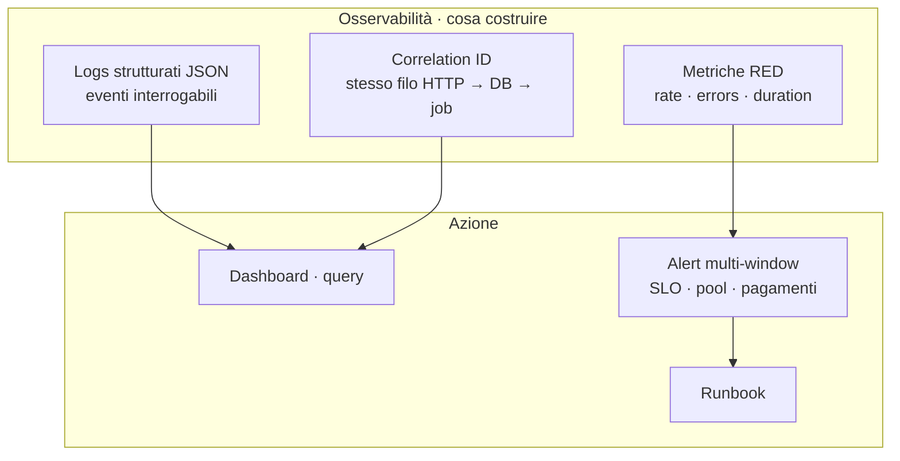
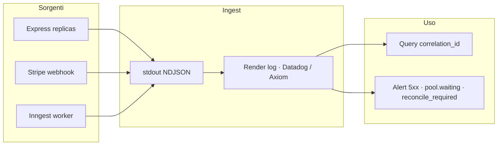
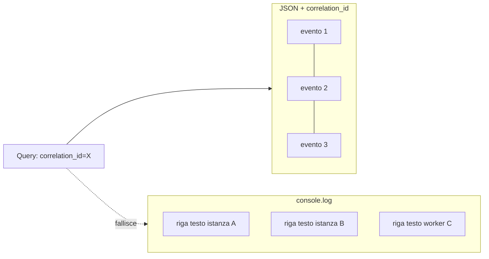
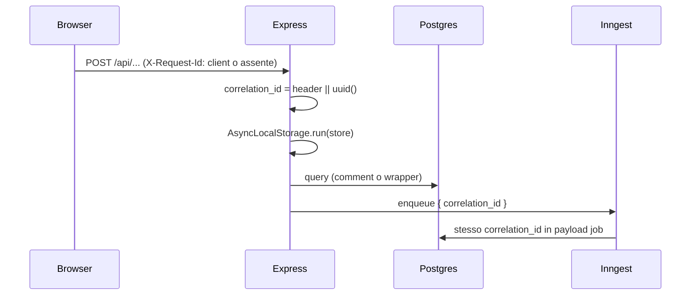
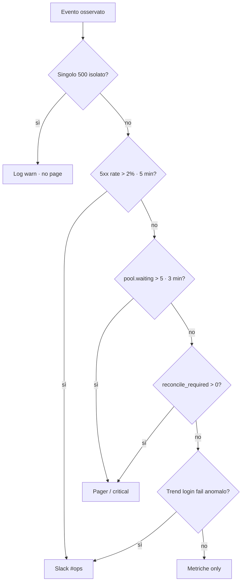

# Capitolo 5 — Osservabilità e telemetria

> **Prerequisiti:** [Cap. 1 — Flusso richiesta](./01-fondamenta-architetturali-e-flusso-richiesta.md), [Cap. 3 — Motori asincroni](./03-motori-asincroni-event-driven.md), [Cap. 4 — Transazioni distribuite](./04-transazioni-distribuite-interazioni-esterne.md)  
> **Stato JEINS oggi:** logging quasi tutto su **`console.log` / `console.error`**; `middleware/requestLog.js` emette righe testuali non strutturate; **nessun** correlation ID, **nessun** APM, **nessun** sistema di alert collegato al codice. Questo capitolo spiega perché quello stato è **invisibilità operativa**, non “logging sufficiente”.

### I tre pilastri dell’osservabilità (design system ops)



| Pilastro | Domanda che risponde | JEINS oggi |
|----------|----------------------|------------|
| Logs | *Cosa è successo su questa richiesta?* | `console.*` testuale |
| Trace | *È la stessa operazione su API, webhook, worker?* | assente |
| Metrics | *Il sistema sta degradando prima del 500?* | assente |

### Architettura target (telemetria end-to-end)



---

## 5.0 Perché `console.log()` non è osservabilità

Un junior pensa: *“Se qualcosa va storto, aggiungo un log e lo leggo su Render.”*  
In un sistema **distribuito** (più istanze, job async, webhook esterni, futuro serverless) quella frase è falsa per cinque motivi indipendenti.

### 5.0.1 Non esiste “il” file di log

Su **Render**, **Vercel Functions**, **AWS Lambda**, ogni invocazione scrive su **stdout** del processo/container che ha servito *quella* richiesta. Il processo muore; un’altra istanza serve la richiesta successiva.

| Ambiente | Cosa succede ai `console.log` |
|----------|-------------------------------|
| Dev locale | Un terminale, ordine leggibile |
| Render (N istanze) | N stream mescolati nel log aggregator |
| Serverless | Una riga per invocazione, spesso **senza** contesto della richiesta precedente |
| Job Inngest (futuro) | Worker diverso dall’API che ha accettato il POST |

`console.log('pagamento ok')` **non ti dice** su quale istanza, per quale utente, in quale catena di retry è avvenuto.

### 5.0.2 Il testo libero non è interrogabile

Con migliaia di eventi al minuto, nessuno “scrolla” i log. Serve:

```text
status_code:500 AND route:"/api/contracts" AND duration_ms:>2000
```

Una riga come:

```text
[2026-05-20T10:01:02.123Z] POST /api/projects 500 1842ms
```

è **quasi** strutturata (JEINS `requestLog` oggi), ma senza campi JSON separati il parser del vendor (Datadog, Axiom, Better Stack, CloudWatch Logs Insights) deve indovinare con regex — fragile e costoso.

### 5.0.3 Correlazione impossibile senza ID

Flusso reale (Cap. 4):

1. `POST /api/contracts/:id/checkout` (API, istanza A)  
2. Webhook Stripe (istanza B)  
3. Job Inngest `applyCheckoutCompleted` (worker C)  
4. Poll success page (istanza A o D)

Quattro log con `console.log` diversi **non si ricollegano** senza un `request_id` / `trace_id` propagato esplicitamente.

### 5.0.4 Side-effect e performance

`console.log` in Node è **sincrono** su stream TTY/file (buffered, ma sotto carico contribuisce a latenza). In produzione, loggare body JSON grandi (come `requestBodyLog` in dev) su ogni POST **moltiplica** I/O.

### 5.0.5 Sicurezza e compliance

Oggi in JEINS:

```js
// routes/auth.js — esempio da eliminare in prod strutturata
console.log(`Login OK user=${user.user_id} role=${user.role}`);
```

Anche senza password, stai emettendo **identificativi** in chiaro su stdout condiviso con tutti i servizi Render del team. Il logging strutturato impone **allowlist** di campi, non “stampo quello che mi serve al debug”.



**Regola da Senior:** `console.log` in route di produzione = **debito**; ammesso solo in script CLI (`scripts/migrate.js`) dove un umano legge il terminale.

---

## 5.1 Logging strutturato JSON: l’unica base analitica

### Contratto di un evento log

Ogni riga = **un oggetto JSON** (NDJSON su stdout). Campi minimi:

| Campo | Tipo | Obbligatorio | Esempio |
|-------|------|--------------|---------|
| `timestamp` | ISO8601 | sì | `2026-05-20T10:01:02.123Z` |
| `level` | enum | sì | `info`, `warn`, `error` |
| `msg` | string | sì | `http_request_completed` |
| `service` | string | sì | `gestionale-api` |
| `env` | string | sì | `production` |
| `correlation_id` | string | sì (se request) | `req_8f3a...` |
| `duration_ms` | number | se HTTP | `1842` |
| `http.method` | string | se HTTP | `POST` |
| `http.route` | string | se HTTP | `/api/projects/:id` |
| `http.status_code` | number | se HTTP | `500` |
| `user_id` | uuid | se autenticato | hash o UUID (policy) |
| `err.type` | string | se errore | `DatabaseError` |
| `err.message` | string | se errore | messaggio sanitizzato |
| `err.code` | string | se PG | `53300` pool exhausted |

**Non loggare mai:** `password`, `managerCode`, token JWT, body carta, `STRIPE_WEBHOOK_SECRET`, stack completo verso client (sì in log **error** interno, no in risposta HTTP).

### Perché JSON e non “quasi JSON”

- **Aggregazioni:** `avg(duration_ms) by http.route`  
- **Cardinality controllata:** `http.route` templated (`/api/projects/:id`), non path con UUID grezzo in ogni serie (o due campi: `route` + `resource_id` separato)  
- **Sampling:** in futuro campioni al 10% gli `info`, mai gli `error`  
- **Export:** stesso formato verso Datadog/OpenTelemetry senza riscrivere

### Implementazione target (Node + Pino)

Pino è lo standard de facto: serializzazione veloce, child logger, redaction integrata.

```js
// lib/logger.js (target — non esiste ancora in JEINS)
import pino from 'pino';

export const logger = pino({
  level: process.env.LOG_LEVEL || 'info',
  base: { service: 'gestionale-api', env: process.env.NODE_ENV },
  redact: ['req.headers.authorization', 'password', 'managerCode', 'body.password'],
  timestamp: pino.stdTimeFunctions.isoTime,
});

export function childWithCorrelation(correlationId, extra = {}) {
  return logger.child({ correlation_id: correlationId, ...extra });
}
```

Sostituire `requestLog` attuale:

```js
// middleware/requestLog.js — target
export function requestLog(req, res, next) {
  const start = Date.now();
  const log = req.log; // child già con correlation_id (§5.2)
  res.on('finish', () => {
    log.info({
      msg: 'http_request_completed',
      duration_ms: Date.now() - start,
      http: {
        method: req.method,
        route: req.route?.path || req.path,
        status_code: res.statusCode,
      },
    });
  });
  next();
}
```

Sostituire i ~80 `console.error('Errore recupero progetti:', error)` con:

```js
req.log.error({ err: serializeError(error), msg: 'projects_list_failed' });
```

`serializeError` estrae `name`, `message`, `code` (pg), **non** tutto lo stack in `info`.

### Livelli: semantica che evita il rumore

| Livello | Quando | Esempio JEINS |
|---------|--------|----------------|
| `debug` | solo dev / trace query | SQL bind (mai in prod senza flag) |
| `info` | evento business normale | login success **senza** PII eccessiva |
| `warn` | degradazione recuperabile | CORS rifiutato, retry webhook |
| `error` | richiesta fallita o invariante rotta | 500, pool timeout |
| `fatal` | processo non può continuare | `DATABASE_URL` assente all’avvio |

**Anti-pattern JEINS attuale:** stesso `console.error` per bug 500 e per errore atteso (es. validazione non loggata ma catch generico) — impossibile alertare solo sul “vero” incidente.

### ×100 eventi al minuto

- **Una riga per richiesta HTTP** in `info`, non dieci `console.log` per handler.  
- Log di business (es. “contratto pagato”) = **un** evento con `contract_id`, `payment_intent_id`, `correlation_id`.  
- Evitare log in loop (N task → N righe): logga `count` e `project_id`.  
- In prod: `LOG_LEVEL=info`; `debug` solo con flag temporaneo e TTL.

---

## 5.2 Tracciamento distribuito: Correlation ID

Il **Correlation ID** (spesso header `X-Request-Id` o `X-Correlation-Id`) è l’identificatore che lega tutti gli eventi di **una** intenzione utente attraverso processi diversi. Non è OpenTelemetry completo, ma è il **80% del valore** con il 20% dello sforzo.

### Generazione e ingresso HTTP



**Middleware (target):**

```js
import { randomUUID } from 'crypto';
import { AsyncLocalStorage } from 'async_hooks';

export const requestContext = new AsyncLocalStorage();

export function correlationMiddleware(req, res, next) {
  const correlationId =
    req.headers['x-request-id'] ||
    req.headers['x-correlation-id'] ||
    randomUUID();
  res.setHeader('X-Request-Id', correlationId);
  const store = { correlationId, userId: null };
  req.log = logger.child({ correlation_id: correlationId });
  requestContext.run(store, () => next());
}
```

Ordine in `app.js`: **subito dopo** helmet, **prima** di `requestLog` e body parser — così anche errori di parsing portano l’ID.

Il frontend (Cap. client futuro) dovrebbe **riusare** l’ID restituito in risposta per support (“ho errore, id: req_…”).

### Propagazione in Express → servizi → SQL (`pg`)

Oggi JEINS usa `pool.query` diretto (Cap. 2). Fino a Drizzle:

```js
// lib/db.js — wrapper minimale
import pool from '../database/connection.js';
import { requestContext } from '../middleware/correlation.js';

export async function query(text, params) {
  const ctx = requestContext.getStore();
  const cid = ctx?.correlationId;
  // Opzione A: commento tracciabile in pg_stat_activity (leggero)
  const tagged = cid
    ? `/* cid=${cid} */ ${text}`
    : text;
  const start = Date.now();
  try {
    return await pool.query(tagged, params);
  } finally {
    const log = ctx?.log ?? logger;
    log.debug({
      msg: 'db_query',
      duration_ms: Date.now() - start,
      // NON loggare SQL con PII; opzionale hash della query
    });
  }
}
```

**Con Drizzle (target):** stesso `AsyncLocalStorage`; in middleware Drizzle custom logga `correlation_id` su ogni statement, oppure plugin che aggiunge comment SQL.

**Non confondere** correlation ID con **idempotency key** (Cap. 4): la prima collega i log; la seconda impedisce doppio addebito.

### Propagazione verso job Inngest (Cap. 3)

All’enqueue (HTTP → Inngest o QStash):

```js
await inngest.send({
  name: 'stripe/checkout.completed',
  data: {
    correlation_id: requestContext.getStore().correlationId,
    stripe_event_id: event.id,
    contract_id: metadata.contractId,
  },
});
```

Nel handler Inngest:

```js
inngest.createFunction(
  { id: 'apply-checkout' },
  { event: 'stripe/checkout.completed' },
  async ({ event, step }) => {
    const log = logger.child({
      correlation_id: event.data.correlation_id,
      stripe_event_id: event.data.stripe_event_id,
      inngest_run_id: event.id,
    });
    await step.run('mark-paid', async () => {
      log.info({ msg: 'checkout_apply_start' });
      // ...
    });
  },
);
```

Campi utili in dashboard Inngest: filtri su `correlation_id` per saltare da log API a run job.

### Webhook Stripe e provider esterni

Stripe non conosce il tuo `X-Request-Id`. Strategia:

1. Alla creazione Checkout Session, metti in **metadata** `correlation_id` (quello della richiesta `POST /checkout`).  
2. Nel webhook, leggi `session.metadata.correlation_id` e usalo come child logger.  
3. Se assente (eventi legacy), genera nuovo ID e logga `correlation_id_source: 'webhook_generated'`.

Così la catena **checkout click → webhook → job → poll success** è una sola query nei log.

### OpenTelemetry (opzionale, fase 2)

Correlation ID manuale scala fino a ~20 servizi. Oltre:

- **trace_id** / **span_id** W3C (`traceparent` header);
- exporter OTLP verso Datadog/Honeycomb;
- auto-instrumentation `pg`, `http`.

Per JEINS su Render monolite, **fase 1 = correlation_id + JSON**; OTel quando aggiungi worker separati o >3 integrazioni critiche.

---

## 5.3 Alerting intelligente: segnali, non log

L’obiettivo non è “mandare email quando c’è un `error` nel log”. È **svegliare un umano quando un SLO utente è a rischio**, con **basso tasso di falso positivo**.

### Rumore vs incidente

| Rumore (non pagare) | Incidente (pagare) |
|---------------------|-------------------|
| Un singolo 500 su `/api/events` | Tasso 5xx > 2% per 5 min su route critiche |
| Un timeout isolato | `pool waitingCount` alto **sostenuto** |
| Log `CORS rifiutato` sporadico | Spike login falliti (credential stuffing) |
| Retry webhook Stripe (200 idempotente) | `payment_reconcile_required` > 0 (Cap. 4) |
| Deploy che riavvia istanza (health blip) | Health fail **consecutive** da 3+ probe |

**Alert fatigue:** dopo 20 alert “urgenti” falsi, il team ignora quello vero (saturazione pool alle 3:00).



### Segnali che funzionano su JEINS (stack Render + Postgres)

#### 1. Salute HTTP (RED method)

- **Rate** — richieste/s per route  
- **Errors** — % 5xx (escludi 401/403 se policy)  
- **Duration** — p95, p99 `duration_ms` da log JSON

Alert esempio:

```text
SE avg(http.status_code >= 500) / count(*) > 0.02
   PER route IN (/api/auth/login, /api/contracts/*)
   FOR 5 minutes
THEN page on-call
```

#### 2. Connection pool PostgreSQL (`pg`)

Il pool in `connection.js` ha `max` default (10). Sintomi di saturazione:

- errori PG `53300` o messaggi “timeout acquiring connection”;
- latenza che sale su **tutte** le route insieme;
- `pool.totalCount === max` e `pool.waitingCount > 0` per minuti.

**Instrumentazione target** (metrica o log periodico ogni 60s in prod):

```js
setInterval(() => {
  logger.info({
    msg: 'db_pool_stats',
    pool: {
      total: pool.totalCount,
      idle: pool.idleCount,
      waiting: pool.waitingCount,
    },
  });
}, 60_000);
```

Alert:

```text
SE pool.waiting > 5 FOR 3 minutes
OR SE rate(db_connection_timeout) > 10/min
THEN critical — "Pool Postgres saturo"
```

**Non** alertare su `waiting === 1` per 10 secondi durante deploy.

#### 3. Dipendenze esterne (Stripe, email, Inngest)

- Stripe webhook: lag tra `event.created` e `processed_at` (tabella `stripe_events`) > SLA (es. 5 min).  
- Job DLQ depth > 0 (Cap. 3).  
- `reconcile_required` count ≥ 1 → **critical business**, non warning.

#### 4. Sintomi utente vs cause

| Sintomo utente | Metrica proxy |
|----------------|---------------|
| “Login non va” | 5xx + latenza su `POST /api/auth/login` |
| “Board lenta” | p95 `GET /api/tasks` + pool waiting |
| “Ho pagato ma non risulta” | count `payment_intents` stuck `processing` > 10 min |

### Multi-window e severità

Usa **due finestre** per ridurre falsi positivi:

- **Warning:** condizione per 5 min → ticket Slack canale `#ops`  
- **Critical:** stessa condizione per 15 min **oppure** impatto business (`reconcile_required`) → pager

**Burn rate** (approccio SRE): se in 1h bruci il 10% del budget errore mensile, alert anche se la finestra 5m non è ancora rossa.

### Cosa non mettere in alert

- Ogni riga `console.error` delle route JEINS (oggi genererebbe centinaia di notifiche inutili).  
- 404 su route scanner bot.  
- Rate limit 429 su login (monitor **trend**, alert solo se anomalia rispetto baseline).  
- Log `info` di avvio server.

### Runbook minimo (collegato all’alert)

Ogni alert critico ha **una** pagina runbook:

1. **Pool saturo** → verifica query lente (`pg_stat_activity`), N+1 su `projects`, aumenta `max` temporaneo, scala istanza Render.  
2. **5xx spike post-deploy** → rollback, confronta `correlation_id` campione.  
3. **Pagamenti stuck** → Cap. 4 reconciliation, Stripe Dashboard, non refund automatico.

---

## 5.4 Stato JEINS e roadmap

| Componente | Oggi | Target |
|------------|------|--------|
| HTTP access log | `requestLog` → `console.log` testo | Pino JSON + `duration_ms` |
| Errori route | `console.error` sparsi | `req.log.error` + `msg` stabile |
| Correlation ID | assente | middleware + `X-Request-Id` |
| DB trace | assente | wrapper `query()` + comment `cid` |
| Job async | assente | `correlation_id` in payload Inngest |
| Metriche pool | assente | log/metrica `pool.waiting` |
| Alert | manuale (utente segnala) | SLO 5xx + pool + `reconcile_required` |
| APM / OTel | assente | fase 2 |

**Ordine implementazione (basso rischio):**

1. `lib/logger.js` + Pino, `LOG_LEVEL`.  
2. `correlationMiddleware` + sostituire `requestLog`.  
3. Eliminare `console.log` in `auth.js` login; redaction body log.  
4. Wrapper `query()` con `correlation_id`.  
5. Metriche pool + dashboard Render/log vendor.  
6. Alert multi-window su 5xx e pool.  
7. Quando arriva Inngest: propagazione ID (Cap. 3).

---

## 5.5 Checklist code review (osservabilità)

- [ ] Nessun `console.log` / `console.error` nelle `routes/*` (solo logger strutturato).  
- [ ] Ogni log HTTP ha `correlation_id`, `duration_ms`, `http.status_code`.  
- [ ] Route template in `http.route`, non path con UUID nel nome metrica.  
- [ ] Password, token, secret in `redact`.  
- [ ] Errori con `msg` machine-readable (`projects_list_failed`), non solo italiano libero.  
- [ ] Webhook/job includono `correlation_id` da metadata o payload.  
- [ ] Alert su **sintomo** (5xx%, pool waiting), non su singolo log line.  
- [ ] Runbook linkato per alert critici pagamenti e DB.

---

## 5.6 Collegamenti

- **Cap. 4bis (indice):** `requestLog` attuale, body log in dev, PII.  
- **Cap. 4:** metriche `payment_reconcile_required`, webhook lag.  
- **Cap. 3:** DLQ, retry — loggare `attempt`, `job_id`.  
- **Cap. 8 (indice):** pool `pg`, connection exhausted.  
- **Cap. 25 (indice):** health check e deploy Render.

---

### Sintesi

> **`console.log` ti racconta una storia su un terminale che non esiste in produzione distribuita.**  
> **JSON strutturato** rende i log un database interrogabile a migliaia di eventi/minuto.  
> **Correlation ID** è il filo tra HTTP, Postgres, Stripe webhook e Inngest — senza OTel costoso.  
> **Alert** su saturazione pool e SLO 5xx, non su ogni `console.error` — altrimenti imparerai a ignorare il pager.

---

*Capitolo 5 — bozza v1. JEINS: logging legacy documentato; target Pino + correlation + alerting allineato a Render e roadmap Cap. 3–4.*
