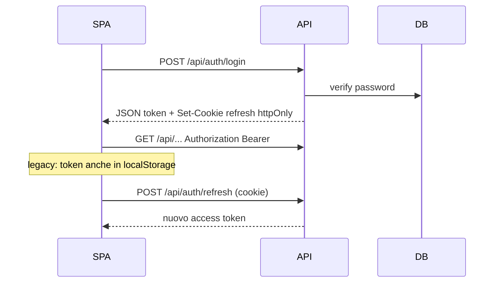

# Capitolo 5bis — Autenticazione: JWT, cookie, refresh

> **Prerequisito:** [Cap. 4bis](./04bis-middleware-pipeline-sicurezza.md)  
> **Codice:** `routes/auth.js`, `services/authService.js`, `lib/tokens.js`, `lib/authCookies.js`, `middleware/auth.js`

---

## 5bis.1 Modello ibrido Bearer + cookie



| Canale | Contenuto | Scadenza default |
|--------|-----------|------------------|
| Body `token` | access JWT | `ACCESS_TOKEN_EXPIRES` 15m |
| Cookie `refresh_token` | refresh JWT | `REFRESH_TOKEN_EXPIRES` 7d |
| Header `Authorization` | Bearer access | — |

`extractBearerOrCookie` — access da header **o** cookie access se presente.

---

## 5bis.2 Responsabilità moduli

| Modulo | Fa |
|--------|-----|
| `authService` | register, login, hash, duplicate email |
| `tokens.js` | sign/verify, tipi access/refresh |
| `authCookies.js` | set/clear/httpOnly/sameSite |
| `authSchemas.js` | Zod login/register |
| `authenticateToken` | verify + **loadUser da DB** |

**Punto critico:** ruolo in JWT può essere stale; **`loadUser` ricarica `role` e `area` dal DB** ogni request protetta.

---

## 5bis.3 Access vs refresh

```11:24:backend/lib/tokens.js
export function issueAccessToken(user) {
    return jwt.sign(
        { userId: user.user_id, email: user.email, role: user.role, type: 'access' },
        ...
        { expiresIn: process.env.ACCESS_TOKEN_EXPIRES || '15m' },
    );
}
```

**Trade-off:** access breve limita finestra di token rubato; refresh in cookie riduce esposizione XSS rispetto a refresh in localStorage.

---

## 5bis.4 Flussi endpoint

| Endpoint | Rate limit | Note |
|----------|------------|------|
| `POST /register` | `registerLimiter` | ruolo da `managerCode`, non da body |
| `POST /login` | `loginLimiter` | |
| `POST /refresh` | — | richiede cookie refresh |
| `GET /verify` | — | validazione token corrente |
| `POST /logout` | — | clear cookies |

---

## 5bis.5 Trade-off JWT vs sessione server

| JWT + reload DB (oggi) | Session Redis |
|------------------------|---------------|
| scale orizzontale facile | revoke immediata sessione |
| revoca ruolo ritardata fino a scadenza access | più infra |

---

## 5bis.6 Fallimenti

| Sintomo | Causa probabile |
|---------|-----------------|
| 403 token scaduto | access 15m, refresh non chiamato |
| 403 dopo cambio ruolo | access vecchio ancora valido fino a expiry |
| 500 configurazione | `JWT_SECRET` assente |
| 401 refresh | cookie non inviato (SameSite, dominio) |

---

## 5bis.7 ×100

Ogni request autenticata: **verify JWT + `loadUser` query**. Mitigazioni: cache breve Redis per `user_id → role`, oppure claims minimal + refresh forzato su azioni admin.

---

*Capitolo 5bis — v1*
