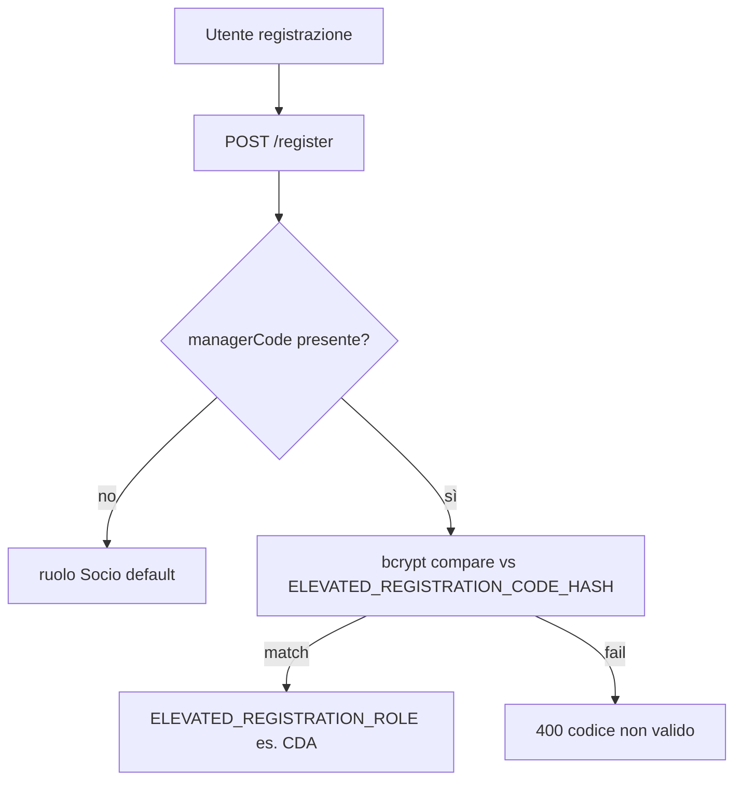

# Capitolo 6 — Registrazione elevata e superficie di abuso

> **Codice:** `lib/registrationRoles.js`, `services/authService.js`, `middleware/rateLimit.js`, `.env.example`

---

## 6.1 Threat model `managerCode`

**Mai** accettare `role` nel body client. Il codice in chiaro **non** va in repo — solo hash in env.

---

## 6.2 `registrationRoles.js`

- Hash assente → registrazione elevata **disabilitata** (log errore config).  
- Ruolo elevato da `ELEVATED_REGISTRATION_ROLE` (default CDA).

---

## 6.3 Rate limiting

`loginLimiter` / `registerLimiter` su `/api/auth` — mitiga brute force e stuffing; **non** coordina tra repliche (in-memory).

---

## 6.4 Alternative scartate

| Scartata | Perché |
|----------|--------|
| Ruolo nel JSON body | escalation banale |
| Codice in chiaro in git | leak repository |
| Nessun rate limit | abuso registrazione spam |

---

## 6.5 Fallimenti

- Enum email implicita via messaggi uniformi (verificare copy errori).  
- Credential stuffing su login — monitorare 401 rate (Cap. 5).  
- Codice elevato condiviso su chat → ruotare hash e rigenerare con `npm run hash:registration-code`.

---

*Capitolo 6 — v1*
