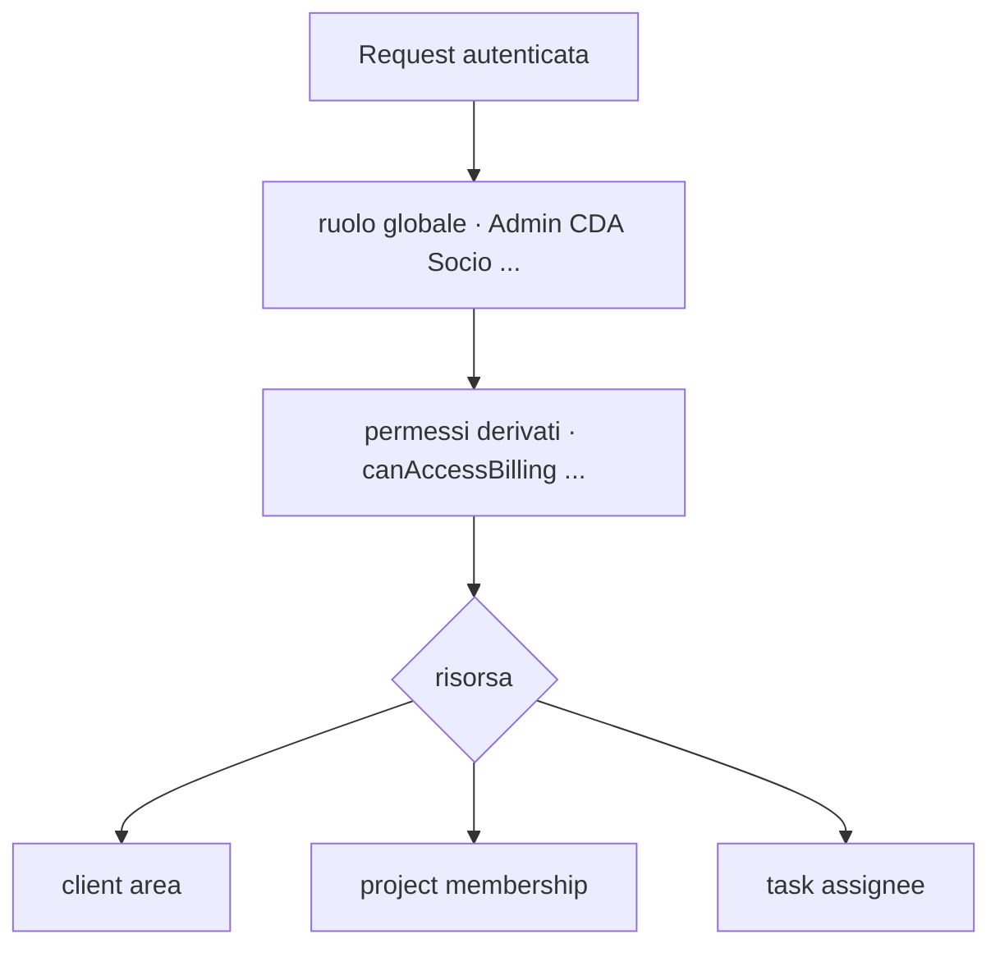

# Capitolo 7 — Autorizzazione (RBAC) e accesso alle risorse

> **Riferimento canonico:** `docs/RBAC.md`  
> **Codice:** `lib/roles.js`, `lib/permissions.js`, `middleware/authorize.js`, `lib/taskAccess.js`, `lib/projectAccess.js`

---

## 7.1 Due livelli

| Livello | Esempio |
|---------|---------|
| Globale | `isAdmin`, `isManagement`, `requireNotSocio` |
| Risorsa | `canAccessProject`, `canEditTask`, `canAccessBilling` |

---

## 7.2 Middleware

- `authenticateToken` — prerequisito  
- `authorize(...roles)` — allow-list ruoli  
- `requirePermission(fn)` — predicate su `req.user`

---

## 7.3 RBAC per dominio (sintesi)

| Dominio | Gate principale |
|---------|-----------------|
| Clienti | area + ruolo (Socio limitato) |
| Progetti | membership team, area |
| Contratti | `canAccessBilling` / Tesoreria |
| Task | assignee, project access |
| Eventi | creator, partecipante, RSVP Socio |

**Drift:** ogni nuova route deve aggiornare `docs/RBAC.md` e test permessi.

---

## 7.4 Trade-off RBAC codice vs RLS

Vedi Cap. 2 §2.5 — Node per policy ricca; RLS opzionale baseline.

---

## 7.5 Fallimenti

| Errore | Rischio |
|--------|---------|
| 404 vs 403 inconsistente | information disclosure |
| `PATCH` parziale | escalation campi sensibili |
| Script con `DATABASE_URL` | bypass totale RBAC |

---

## 7.6 ×100

Query membership ripetute per progetto/task su board — cache per request o join unico.

---

*Capitolo 7 — v1*
