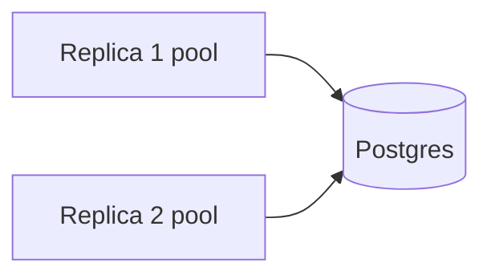

# Capitolo 8 — PostgreSQL come source of truth

> **Estende:** [Cap. 2](./02-livello-dati-architettura-stato-type-safety.md) con focus operativo

---

## 8.1 Perché Postgres

ACID, FK, `CHECK`, JSONB per `activities.payload` / poll — un primary per associazione è sufficiente.

---

## 8.2 Pool `connection.js`

- Singleton module export.  
- SSL `rejectUnauthorized: false` in production (Render).  
- **PgBouncer:** non modellato — attenzione `max` pool × repliche Node.

---

## 8.3 Schema concettuale

Grafo: `users` → `clients` → `projects` → `tasks` / `todos`; `contracts` → client/project; `events` → `participants`. Dettaglio: `docs/data/Database-Schema.md`.

---

## 8.4 SQL grezzo vs ORM

Oggi SQL in route — Cap. 2 per Drizzle target.

---

## 8.5 Fallimenti

| Codice | Azione |
|--------|--------|
| pool exhausted | ridurre repliche o pool max, PgBouncer |
| deadlock | retry transazione, ordine lock |
| timeout query | EXPLAIN, indici |

---

## 8.6 ×100

Singolo primary — read replica non presente; report pesanti competono con OLTP.

---

*Capitolo 8 — v1*
