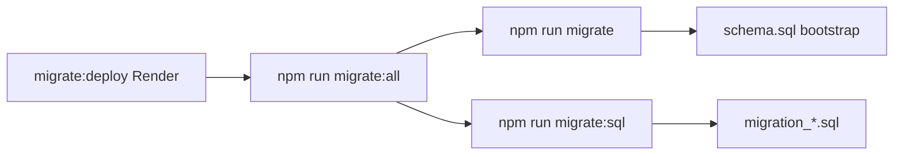

# Capitolo 9 — Strategia di migrazione e evoluzione schema

> **Script:** `scripts/migrate.js`, `scripts/migrate-all.js`, `scripts/run-sql-migrations.js`

---

## 9.1 Tre velocità

| Script | Uso |
|--------|-----|
| `migrate.js` | DB vuoto + SEED_ADMIN opzionale |
| `run-sql-migrations.js` | incrementali + `schema_migrations` |
| `migrate_v2.js` | legacy board (se ancora usato) |

---

## 9.2 `schema_migrations`

Ordine **esplicito** in `MIGRATION_FILES` — non alfabetico. Ogni file: transazione, `markApplied`, skip se già applicata.

---

## 9.3 Trigger condivisi

`migration_000_shared_functions.sql` — funzioni `updated_at`, `increment_version` riusate.

---

## 9.4 Trade-off SQL manuali vs tool unico

Controllo totale SQL vs doppio sistema se si aggiunge Drizzle Kit — scegliere uno path primario.

---

## 9.5 Fallimenti

- Migrazione parziale → app nuova su schema vecchio.  
- Drift staging/prod → confrontare `SELECT * FROM schema_migrations`.  
- **Rollback:** solo migrazione compensatoria forward.

---

## 9.6 Operativa Render

`startCommand: npm run migrate:deploy && npm start` — deploy fallisce se migrate fallisce (coerente, ma downtime se migration lenta).

---

*Capitolo 9 — v1*
