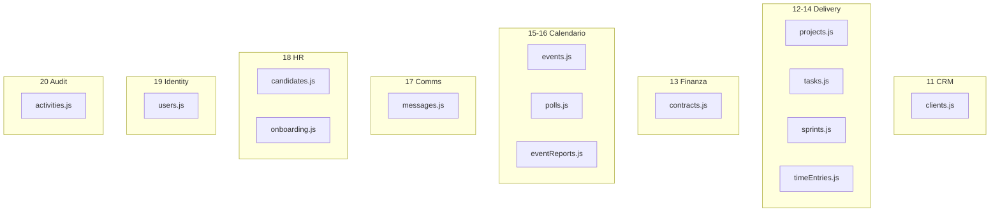

# Capitoli 11–20 — Dominio applicativo (moduli API)

> **Schema interno per ogni modulo:** responsabilità → flusso → invarianti → errori → debito → ×100  
> **Codice:** `backend/routes/*.js` · **Permessi:** `docs/RBAC.md`

---

## Panorama moduli

---

## Cap. 11 — CRM: `clients.js`

| Aspetto | Dettaglio |
|---------|-----------|
| Responsabilità | CRUD clienti, stati pipeline, filtro area |
| Invarianti | `CHECK` status/area; Socio non crea/modifica |
| Debito | SQL inline, estrarre `clientsService` |
| ×100 | liste senza paginazione stretta → scan |

---

## Cap. 12 — Progetti: `projects.js` + `lib/projects.js`

| Aspetto | Dettaglio |
|---------|-----------|
| Responsabilità | progetti, todos, team, task nested |
| Punto di forza | `attachTodosToProjects` anti N+1 |
| Invarianti | FK client, cascade delete |
| ×100 | card con molti todo — batch ok, verificare task board |

---

## Cap. 13 — Contabilità: `contracts.js`

| Aspetto | Dettaglio |
|---------|-----------|
| Responsabilità | contratti/fatture/preventivi, stati fino a Pagato |
| Sensibilità | `canAccessBilling` — Tesoreria/CDA |
| Gap | Pagato manuale — nessun Stripe (Cap. 4) |
| Fallimenti | leak via export futuro |

---

## Cap. 14 — Board: `tasks.js`, `sprints.js`, `timeEntries.js`

| Aspetto | Dettaglio |
|---------|-----------|
| Responsabilità | colonne, assignees, subtasks, sprint, ore |
| Accesso | `taskAccess`, project membership |
| ×100 | drag-drop = molti PATCH; optimistic `version` su task |

---

## Cap. 15 — Calendario: `events.js`

| Aspetto | Dettaglio |
|---------|-----------|
| Responsabilità | eventi, call link, partecipanti, RSVP |
| SQL | range su `start_time` — indice `idx_events_start_time` |
| ×100 | query calendario mensile senza limit |

---

## Cap. 16 — Poll e report: `polls.js`, `eventReports.js`

| Aspetto | Dettaglio |
|---------|-----------|
| Responsabilità | sondaggi disponibilità, heatmap, report post-evento |
| JSONB | aggregazioni poll |
| Debito | email placeholder in poll → usare coda (Cap. 3) |

---

## Cap. 17 — Messaggi: `messages.js`

| Aspetto | Dettaglio |
|---------|-----------|
| Responsabilità | chat, messaggi, `chat_members` |
| Gap | **no WebSocket** — client polling |
| ×100 | fan-out messaggi progetto grande |

---

## Cap. 18 — HR: `candidates.js`, `onboarding.js`

| Aspetto | Dettaglio |
|---------|-----------|
| Responsabilità | pipeline candidati, periodo prova |
| Migrazione | `migration_hr_recruiting.sql` |
| Sensibilità | dati personali — RBAC stretto |

---

## Cap. 19 — Utenti: `users.js`

| Aspetto | Dettaglio |
|---------|-----------|
| Responsabilità | profilo, admin utenti, reset password |
| Presenza | `last_seen` + throttle Map (Cap. 1) |
| ×100 | write amplification `last_seen` |

---

## Cap. 20 — Activities: `activities.js`

| Aspetto | Dettaglio |
|---------|-----------|
| Responsabilità | feed attività progetto |
| Modello | audit leggero, non event sourcing completo |
| Gap | retention policy assente |

---

## Checklist review (tutti i moduli)

- [ ] `authenticateToken` + permesso dominio prima di write  
- [ ] Query parametrizzate  
- [ ] Conteggio query documentato su GET lista  
- [ ] Nessun segreto in log  
- [ ] Stati allineati a `CHECK` DB  

---

*Capitoli 11–20 — v1 consolidato*
