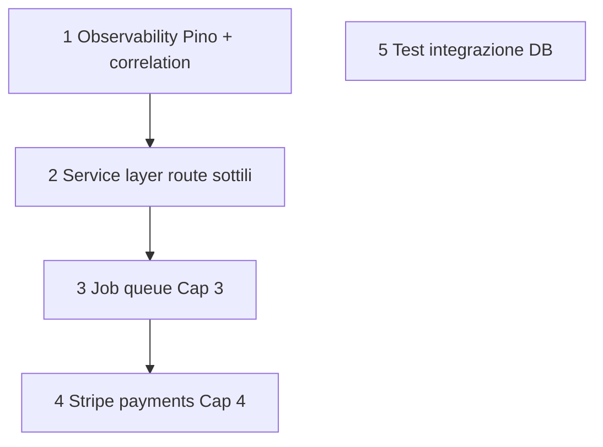

# Capitolo 28 — Roadmap e debito tecnico

> **Fonti:** `docs/ROADMAP-BACKEND.md`, gap espliciti nei Cap. 1–27

---

## 28.1 Debito prioritario (ordinato)

| # | Item | Capitolo |
|---|------|----------|
| 1 | Logging strutturato + correlation | 5, 25 |
| 2 | Estrarre SQL da `routes/*` | 1, 11–20 |
| 3 | Inngest/QStash | 3 |
| 4 | Pagamenti Stripe | 4 |
| 5 | Graceful shutdown | 3bis |
| 6 | Env validation boot | 3bis |
| 7 | Drizzle graduale | 2 |

---

## 28.2 Criteri stop refactoring

- Ogni nuova feature rispetta checklist Cap. 1 §1.9  
- Non big-bang ORM senza modulo pilota  
- Un dominio per sprint verso `*Service`

---

*Capitolo 28 — v1*
