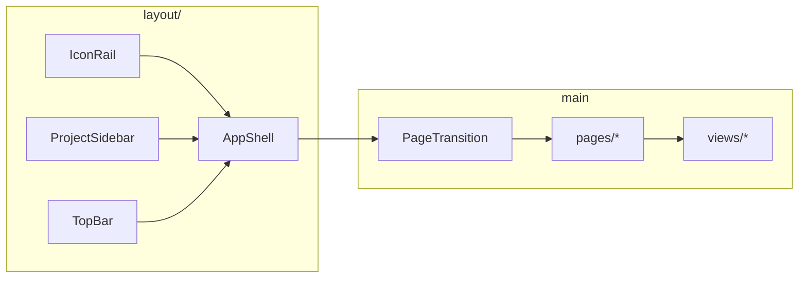

# Capitolo 0 — Come usare il manuale e mappa UI del repo

> **Prerequisito:** [PRE-DE-B — Fondamenta design engineering](./cap00-pre-de-b-fondamenta-design-engineering.md).  
> **Dev (git/React/HTTP):** [FOUNDATIONS PRE-DE-A](../FOUNDATIONS/00-INDICE.md) se non hai ancora avviato il repo.

---

## Contesto

Arrivi con competenze da tutorial (componenti isolati, palette copiata da Figma) **e** hai letto PRE-DE-B (gerarchia, stati, feedback). In JEINS il lavoro visivo non è “bello per sé”: è **leggibilità sotto carico cognitivo**, stati espliciti, e coerenza con un design system già in produzione. Questo capitolo ti orienta **dove** intervenire senza leggere 142 file uno per uno.

**Obiettivo del capitolo:** costruire una mappa mentale di `gestionale-app/src/` e sapere quali altri manuali aprire per dati, permessi o deploy.

---

## Codice ancoraggio — albero operativo

Non memorizzare ogni file. Memorizza **cinque zone**:

| Zona | Path | Responsabilità visiva |
|------|------|------------------------|
| **Shell** | `layout/`, `app/AuthenticatedLayout.tsx` | cornice persistente: rail, sidebar, top bar |
| **Pagine** | `pages/` | wiring: query, modali, permessi — poche righe di layout |
| **Viste** | `views/` | presentazione: tabelle, card, empty — **zero** fetch |
| **Sistema** | `components/ui/`, `index.css`, `motion/` | primitivi e token |
| **Dominio visivo** | `components/dashboard/`, `features/forms/` | widget e form riusabili |

Entry dell’app (non tocchi spesso come design engineer):

```1:8:gestionale-app/src/App.tsx
// App minimale → providers → router
```

Provider globali (tema, query, notice):

📁 `gestionale-app/src/app/providers.tsx`

---

## Diagramma — shell applicativa



La shell è **stato condiviso** (progetto attivo, vista, utente). Le Page **non** ridisegnano la shell: passano `children` dentro `AppShell` via layout autenticato — vedi [cap04](./cap04-layout-information-architecture.md).

---

## Come leggere gli altri capitoli

| Simbolo nel manuale | Significato |
|---------------------|-------------|
| 📁 | path reale — apri in IDE |
| ✅ | pattern che mergiamo |
| ❌ | pattern che la review respinge |
| → link | approfondimento, non duplicato qui |

**Ordine di lavoro tipico su una feature visiva:**

0. PRE-DE-B — modello mentale (se saltato, torna indietro)  
1. Cap 1 — vincoli (B2B, no SSR)  
2. Cap 2–3 — token + primitivi  
3. Cap 4–5 — dove vive la UI (View) e stati  
4. [MID-LEVEL cap01](../MID-LEVEL/cap01-metodo-jeins-feature-end-to-end.md) — filo E2E  
5. Cap 9 — checklist prima della PR  

---

## Alternative scartate

| Approccio | Perché scartato in JEINS |
|-----------|-------------------------|
| Leggere tutto `src/` in ordine alfabetico | costo >> beneficio; perdi il modello Page/View |
| Copiare componenti da shadcn senza adattare token | seconda palette, tema chiaro/scuro rotto |
| Studiare solo Figma / mock esterni | il source of truth è il codice deployato |
| Sostituire questo manuale con [frontend](../frontend/00-INDICE.md) | quello è architettura; qui è **craft** sul DS esistente |

---

## Trade-off

| Scelta | Pro | Contro |
|--------|-----|--------|
| Mappa per **responsabilità** non per cartella | onboarding veloce | nomi file non sempre autoesplicativi (`UtilityView`) |
| Design engineer lavora soprattutto su `views/` + `components/ui/` | PR piccole, review focalizzate | serve capire hook in `pages/` per stati |
| Link pesanti a MID-LEVEL / frontend | niente drift tra “teoria” e “consegna” | devi saltare tra file |

---

## Esercizio valutabile

**Deliverable (2–3 ore):**

1. Disegna (Excalidraw o Mermaid) la shell con **tre colonne** e annota quali props arrivano da `AuthenticatedLayout` a `AppShell`.
2. Traccia **Clienti** end-to-end solo nomi file: `router.tsx` → `ClientsPage.tsx` → `ClientiView.tsx` → `AppModal` → `features/forms/modals.tsx`.
3. Elenca **5 file** che non modificheresti per un tweak visivo sulla tabella clienti — e spiega perché in una riga ciascuno.

**Criteri di valutazione:**

| Criterio | Sufficiente |
|----------|-------------|
| Shell | IconRail + sidebar opzionale + main identificati |
| Tracciamento Clienti | almeno 4 hop corretti |
| Disciplina scope | nessun `backend/` nei file “non toccare” per tweak tabella |

---

## Limiti nel repo

- **`components/` misto:** dashboard, calendar, legacy (`MyTasks`, `Recruiting`) con stili non sempre allineati ai token — non usarli come template senza verifica ([cap10](./cap10-capstone-rifare-schermata.md)).
- **Doppio sistema modali:** `AppModal` vs `components/motion/MotionDialog.tsx` — convivenza storica ([cap07](./cap07-form-modali.md)).
- **`EmptyState`** usa ancora classi `neutral-*` invece di `ink`/`surface` — debito visivo documentato in [cap05](./cap05-stati-feedback.md).
- **Deploy / API:** non coperti; vedi [BACKEND cap24](../BACKEND/24-deploy-configurazione-produzione.md) se serve contesto hosting (Render).

---

*Indietro: [PRE-DE-B](./cap00-pre-de-b-fondamenta-design-engineering.md) · Prossimo: [Capitolo 1 — Filosofia design engineer](./cap01-filosofia-design-engineer.md)*
