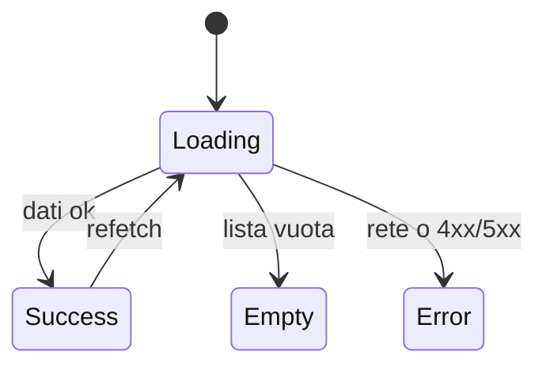

# PRE-DE-B — Fondamenta design engineering (zero craft UI)

> **PRE-DE-B** = prerequisiti **design** — da leggere **prima** di token, Tailwind e motion.  
> **PRE-DE-A** (git, React, HTTP, avvio repo) → [FOUNDATIONS](../FOUNDATIONS/00-INDICE.md).

---

## Contesto

Puoi scrivere React e non essere ancora un **design engineer**: confondi “bello” con “usabile”, dimentichi stati vuoti, animi tutto o non dai feedback. Questo capitolo costruisce il **modello mentale** che i capitoli 1–10 applicano sul codice JEINS.

**Non apri ancora** `index.css` come compito — quello è [cap02](./cap02-token-tipografia-spaziatura.md). Qui impari *cosa* stai ottimizzando.

---

## Design engineer vs altri ruoli

| Ruolo | Focus | In JEINS |
|-------|--------|----------|
| **Grafico / UI designer** | mock, brand, ricerca utenti | input esterno — non source of truth |
| **Frontend “solo CSS”** | allineare pixel | insufficiente senza stati e permessi |
| **Design engineer** | superfici **usabili in produzione**: gerarchia, stati, a11y base, sistema | `views/` + `components/ui/` + token |
| **Mid full-stack** | feature E2E DB→API→Page | [MID-LEVEL](../MID-LEVEL/00-INDICE.md) |

Tu punti alla riga **design engineer** sul prodotto reale, non a Figma isolato.

---

## 1. Gerarchia visiva

L’occhio segue ordine di importanza:

1. **Dove sono** (titolo pagina, breadcrumb, contesto progetto)
2. **Cosa posso fare ora** (azione primaria: “Nuovo cliente”, “Salva”)
3. **Dati** (tabella, card, metriche)
4. **Rumore** (link secondari, metadati, icone decorative)

**Esercizio carta:** stampa o schizza una schermata admin densa. Cerchia in rosso **una sola** azione primaria. Se ne trovi tre, il design ha fallito prima del CSS.

In JEINS la shell (`AppShell`, `TopBar`) porta (1); le Page non devono competere con la rail ([cap04](./cap04-layout-information-architecture.md)).

---

## 2. Affordance e feedback

| Domanda utente | Risposta UI |
|----------------|-------------|
| Ho cliccato? | stato pressed / loading sul bottone |
| Sta caricando? | skeleton o spinner **nel layout** — non schermo bianco |
| È vuoto? | `EmptyState` con messaggio + CTA |
| È andato male? | errore in italiano, azione di recupero |
| Ho salvato? | toast / notice — [cap05](./cap05-stati-feedback.md) |

**Feedback** ≠ animazione decorativa. Se l’utente non capisce l’esito, il motion è rumore ([cap06](./cap06-motion.md)).

---

## 3. Stati come design (non afterthought)

Ogni vista dati ha almeno quattro stati:

In JEINS lo stato **Success** vive spesso in React Query; la **View** riceve `isLoading`, `isError`, `data` e decide cosa disegnare — [frontend mod.4](../frontend/04-state-management-e-data-flow.md).

**Junior:** disegna solo il caso felice.  
**Design engineer:** il professore valuta empty/error come il layout della tabella.

---

## 4. Restraint (craft intenzionale)

Principi che userai in ogni capitolo:

| Principio | Applicazione |
|-----------|----------------|
| **Default semplici** | token esistenti, primitivi `components/ui/` |
| **Motion come informazione** | entrata lista sì; ogni hover no |
| **Coerenza > creatività** | stesso bottone ovunque |
| **Costo esplicito** | modale = focus trap; animazione = CPU + accessibilità |
| **Saper dire no** | alternative scartate documentate in PR |

Non è “minimalismo estetico” — è **rispetto del tempo cognitivo** dell’operatore B2B che usa il gestionale ore al giorno.

---

## 5. Vincoli JEINS (anteprima cap01)

| Vincolo | Effetto sul design |
|---------|-------------------|
| B2B amministrativo | densità dati, poche illustrazioni |
| Team piccolo | un design system interno |
| SPA, no SSR | loading lato client esplicito |
| RBAC | non mostrare azioni illegali — [cap08](./cap08-rbac-ui-difensiva.md) |
| Copy in **italiano** | professionalità, coerenza |

Dettaglio filosofico: [cap01](./cap01-filosofia-design-engineer.md).

---

## Alternative scartate

| Approccio | Perché scartato |
|-----------|-----------------|
| Imparare solo teoria colore / tipografia generica | senza stati e permessi non sopravvivi in `gestionale-app/` |
| Copiare Dribbble / dashboard random | seconda palette, tema JEINS rotto |
| Saltare PRE-DE-B e aprire Figma | il source of truth è il codice deployato |

---

## Trade-off

| Scelta | Pro | Contro |
|--------|-----|--------|
| Capitolo senza codice CSS | modello mentale solido | impazienza “voglio codice subito” |
| Esercizi carta + repo | valutabile in università | meno spettacolare di un redesign completo |
| Separato da PRE-DE-A | percorsi chiari | due ingressi da spiegare ([00-PERCORSI](../00-PERCORSI.md)) |

---

## Esercizio valutabile

**Parte A (1 h, senza IDE):** per la schermata **Clienti**, descrivi in italiano:

1. gerarchia (titolo, azione primaria, tabella);
2. copy per **empty** e **error** di rete;
3. cosa succede al bottone “Salva” durante il submit.

**Parte B (1 h, con IDE):** apri `gestionale-app/src/views/` (file Clienti) e verifica quali stati sono **già** gestiti vs il tuo documento — gap list di max 5 bullet.

**Sufficiente se:** Parte A completa; Parte B con almeno 2 gap reali e proposta (non codice) per uno.

---

## Limiti

- Non copre accessibilità avanzata (WCAG audit) — baseline in [cap09](./cap09-review-ui-checklist-pr.md).
- Non copre 409 / conflitti — [MID-LEVEL cap03](../MID-LEVEL/cap03-gestione-conflitti-dati-concorrenti.md).
- Non sostituisce [FOUNDATIONS](../FOUNDATIONS/00-INDICE.md) se non sai usare git/React.

---

## Prossimo

1. [Capitolo 0 — Mappa UI del repo](./cap00-come-usare-mappa-ui.md) — dove intervenire nel codice  
2. Poi [Capitolo 1 — Filosofia](./cap01-filosofia-design-engineer.md)

---

*PRE-DE-B — ingresso DESIGN-ENGINEER*
