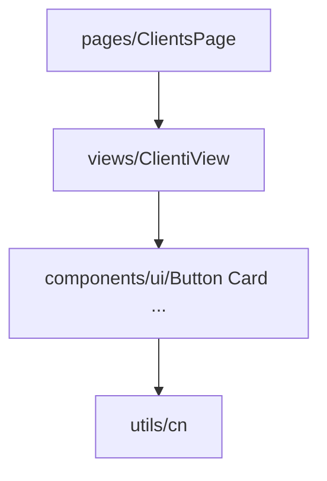

# Capitolo 3 — Primitivi e composizione (`components/ui`, `cn`, varianti)

---

## Contesto

Prima di creare `FancyCard.tsx` in una feature, chiediti: esiste già un primitivo che, composto, risolve il 80%? Il design system JEINS vive in `components/ui/` — API piccole, varianti esplicite, `cn` per merge sicuro.

---

## Codice ancoraggio — barrel export

📁 `gestionale-app/src/components/ui/index.ts`

Esporta: `Button`, `Card`, `Modal`, `Form`, `EmptyState`, `Skeleton`, `DataTable`, `SkipLink`, `AccessibleButton`, …

**Regola:** import da `components/ui` (o path diretto se tree-shaking) — non copiare markup bottone in ogni View.

---

## Codice ancoraggio — `cn`

📁 `gestionale-app/src/utils/cn.ts`

```ts
export function cn(...inputs: ClassValue[]) {
  return twMerge(clsx(inputs));
}
```

| Tool | Ruolo |
|------|--------|
| `clsx` | condizioni booleane sulle classi |
| `tailwind-merge` | ultima classe vince (`p-4` + `p-2` → `p-2`) |

---

## Codice ancoraggio — varianti su `Button`

📁 `gestionale-app/src/components/ui/Button.tsx`

```13:19:gestionale-app/src/components/ui/Button.tsx
const variantStyles = {
  primary: 'bg-primary-600 dark:bg-primary-500 text-white hover:bg-primary-700 ...',
  secondary: '...',
  ghost: '...',
  danger: '...',
  outline: '...',
};
```

```46:59:gestionale-app/src/components/ui/Button.tsx
        className={cn(
          'inline-flex items-center justify-center gap-2',
          'font-medium rounded-lg',
          ...
          variantStyles[variant],
          sizeStyles[size],
          fullWidth && 'w-full',
          className
        )}
        disabled={disabled || isLoading}
        aria-busy={isLoading}
```

**Pattern da replicare** su nuovi primitivi: oggetto `variantStyles`, prop `className` finale per override controllato, stati `disabled` + `isLoading` + `aria-busy`.

---

## Composizione — Card e Form

| Primitivo | Uso |
|-----------|-----|
| `Card` + `CardHeader` / `CardContent` | pannelli dashboard, sezioni impostazioni |
| `Form` + `FormField` | label + errore allineati |
| `DataTable` | liste dense B2B |
| `Badge` / `PriorityBadge` | stato entità — dominio vicino a UI ma riusabile |

**Componente dominio vs primitivo:**

- `TaskCard` → dominio (dashboard), può usare `Card` + token.
- `Button` → mai logica RBAC dentro; la Page passa `disabled` o non renderizza.

---

## Diagramma — composizione



---

## Alternative scartate

| ❌ | ✅ |
|----|-----|
| Nuovo bottone HTML in ogni modale | `Button` con `variant` |
| Props `color="green"` libera | `variant` enum chiuso |
| `className` stringa concatenata | `cn(...)` |
| Primitivo con fetch API | sposta in `pages/` o hook |

---

## Trade-off

| Scelta | Pro | Contro |
|--------|-----|--------|
| Variant enum chiusi | review e snapshot prevedibili | serve nuovo variant per casi rari |
| `forwardRef` su Button/Input | focus e form library | boilerplate |
| Barrel `index.ts` | import puliti | rischio import circolari se UI importa pages |
| Estendere primitivo vs wrapper View | meno file | wrapper se logica solo layout |

**Quando creare un nuovo primitivo** (checklist):

1. Ripetuto ≥3 volte con stesse varianti  
2. Nessuna logica dominio (cliente/progetto)  
3. Accessibilità centralizzabile (`aria-*`, focus)  

Altrimenti: composizione in `views/` o `components/dashboard/`.

---

## Esercizio valutabile

Implementa un componente **`SectionHeader`** in `gestionale-app/src/components/ui/` (o sotto `components/layout/` se il team preferisce):

- Props: `title`, `description?`, `action?: ReactNode`
- Solo token `ink` / `surface` / `line`
- Usa `cn`, nessun colore hardcoded

Usalo in **una** View esistente al posto di un heading ad hoc.

**Valutazione:** export da `index.ts`; story visiva in PR screenshot; nessun `any` sulle props pubbliche.

---

## Limiti nel repo

- **`Modal` in ui/** vs **`AppModal`**: due livelli — shell dominio vs primitivo generico ([cap07](./cap07-form-modali.md)).
- **`AccessibleButton`**: parallelo a `Button` — usare dove serve comportamento extra, non terzo bottone custom.
- [MID-LEVEL cap05](../MID-LEVEL/cap05-ui-design-system-tailwind-motion.md) copre Framer su primitivi — non duplicare qui.

---

*Prossimo: [Capitolo 4 — Layout e information architecture](./cap04-layout-information-architecture.md)*
