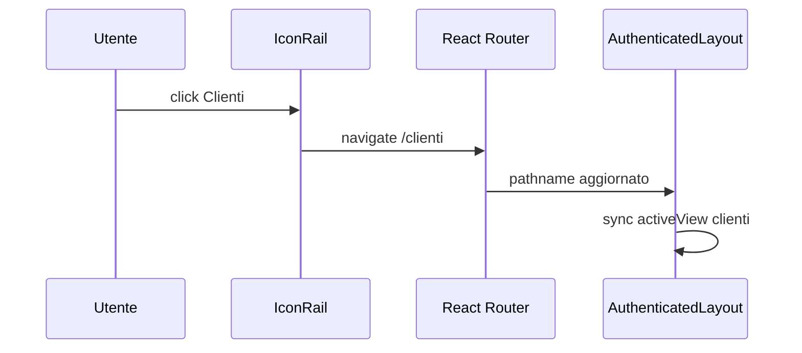

# Capitolo 4 — Layout e information architecture

---

## Contesto

L’utente JEINS naviga per **ore** nella stessa shell: rail fissa, contesto progetto opzionale, area di lavoro scrollabile. Information architecture = *cosa è sempre visibile*, *cosa dipende dal ruolo*, *cosa è contenuto di pagina*.

Confondere Page e View o URL con `activeView` produce bug visivi (highlight sbagliato, sidebar fuori sync).

---

## Codice ancoraggio — `AppShell`

📁 `gestionale-app/src/layout/AppShell.tsx`

Tre colonne logiche:

1. **`IconRail`** — navigazione modulo (clienti, dashboard, …)  
2. **`ProjectSidebar`** — opzionale (`showProjectSidebar`) — contesto progetto  
3. **Colonna main** — `TopBar` + `main` con `PageTransition`

Props chiave: `activeView`, `setActiveView`, `projects`, `activeProjectId`, `showProjectSidebar`.

---

## Codice ancoraggio — navigazione e permessi menu

📁 `gestionale-app/src/layout/IconRail.tsx`

```31:40:gestionale-app/src/layout/IconRail.tsx
const TOP_ITEMS: { id: string; icon: typeof LayoutGrid; label: string; perm: keyof UserPermissions }[] = [
    { id: 'clienti',     icon: LayoutGrid,    label: 'Clienti',       perm: 'viewClients' },
    { id: 'dashboard',   icon: FolderOpen,    label: 'Dashboard',     perm: 'viewDashboard' },
    ...
];
```

Ogni voce rail è filtrata con `resolvePermissions(user)` — la superficie navigabile **è** IA + sicurezza.

`VIEW_PATHS` mappa `id` → path React Router (`/clienti`, …).

---

## Page vs View

| Layer | Path esempio | Ruolo visivo |
|-------|--------------|--------------|
| **Page** | `pages/ClientsPage.tsx` | stati query, modali, conflict |
| **View** | `views/ClientiView.tsx` | tabella, toolbar, callback |

```32:47:gestionale-app/src/pages/ClientsPage.tsx
    if (isLoading) return <p className="text-ink-muted">Caricamento clienti…</p>;
    if (error) return <p className="text-rose-400">{(error as Error).message}</p>;

    return (
        <>
            <ClientiView
                clients={clients}
                onUpdateStatus={...}
                onOpenAdd={() => setAddOpen(true)}
            />
```

**Design engineer:** il 90% del lavoro “schermata” è `ClientiView` + token; loading/error restano in Page ([cap05](./cap05-stati-feedback.md)).

---

## URL vs `activeView`



Rischio: desync se si cambia URL senza aggiornare `activeView` — mitigazione in layout (vedi [frontend mod.2](../frontend/02-routing-layout-e-esperienza-applicativa.md)).

`PageTransition` oggi è leggero — re-mount su `pathname`:

📁 `gestionale-app/src/components/layout/PageTransition.tsx`

```4:10:gestionale-app/src/components/layout/PageTransition.tsx
export function PageTransition({ children }: { children: ReactNode }) {
    const { pathname } = useLocation();
    return (
        <div key={pathname} className="page-enter min-h-0">
            {children}
        </div>
    );
}
```

Classe `page-enter` definita in `index.css` — non aggiungere Framer pesante su ogni route senza [cap06](./cap06-motion.md).

---

## `RequirePermission` a livello route

📁 `gestionale-app/src/app/router.tsx` — route wrappate con `RequirePermission perm="viewClients"` ecc.

Redirect a `defaultHomePath(user)` se negato — [MID-LEVEL cap04](../MID-LEVEL/cap04-auth-rbac-blindare-feature.md).

---

## Alternative scartate

| ❌ | ✅ |
|----|-----|
| Sidebar diversa per ogni Page | `AppShell` unica |
| Stato “tab attivo” solo in `useState` locale | sync con URL |
| View che chiama `fetch` | Page + React Query |
| Nuova colonna layout senza review | estensione rare, documentata |

---

## Trade-off

| Scelta | Pro | Contro |
|--------|-----|--------|
| Shell condivisa | orientamento costante | meno “fullscreen marketing” |
| Sidebar progetti opzionale | meno rumore per ruoli senza progetti | due modalità da testare |
| Page “spessa” su stati, View magra | testabilità View | duplicazione pattern loading tra Page |
| Rail icon-only | densità | tooltip/label per a11y ([cap09](./cap09-review-ui-checklist-pr.md)) |

---

## Esercizio valutabile

1. Disegna IA per un modulo ipotetico **“Fornitori”** (voce rail, path, permesso `view*` da definire con tutor).
2. Indica cosa vive in `IconRail`, cosa in `TopBar` title, cosa in `View`.
3. **Non implementare** — solo diagramma + tabella file da creare (allineata a [MID-LEVEL cap01](../MID-LEVEL/cap01-metodo-jeins-feature-end-to-end.md)).

**Valutazione:** permesso citato; nessun fetch in View; shell non duplicata.

---

## Limiti nel repo

- **Route utility** (`notifiche`, `help`) — placeholder; non usare come modello IA.
- **`UtilityView`** — pattern legacy.
- **Home per ruolo** — `HomeRedirect` / `defaultHomePath` — coerenza con rail filtrata.
- Layout grid aggiuntivi: `components/layout/Grid.tsx`, `Container.tsx` — usare per contenuti interni al `main`, non sostituire shell.

---

*Prossimo: [Capitolo 5 — Stati e feedback](./cap05-stati-feedback.md)*
