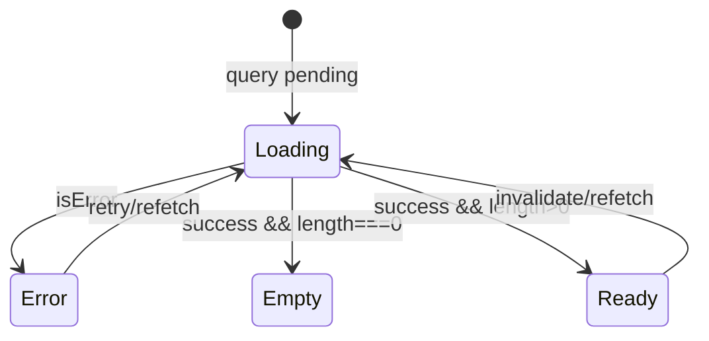

# Capitolo 5 — Stati e feedback (loading, empty, error, toast)

---

## Contesto

In una SPA senza SSR, l’utente **vede** il vuoto tra click e risposta API. Un design engineer tratta loading, empty ed error come **stati di prima classe** — stessa importanza del layout felice.

Confonderli (spinner infinito su lista vuota, testo generico su 409) è un difetto di prodotto, non “dettaglio”.

---

## Diagramma — macchina stati lista tipica



La Page decide la transizione; la View riceve dati già risolti o props `isEmpty` esplicite.

---

## Codice ancoraggio — Page (pattern attuale)

📁 `gestionale-app/src/pages/ClientsPage.tsx`

```32:33:gestionale-app/src/pages/ClientsPage.tsx
    if (isLoading) return <p className="text-ink-muted">Caricamento clienti…</p>;
    if (error) return <p className="text-rose-400">{(error as Error).message}</p>;
```

**Miglioramento atteso in PR** (design engineer):

- `Skeleton` o `Spinner` da `components/ui/Loading.tsx` con `role="status"`
- `EmptyState` quando `clients.length === 0` **dopo** success
- messaggio errore in italiano, azione “Riprova” se ha senso

---

## Codice ancoraggio — primitivi

📁 `gestionale-app/src/components/ui/Loading.tsx` — `Spinner`, `Skeleton`, `LoadingOverlay`

```27:32:gestionale-app/src/components/ui/Loading.tsx
    <div
      className={cn('inline-block', className)}
      role="status"
      aria-label="Caricamento in corso"
```

📁 `gestionale-app/src/components/ui/EmptyState.tsx`

```17:46:gestionale-app/src/components/ui/EmptyState.tsx
export const EmptyState: React.FC<EmptyStateProps> = ({
  icon, title, description, action, className,
}) => {
  return (
    <div className={cn('flex flex-col items-center justify-center', 'py-12 px-4 text-center', className)}>
      ...
      {action && (
        <Button variant={action.variant || 'primary'} onClick={action.onClick}>
          {action.label}
        </Button>
      )}
```

**Debito:** titolo/descrizione usano `neutral-*` — in PR che tocchi il file, migrare a `text-ink` / `text-ink-muted` ([cap02](./cap02-token-tipografia-spaziatura.md)).

---

## Errori — tassonomia UX

| Tipo | UX | Componente / pattern |
|------|-----|----------------------|
| Rete / 5xx | messaggio + retry | testo in Page o toast |
| 403 | redirect o messaggio “non autorizzato” | `RequirePermission`, API |
| 409 conflitto | dialog dedicato | `useConflictUpdate`, `ConflictDialog` — [MID-LEVEL cap03](../MID-LEVEL/cap03-gestione-conflitti-dati-concorrenti.md) |
| Validazione form | inline su `FormField` | `Form` ui |
| Successo save | toast breve | `useToast`, `Toast` |

📁 `gestionale-app/src/hooks/useToast.ts`  
📁 `gestionale-app/src/components/ui/Toast.tsx`  
Eventi globali: `NoticeProvider` in `app/providers.tsx` (vedi [frontend mod.6](../frontend/06-concorrenza-integrita-e-errori.md)).

**Non** usare `window.alert` per successi — solo `confirm` ancora accettato per delete distruttiva in alcune Page (migliorabile con modale).

---

## Loading in mutazioni

`Button` con `isLoading` + `aria-busy` — doppio submit mitigato ([frontend mod.6](../frontend/06-concorrenza-integrita-e-errori.md)).

Per overlay form: `LoadingOverlay` su sezione card, non su tutta shell.

---

## Alternative scartate

| ❌ | ✅ |
|----|-----|
| `return null` mentre loading (layout che salta) | placeholder altezza stabile (`Skeleton`) |
| Lista vuota = errore | `EmptyState` con CTA |
| Toast per ogni 409 | `ConflictDialog` |
| Spinner fullscreen per refetch background | indicatore locale o nessuno se `isFetching` e dati stale visibili |

---

## Trade-off

| Scelta | Pro | Contro |
|--------|-----|--------|
| Stati in Page | View pulita | Page più lunghe |
| Skeleton vs testo “Caricamento…” | percezione performance | più markup |
| Empty con CTA “Aggiungi” | conversione azione | ridondante se CTA già in toolbar |
| Toast non bloccanti | flusso veloce | utente può perderli — non per errori critici |

---

## Esercizio valutabile

Su **ClientsPage** (o altra Page assegnata):

1. Sostituisci loading testuale con `Skeleton` (≥3 righe tabella) o layout equivalente.
2. Aggiungi `EmptyState` italiano con azione che apre modale add.
3. Migliora errore: messaggio user-friendly + bottone refetch (`refetch()` da query).

**Valutazione:** tre stati distinguibili in screenshot; 409 ancora gestito da conflict hook se presente; `npm run lint` ok.

---

## Limiti nel repo

- Non tutte le Page hanno empty skeleton — allineamento graduale.
- **Dashboard** fetch custom — stati non uniformi.
- **Mock dev** — empty falso se mock popola dati; disattivare mock prima di demo ([MID-LEVEL cap08](../MID-LEVEL/cap08-react-query-chiavi-cache.md#84-mock-solo-dev---cosa-sono-e-cosa-non-committare)).

---

*Prossimo: [Capitolo 6 — Motion](./cap06-motion.md)*
