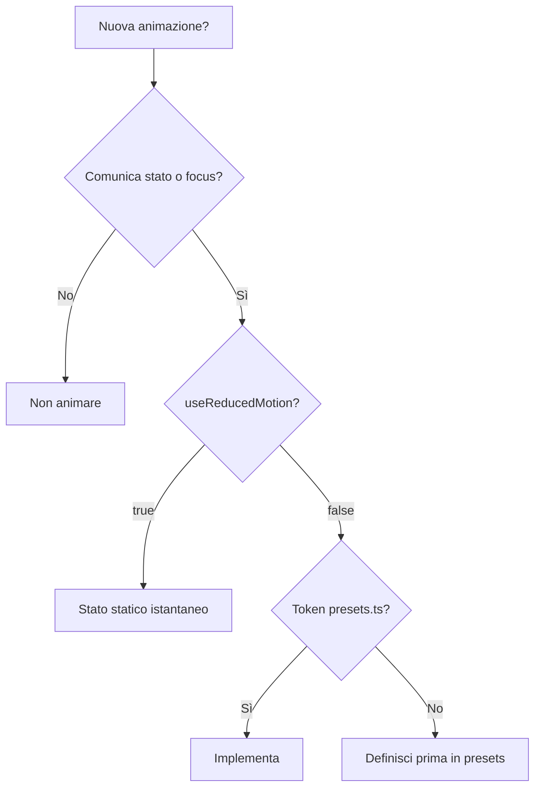

# Capitolo 6 — Motion con criterio (`motion/`, performance, reduced motion)

---

## Contesto

Motion in JEINS è **enhancement**, non requisito funzionale. Il riferimento craft: ogni animazione deve rispondere a “cosa comunica?” — orientamento, feedback pressione, enfasi su cambio stato — non “è fluido”.

Troppa motion su liste lunghe o su ogni transizione route affatica e ignora `prefers-reduced-motion`.

---

## Codice ancoraggio — single source of timing

📁 `gestionale-app/src/motion/presets.ts`

```6:31:gestionale-app/src/motion/presets.ts
export const DURATION = {
    instant: 0.12,
    fast: 0.18,
    normal: 0.28,
    slow: 0.42,
} as const;

export const SPRING = {
    snap: { type: 'spring' as const, stiffness: 480, damping: 34, mass: 0.8 },
    panel: { type: 'spring' as const, stiffness: 320, damping: 30, mass: 0.9 },
    soft: { type: 'spring' as const, stiffness: 260, damping: 28, mass: 1 },
};

export const TRANSITION = {
    fast: { duration: DURATION.fast, ease: EASE_OUT },
    normal: { duration: DURATION.normal, ease: EASE_OUT },
    slow: { duration: DURATION.slow, ease: EASE_OUT },
};
```

📁 `gestionale-app/src/motion/variants.ts` — varianti Framer riusabili  
📁 `gestionale-app/src/motion/useReducedMotion.ts` — legge media query

```3:10:gestionale-app/src/motion/useReducedMotion.ts
export function useReducedMotion(): boolean {
    ...
        return window.matchMedia('(prefers-reduced-motion: reduce)').matches;
```

---

## Codice ancoraggio — wrapper

| File | Uso |
|------|-----|
| `components/motion/Pressable.tsx` | feedback tap bottoni/card |
| `components/motion/StaggerList.tsx` | ingresso liste dashboard |
| `components/motion/BentoCell.tsx` | celle dashboard |
| `components/motion/MotionDialog.tsx` | modale animata (alternativa ad AppModal) |
| `layout/IconRail.tsx` | highlight voce attiva con `motion` + `SPRING` |

Pattern:

```ts
const reduced = useReducedMotion();
// transition: reduced ? { duration: 0 } : TRANSITION.fast
```

---

## CSS — reduced motion globale

📁 `gestionale-app/src/index.css` (sezione `@media (prefers-reduced-motion: reduce)`)

Riduce animazioni CSS (`page-enter`, `animate-fade-in` su modali). **Nuove** animazioni CSS devono rispettare lo stesso media query o usare hook JS.

`AppModal` usa `animate-fade-in` — accettabile se breve; evitare `backdrop-blur` pesante su dispositivi lenti se non necessario.

---

## Quando animare / quando NO

| ✅ Animare | ❌ Non animare |
|-----------|----------------|
| Feedback pressione CTA primaria | Ogni riga tabella su hover |
| Ingresso pannello dashboard (poche celle) | Refetch lista 200 righe |
| Indicatore rail attivo | Route change con slide 300ms + blur |
| Drag overlay Kanban | Spinner già rotante + bounce extra |

**Performance:**

- Liste lunghe: niente `layout` Framer su ogni item.
- Grafici `recharts`: mount costoso — non combinare con stagger pesante al primo paint.
- `@dnd-kit` Kanban: motion solo sull’overlay drag — vedi `components/dashboard/KanbanBoard.tsx`.

---

## Diagramma — decisione motion



---

## Alternative scartate

| ❌ | ✅ |
|----|-----|
| `duration: 0.8` inline | `DURATION.normal` |
| Ignorare `prefers-reduced-motion` | hook + CSS |
| `AnimatePresence` su ogni modale senza misura | solo dove ingresso/uscita aiuta |
| Libreria motion aggiuntiva | Framer già in bundle |

---

## Trade-off

| Scelta | Pro | Contro |
|--------|-----|--------|
| Token motion centralizzati | coerenza “tactile” | curva apprendimento Framer |
| Spring su rail | premium feel | calcolo su low-end |
| CSS `page-enter` leggero | no JS su ogni route | meno controllo orchestrato |
| `MotionDialog` vs `AppModal` | UX modale ricca | due pattern ([cap07](./cap07-form-modali.md)) |

---

## Esercizio valutabile

1. Trova **una** animazione nel repo senza guard `useReducedMotion` (grep `motion.` escludendo file che importano l’hook).
2. Proponi patch minima: `reduced ? { duration: 0 } : TRANSITION.fast`.
3. Documenta in 5 righe **perché** quell’animazione merita di restare.

**Valutazione:** diff tocca solo file necessari; nessun nuovo magic number fuori `presets.ts`.

---

## Limiti nel repo

- `PageTransition` quasi statico — ok per restraint.
- Non tutti i widget dashboard uniformi su reduced motion.
- [MID-LEVEL cap05](../MID-LEVEL/cap05-ui-design-system-tailwind-motion.md) — esempi Framer aggiuntivi.
- [frontend mod.8](../frontend/00-INDICE.md) — Kanban, calendario (non ridisegnare motion lì senza cap06).

---

*Prossimo: [Capitolo 7 — Form e modali](./cap07-form-modali.md)*
