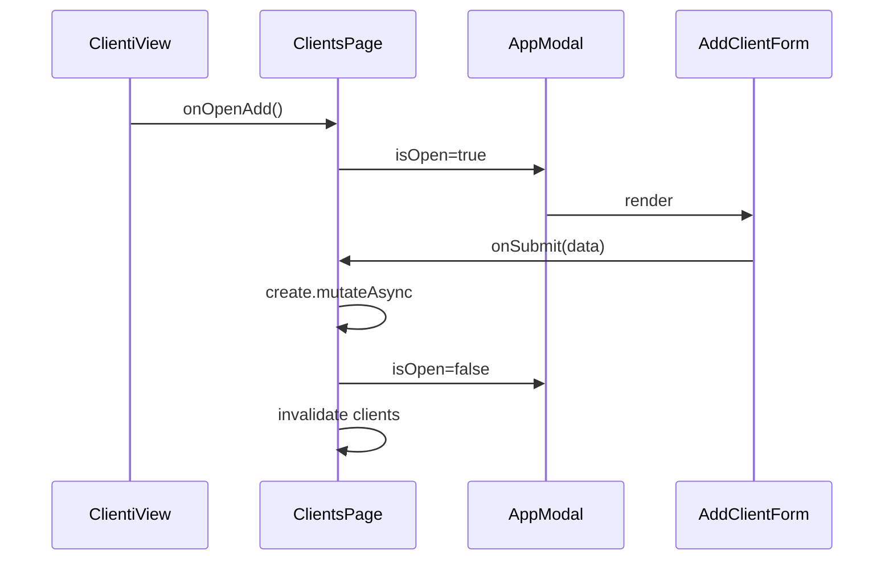

# Capitolo 7 — Form e modali (`AppModal`, CRUD coerente)

---

## Contesto

CRUD JEINS ripete lo stesso **ritmo visivo**: lista in View → modale add/edit → feedback → chiusura. Il design engineer allinea label, spacing form, footer azioni e chiusura ESC — senza reinventare overlay ogni Page.

Dati e `version` per 409 vivono nei form feature — vedi [MID-LEVEL cap01](../MID-LEVEL/cap01-metodo-jeins-feature-end-to-end.md) e [cap03](../MID-LEVEL/cap03-gestione-conflitti-dati-concorrenti.md).

---

## Codice ancoraggio — `AppModal`

📁 `gestionale-app/src/components/AppModal.tsx`

```4:18:gestionale-app/src/components/AppModal.tsx
export function AppModal({
    isOpen, onClose, children,
}: { isOpen: boolean; onClose: () => void; children: ReactNode }) {
    if (!isOpen) return null;
    return (
        <div className="fixed inset-0 z-50 flex items-center justify-center p-4">
            <div className="fixed inset-0 bg-black/60 backdrop-blur-sm" onClick={onClose} />
            <div className="relative card max-w-lg w-full max-h-[90vh] overflow-y-auto animate-fade-in">
                <button onClick={onClose} className="absolute top-3 right-3 icon-btn z-10" aria-label="Chiudi">
```

**Checklist visiva modale JEINS:**

- overlay scuro + blur leggero  
- pannello `card`, `max-w-lg`, scroll interno  
- chiusura icona `icon-btn` con `aria-label="Chiudi"`  
- click overlay chiude (attenzione: non su form lunghi senza dirty guard — debito)

---

## Codice ancoraggio — wiring Page

📁 `gestionale-app/src/pages/ClientsPage.tsx`

```48:64:gestionale-app/src/pages/ClientsPage.tsx
            <AppModal isOpen={addOpen} onClose={() => setAddOpen(false)}>
                <AddClientForm
                    onSubmit={async data => {
                        await create.mutateAsync(data);
                        setAddOpen(false);
                    }}
                />
            </AppModal>
            <AppModal isOpen={!!editClient} onClose={() => setEditClient(null)}>
                {editClient && (
                    <EditClientForm
                        client={editClient}
                        onSubmit={data => conflict.executeUpdate(data, editClient.version)}
                    />
                )}
            </AppModal>
            {conflict.ConflictModal}
```

**Separazione:**

| Pezzo | Dove |
|-------|------|
| Stato `addOpen` / `editClient` | Page |
| Markup form campi | `features/forms/modals.tsx` |
| Shell overlay | `AppModal` |
| Conflitto 409 | `useConflictUpdate` + modal dedicata |

---

## Form feature

📁 `gestionale-app/src/features/forms/modals.tsx`

- `AddClientForm`, `EditClientForm`, form progetto, …  
- Usa primitivi `Form`, `FormField`, `Input`, `Select` da `components/ui/`  
- Label e pulsanti in **italiano**  
- Submit: `Button` `isLoading` durante mutazione

**Layout form tipico:**

1. Titolo modale (heading `text-ink`, `font-semibold`)  
2. `FormGroup` con campi in colonna `gap-4`  
3. Footer `flex justify-end gap-2` — Annulla ghost + Salva primary  

---

## `MotionDialog` vs `AppModal`

📁 `gestionale-app/src/components/motion/MotionDialog.tsx`

| | AppModal | MotionDialog |
|---|----------|--------------|
| Motion | CSS fade | Framer + reduced motion |
| Uso attuale | CRUD Pages | alcuni flussi dashboard |
| Nuova feature | **preferire AppModal** salvo motivo UX | escalare unificazione |

Unificazione = tema [frontend mod.13](../frontend/00-INDICE.md) / capstone — non blocker per feature piccola.

---

## Diagramma — flusso modale add



---

## Alternative scartate

| ❌ | ✅ |
|----|-----|
| Form inline 40 campi in lista | modale o drawer futuro |
| Nuovo z-index random | `z-50` come AppModal |
| Modale senza `aria-label` chiusura | icon-btn etichettato |
| Tre varianti footer CTA | primary + ghost standard |

---

## Trade-off

| Scelta | Pro | Contro |
|--------|-----|--------|
| Modale centrata `max-w-lg` | focus | form molto larghi stretti |
| Chiusura overlay | velocità | rischio perdita dati |
| Form in `features/forms` | riuso | accoppiamento dominio |
| `window.confirm` delete | veloce | UX povera — migliorabile |

---

## Esercizio valutabile

Su un form esistente in `features/forms/modals.tsx`:

1. Allinea spacing e tipografia a token `ink` / `line`.  
2. Aggiungi stato loading sul submit (`isPending` da mutazione passata da Page).  
3. Verifica tab order: primo campo → … → Salva → Annulla; ESC chiude (se non in conflitto con input).

**Valutazione:** screenshot form; nessun nuovo componente modale; messaggi validazione in italiano.

---

## Limiti nel repo

- **Focus trap** completo non garantito su `AppModal` — backlog a11y ([cap09](./cap09-review-ui-checklist-pr.md)).
- Form senza `react-hook-form` ovunque — pattern misto accettato.
- Permessi su submit: API è source of truth — UI disabilita azioni ([cap08](./cap08-rbac-ui-difensiva.md)).

---

*Prossimo: [Capitolo 8 — RBAC e UI difensiva](./cap08-rbac-ui-difensiva.md)*
