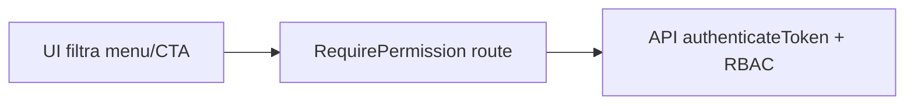

# Capitolo 8 — RBAC e UI difensiva

---

## Contesto

Il frontend **non** sostituisce la sicurezza server — ma deve **non mentire**: non mostrare CTA che falliscono al 403, non lasciare menu che portano a redirect frustrante.

Il design engineer conosce `docs/RBAC.md`, `lib/permissions.ts`, `RequirePermission` e la differenza tra **nascondere** e **disabilitare**.

Approfondimento operativo: [MID-LEVEL cap04](../MID-LEVEL/cap04-auth-rbac-blindare-feature.md).  
Teoria: [frontend mod.3](../frontend/03-autenticazione-sessione-e-permessi-ui.md).

---

## Codice ancoraggio — guard route

📁 `gestionale-app/src/app/RequirePermission.tsx`

```5:18:gestionale-app/src/app/RequirePermission.tsx
export function RequirePermission({
    perm,
    children,
}: {
    perm: keyof UserPermissions;
    children: React.ReactNode;
}) {
    const { user, loading } = useAuth();
    if (loading) return null;
    const permissions = resolvePermissions(user);
    if (!permissions[perm]) {
        return <Navigate to={defaultHomePath(user)} replace />;
    }
    return <>{children}</>;
}
```

**Nota visiva:** durante `loading` ritorna `null` — shell può apparire vuota un istante; miglioramento possibile con skeleton shell (non obbligatorio per junior).

---

## Codice ancoraggio — menu filtrato

📁 `gestionale-app/src/layout/IconRail.tsx`

Voci `TOP_ITEMS` con `perm: 'viewClients' | ...` — render solo se `permissions[perm]`.

Coerenza: se la voce non c’è, l’utente non dovrebbe raggiungere la route — ma deep link può esistere → guard route obbligatoria.

---

## Nascondere vs disabilitare

| Strategia | Quando | UX |
|-----------|--------|-----|
| **Non renderizzare** | navigazione, moduli interi senza permesso | meno rumore |
| **`disabled` + titolo** | azione in contesto visibile ma vietata (es. riga in sola lettura) | spiega che esiste il concetto |
| **Redirect** | accesso URL non autorizzato | `RequirePermission` |

❌ Bottone attivo che API rifiuta → frustrante.  
❌ Disabilitato senza spiegazione su azione **critica** → dubbio.

✅ Socio vede dashboard ridotta — vedi `defaultHomePath`, `showProjectSidebar` in layout.

---

## UI difensiva su azioni

Pattern in View (props dalla Page):

```tsx
// Page calcola
const canEdit = permissions.editClients;

<ClientiView
  onEdit={canEdit ? setEditClient : undefined}
/>
```

Oppure `onEdit` sempre ma bottone `disabled={!canEdit}` con `title="Non hai permesso di modifica"`.

**Allineamento:** se aggiungi permesso, aggiorna `docs/RBAC.md` + backend + `resolvePermissions` — [MID-LEVEL cap04](../MID-LEVEL/cap04-auth-rbac-blindare-feature.md).

---

## Diagramma — doppia barriera



Il design engineer controlla **UI** e **R**; non saltare API.

---

## Alternative scartate

| ❌ | ✅ |
|----|-----|
| `if (user.role === 'Socio')` sparso | `permissions.viewX` |
| Solo nascondere in UI, route aperta | `RequirePermission` |
| Tooltip permessi su ogni pixel | solo dove disabilitato non è ovvio |
| Nuovo ruolo senza review | escalare [cap10 MID-LEVEL](../MID-LEVEL/cap10-quando-escalare.md) |

---

## Trade-off

| Scelta | Pro | Contro |
|--------|-----|--------|
| Capability-based | estendibile | più chiavi da documentare |
| Redirect silenzioso | sicurezza | utente confuso — accettabile in B2B |
| Menu icon-only | densità | permessi meno evidenti a colpo d’occhio |
| Fallback `resolvePermissions` | dev senza backend | rischio drift da prod |

---

## Esercizio valutabile

Scenario tutor: ruolo ipotetico **Audit** con solo `viewReports` (permessi da definire in `docs/RBAC.md` draft).

1. Elenca voci `IconRail` visibili.  
2. Disegna schermata Report: quali CTA sono assenti vs disabilitati.  
3. Indica file da toccare (senza implementare RBAC server): `IconRail`, `router.tsx`, `permissions.ts`, `docs/RBAC.md`.

**Valutazione:** nessun check su stringa ruolo; doppia barriera UI + route citata.

---

## Limiti nel repo

- Non tutti i bottoni inline tabella hanno guard visiva — gap da chiudere in PR mirate.
- **Admin / dev panel** — solo dev/prod flag — non modello RBAC business.
- Escalation nuovo permesso globale → [MID-LEVEL cap10](../MID-LEVEL/cap10-quando-escalare.md) **prima** del merge.

---

*Prossimo: [Capitolo 9 — Review UI e checklist PR](./cap09-review-ui-checklist-pr.md)*
