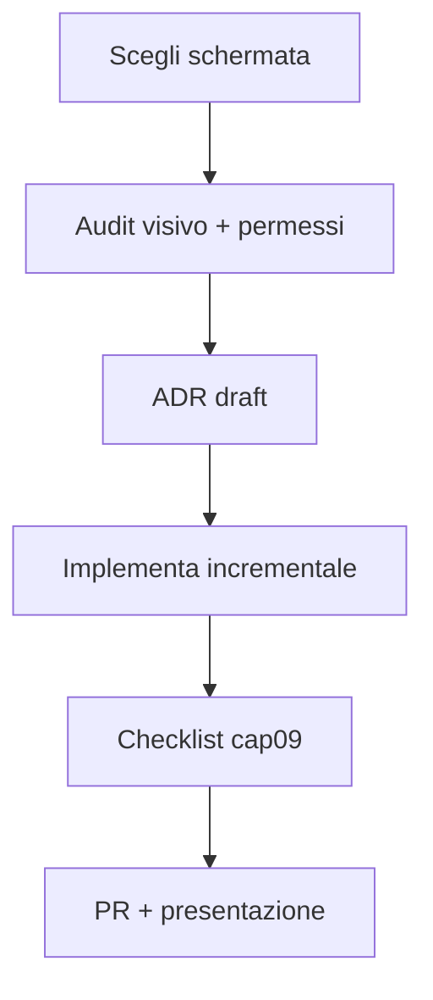

# Capitolo 10 — Capstone: rifare una schermata esistente

---

## Contesto

Il capstone verifica che tu ragioni come design engineer JEINS: **restraint**, token, stati, permessi, motion misurata — e che **documenti** le scelte come in una review, non come moodboard.

Non è un redesign marketing: è miglioramento misurabile su schermata **già in produzione**.

---

## Brief

Scegli **una** schermata (con tutor se incerto):

| Opzione | File principali | Difficoltà |
|---------|-----------------|------------|
| A — Clienti | `pages/ClientsPage.tsx`, `views/ClientiView.tsx` | media |
| B — Progetti | `pages/ProjectsPage.tsx`, `views/ProgettiView.tsx` | media |
| C — Dashboard widget | `components/dashboard/DashboardView.tsx` | alta (fetch ibrido) |
| D — Billing / KPI | `pages/BillingPage.tsx`, `views/ContabilitaView.tsx` | media-alta |

**Vincoli capstone:**

- Nessuna nuova libreria UI  
- Nessun cambio schema DB / API (solo UI; se serve campo, escalare [MID-LEVEL cap01](../MID-LEVEL/cap01-metodo-jeins-feature-end-to-end.md))  
- Branch dedicato; PR con checklist [cap09](./cap09-review-ui-checklist-pr.md)  
- Documento scelte: copia [capstone/TEMPLATE-ADR-VISIVO.md](./capstone/TEMPLATE-ADR-VISIVO.md) in `capstone/esercizio-<cognome>.md` **o** incolla in descrizione PR — vedi [capstone/README.md](./capstone/README.md)  

---

## Deliverable

### 1. Implementazione UI

- Gerarchia rivista (titolo, azioni, contenuto)  
- Stati loading / empty / error ([cap05](./cap05-stati-feedback.md))  
- Token allineati ([cap02](./cap02-token-tipografia-spaziatura.md))  
- Motion solo se motivata ([cap06](./cap06-motion.md))  
- RBAC invariato o migliorato ([cap08](./cap08-rbac-ui-difensiva.md))  

### 2. Documento decisioni (ADR visivo leggero)

**Template versionato:** [capstone/TEMPLATE-ADR-VISIVO.md](./capstone/TEMPLATE-ADR-VISIVO.md) — copia, compila tutte le sezioni, allega link in PR.

Sintesi minima se non usi il file (sconsigliato per capstone universitario):

- Problema osservato (2–4 frasi)
- Tabella scelte con **alternativa scartata** per gerarchia, stati, token, motion, RBAC
- File toccati + trade-off residui
- Checklist cap09 + screenshot chiaro/scuro

### 3. Presentazione 10 minuti

- Prima / dopo  
- Una slide trade-off  
- Cosa escaleresti al lead  

---

## Rubrica valutazione (100 punti)

| Criterio | Punti | Sufficiente se |
|----------|-------|----------------|
| Gerarchia e IA | 25 | focal point chiaro; shell intatta |
| Token / DS | 20 | zero hex nuovi; primitivi riusati |
| Stati UX | 20 | tre stati distinguibili |
| RBAC / difesa | 15 | nessuna CTA ingannevole |
| Motion / a11y | 10 | reduced motion ok |
| Documentazione | 10 | ADR con alternative scartate |

**< 60** — rivedi cap 2–5 e ripeti capstone su schermata più piccola.  
**≥ 80** — autonomia design engineer JEINS su feature visive standard.

---

## Codice ancoraggio — esempio obiettivo minimo (Clienti)

**Prima (debito):** loading testuale, nessun empty, colori misti in tabella.

**Dopo (target):**

- `ClientsPage`: `Skeleton` + `EmptyState` + errore con refetch  
- `ClientiView`: toolbar `SectionHeader` o pattern equivalente; tabella `DataTable` se adatta  
- Modali invariati in struttura (`AppModal`) — solo polish form  

Non obbligatorio raggiungere perfezione su Dashboard (fetch custom).

---

## Diagramma — percorso capstone

---

## Alternative scartate (a livello capstone)

| ❌ | ✅ |
|----|-----|
| Redesign totale app | una schermata |
| Cambiare palette brand | token esistenti |
| Aggiungere Storybook | screenshot + PR |
| Ignorare MID-LEVEL DoD dati | UI-only capstone |

---

## Trade-off

| Scelta | Pro | Contro |
|--------|-----|--------|
| Schermata media (Clienti) | feedback veloce | meno wow |
| Dashboard come capstone | impatto visibile | rischio scope creep |
| ADR in PR | storico git | testo lungo |

---

## Dopo il capstone

| Prossimo passo | Manuale |
|----------------|---------|
| Feature E2E con DB | [MID-LEVEL cap01](../MID-LEVEL/cap01-metodo-jeins-feature-end-to-end.md) |
| Architettura FE teorica | [frontend](../frontend/00-INDICE.md) |
| Scala / sicurezza server | [BACKEND](../BACKEND/00-INDICE.md) |
| Blocco > 4h | [MID-LEVEL cap10](../MID-LEVEL/cap10-quando-escalare.md) |

---

## Limiti nel repo

- Capstone **non** chiude debito globale (`MotionDialog`, `DashboardView`, `EmptyState` neutral).  
- Merge dipende da review team — documentazione non sostituisce approvazione.  
- Cartella [capstone/](./capstone/README.md) — template ADR; gli studenti possono aggiungere `esercizio-<cognome>.md` su branch dedicato (non dati sensibili).

---

*Torna all’[Indice](./00-INDICE.md)*
