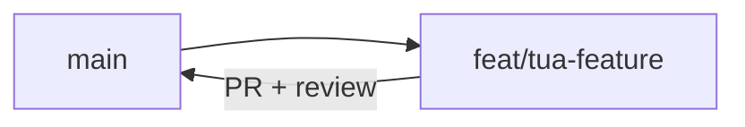

# PRE-DE-A — Capitolo 0 — Git, workflow e struttura repository

> **PRE-DE-A** = prerequisiti **sviluppo**. Non confondere con [PRE-DE-B](../DESIGN-ENGINEER/cap00-pre-de-b-fondamenta-design-engineering.md) (fondamenta **design**).

---

## Contesto

Su JEINS non “salvi il file sul desktop”: ogni modifica vive in **git**, su un **branch**, finisce in una **pull request** e viene **rivista** prima del merge. Senza questo flusso non puoi consegnare compiti universitari né tirocinio in team.

Questo capitolo insegna il **perché** del workflow (tracciabilità, review, rollback), non Git avanzato (rebase interattivo, cherry-pick).

---

## Struttura repository (alto livello)

```
GESTIONALE-JEINS/
├── gestionale-app/     # Frontend React + Vite (ci lavori spesso)
├── backend/            # API Express + PostgreSQL
├── docs/               # Reference (RBAC, glossario) — leggi, non duplicare
├── walkthrough/        # Manuali didattici (sei qui)
├── ARCHITETTURA.md     # Vista sistema
└── README.md           # Avvio rapido
```

**Regola di ragionamento:** una PR dovrebbe raccontare **una storia** (“aggiungo campo X a clienti”). Se mescoli refactor globale + feature + fix typo in 40 file, la review fallisce perché nessuno capisce il rischio.

---

## Perché git (ragionamento neofita)

| Senza git | Con git su JEINS |
|-----------|------------------|
| “Funziona sulla mia macchina” | Diff leggibile: cosa è cambiato riga per riga |
| Sovrascrivi il lavoro altrui | Branch isolato: sperimenti senza rompere `main` |
| Non si capisce chi ha rotto cosa | Commit + PR = storia e responsabilità |

**Modello mentale:** commit = fotografia **logica** del codice; branch = linea temporale parallela; PR = richiesta di unire quella linea in `main` dopo controllo.

---

## Comandi minimi (giornalieri)

| Comando | Cosa fa | Quando |
|---------|---------|--------|
| `git status` | File modificati / staged | Prima di ogni sessione |
| `git pull` | Scarica aggiornamenti da remoto | Inizio giornata, prima di nuovo branch |
| `git checkout -b feat/nome-breve` | Crea branch | Nuova attività |
| `git diff` | Vedi modifiche non staged | Prima di `add` |
| `git add path/file` | Stage **mirato** | Dopo aver verificato il diff |
| `git commit -m "…"` | Snapshot locale | Blocco logico finito |
| `git push -u origin feat/…` | Pubblica branch | Aprire PR |
| `git log --oneline -5` | Ultimi commit | Capire storia recente |

**Messaggio commit (JEINS):** verbo + ambito + perché breve.

| ❌ Evita | ✅ Preferisci |
|--------|----------------|
| `fix` | `fix(clienti): messaggio errore rete in italiano` |
| `wip` | `feat(foundations): esercizio git cap00` |
| `aggiornamenti` | `docs(walkthrough): espande FOUNDATIONS cap01` |

---

## Branch e PR



**Passi standard:**

1. `git checkout main` → `git pull`
2. `git checkout -b feat/foundations-mario-rossi`
3. Lavori, commit piccoli (meglio 3 commit chiari che 1 enorme)
4. `git push -u origin feat/foundations-mario-rossi`
5. Apri **Pull Request** su GitHub/GitLab
6. Descrizione PR (minimo):
   - **Cosa** hai fatto
   - **Come testare** (passi numerati)
   - **Screenshot** se tocchi UI
7. Review → commenti → fix su **stesso branch** → push → merge

Dettaglio review team: [MID-LEVEL cap09](../MID-LEVEL/cap09-pr-review-testing.md).

---

## Cosa non committare (e perché)

| Path / pattern | Motivo |
|----------------|--------|
| `.env` | Segreti (`DATABASE_URL`, `JWT_SECRET`) |
| `node_modules/` | Rigenerabile con `npm install` — peso enorme |
| `dist/`, build cache | Artefatti, non sorgente |
| File locali IDE casuali | Rumore (usa `.gitignore` del repo) |

**Perché:** un segreto in git può restare nella storia **per sempre** anche se lo cancelli dopo — meglio prevenire con `git status` consapevole.

📁 Controlla `.gitignore` alla root e in `gestionale-app/` — se `git status` mostra roba strana, **non** fare `git add .` finché non capisci ogni riga.

---

## Codice ancoraggio — nessun codice, solo disciplina

FOUNDATIONS cap00 non tocca `gestionale-app/src/`. La “ancoraggio” è il **processo** che protegge quel codice.

---

## Alternative scartate

| Approccio | Perché scartato |
|-----------|------------------|
| Lavorare sempre su `main` | Rompi build condivisa; review impossibile |
| Zip via email / Drive | Nessun diff, nessuna storia |
| Un commit “tutto il progetto” | Review ingestibile |
| `git add .` senza guardare | Finisci `.env` o file generati in PR |

---

## Trade-off

| Scelta | Pro | Contro |
|--------|-----|--------|
| Branch per ogni compito | Sicurezza, review pulita | Più branch da gestire |
| Commit piccoli | Storia leggibile | Richiede disciplina |
| PR draft mentre impari | Feedback precoce | Rumore se troppo presto |
| Solo walkthrough nel primo PR | Rischio zero su produzione | Non esercita FE/BE |

---

## Esercizio valutabile — passi numerati

**Obiettivo:** dimostrare il flusso git senza toccare logica di produzione.

1. Clona o apri il repo JEINS in locale.
2. `git pull` su `main` (se usi remoto).
3. `git checkout -b feat/foundations-esercizio-<tuo-cognome>`.
4. Crea `walkthrough/FOUNDATIONS/esercizio-<cognome>.md` con:
   ```markdown
   # Esercizio git — <Nome>
   Data: …
   Ho capito: branch, commit, PR.
   ```
5. `git status` — verifica che **solo** quel file (o + commento in cap00) sia modificato.
6. `git add walkthrough/FOUNDATIONS/esercizio-<cognome>.md`
7. `git commit -m "docs(foundations): esercizio git cap00 <cognome>"`
8. `git push -u origin feat/foundations-esercizio-<cognome>`
9. Apri PR **draft** con descrizione:
   - Obiettivo: esercizio FOUNDATIONS cap00
   - Verifica: aprire il file markdown in PR

### Rubrica

| Criterio | Sufficiente | Insufficiente |
|----------|-------------|---------------|
| Branch naming | `feat/` o `fix/` + nome leggibile | Commit su `main` diretto |
| Commit message | Descrive ambito + cosa | `wip`, `test`, vuoto |
| PR | Esiste, descrizione ≥ 2 righe | Solo push senza PR |
| Igiene | Nessun `.env` / `node_modules` in diff | File segreti in stage |

---

## Limiti nel repo

- Non copre **risoluzione conflitti merge** avanzata — chiedi al tutor se `git pull` segnala conflict.
- Non copre **GitHub CLI** — UI web va bene per neofiti.
- Dopo questo cap non sai ancora React — [cap01](./cap01-react-typescript-minimo.md).

---

## Prossimo

[Capitolo 1 — React e TypeScript minimo](./cap01-react-typescript-minimo.md)
