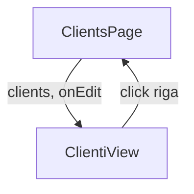

# PRE-DE-A — Capitolo 1 — React e TypeScript minimo

---

## Contesto

JEINS è **React 19 + TypeScript strict** + **Vite**. Il neofita deve:
- aprire un file `.tsx` e capire cosa esporta;
- distinguere **dati dal server** vs **stato UI locale**;
- far passare `npm run build` senza disperarsi al primo errore rosso.

I **token visivi** JEINS (`text-ink`, `bg-surface`) li imparerai in [DESIGN-ENGINEER cap02](../DESIGN-ENGINEER/cap02-token-tipografia-spaziatura.md). Qui usiamo classi Tailwind **generiche** (`text-gray-900`, `border-gray-200`) negli esercizi — volutamente — per non applicare pattern prima di capirli.

---

## Perché React “a funzioni” (ragionamento)

| Scelta JEINS | Perché |
|--------------|--------|
| `export function Component()` | Standard nel repo; facile da leggere in review |
| No class components | Legacy, non usato in `gestionale-app/src` |
| File `.tsx` | JSX + TypeScript nello stesso file |
| Props tipizzate | Il compilatore impedisce errori stupidi prima del runtime |

**Regola d’oro:** il componente è una **funzione pura della UI** rispetto ai props: stessi input → stessa struttura (salvo stato interno esplicito).

---

## Moduli: import ed export

```tsx
// FoundationsHello.tsx
import { useState } from 'react';

export type FoundationsHelloProps = {
  title: string;
  onDismiss: () => void;
};

export function FoundationsHello({ title, onDismiss }: FoundationsHelloProps) {
  ...
}
```

| Sintassi | Significato |
|----------|-------------|
| `import { useState } from 'react'` | Prendi solo `useState` dalla libreria |
| `export function …` | Altri file possono importare il componente |
| `export type …` | Tipo riusabile (props, modelli) |

**Perché named export:** nel repo quasi mai `export default` su componenti feature — review più chiara (`import { ClientsPage } from …`).

---

## Componente = funzione che ritorna UI

```tsx
export function ClientRow({ name, onSelect }: { name: string; onSelect: () => void }) {
  return (
    <button type="button" onClick={onSelect} className="text-left text-gray-900 hover:underline">
      {name}
    </button>
  );
}
```

| Concetto | Ruolo | Perché importa in JEINS |
|----------|--------|-------------------------|
| **Props** | Input dal genitore | La View non “inventa” i dati clienti — li riceve |
| **`children`** | Contenuto annidato | Layout (`<Card>…</Card>`) |
| **Eventi** `onClick` | Callback verso l’alto | Il figlio non decide il routing — notifica il padre |

### Props down, eventi up (modello che userai sempre)



**Perché:** `ClientiView` resta testabile e “stupida” — tutta la logica fetch sta in Page/hook ([cap04](./cap04-prima-modifica-in-view.md)).

---

## State locale (`useState`)

```tsx
import { useState } from 'react';

export function ExpandableHint({ text }: { text: string }) {
  const [open, setOpen] = useState(false);
  return (
    <div>
      <button type="button" onClick={() => setOpen((v) => !v)}>
        {open ? 'Nascondi' : 'Mostra'} dettaglio
      </button>
      {open && <p className="text-sm text-gray-600">{text}</p>}
    </div>
  );
}
```

| Usa `useState` per | Non usare `useState` per |
|--------------------|---------------------------|
| Modale aperta/chiusa | Lista clienti da API |
| Tab selezionato localmente | Dati che altri utenti possono cambiare |
| Testo filtro **solo UI** (se non in URL) | Cache server — usa React Query |

**Regola JEINS:** dati da API → [MID-LEVEL cap02](../MID-LEVEL/cap02-uccidere-useeffect-react-query.md) (`useQuery`), **non** `useEffect` + `fetch` + `setState`.

**Perché:** React Query gestisce cache, refetch, errori — duplicare in ogni Page è bug e incoerenza.

---

## TypeScript — leggere errori di build

Esegui spesso:

```bash
cd gestionale-app
npm run build
```

| Messaggio | Causa probabile | Cosa fare |
|-----------|-----------------|-----------|
| `Property 'foo' does not exist on type 'Props'` | Props incomplete | Aggiungi al tipo |
| `Type 'string \| undefined' is not assignable to type 'string'` | Valore opzionale | `name ?? ''` o guard `if (!name) return null` |
| `Cannot find module './X'` | Path sbagliato | Controlla maiuscole / cartella |
| `'x' is declared but never used` | Variabile inutile | Rimuovi o usa `_` prefix |

**Perché strict:** in PR production un `any` nasconde bug che esplodono solo col 409 o in produzione.

Dominio JEINS — tipo con `version` (anticipazione concorrenza):

```ts
export type Client = {
  id: string;
  name: string;
  version: number;
};
```

---

## JSX — regole rapide

| HTML / errore comune | JSX corretto |
|---------------------|--------------|
| `class="…"` | `className="…"` |
| Tag non chiusi `<br>` | `<br />` |
| Un solo elemento root | Oppure fragment `<>…</>` |
| `if` dentro return grezzo | Ternario o variabile prima del `return` |

```tsx
return (
  <div className="flex flex-col gap-2 rounded-lg border border-gray-200 p-4">
    <h2 className="text-base font-semibold text-gray-900">{title}</h2>
  </div>
);
```

---

## Dove vivono i file (anticipazione cap04)

| Cartella | Responsabilità |
|----------|----------------|
| `pages/` | Hook, permessi, modali, passa props alla View |
| `views/` | Markup, tabelle, empty — **no fetch** |
| `components/ui/` | Primitivi riusabili (Button, Input) |
| `features/data/hooks.ts` | `useClients()`, ecc. |

---

## Codice ancoraggio — pattern reale (sintesi)

📁 `gestionale-app/src/pages/ClientsPage.tsx` — importa hook + View, gestisce loading/error **a livello Page** (pattern che imparerai a rifinire in DESIGN-ENGINEER cap05).

📁 `gestionale-app/src/views/ClientiView.tsx` — riceve dati e callback; **non** importa `clientsAPI` direttamente (disciplina da rispettare fin da subito).

---

## Alternative scartate

| ❌ Neofita | ✅ JEINS |
|-----------|----------|
| Tutto in un file 800 righe | Page sottile + View |
| `fetch` dentro la View | Hook + `services/api.ts` |
| `any` su props | Tipo esplicito |
| Copiare componente da tutorial con `useEffect` per lista | `useQuery` (dopo FOUNDATIONS) |
| Stili inline `style={{}}` ovunque | Classi Tailwind (token dopo PRE-DE-B) |

---

## Trade-off

| Scelta | Pro | Contro |
|--------|-----|--------|
| TypeScript strict | Meno bug | Curva iniziale errori |
| Componenti piccoli | Review facile | Più file da navigare |
| `useState` minimo | Semplicità | Tentazione di metterci tutto |
| Esercizio isolato `FoundationsHello` | Zero rischio prod | Non ancora integrato in router |

---

## Esercizio valutabile — passi numerati

**Obiettivo:** primo componente che compila nel progetto reale.

1. Crea `gestionale-app/src/components/training/FoundationsHello.tsx` (cartella `training/` = esercizi, non produzione).
2. Implementa:
   - Props: `title: string`, `onDismiss: () => void`
   - UI: titolo + bottone “Chiudi” che chiama `onDismiss`
   - Classi: `text-gray-900`, `border-gray-200`, `rounded-lg`, `p-4` (no token JEINS ancora)
3. Crea `gestionale-app/src/components/training/FoundationsHelloDemo.tsx`:
   ```tsx
   import { useState } from 'react';
   import { FoundationsHello } from './FoundationsHello';

   export function FoundationsHelloDemo() {
     const [visible, setVisible] = useState(true);
     if (!visible) return <p className="text-gray-600">Componente chiuso.</p>;
     return (
       <FoundationsHello title="Ciao JEINS" onDismiss={() => setVisible(false)} />
     );
   }
   ```
4. **Temporaneamente** monta `FoundationsHelloDemo` in una Page che usi per esercizio (es. in cima a `ClientsPage` **solo in locale**) — oppure chiedi al tutor un file sandbox. **Non committare** mount in Page produzione senza accordo.
5. `cd gestionale-app && npm run build` — deve uscire senza errori TS.
6. `npm run lint` — correggi warning bloccanti se presenti.
7. Rimuovi mount temporaneo prima della PR finale del cap04.

### Rubrica

| Criterio | Sufficiente | Insufficiente |
|----------|-------------|---------------|
| Build | `npm run build` ok | Errori TS ignorati con `@ts-ignore` |
| Props | Tipizzate, no `any` | Props non usate / sbagliate |
| State | Solo per UI demo | Lista mock in `useState` |
| Igiene | File sotto `training/` | Modifica casuale `components/ui/Button.tsx` |

**Domanda orale (tutor):** “Perché la lista clienti non va in `useState`?” — risposta attesa: perché è server state, altri utenti, refetch, ecc.

---

## Limiti

- Non copre React Query, router, context — [cap02](./cap02-http-json-api-client.md), MID-LEVEL cap02.
- Non copre test Vitest — MID-LEVEL cap09.
- Token `ink`/`surface` — DESIGN-ENGINEER cap02 dopo PRE-DE-B.

---

## Prossimo

[Capitolo 2 — HTTP, JSON e client API](./cap02-http-json-api-client.md)
