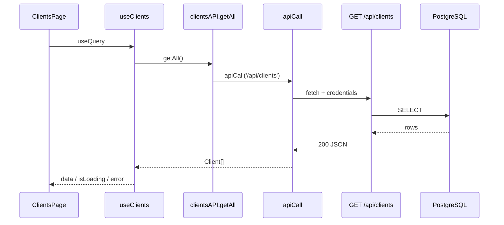

# PRE-DE-A — Capitolo 2 — HTTP, JSON e client API

---

## Contesto

Il browser **non** accede a PostgreSQL. Ogni dato persistente passa da:

**React → HTTP → Express → SQL**

Se non capisci questa catena, metterai logica DB nel frontend o ti confonderai quando la lista è vuota ma “non vedi errori” (spesso: **mock dev** attivo).

---

## Perché stratificare le chiamate (ragionamento)

| Layer | File | Perché esiste |
|-------|------|---------------|
| **View** | `views/*` | Zero conoscenza di URL |
| **Page** | `pages/*` | Orchestrazione + stati |
| **Hook** | `features/data/hooks.ts` | React Query, cache |
| **Facade** | `services/api.ts` | Un posto per `/api/clients` |
| **Transport** | `lib/api/client.ts` | Auth, timeout, 409, retry |

**Regola:** se cambia l’URL API, tocchi `services/api.ts` e forse `client.ts` — non 15 View diverse.

---

## Richiesta / risposta (modello mentale)



---

## Status HTTP in JEINS

| Status | Significato | Cosa fa il client (semplificato) |
|--------|-------------|----------------------------------|
| `200` | OK lettura | `response.json()` |
| `201` | Creato | come sopra |
| `400` | Body non valido (Zod) | `throw Error` con messaggio |
| `401` | Non autenticato | refresh o logout event |
| `403` | Permesso negato | errore + eventuale redirect |
| `409` | Conflitto `version` | `ConcurrentModificationError` |
| `500` | Bug server | messaggio generico — non colpa utente |

**Perché 409 è speciale:** due persone modificano lo stesso record — la UI deve dire “ricarica”, non “errore di rete”. Vedi [MID-LEVEL cap03](../MID-LEVEL/cap03-gestione-conflitti-dati-concorrenti.md).

---

## JSON e tipi

Esempio body update cliente:

```json
{
  "name": "Associazione Esempio",
  "version": 3
}
```

In TypeScript:

```ts
type ClientUpdatePayload = {
  name: string;
  version: number;
};
```

**Perché `version` nel payload:** il backend confronta con il DB; se diverso → 409.

---

## Codice ancoraggio — `apiCall`

📁 `gestionale-app/src/lib/api/client.ts`

**Base URL (dev):**

```3:8:gestionale-app/src/lib/api/client.ts
export function getApiUrl(): string {
    const url =
        localStorage.getItem('customApiUrl') ||
        import.meta.env.VITE_API_URL ||
        'http://localhost:3000';
    return url.replace(/\/+$/, '');
}
```

**Perché tre fonti:** override locale per debug (`customApiUrl`), env Vite in progetto, fallback localhost.

**Fetch con credenziali e token:**

```86:94:gestionale-app/src/lib/api/client.ts
    const config: RequestInit = {
        ...options,
        credentials: 'include',
        headers: {
            'Content-Type': 'application/json',
            ...(token && { Authorization: `Bearer ${token}` }),
            ...options.headers,
        },
    };
```

**Perché `credentials: 'include'`:** cookie httpOnly di sessione + compatibilità CORS con `FRONTEND_URL` nel backend.

**Errore rete esplicito (neofita: leggi il messaggio):**

```137:147:gestionale-app/src/lib/api/client.ts
        if (
            err.name === 'AbortError' ||
            err.message === 'Failed to fetch' ||
            err.name === 'TypeError'
        ) {
            const isTimeout = err.name === 'AbortError';
            const networkError = new Error(
                `Impossibile raggiungere il backend.${isTimeout ? ' Timeout.' : ''} URL: ${getApiUrl()}`,
            );
```

Se vedi questo testo in UI, **non** è un bug del componente tabella — è backend spento o `VITE_API_URL` errato.

---

## Codice ancoraggio — facade dominio

📁 `gestionale-app/src/services/api.ts`

```ts
export const clientsAPI = {
    getAll: () => apiCall('/api/clients'),
    // getById, create, update, delete …
};
```

**Perché non chiamare `apiCall` dalla Page:** la Page usa `useClients()` che incapsula query key, refetch, error shape.

---

## Mock dev — trappola del neofita

📁 `client.ts` — `shouldUseMockData`:

```21:31:gestionale-app/src/lib/api/client.ts
/** Mock attivo solo in development e solo se esplicitamente abilitato. */
export function shouldUseMockData(section?: ApiSection, endpoint?: string): boolean {
    if (import.meta.env.PROD) return false;
    ...
    const globalMock = localStorage.getItem('useMockData') === 'true';
```

**Sintomo:** dati in tabella ma **nessuna** richiesta in Network.

**Perché esiste:** sviluppo UI senza backend — per FOUNDATIONS **disattivalo** mentre impari HTTP reale.

**Come verificare:**

1. DevTools → Application → Local Storage → `http://localhost:5173`
2. Rimuovi `useMockData` / `mockDataSections` se `true`
3. Ricarica pagina Clienti — deve comparire `GET …/api/clients`

Dettaglio: [MID-LEVEL cap08 §8.4](../MID-LEVEL/cap08-react-query-chiavi-cache.md#84-mock-solo-dev---cosa-sono-e-cosa-non-committare).

---

## Codice ancoraggio — backend route

📁 `backend/routes/clients.js` — handler `GET /` (lista).

**Perché guardarlo:** collega l’URL visto in Network al file che il team reviewa in PR backend.

Esercizio cap03: `console.log` temporaneo qui per vedere il collegamento.

---

## Alternative scartate

| ❌ | ✅ |
|----|-----|
| `fetch('/api/clients')` in ogni View | `clientsAPI` + hook |
| Ignorare status HTTP | Gestire 401/403/409 in client |
| Mostrare stack trace all’utente | Messaggio italiano + azione |
| Assumere dati sempre veri | `isLoading`, `isError`, empty |

---

## Trade-off

| Scelta | Pro | Contro |
|--------|-----|--------|
| Client centralizzato | Comportamento auth uniforme | File lungo, da non duplicare |
| Bearer + cookie | Compatibilità attuale | Neofita deve capire entrambi |
| Timeout 30s | Evita hang infiniti | Attesa lunga su rete lenta |
| Mock opt-in | UI senza BE | Confonde chi impara HTTP |

---

## Esercizio valutabile — passi numerati

**Prerequisito:** backend + frontend avviati ([cap03](./cap03-avvio-jeins-e-mappa.md) § checklist) oppure dopo cap03.

1. Login nell’app (`admin@gestionale.it` / `admin123` in locale).
2. Apri pagina **Clienti**.
3. DevTools → **Network** → filtra **Fetch/XHR**.
4. Ricarica la pagina (F5).
5. Individua richiesta lista clienti — compila tabella:

| Campo | Tuo valore |
|-------|------------|
| URL completo | |
| Metodo | |
| Status | |
| Un campo JSON risposta (es. `name`) | |

6. In IDE: **Find in Files** `getAll` in `services/api.ts` → conferma `clientsAPI.getAll`.
7. **Find** `useClients` in `features/data/hooks.ts` → apri definizione.
8. Apri `ClientsPage.tsx` — trova dove usa `useClients()` (o hook equivalente).
9. Scrivi a mano la catena in 1 riga: `Page → hook → clientsAPI → apiCall → route BE`.
10. Verifica mock **off** (nessuna richiesta = torna al § mock).

### Rubrica

| Criterio | Sufficiente | Insufficiente |
|----------|-------------|---------------|
| Network | Almeno 1 GET `/api/clients` (o path reale) con 200 | Solo dati senza richiesta (mock) |
| Codice | Catena 4 hop corretta | URL inventato / file sbagliato |
| Comprensione | Distingue errore rete vs 403 | “Non funziona” senza status HTTP |

**Domanda orale:** “Cosa cambia se il backend è spento?” — risposta: `Failed to fetch` / NetworkError da `apiCall`, non array vuoto magico.

---

## Limiti

- Non installa React Query — MID-LEVEL cap02.
- Non copre POST/PATCH body — MID-LEVEL cap01.
- Auth refresh completo — [frontend mod.3](../frontend/03-autenticazione-sessione-e-permessi-ui.md).

---

## Prossimo

[Capitolo 3 — Avvio JEINS e mappa operativa](./cap03-avvio-jeins-e-mappa.md)
