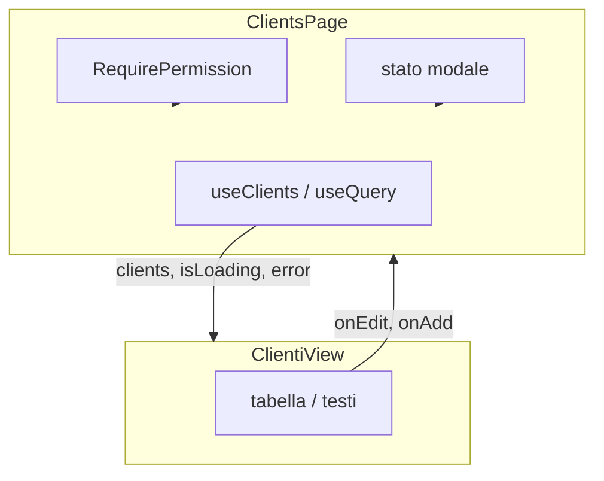

# PRE-DE-A — Capitolo 4 — Prima modifica in View (Page vs View)

---

## Contesto

Cap03 hai cambiato un testo e hai visto il log nel backend. Ora impari la **regola architetturale** che JEINS applica in ogni feature: la **Page** pensa (dati, permessi, modali); la **View** disegna (props in, eventi out).

Se metti `fetch` o `useQuery` nella View, la review respinge la PR — non per capriccio, ma perché rompe testabilità e design system.

---

## Perché Page / View (ragionamento)

| Domanda | Page | View |
|---------|------|------|
| Chi chiama `useClients()`? | ✅ | ❌ |
| Chi mostra la tabella? | orchestrando | ✅ |
| Chi apre `AppModal`? | ✅ | riceve `onAdd` |
| File da aprire per “cambiare colore header tabella”? | solo se serve stato | ✅ |



**Coerenza con design engineer:** stati loading/error possono stare in Page (oggi) o essere passati come props esplicite alla View — in entrambi i casi la **View non decide** di chiamare l’API.

---

## Codice ancoraggio — Page

📁 `gestionale-app/src/pages/ClientsPage.tsx`

Pattern tipico (semplificato):

```tsx
// 1. Hook dati (server state)
const { data: clients, isLoading, error, refetch } = useClients();

// 2. Stato UI locale (modale, selezione)
const [modalOpen, setModalOpen] = useState(false);

// 3. Guard permessi + early return stati
if (isLoading) return <p>Caricamento…</p>;
if (error) return <p>Errore…</p>;

// 4. View “stupida”
return (
  <ClientiView
    clients={clients ?? []}
    onAdd={() => setModalOpen(true)}
    onEdit={(id) => { /* … */ }}
  />
);
```

**Perché early return in Page:** la View non deve ripetere `if (isLoading)` in ogni schermata — un punto solo (poi raffinerai con `Skeleton` in DESIGN-ENGINEER cap05).

---

## Codice ancoraggio — View

📁 `gestionale-app/src/views/ClientiView.tsx` (nome può variare — segui import da `ClientsPage`)

La View **dichiara** le props:

```tsx
type ClientiViewProps = {
  clients: Client[];
  onAdd: () => void;
  onEdit: (id: string) => void;
};

export function ClientiView({ clients, onAdd, onEdit }: ClientiViewProps) {
  // solo markup + eventi
}
```

**Perché tipizzare props:** se la Page passa `onEdit` sbagliato, TypeScript fallisce in build — feedback immediato al neofita.

---

## Cosa puoi / non puoi modificare come neofita

| Modifica | File | OK in esercizio? |
|----------|------|------------------|
| Testo colonna, spacing leggero | View | ✅ |
| Nuova colonna che usa dati **già** in `clients` | View | ✅ |
| Chiamata `clientsAPI.getAll()` | View | ❌ |
| `useQuery` in View | View | ❌ |
| Nuovo endpoint backend | route + migration | ❌ (MID-LEVEL cap01) |
| Token `text-ink` al posto di gray | View | ✅ ma meglio dopo PRE-DE-B + DE cap02 |

---

## Alternative scartate

| ❌ | ✅ |
|----|-----|
| Tutto in `ClientsPage.tsx` 400 righe | Page sottile + View |
| View che importa `services/api.ts` | Page + hook |
| Props non tipizzate | `ClientiViewProps` |
| Modificare 5 View insieme nel primo esercizio | Una View, un obiettivo |

---

## Trade-off

| Scelta | Pro | Contro |
|--------|-----|--------|
| Due file per schermata | Review e test focalizzati | Più navigazione IDE |
| Page con early return loading | Veloce da scrivere | Page si allunga (poi Skeleton) |
| Esercizio solo testo | Rischio minimo | Non esercita ancora modale |

---

## Esercizio valutabile — mini-PR disciplinata

**Branch:** `feat/foundations-cap04-<cognome>` (o continua branch cap00 se non ancora mergiato).

### Parte A — View (obbligatoria)

1. Apri `ClientiView` (o equivalente) collegata a `ClientsPage`.
2. Applica **due** modifiche visibili e motivate:
   - es. intestazione tabella più chiara (gerarchia — richiamo PRE-DE-B);
   - es. messaggio quando `clients.length === 0` **se** la View gestisce già empty, altrimenti solo testo statico “Nessun cliente” passato da Page (chiedi al tutor quale pattern ha il file oggi).
3. **Non** aggiungere import di `api.ts` o hook in View.

### Parte B — Page (opzionale per “ottimo”)

4. Passa una nuova prop booleana `showHint?: boolean` dalla Page con valore `true` in dev.
5. View mostra un hint `<p className="text-sm text-gray-600">…</p>` solo se `showHint`.

### Parte C — Verifica

6. `cd gestionale-app && npm run build && npm run lint`
7. Screenshot prima/dopo (anche da phone dello schermo — per PR).
8. PR con descrizione:
   - Cosa hai cambiato e **perché** (2 frasi)
   - Come testare: login → Clienti → verificare testi
   - Conferma: nessun `fetch` aggiunto in View

### Rubrica

| Criterio | Sufficiente (6/10 minimo) | Ottimo |
|----------|---------------------------|--------|
| Scope | Diff solo View (+ Page se Parte B) | + spiegazione Page vs View in PR |
| Architettura | Zero `api`/`useQuery` in View | Props tipizzate nuove |
| Build | build + lint ok | + screenshot chiaro/scuro se tocchi classi |
| Git | PR senza `console.log` / `.env` | Commit message `feat(clienti)` o `docs` coerente |
| Ragionamento | PR dice *perché* del testo | Collega a gerarchia PRE-DE-B |

**Insufficiente:** `useClients()` spostato o duplicato in View; PR che modifica `components/ui/Button.tsx` senza motivo.

---

## Collegamento track successivi

| Dopo cap04 | Vai a |
|------------|--------|
| Craft UI, token, stati | [PRE-DE-B](../DESIGN-ENGINEER/cap00-pre-de-b-fondamenta-design-engineering.md) → DESIGN-ENGINEER |
| Feature con migration | [MID-LEVEL cap01](../MID-LEVEL/cap01-metodo-jeins-feature-end-to-end.md) |
| Teoria layering | [frontend mod.5](../frontend/05-pages-views-e-features.md) |

---

## Limiti

- Non copre `RequirePermission` — MID-LEVEL cap04.
- Non copre modali CRUD — DESIGN-ENGINEER cap07.
- Nomi file view possono differire — usa “Find references” su `ClientsPage`.

---

## Fine PRE-DE-A

Hai completato **PRE-DE-A** quando:

- [ ] DoD cap03 ([cap03](./cap03-avvio-jeins-e-mappa.md))
- [ ] Esercizio cap04 con PR merged o approvata dal tutor
- [ ] Sai spiegare a voce: “Perché non fetch nella View?”

**Hub:** [FOUNDATIONS/00-INDICE.md](./00-INDICE.md) · [00-PERCORSI.md](../00-PERCORSI.md)

---

*Prossimo track consigliato: PRE-DE-B poi DESIGN-ENGINEER, in parallelo MID-LEVEL cap00 rinforzo se necessario.*
