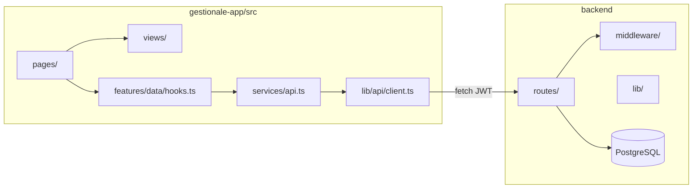

# Capitolo 0 — Onboarding e mappa del repository

---

## 1.1 Setup locale (ordine obbligatorio)

```bash
# Terminal 1 — DB + API
cd backend
cp .env.example .env
# DATABASE_URL, JWT_SECRET, FRONTEND_URL=http://localhost:5173
npm install
npm run migrate:all
npm run dev
# → http://localhost:3000/health

# Terminal 2 — UI
cd gestionale-app
echo VITE_API_URL=http://localhost:3000 > .env
npm install
npm run dev
# → http://localhost:5173
```

Credenziali seed: `admin@gestionale.it` / `admin123` (cambia subito).

---

## 1.2 Mappa mentale E2E



| Cartella FE | Cosa ci metti |
|-------------|----------------|
| `pages/` | orchestrazione: hook, modali, permessi, routing |
| `views/` | UI “stupida”: props in, eventi out |
| `features/data/hooks.ts` | React Query (lista dominio CRM base) |
| `features/forms/modals.tsx` | form add/edit riusabili |
| `services/api.ts` | funzioni `*API.getAll`, `create`, … |
| `lib/api/client.ts` | `apiCall`, refresh, 409 |
| `lib/query/keys.ts` | **unica** fonte chiavi cache |
| `components/ui/` | Button, Card, Modal — non duplicare |

| Cartella BE | Cosa ci metti |
|-------------|----------------|
| `routes/nome.js` | HTTP: parse input, chiama DB, `res.json` |
| `middleware/auth.js` | `req.user` |
| `middleware/authorize.js` | `requireNotSocio`, `requireClientWrite`, … |
| `lib/roles.js` | regole area / privilegi |
| `services/` | solo se logica non banale (oggi: `authService`) |
| `validators/` | Zod + `validateBody` |
| `database/migration_*.sql` | evoluzione schema |

---

## 1.3 Comandi che userai ogni giorno

| Comando | Dove |
|---------|------|
| `npm run dev` | entrambi |
| `npm run test` | `backend` (obbligatorio se tocchi `lib/`) · `gestionale-app` (Vitest — vedi [Cap. 9](./cap09-pr-review-testing.md#95-test-in-questo-repo)) |
| `npm run test:e2e` | `gestionale-app` — Playwright, opzionale in locale |
| `npm run migrate:all` | `backend` dopo pull con nuove migration |
| `npm run build` | `gestionale-app` prima di PR |

---

## 1.4 Primo giorno — esercizio obbligatorio

1. Apri `gestionale-app/src/pages/ClientsPage.tsx` e traccia fino a `backend/routes/clients.js`.
2. Modifica solo testo UI in `ClientiView` → verifica hot reload.
3. Aggiungi un `console.log` in `GET /api/clients` → vedi log in terminale backend.
4. Rimuovi tutto prima del commit.

---

**Prossimo passo:** [Capitolo 1 — Metodo JEINS](./cap01-metodo-jeins-feature-end-to-end.md) · [Indice playbook](./00-INDICE.md)

---

*Capitolo 0 — v2*
