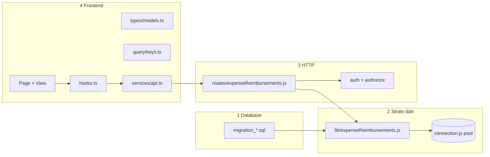
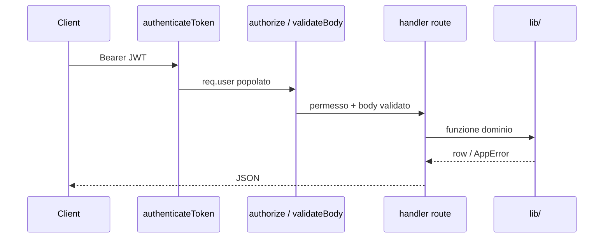

# Capitolo 1 — Sviluppare una Feature End-to-End: Il Metodo JEINS

> **Per chi:** developer che conosce React e Node ma non ancora il flusso di **questa** repo.  
> **Esempio filo conduttore:** nuova entità **Rimborsi Spese** (`expense_reimbursements`).  
> **Regola d’oro:** un Mid-Level **non va a tentativi** — segue sempre lo stesso ordine: **DB → lib → route → FE**.

> **⚠️ Esempio didattico — non cercarlo nel repo**  
> `expense_reimbursements`, `expenseReimbursements.js`, `ExpenseReimbursementsPage`, ecc. sono **solo tutorial** per illustrare il metodo JEINS. Non sono deployati né presenti nel codice sorgente attuale. Per imparare il flusso reale, traccia invece **Clienti** (`ClientsPage` → `routes/clients.js`). Quando implementi una feature vera, sostituisci i nomi dell’esempio con il dominio reale.

---

## Perché un metodo e non “proviamo”

❌ **Junior:** apre `ClientsPage.tsx`, copia-incolla, aggiunge `fetch` in mezzo alla View, scrive SQL nella route Express, dimentica RBAC, la PR torna indietro tre volte.

✅ **Mid-Level:** una tabella, un modulo dati in `backend/lib/`, un router sottile, tipi + `queryKeys` + hook, Page/View. Ogni strato ha **un solo compito**.



> **Nota onesta sul repo:** route storiche come `clients.js` contengono ancora SQL inline. Per **nuove entità** il team si aspetta il pattern **lib + route sottile**. Non aggiungere altro debito copiando `clients.js` alla lettera.

---

## Fase 0 — Scope (15 minuti, obbligatoria)

| Domanda | Dove documentare |
|---------|------------------|
| Chi può leggere / creare / approvare? | `docs/RBAC.md` |
| Collegamento ad altre tabelle? (`user_id`, `project_id`) | schema migration |
| Serve `version` per 409? | sì → [Capitolo 3](./cap03-gestione-conflitti-dati-concorrenti.md) |
| Quale Page / permesso UI? | `router.tsx` + `permissions.ts` |

---

## 1. Database First

Il database è la **fonte di verità**. Nessun campo “solo frontend”.

### 1.1 Dove scrivere

| File | Ruolo |
|------|--------|
| 📁 `backend/database/migration_<nome>.sql` | **modifica incrementale** su DB esistenti |
| 📁 `backend/database/schema.sql` | riferimento “schema completo” per nuovi ambienti (allinea dopo migration) |
| 📁 `backend/scripts/run-sql-migrations.js` | **registra** il file nell’array `MIGRATION_FILES` |

❌ **Junior:** modifica solo `schema.sql` e si aspetta che la macchina del collega si aggiorni da sola.

✅ **Mid-Level:** crea `migration_expense_reimbursements.sql` e lo aggiunge **in fondo** a `MIGRATION_FILES` (ordine esplicito, non alfabetico).

### 1.2 Esempio migration — Rimborsi Spese

📁 `backend/database/migration_expense_reimbursements.sql`

```sql
CREATE TABLE IF NOT EXISTS expense_reimbursements (
    reimbursement_id UUID PRIMARY KEY DEFAULT gen_random_uuid(),
    user_id UUID NOT NULL REFERENCES users(user_id) ON DELETE CASCADE,
    project_id UUID REFERENCES projects(project_id) ON DELETE SET NULL,
    amount_cents INTEGER NOT NULL CHECK (amount_cents > 0),
    description TEXT NOT NULL,
    status VARCHAR(32) NOT NULL DEFAULT 'pending'
        CHECK (status IN ('pending', 'approved', 'rejected', 'paid')),
    receipt_url TEXT,
    created_at TIMESTAMPTZ NOT NULL DEFAULT NOW(),
    updated_at TIMESTAMPTZ NOT NULL DEFAULT NOW(),
    version INTEGER NOT NULL DEFAULT 1
);

CREATE INDEX IF NOT EXISTS idx_expense_reimbursements_user
    ON expense_reimbursements (user_id, created_at DESC);
```

Registrazione in `run-sql-migrations.js`:

```js
const MIGRATION_FILES = [
    // ... file esistenti ...
    'migration_expense_reimbursements.sql',
];
```

### 1.3 Applicare in locale

```bash
cd backend
npm run migrate:all
# oppure solo SQL: npm run migrate:sql
```

Verifica: tabella presente, `schema_migrations` contiene il filename.

### 1.4 Convenzioni SQL JEINS

- PK: `<entità>_id` UUID + `gen_random_uuid()`
- Timestamp: `created_at`, `updated_at` (trigger se il dominio lo usa già altrove)
- Importi: **centesimi** (`amount_cents`) — mai `float` per soldi
- Vincoli e `CHECK` in migration, non solo commenti

---

## 2. Strato dati (Backend) — `backend/lib/`

Qui vive **tutto il SQL**. Le route chiamano funzioni; non costruiscono stringhe query.

### 2.1 Connessione DB

📁 `backend/database/connection.js` — **unico** `Pool` pg:

```js
import pool from '../database/connection.js';
```

❌ **Junior:** `new Pool()` in ogni file route.

✅ **Mid-Level:** importa sempre il pool condiviso (o, in futuro, passa `pool` ai test).

### 2.2 Nuovo modulo dati

📁 `backend/lib/expenseReimbursements.js`

```js
import pool from '../database/connection.js';
import { AppError } from './AppError.js';

const SELECT_FIELDS = `
    reimbursement_id AS id,
    user_id AS "userId",
    project_id AS "projectId",
    amount_cents AS "amountCents",
    description,
    status,
    receipt_url AS "receiptUrl",
    created_at AS "createdAt",
    version
`;

export async function listReimbursements({ userId, areaFilter, limit, offset }) {
    const params = [];
    let where = ' WHERE 1=1';

    if (userId) {
        params.push(userId);
        where += ` AND user_id = $${params.length}`;
    }
    // areaFilter: join users/projects se RBAC per area — stesso spirito di clients.js

    params.push(limit, offset);
    const result = await pool.query(
        `SELECT ${SELECT_FIELDS}
         FROM expense_reimbursements
         ${where}
         ORDER BY created_at DESC
         LIMIT $${params.length - 1} OFFSET $${params.length}`,
        params,
    );
    return result.rows;
}

export async function getReimbursementById(id) {
    const result = await pool.query(
        `SELECT ${SELECT_FIELDS} FROM expense_reimbursements WHERE reimbursement_id = $1`,
        [id],
    );
    return result.rows[0] ?? null;
}

export async function createReimbursement({ userId, projectId, amountCents, description, receiptUrl }) {
    if (!description?.trim()) {
        throw new AppError('La descrizione è obbligatoria', 400);
    }
    if (!amountCents || amountCents <= 0) {
        throw new AppError('Importo non valido', 400);
    }

    const result = await pool.query(
        `INSERT INTO expense_reimbursements
            (user_id, project_id, amount_cents, description, receipt_url)
         VALUES ($1, $2, $3, $4, $5)
         RETURNING ${SELECT_FIELDS}`,
        [userId, projectId ?? null, amountCents, description.trim(), receiptUrl ?? null],
    );
    return result.rows[0];
}

export async function updateReimbursementStatus(id, status, expectedVersion) {
    const result = await pool.query(
        `UPDATE expense_reimbursements
         SET status = $1, version = version + 1, updated_at = NOW()
         WHERE reimbursement_id = $2 AND version = $3
         RETURNING ${SELECT_FIELDS}`,
        [status, id, expectedVersion],
    );
    if (!result.rows.length) {
        const current = await getReimbursementById(id);
        throw new AppError('Conflitto di modifica', 409, { serverEntity: current });
    }
    return result.rows[0];
}
```

### 2.3 Anti SQL-injection (non negoziabile)

| ❌ Junior | ✅ Mid-Level |
|-----------|--------------|
| `` `... WHERE id = '${id}'` `` | `WHERE reimbursement_id = $1` + `[id]` |
| `ORDER BY ${req.query.sort}` | whitelist colonne: `const SORT = { date: 'created_at' }` |
| `LIMIT ${req.query.limit}` senza parse | `parsePagination` da `lib/pagination.js` |

Il driver `pg` **parametrizza** i valori; il rischio resta solo se **concateni nomi di colonna** non validati.

### 2.4 Cosa resta in `lib/` oggi (esempi reali)

| Modulo | Scopo |
|--------|--------|
| `lib/roles.js` | `isPrivileged`, `canAccessClientInArea` |
| `lib/pagination.js` | `parsePagination`, `buildPaginatedResult` |
| `lib/projects.js` | query ausiliarie (es. `attachTodosToProjects`) |
| `lib/AppError.js` | errori HTTP coerenti |

Per Rimborsi Spese aggiungi anche (se serve RBAC dedicato):

- `canManageExpenseReimbursements(role)` in `lib/roles.js`
- middleware `requireExpenseWrite` in `middleware/authorize.js`

---

## 3. Controller e rotte — `backend/routes/`

La route è un **adattatore HTTP**: legge `req`, chiama `lib/`, risponde `res.json`, delega errori a `next(error)`.

### 3.1 File route

📁 `backend/routes/expenseReimbursements.js`

```js
import express from 'express';
import { authenticateToken } from '../middleware/auth.js';
import { requireNotSocio } from '../middleware/authorize.js';
import * as reimbursements from '../lib/expenseReimbursements.js';
import { parsePagination } from '../lib/pagination.js';
import { validateBody } from '../validators/authSchemas.js';
import { createReimbursementSchema } from '../validators/expenseReimbursementSchemas.js';

const router = express.Router();
router.use(authenticateToken);

router.get('/', requireNotSocio, async (req, res, next) => {
    try {
        const { limit, offset } = parsePagination(req.query);
        const items = await reimbursements.listReimbursements({
            userId: req.user.role === 'Socio' ? req.user.id : undefined,
            limit,
            offset,
        });
        res.json(items);
    } catch (error) {
        next(error);
    }
});

router.post('/', requireNotSocio, validateBody(createReimbursementSchema), async (req, res, next) => {
    try {
        const row = await reimbursements.createReimbursement({
            userId: req.user.id,
            ...req.body,
        });
        res.status(201).json(row);
    } catch (error) {
        next(error);
    }
});

export default router;
```

### 3.2 Middleware — ordine corretto



| Middleware | File | Quando |
|------------|------|--------|
| `authenticateToken` | `middleware/auth.js` | sempre, `router.use` sul router |
| `requireNotSocio`, `requirePrivileged`, … | `middleware/authorize.js` | per metodo HTTP |
| `validateBody(schema)` | `validators/*Schemas.js` | POST/PUT con body strutturato |

📁 Esempio Zod (stesso pattern di `authSchemas.js`):

📁 `backend/validators/expenseReimbursementSchemas.js`

```js
import { z } from 'zod';

export const createReimbursementSchema = z.object({
    projectId: z.string().uuid().optional(),
    amountCents: z.number().int().positive(),
    description: z.string().trim().min(1),
    receiptUrl: z.string().url().optional(),
});
```

❌ **Junior:** validazione solo nel frontend (“tanto l’utente non bara”).

✅ **Mid-Level:** Zod o `AppError` nel backend; il frontend replica solo per UX.

### 3.3 Montare l’API

📁 `backend/app.js`

```js
import expenseReimbursementsRoutes from './routes/expenseReimbursements.js';
app.use('/api/expense-reimbursements', expenseReimbursementsRoutes);
```

Prefisso REST: kebab-case plurale, allineato agli altri (`/api/clients`, `/api/time-entries`).

### 3.4 Junior vs Mid-Level — route

❌ **Junior — SQL nella route:**

```js
router.get('/', async (req, res) => {
    const rows = await pool.query(
        `SELECT * FROM expense_reimbursements WHERE user_id = '${req.user.id}'`,
    );
    res.json(rows.rows);
});
```

✅ **Mid-Level — route sottile:**

```js
router.get('/', requireNotSocio, async (req, res, next) => {
    try {
        const items = await reimbursements.listReimbursements({ userId: req.user.id });
        res.json(items);
    } catch (error) {
        next(error);
    }
});
```

---

## 4. Integrazione Frontend

Dopo che `GET/POST` rispondono da Postman/curl, agganci il FE **in questo ordine** (non invertire).

### 4.1 Tipi — `src/types/models.ts`

```ts
export type ExpenseReimbursementStatus = 'pending' | 'approved' | 'rejected' | 'paid';

export interface ExpenseReimbursement {
    id: string;
    userId: string;
    projectId?: string;
    amountCents: number;
    description: string;
    status: ExpenseReimbursementStatus;
    receiptUrl?: string;
    createdAt?: string;
    version?: number;
}
```

Allinea **camelCase** ai alias SQL (`AS "amountCents"`).

### 4.2 Chiavi React Query — `src/lib/query/keys.ts`

```ts
export const queryKeys = {
    // ... esistenti ...
    expenseReimbursements: ['expense-reimbursements'] as const,
    expenseReimbursement: (id: string) => ['expense-reimbursements', id] as const,
};
```

❌ **Junior:** `queryKey: ['reimbursements', 'list']` in un file e `['expense']` in un altro.

✅ **Mid-Level:** una sola definizione in `keys.ts`.

### 4.3 Client API — `src/services/api.ts`

```ts
export const expenseReimbursementsAPI = {
    getAll: () => apiCall('/api/expense-reimbursements'),
    getById: (id: string) => apiCall(`/api/expense-reimbursements/${id}`),
    create: (body: Partial<ExpenseReimbursement>) =>
        apiCall('/api/expense-reimbursements', {
            method: 'POST',
            body: JSON.stringify(body),
        }),
    updateStatus: (id: string, status: string, expectedVersion?: number) =>
        apiCall(`/api/expense-reimbursements/${id}`, {
            method: 'PATCH',
            body: JSON.stringify({ status, expectedVersion }),
        }),
};
```

Tutto passa da `apiCall` → `lib/api/client.ts` (token, refresh 401).

❌ **Junior:** `fetch('http://localhost:3000/...')` nella View.

### 4.4 Hooks — `src/features/data/hooks.ts`

```ts
export function useExpenseReimbursements() {
    return useQuery({
        queryKey: queryKeys.expenseReimbursements,
        queryFn: () => expenseReimbursementsAPI.getAll() as Promise<ExpenseReimbursement[]>,
    });
}

export function useExpenseReimbursementMutations() {
    const qc = useQueryClient();
    const invalidate = () =>
        qc.invalidateQueries({ queryKey: queryKeys.expenseReimbursements });

    const create = useMutation({
        mutationFn: (data: Partial<ExpenseReimbursement>) => expenseReimbursementsAPI.create(data),
        onSuccess: invalidate,
    });

    return { create };
}
```

### 4.5 UI — Page / View / permessi

| File | Compito |
|------|---------|
| `pages/ExpenseReimbursementsPage.tsx` | hook, modali, `mutate`, loading/error |
| `views/ExpenseReimbursementsView.tsx` | tabella, callback `onCreate` |
| `app/router.tsx` | `<RequirePermission perm="viewExpenseReimbursements">` |
| `lib/permissions.ts` | flag derivato da ruolo |

Copia la **forma** di `ClientsPage.tsx` + `ClientiView.tsx`, non la logica SQL.

Dettaglio UI: [Capitolo 7](./cap07-frontend-pages-hooks-ui.md) · Query: [Capitolo 2](./cap02-uccidere-useeffect-react-query.md).

---

## Separazione degli strati (checklist mentale)

| Strato | Può | Non può |
|--------|-----|---------|
| `database/*.sql` | DDL, indici, vincoli | logica ruoli |
| `lib/*.js` | SQL, regole dominio, `AppError` | `req`, `res` |
| `routes/*.js` | HTTP, status code, middleware | SQL inline (nuove feature) |
| `services/api.ts` | URL, metodi, JSON | stato React |
| `hooks.ts` | cache, invalidate | JSX |
| `Page/View` | UI, permessi display | `pool.query` |

---

## Checklist rapida (stampa mentale)

- [ ] Migration in `backend/database/` + voce in `MIGRATION_FILES`
- [ ] `npm run migrate:all` ok
- [ ] `backend/lib/<entità>.js` con query parametrizzate
- [ ] `backend/routes/<entità>.js` sottile + `authenticateToken` + authorize
- [ ] Validator Zod o `AppError` su input
- [ ] `app.use('/api/...')` in `app.js`
- [ ] `ExpenseReimbursement` in `types/models.ts`
- [ ] `queryKeys` + `expenseReimbursementsAPI` + hook
- [ ] Page + View + `RequirePermission`
- [ ] Loading / error / 409 se `version`
- [ ] `docs/RBAC.md` aggiornato
- [ ] `npm test` (backend) + `npm run build` (gestionale-app)

---

## Approfondimenti

| Argomento | Capitolo |
|-----------|----------|
| SQL e middleware nel dettaglio | [Capitolo 6](./cap06-backend-route-e-sql.md) |
| Page / View | [Capitolo 7](./cap07-frontend-pages-hooks-ui.md) |
| React Query | [Capitolo 2](./cap02-uccidere-useeffect-react-query.md) |
| RBAC | [Capitolo 4](./cap04-auth-rbac-blindare-feature.md) |
| 409 conflitti | [Capitolo 3](./cap03-gestione-conflitti-dati-concorrenti.md) |

---

*Capitolo 1 — Metodo JEINS — v1 — maggio 2026*
