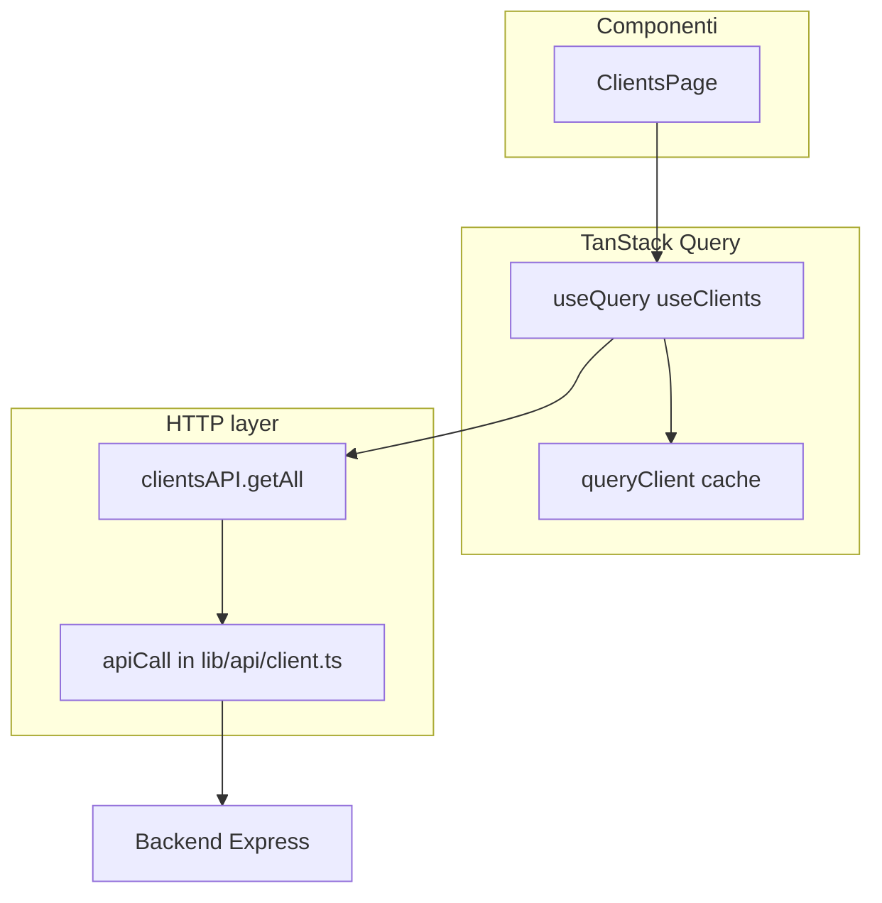
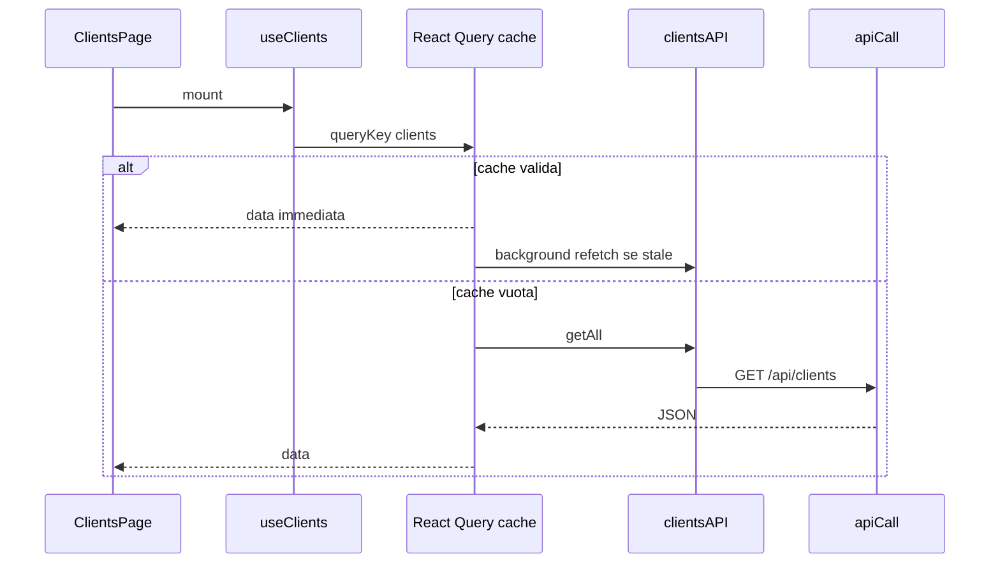

# Capitolo 2 — Uccidere gli `useEffect`: React Query e gestione dati

> **Il capitolo frontend più importante del playbook.**  
> Se continui a fare `useEffect` + `useState` per caricare liste dal backend, non stai scrivendo codice JEINS.

**File canonici in questo capitolo:**

| File | Ruolo |
|------|--------|
| 📁 `gestionale-app/src/lib/api/client.ts` | HTTP: token, refresh 401, timeout, 409 |
| 📁 `gestionale-app/src/services/api.ts` | Funzioni dominio (`clientsAPI.getAll`, …) |
| 📁 `gestionale-app/src/lib/query/client.ts` | Istanza `QueryClient` condivisa |
| 📁 `gestionale-app/src/lib/query/keys.ts` | Chiavi cache |
| 📁 `gestionale-app/src/features/data/hooks.ts` | `useClients`, `useClientMutations`, … |
| 📁 `gestionale-app/src/app/providers.tsx` | `QueryClientProvider` |

---

## La regola JEINS in una frase

**I dati remoti non vivono in `useState`. Vivono in React Query.**  
`useEffect` resta per effetti collaterali veri (focus trap, subscribe a `window`, sincronizzare URL)—**non** per `fetch('/api/...')`.

---

## 1. Perché React Query (e non DIY)

### 1.1 Cosa fa il Junior senza React Query

- Ogni mount della Page = nuova richiesta HTTP (anche se i dati sono identici).
- Due componenti che mostrano gli stessi clienti = **due fetch** paralleli.
- Dopo un salvataggio, dimentica di ricaricare → UI stale.
- Gestione manuale di loading/error con 4 `useState` che si contraddicono.

### 1.2 Cosa ottieni con la nostra stack



| Capacità | Comportamento in JEINS |
|----------|------------------------|
| **Caching** | Stessa `queryKey` → stessi dati in memoria; secondo componente non rifà HTTP subito |
| **Stale time** | 📁 `lib/query/client.ts`: `staleTime: 30_000` — per 30s i dati sono “freschi”, niente refetch automatico |
| **Background refetch** | In **produzione** `refetchOnWindowFocus: true` — torni sulla tab → dati aggiornati senza codice extra |
| **Retry** | `retry: 1` sulle query — un errore di rete transient viene ritentato |
| **Mutations** | Dopo `create`/`update`, `invalidateQueries` aggiorna tutte le liste collegate |
| **Dedup** | Due `useClients()` montati insieme → **una** richiesta in flight |

### 1.3 Configurazione globale (non toccare a caso)

📁 `gestionale-app/src/lib/query/client.ts`

```ts
export const queryClient = new QueryClient({
    defaultOptions: {
        queries: {
            staleTime: 30_000,
            retry: 1,
            refetchOnWindowFocus: import.meta.env.PROD,
        },
        mutations: {
            retry: 0,
        },
    },
});
```

📁 `gestionale-app/src/app/providers.tsx` — **una sola** istanza per tutta l’app:

```tsx
<QueryClientProvider client={queryClient}>
```

❌ **Junior:** `new QueryClient()` dentro ogni Page → cache inutilizzata.

---

## 2. I due layer HTTP (prima degli hook)

Capire la separazione evita `fetch` sparsi.

### 2.1 `lib/api/client.ts` — trasporto

Responsabilità **basse livello**:

- `getApiUrl()` — `VITE_API_URL` o default `http://localhost:3000`
- Header `Authorization: Bearer` da `localStorage`
- Cookie `credentials: 'include'` per refresh session
- Refresh automatico su 401 → `tryRefreshSession()` → ritenta la chiamata
- `notifyUnauthorized()` → logout UI
- Timeout 30s (`AbortController`)
- `ConcurrentModificationError` su 409

```ts
// Tutto il dominio passa da qui, mai fetch nudo nelle Page
export async function apiCall(endpoint: string, options: RequestInit = {}, ...) {
    const token = localStorage.getItem('token');
    const fullUrl = `${getApiUrl()}${cleanEndpoint}`;
    // ...
}
```

### 2.2 `services/api.ts` — contratto dominio

Wrappa `apiCall` con URL e metodi leggibili:

```ts
export const clientsAPI = {
    getAll: () => apiCall('/api/clients'),
    getById: (id: string) => apiCall(`/api/clients/${id}`),
    create: (client: any) =>
        apiCall('/api/clients', { method: 'POST', body: JSON.stringify(client) }),
    // ...
};
```

In dev può usare mock (`shouldUseMockData`) — ancora **non** nella Page.

❌ **Junior:** `fetch` nella View con URL costruito a mano.  
✅ **Mid-Level:** `clientsAPI.getAll()` — se cambia il path, tocchi un file.

---

## 3. Scrivere un custom hook (es. `useClients`)

Nel team JEINS il nome è **`useClients`** (risorsa), non `useGetClients`. Il concetto è lo stesso: hook che incapsula `useQuery`.

### 3.1 Passo A — chiave in `keys.ts`

📁 `gestionale-app/src/lib/query/keys.ts`

```ts
export const queryKeys = {
    clients: ['clients'] as const,
    client: (id: string) => ['clients', id] as const,
};
```

### 3.2 Passo B — hook in `features/data/hooks.ts`

```ts
import { useQuery } from '@tanstack/react-query';
import { clientsAPI } from '../../services/api';
import { queryKeys } from '../../lib/query/keys';
import type { Client } from '../../types/models';

/** Lettura lista clienti — usa questo, non useEffect. */
export function useClients() {
    return useQuery({
        queryKey: queryKeys.clients,
        queryFn: () => clientsAPI.getAll() as Promise<Client[]>,
    });
}
```

Opzioni utili (Mid-Level):

```ts
export function useClient(id: string | undefined) {
    return useQuery({
        queryKey: queryKeys.client(id!),
        queryFn: () => clientsAPI.getById(id!) as Promise<Client>,
        enabled: !!id, // niente fetch se id mancante
    });
}
```

### 3.3 Passo C — scritture con `useMutation`

```ts
export function useClientMutations() {
    const qc = useQueryClient();
    const invalidate = () => {
        qc.invalidateQueries({ queryKey: queryKeys.clients });
        qc.invalidateQueries({ queryKey: queryKeys.projects });
    };

    const create = useMutation({
        mutationFn: (data: Partial<Client>) => clientsAPI.create(data),
        onSuccess: invalidate,
    });

    return { create, updateStatus, remove };
}
```

❌ **Junior:** dopo `create`, `setClients([...clients, newOne])` a mano — dimentica progetti collegati.  
✅ **Mid-Level:** `invalidate` su **tutte** le query che dipendono da quel dato.

### 3.4 Diagramma flusso dati



---

## 4. Antipattern Junior vs pattern Mid-Level

### 4.1 Fetch dentro il componente

❌ **Junior — `ClientsPage.tsx`:**

```tsx
export function ClientsPage() {
    const [clients, setClients] = useState<Client[]>([]);
    const [loading, setLoading] = useState(true);
    const [error, setError] = useState<string | null>(null);

    useEffect(() => {
        setLoading(true);
        fetch(`${import.meta.env.VITE_API_URL}/api/clients`, {
            headers: { Authorization: `Bearer ${localStorage.getItem('token')}` },
        })
            .then(r => r.json())
            .then(setClients)
            .catch(e => setError(e.message))
            .finally(() => setLoading(false));
    }, []);

    // ...
}
```

**Problemi:** niente cache, niente refresh token, race se il componente smonta, duplicazione in ogni Page, `reload` manuale dopo ogni save.

---

✅ **Mid-Level — stesso file reale nel repo:**

📁 `gestionale-app/src/pages/ClientsPage.tsx`

```tsx
export function ClientsPage() {
    const { data: clients = [], isLoading, error, isSuccess } = useClients();
    const { create, updateStatus, remove } = useClientMutations();
    const [addOpen, setAddOpen] = useState(false); // solo UI locale

    if (isLoading) return <p className="text-ink-muted">Caricamento clienti…</p>;
    if (error) return <p className="text-rose-400">{(error as Error).message}</p>;

    return (
        <ClientiView
            clients={clients}
            onUpdateStatus={(id, status) => updateStatus.mutate({ id, status })}
            // ...
        />
    );
}
```

`useState` resta solo per **UI locale** (modale aperta, riga in edit)—non per la lista clienti.

### 4.2 Fetch nella View

❌ **Junior:** `ClientiView.tsx` importa `clientsAPI` e fa `useEffect` lì.

✅ **Mid-Level:** la View riceve `clients` e callback; zero hook di dati remoti.

### 4.3 Ricaricare la pagina dopo il save

❌ `window.location.reload()`  
✅ `create.mutateAsync(data)` → `onSuccess` invalida `queryKeys.clients`

---

## 5. Ciclo di vita UI: `isLoading`, `isError`, `isSuccess`

TanStack Query v5 espone flag che **devi** gestire in ogni Page con dati remoti.

### 5.1 Stati query (lettura)

| Flag | Significato pratico |
|------|---------------------|
| `isLoading` | Prima fetch in corso, **nessun** dato in cache |
| `isPending` | Query non ancora in `success` (include loading iniziale) |
| `isFetching` | Qualsiasi fetch in corso (anche background refetch) |
| `isError` | Ultimo tentativo fallito |
| `isSuccess` | Dati disponibili e validi |
| `error` | Istanza `Error` (messaggio da `apiCall`) |
| `data` | Payload — può essere `undefined` prima del success |

### 5.2 Template rigoroso (Page)

**Perché serve un template:** senza ordine fisso, il neofita renderizza `<ClientiView clients={data!} />` mentre `data` è ancora `undefined` → schermo bianco o crash. Gli `if` vanno **prima** del return principale.

**Cosa restituisce `useQuery` (TanStack Query v5):** oltre a `data`, ricevi funzioni come `refetch`. Se nel bottone “Riprova” chiami `refetch()`, devi **estrarla** nel destructuring — altrimenti TypeScript segnala errore e in runtime `refetch is not defined`.

```tsx
const {
    data: clients = [],
    isLoading,
    isError,
    error,
    isSuccess,
    isFetching,
    refetch,  // ← obbligatorio se mostri "Riprova"
} = useClients();

// 1) Blocco caricamento iniziale — isLoading = prima fetch, cache vuota
if (isLoading) {
    return <p className="text-ink-muted">Caricamento clienti…</p>;
}

// 2) Blocco errore — rete, 401, 500, messaggio da apiCall
if (isError) {
    return (
        <div className="text-rose-400">
            <p>{(error as Error).message}</p>
            <button type="button" onClick={() => refetch()}>
                Riprova
            </button>
        </div>
    );
}

// 3) Success — lista vuota vs dati
if (isSuccess && clients.length === 0) {
    return <p className="text-ink-muted">Nessun cliente.</p>;
}

// 4) Render principale
return (
    <>
        {isFetching && !isLoading && (
            <span className="text-xs text-ink-muted">Aggiornamento…</span>
        )}
        <ClientiView clients={clients} /* ... */ />
    </>
);
```

📁 Nel repo oggi `ClientsPage` usa `isLoading` + `error` (sufficiente per il caso base). Il Mid-Level aggiunge `isSuccess` per empty state e `isFetching` per feedback refetch in background.

❌ **Junior:**

```tsx
const { data } = useClients();
return <ClientiView clients={data!} />; // crash o flash vuoto
```

❌ **Junior:** mostra “Nessun cliente” mentre `isLoading === true`.

### 5.3 Stati mutation (scrittura)

```tsx
const { create } = useClientMutations();

<Button
    disabled={create.isPending}
    onClick={() => create.mutate(payload)}
>
    {create.isPending ? 'Salvataggio…' : 'Salva'}
</Button>

{create.isError && (
    <p className="text-rose-400">{(create.error as Error).message}</p>
)}
```

| Flag mutation | Uso |
|---------------|-----|
| `isPending` | disabilita submit, spinner |
| `isError` | messaggio sotto il form |
| `isSuccess` | chiudi modale in `onSuccess` o dopo `mutateAsync` |

```tsx
onSubmit={async data => {
    await create.mutateAsync(data);
    setAddOpen(false);
}}
```

### 5.4 Quando `useEffect` è ancora lecito

| Caso | Esempio |
|------|---------|
| Subscription browser | `auth:unauthorized` listener in provider |
| Focus / misura DOM | textarea auto-resize |
| Sync query param ↔ stato UI | filtro complesso non in `queryKey` |

| Caso | Non usare `useEffect` |
|------|------------------------|
| Caricare lista al mount | `useQuery` |
| Ricaricare dopo POST | `invalidateQueries` / `onSuccess` |
| Polling ogni N secondi | `refetchInterval` in `useQuery` |

---

## 6. Cheat sheet — nuova risorsa

1. `clientsAPI.*` in `services/api.ts`  
2. `queryKeys.foo` in `keys.ts`  
3. `useFoo()` + `useFooMutations()` in `hooks.ts`  
4. Page: `useFoo()` + gestione `isLoading` / `isError` / `isSuccess`  
5. View: solo props  

Approfondimento chiavi avanzate: [Capitolo 8](./cap08-react-query-chiavi-cache.md).

---

## 7. Errori tipici in review

| Sintomo | Causa | Fix |
|---------|-------|-----|
| Doppia chiamata HTTP | due `queryKey` diverse per stessi dati | unifica in `queryKeys` |
| Lista non si aggiorna dopo save | manca `invalidateQueries` | aggiungi in `onSuccess` mutation |
| 401 infinito | fetch bypassa `apiCall` | usa `services/api.ts` |
| Flash “undefined” | no default `data: x = []` | default + guard `isLoading` |

---

*Capitolo 2 — v3 — template refetch documentato — maggio 2026*
