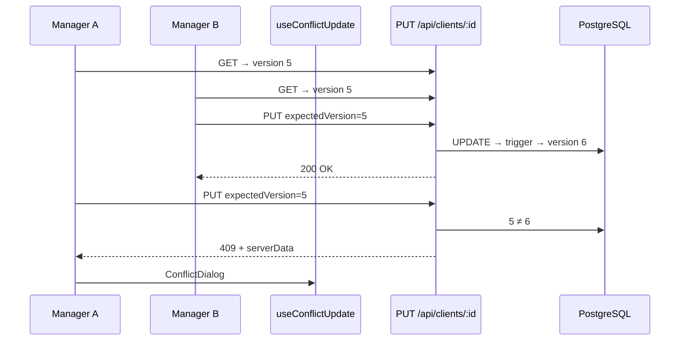
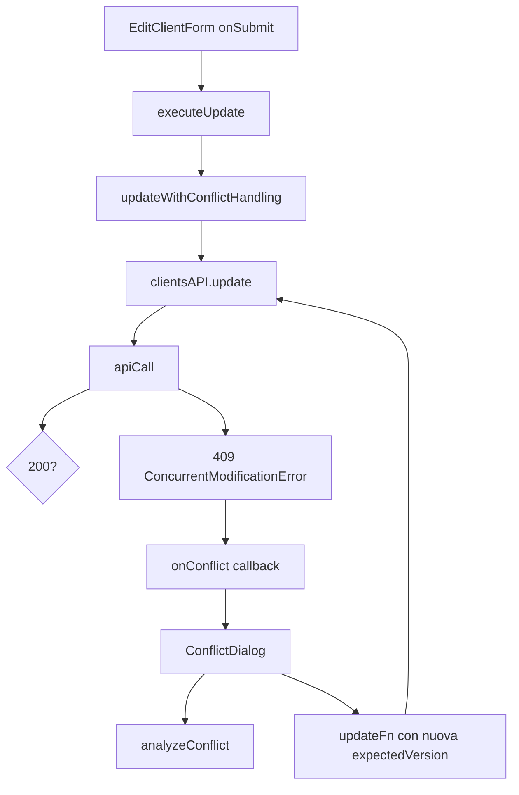

# Capitolo 3 — Gestione dei conflitti e dati concorrenti

> **Mindset Mid-Level:** non presumi mai che il salvataggio andrà a buon fine.  
> Difendi l’**integrità del dato** quando due persone lavorano sullo stesso record.

**Stack JEINS — Optimistic Locking proprietario:**

| Layer | File |
|-------|------|
| DB | `version` + trigger `increment_version()` |
| Backend | `expectedVersion` → risposta **409** `CONCURRENT_MODIFICATION` |
| HTTP | `ConcurrentModificationError` in `lib/api/client.ts` |
| Orchestrazione | `utils/updateWithConflictHandling.ts` |
| Analisi merge | `utils/conflictResolver.ts` |
| UI | `hooks/useConflictUpdate.tsx` + `components/ConflictDialog.tsx` |

**Entità coperte oggi:** `clients`, `projects`, `contracts`, `events` (e `tasks` a livello schema).  
**Esempio narrativo:** due Responsabili che modificano lo stesso **candidato** — stesso problema; quando aggiungerai `version` ai candidati, replicherai questo identico flusso.

---

## 1. Race condition e “lost update”

### 1.1 Cosa succede senza protezione

Due manager aprono la scheda dello stesso record (cliente, progetto, evento):

1. **T=0** — Entrambi leggono `status: "In attesa"`, `version: 5`.
2. **T=1** — Manager A imposta `status: "Approvato"` e salva.
3. **T=2** — Manager B imposta `note: "Da richiamare"` e salva **ancora con dati vecchi**.

Senza locking: **last-write-wins**. La modifica di A sparisce. Nessun errore, nessun avviso — il peggior tipo di bug in un gestionale.

Questo è una **race condition** sullo stesso record: l’esito dipende da *chi scrive per ultimo*, non da *chi ha ragione*.

### 1.2 Cosa fa il Mid-Level

- Invia sempre la **versione letta all’apertura del form** (`expectedVersion`).
- Se il server risponde **409**, **ferma** il flusso e mostra `ConflictDialog`.
- Dopo la risoluzione, ritenta con la **`version` aggiornata** del server.

❌ **Junior:** “Ho cliccato Salva, toast verde, fine” — senza gestire 409.  
✅ **Mid-Level:** “Salva può fallire per conflitto; l’utente sceglie consapevolmente.”



---

## 2. Backend: campo `version` (non solo `updated_at`)

### 2.1 Schema e trigger

📁 `backend/database/migration_add_version_optimistic_locking.sql`

- Colonna `version INTEGER DEFAULT 1` su `clients`, `projects`, `contracts`, `tasks`, `events`.
- Trigger `BEFORE UPDATE` → `NEW.version = OLD.version + 1` automaticamente ad ogni UPDATE riuscito.

`updated_at` dice **quando** è cambiato il record; `version` è un **contatore di revisione** che il client deve rispettare per scrivere.

### 2.2 Contratto PUT

📁 Esempio reale: `backend/routes/clients.js`

```js
const { name, contactPerson, email, phone, status, area, expectedVersion } = req.body;

if (expectedVersion !== undefined) {
    const currentVersion = existing.rows[0].version;
    if (currentVersion !== expectedVersion) {
        const serverData = await pool.query(
            `SELECT client_id as id, name, ..., version FROM clients WHERE client_id = $1`,
            [id],
        );
        return res.status(409).json({
            error: 'CONCURRENT_MODIFICATION',
            message: 'Il cliente è stato modificato da un altro utente.',
            currentVersion,
            expectedVersion,
            serverData: serverData.rows[0],
        });
    }
}

// Solo se la version coincide → UPDATE
```

### 2.2.1 Glossario body JSON del 409 (nomi esatti nel repo)

Quando il backend risponde **409**, il JSON ha campi **fissi**. Non confondere i nomi: in JEINS non esiste `serverVersion` nel body — la versione attuale sul server si chiama `currentVersion`.

| Campo | Tipo | Significato | Chi lo usa |
|-------|------|-------------|------------|
| `error` | stringa | Valore `'CONCURRENT_MODIFICATION'` | `lib/api/client.ts` riconosce il 409 e lancia `ConcurrentModificationError` |
| `message` | stringa | Testo in italiano per l’utente | Dialog e toast |
| `expectedVersion` | numero | Versione che **il client** credeva fosse ancora valida (quella letta all’apertura del form) | Debug: “stavo salvando come v5 ma sul server era già v6” |
| `currentVersion` | numero | Versione **adesso** sul database | Retry: il prossimo `PUT` deve usare questa come `expectedVersion` |
| `serverData` | oggetto | Snapshot completo del record sul server (nome, status, `version`, …) | `ConflictDialog` mostra “cosa c’è sul server” e alimenta merge |

**Flusso mentale per il neofita:**

1. Apri modale modifica → `GET` cliente → memorizzi `version: 5` nel state del form.
2. Invii `PUT` con `expectedVersion: 5` nel body.
3. Nel frattempo un collega salva → sul DB `version` diventa `6`.
4. Il tuo `PUT` non aggiorna righe → backend risponde 409 con `currentVersion: 6` e `serverData` aggiornato.
5. La UI **non** chiude il form in silenzio: apre `ConflictDialog` e chiede cosa fare.

Stesso pattern in 📁 `projects.js`, `contracts.js`, `events.js`.

### 2.3 Backend — checklist nuova entità versionata

- [ ] Colonna `version` + trigger in migration  
- [ ] `SELECT` espone `version` (alias camelCase se serve)  
- [ ] `PUT`/`PATCH` principale accetta `expectedVersion` e risponde 409 con `serverData`  
- [ ] **Non** fare UPDATE “cieco” se `expectedVersion` è obbligatorio per quel flusso

❌ **Junior:** confronta solo `updated_at` come stringa dal client — clock skew e formati diversi.  
✅ **Mid-Level:** intero `version` gestito dal DB.

### 2.4 Scrittura senza `expectedVersion`

Se il body **non** include `expectedVersion`, alcune route oggi applicano ancora UPDATE (comportamento legacy). Per form di modifica in UI il Mid-Level **invia sempre** la versione.

---

## 3. Dal 409 HTTP all’errore tipizzato

📁 `gestionale-app/src/lib/api/client.ts`

```ts
if (response.status === 409 && error.error === 'CONCURRENT_MODIFICATION') {
    throw new ConcurrentModificationError(
        error.message || 'Conflitto di modifica',
        error, // intero payload JSON → conflictData
    );
}
```

`ConcurrentModificationError` espone `.conflictData` (include `serverData`).

---

## 4. Frontend: catena di gestione



### 4.1 `updateWithConflictHandling`

📁 `gestionale-app/src/utils/updateWithConflictHandling.ts`

- Aggiunge `expectedVersion` al payload se `currentVersion` è definito.
- Chiama `updateFunction` (es. `clientsAPI.update`).
- Su `ConcurrentModificationError`, costruisce `ConflictData` e invoca `onConflict` **senza** chiudere il form in silenzio.

```ts
const dataWithVersion = currentVersion !== undefined
    ? { ...updateData, expectedVersion: currentVersion }
    : updateData;
```

Opzionale: passare `originalData` (snapshot all’apertura modale) per merge più intelligente in `analyzeConflict`.

### 4.2 `conflictResolver` — merge per campo

📁 `gestionale-app/src/utils/conflictResolver.ts`

`analyzeConflict(yourChanges, serverData, originalData?)` classifica ogni campo:

| Caso | Esito |
|------|--------|
| Solo tu hai cambiato rispetto all’originale | **mergeable** — si può unire |
| Solo il server ha cambiato | **mergeable** — resta valore server |
| Entrambi cambiato valori diversi | **conflicting** — l’utente deve scegliere |
| Manca `originalData` | tutti i campi trattati come conflitto |

`formatFieldName()` mappa chiavi API → etichette italiane in UI.

### 4.3 `useConflictUpdate` — hook da usare nelle Page

📁 `gestionale-app/src/hooks/useConflictUpdate.tsx`  
📁 Esempio integrato: `pages/ClientsPage.tsx`, `ProjectsPage.tsx`, `BillingPage.tsx`

```tsx
const conflict = useConflictUpdate<Record<string, unknown>>({
    entityType: 'cliente',
    entityId: editClient?.id || '',
    currentVersion: editClient?.version,
    updateFn: payload => clientsAPI.update(editClient!.id, payload),
    onSuccess: () => {
        qc.invalidateQueries({ queryKey: queryKeys.clients });
        setEditClient(null);
    },
});

// Nel JSX della Page — obbligatorio renderizzare il modal
return (
    <>
        <ClientiView /* ... */ />
        {conflict.ConflictModal}
    </>
);
```

**API dell’hook:**

| Membro | Ruolo |
|--------|--------|
| `executeUpdate(payload, version?)` | unico entry point al submit |
| `ConflictModal` | React node con `ConflictDialog` già cablato |

Flusso `executeUpdate`:

1. `updateWithConflictHandling` → try update  
2. Success → `onSuccess()`  
3. 409 → `onConflict` → apre dialog; errore **non** propagato come crash (`ConcurrentModificationError` swallowed dopo dialog)

Risoluzione in `handleResolve`:

| Scelta | Comportamento |
|--------|----------------|
| `'yours'` | Reinvia le tue modifiche con `expectedVersion: serverVersion` |
| `'server'` | Chiudi dialog, `onSuccess` (ricarica lista — dati server vincono) |
| `'merged'` | Payload unificato da `analyzeConflict` + `expectedVersion` server |

### 4.4 `ConflictDialog`

📁 `gestionale-app/src/components/ConflictDialog.tsx`

- Chiama `analyzeConflict` per evidenziare campi **merge automatici** vs **in conflitto**.
- Radio: Mantieni mie / Mantieni server / Merge automatico (solo se zero campi in conflitto).
- **Ricarica dati** → `onReload` → invalida query e chiudi modale.

❌ **Junior:** `window.alert('Errore salvataggio')` sul 409.  
❌ **Junior:** dimentica `{conflict.ConflictModal}` → conflitto invisibile.  
✅ **Mid-Level:** dialog + scelta esplicita + retry con versione corretta.

---

## 5. Junior vs Mid-Level — riepilogo

### Salvataggio modifica cliente

❌ **Junior:**

```tsx
const handleSave = async (data) => {
    await clientsAPI.update(id, data);
    toast.success('Salvato!');
    onClose();
};
```

✅ **Mid-Level:**

```tsx
const conflict = useConflictUpdate({
    entityType: 'cliente',
    entityId: editClient!.id,
    currentVersion: editClient!.version,
    updateFn: payload => clientsAPI.update(editClient!.id, payload),
    onSuccess: () => { refresh(); setEditClient(null); },
});

<EditClientForm
    client={editClient}
    onSubmit={data => conflict.executeUpdate(data, editClient.version)}
/>
{conflict.ConflictModal}
```

### Tipi

📁 `types/models.ts` — includi `version?: number` su `Client`, `Project`, `Contract`, …

### GET prima del form

La `version` nel form deve essere quella restituita dall’**ultimo GET** prima dell’edit, non un valore hardcoded.

---

## 6. Mid-Level: integrità oltre il happy path

| Situazione | Comportamento atteso |
|------------|----------------------|
| Salvataggio OK | `onSuccess`, invalidate React Query |
| 409 | Dialog, nessuna sovrascrittura silenziosa |
| Rete / 500 | Messaggio errore, form resta aperto |
| Utente sceglie “Server” | Chiudi senza retry; lista aggiornata |
| Utente sceglie “Mie” dopo 409 | `expectedVersion` = **version corrente server** |

**Frase da Tech Lead:** *“Il salvataggio è un’ipotesi da verificare, non un fatto compiuto.”*

---

## 7. Estendere il sistema (es. Candidati HR)

1. Migration: `version` + trigger (come `migration_add_version_optimistic_locking.sql`).  
2. Route `candidates.js`: blocco 409 identico a `clients.js`.  
3. `ExpenseReimbursement` / `Candidate` in `models.ts` con `version`.  
4. Page edit: `useConflictUpdate` con `entityType` esteso (oggi: `'cliente' | 'progetto' | 'contratto' | 'task'` — aggiungi tipo in `ConflictEntityType` se serve).  
5. Test manuale: due tab, stesso record, due salvataggi → deve apparire il dialog.

---

## 8. Riferimenti

| Argomento | Dove |
|-----------|------|
| Loading / errori in Page | [Capitolo 2](./cap02-uccidere-useeffect-react-query.md) (§5) |
| Teoria frontend estesa | [frontend Cap. 6](../frontend/06-concorrenza-integrita-e-errori.md) |
| Feature E2E con `version` | [Capitolo 1](./cap01-metodo-jeins-feature-end-to-end.md) |

---

*Capitolo 3 — v1 — Optimistic locking JEINS — maggio 2026*
