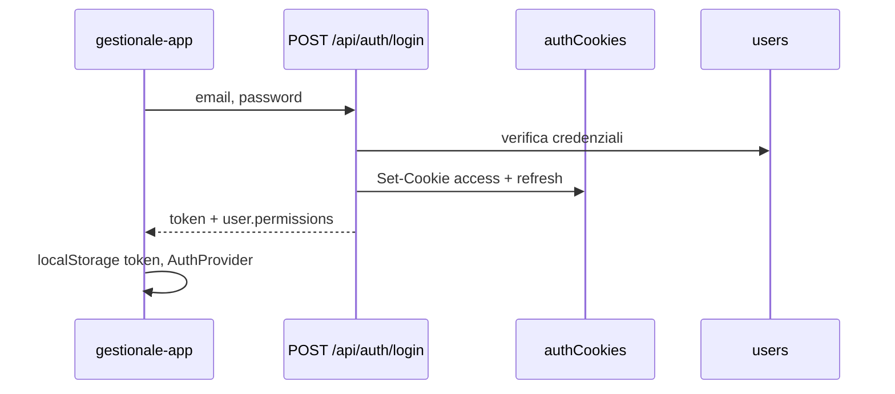

# Capitolo 4 — Blindare le feature: autenticazione e RBAC

> **Regola d’oro JEINS (memorizzala):**  
> **La sicurezza della UI serve solo alla UX.**  
> **La vera sicurezza si fa SEMPRE sul backend.**  
> Un utente malintenzionato può chiamare l’API con curl bypassando React.

---

## Mappa dell’ecosistema

```mermaid
flowchart TB
    subgraph be [Backend]
        AC[authCookies.js]
        AUTH[middleware/auth.js]
        AUTHZ[middleware/authorize.js]
        ROLES[lib/roles.js]
        PERM[lib/permissions.js]
        ROUTE[routes/*.js]
    end
    subgraph fe [Frontend]
        AP[AuthProvider]
        RP[RequirePermission]
        RES[permissions.ts resolvePermissions]
        UI[Page / View / IconRail]
    end
    LOGIN[/api/auth/login] --> AC
    AC --> AUTH
    AUTH --> AUTHZ
    AUTHZ --> ROUTE
    LOGIN --> PERM
    PERM --> AP
    AP --> RES
    RES --> RP
    RES --> UI
```

| Layer | Domanda | File |
|-------|---------|------|
| Identità | *Chi sei?* | `auth.js` + JWT/cookie |
| Autorizzazione | *Cosa puoi fare?* | `authorize.js` + `roles.js` |
| Permessi UI | *Cosa mostriamo?* | `permissions.ts` + `RequirePermission` |

**Matrice business:** 📁 `docs/RBAC.md`

---

## 1. Backend — autenticazione: cookie + Bearer

### 1.1 `authCookies.js` — trasporto token

📁 `backend/lib/authCookies.js`

Non genera JWT: definisce **come** i token viaggiano.

| Funzione | Ruolo |
|----------|--------|
| `setAuthCookies(res, access, refresh)` | Dopo login/register: cookie `httpOnly` `access_token` + `refresh_token` |
| `clearAuthCookies(res)` | Logout |
| `extractBearerOrCookie(req)` | Legge `Authorization: Bearer …` **oppure** cookie `access_token` |

```js
export function extractBearerOrCookie(req, cookieName = 'access_token') {
    const authHeader = req.headers.authorization;
    if (authHeader?.startsWith('Bearer ')) return authHeader.slice(7);
    return req.cookies?.[cookieName] || null;
}
```

**Perché entrambi:** il frontend JEINS salva anche `token` in `localStorage` e lo manda come Bearer (`lib/api/client.ts`); il refresh usa cookie `refresh_token` + `POST /api/auth/refresh`.

Opzioni cookie (produzione): `secure`, `sameSite: 'none'` per cross-origin con frontend su dominio diverso.

### 1.2 `authenticateToken` — middleware obbligatorio

📁 `backend/middleware/auth.js`

```js
export const authenticateToken = async (req, res, next) => {
    const token = extractBearerOrCookie(req);
    if (!token) return res.status(401).json({ error: 'Token di autenticazione mancante' });

    const decoded = verifyTokenString(token); // lib/tokens.js
    const user = await loadUser(decoded);     // role, area da DB
    if (!user) return res.status(403).json({ error: 'Utente non trovato o disattivato' });

    req.user = user;
    next();
};
```

Su ogni router protetto:

```js
const router = express.Router();
router.use(authenticateToken);
```

❌ **Junior:** route “pubblica” per errore che espone dati sensibili.  
✅ **Mid-Level:** `401` senza token, `403` utente disattivato.

### 1.3 Login e permessi nel payload

📁 `backend/routes/auth.js` + `services/authService.js`

Dopo login:

1. `issueAccessToken` / `issueRefreshToken`
2. `setAuthCookies(res, …)`
3. Body JSON con `user` + `token` (Bearer per SPA)
4. `toPublicUser` arricchisce con `permissions: getPermissionsForUser(user)` da 📁 `lib/permissions.js`

Il frontend può usare `user.permissions` già calcolati dal server (fonte preferita se presente).



---

## 2. Backend — autorizzazione RBAC (`authorize.js`)

`authenticateToken` risponde **chi** è l’utente.  
`authorize.js` risponde **se** può eseguire **questa** operazione.

📁 `backend/middleware/authorize.js` — delega le regole a 📁 `backend/lib/roles.js`:

| Middleware | Controllo |
|------------|-----------|
| `requireRoles('Admin', 'IT')` | ruolo esplicito |
| `requirePrivileged` | management + admin |
| `requireClientWrite` | `canManageClients(role)` |
| `requireProjectWrite` | `canManageProjects(role)` |
| `requireContractWrite` | `canAccessBilling(user)` — fatture/contratti |
| `requireNotSocio` | blocca associato su liste management |

### 2.1 Esempio reale — contratti / fatture

📁 `backend/routes/contracts.js`

```js
router.use(authenticateToken);
router.use(requireContractRead);  // canAccessBilling su tutto il router

router.get('/', async (req, res, next) => { /* ... */ });

router.post('/', requireContractWrite, async (req, res, next) => { /* ... */ });
router.put('/:id', requireContractWrite, async (req, res, next) => { /* ... */ });
router.delete('/:id', requireContractWrite, async (req, res, next) => { /* ... */ });
```

Un **Socio** o un **CDA senza area Commerciale** riceve **403** anche se indovina `DELETE /api/contracts/uuid` — **senza** guardare la UI.

### 2.2 RBAC per area (oltre al ruolo)

📁 `lib/roles.js` — `canAccessClientInArea(user, client.area)` su GET/PUT singolo cliente.

Privilegiati vedono tutto; altri solo record della propria `area`.

### 2.3 Middleware generico per permesso

📁 `lib/permissions.js`

```js
export function requirePermission(permissionKey) {
    return (req, res, next) => {
        const perms = getPermissionsForUser(req.user);
        if (!perms[permissionKey]) {
            return res.status(403).json({ error: 'Accesso negato...' });
        }
        next();
    };
}
```

Usalo su nuove route quando il permesso esiste già in `getPermissionsForUser` (es. `manageEvents`).

### 2.4 Junior vs Mid-Level — nuova route

❌ **Junior:**

```js
router.delete('/:id', authenticateToken, async (req, res) => {
    if (req.user.role !== 'Admin') return res.status(403).json({ error: 'No' });
    // SQL...
});
```

✅ **Mid-Level:**

```js
router.delete('/:id', requireContractWrite, async (req, res, next) => {
    try { /* ... */ } catch (e) { next(e); }
});
```

Regola: **un check = un middleware** riusabile, non `if (role)` copiato in 20 file.

---

## 3. Frontend — permessi e UX

### 3.1 `resolvePermissions` — cosa può vedere/fare l’utente

📁 `gestionale-app/src/lib/permissions.ts`

Allineato a `backend/lib/permissions.js` (stessi flag booleani).

```ts
export interface UserPermissions {
    viewClients: boolean;
    manageClients: boolean;
    viewBilling: boolean;
    manageBilling: boolean;
    manageUsers: boolean;
    // ...
}
```

Priorità:

1. Se `user.permissions` arriva dal backend (login/`/users/me`) → **usa quello**.
2. Altrimenti calcolo client con `isPrivileged`, `canAccessBilling`, `role === 'Socio'`, ecc.

```ts
export function resolvePermissions(user: User | null | undefined): UserPermissions {
    if (user?.permissions) return user.permissions as UserPermissions;
    // fallback locale...
}
```

❌ **Junior:** `user.role === 'Admin'` sparso in 15 componenti.  
✅ **Mid-Level:** un solo `resolvePermissions(user)` e flag semantici (`manageBilling`).

### 3.2 `RequirePermission` — proteggere intere pagine

📁 `gestionale-app/src/app/RequirePermission.tsx`

```tsx
export function RequirePermission({ perm, children }: { perm: keyof UserPermissions; children: React.ReactNode }) {
    const { user, loading } = useAuth();
    if (loading) return null;
    const permissions = resolvePermissions(user);
    if (!permissions[perm]) {
        return <Navigate to={defaultHomePath(user)} replace />;
    }
    return <>{children}</>;
}
```

📁 `router.tsx` — wrapper `Guard`:

```tsx
<Route path="contabilita" element={
    <Guard perm="viewBilling">
        <Lazy><BillingPage /></Lazy>
    </Guard>
} />
```

Senza `viewBilling` → redirect a home socio (`/tasks`) o dashboard — **non** pagina bianca.

❌ **Junior:** nasconde voce menu ma lascia `/contabilita` raggiungibile da URL.  
✅ **Mid-Level:** `RequirePermission` sulla **Route**.

### 3.3 Nascondere pulsanti e azioni (UX)

📁 `IconRail.tsx` — menu filtrato:

```ts
const permissions = resolvePermissions(user);
const navItems = TOP_ITEMS.filter(item => permissions[item.perm]);
```

**Esempio — “Elimina fattura” / documento contabile**

Il backend consente delete a chi passa `requireContractWrite` (`canAccessBilling`: Tesoreria, area Commerciale, Admin/IT) — **non** solo Admin.

Per **solo lettura** vs **scrittura** in UI:

```tsx
// BillingPage.tsx — pattern Mid-Level da applicare
const { user } = useAuth();
const { manageBilling } = resolvePermissions(user);

<ContabilitaView
    contracts={contracts}
    onDelete={manageBilling ? (id) => { /* confirm + mutate */ } : undefined}
    onOpenAdd={manageBilling ? () => setAddOpen(true) : undefined}
/>
```

| Permesso | UI tipica |
|----------|-----------|
| `viewBilling` | accesso route `/contabilita` |
| `manageBilling` | Crea / Modifica / Elimina documento |
| `manageUsers` | pannello admin utenti (Admin / IT / Responsabile) |

Se il product owner chiede **solo Admin** per delete: aggiungi regola esplicita in `roles.js` + middleware dedicato — **non** solo `display: none` in React.

❌ **Junior:** bottone Elimina visibile a tutti sulla pagina contabilità perché “tanto il backend blocca”.  
✅ **Mid-Level:** UI coerente **e** `DELETE` protetto da `requireContractWrite`.

### 3.4 Tabella — dove mettere ogni check

| Livello | Strumento | Scopo |
|---------|-----------|--------|
| Route SPA | `RequirePermission` | impedire navigazione |
| Menu | `IconRail` + `perm` | non mostrare sezioni |
| Page/View | `resolvePermissions` | nascondere CTA |
| API Express | `authenticateToken` | identità |
| API Express | `authorize.js` / `requirePermission` | **sicurezza reale** |
| Dato singolo | `canAccessClientInArea` | filtro per record |

---

## 4. Checklist Mid-Level — nuova feature sensibile

### 4.1 Documentazione e codice (ordine consigliato)

1. [ ] Aggiorna `docs/RBAC.md` — tabella “ruolo X può Y” comprensibile al product owner.  
2. [ ] Backend: `router.use(authenticateToken)` su tutto il router della feature.  
3. [ ] Backend: middleware per metodo (`requireXWrite` su POST/PUT/DELETE, `requireNotSocio` su GET lista se applicabile).  
4. [ ] Se nuovo permesso booleano: **stesso nome** in `backend/lib/permissions.js` (`getPermissionsForUser`) e `gestionale-app/src/lib/permissions.ts` (`resolvePermissions`).  
5. [ ] Verifica che login o `GET /api/users/me` restituisca `user.permissions` aggiornato (il frontend preferisce quello dal server).  
6. [ ] Frontend: route in `router.tsx` wrappata con `<Guard perm="view…">`.  
7. [ ] Frontend: voce menu in `IconRail` con lo stesso `perm` — menu e route devono coincidere.  
8. [ ] Frontend: pulsanti “Crea / Modifica / Elimina” visibili solo se `manage…` è true (la Page passa `onDelete={undefined}` se non autorizzato).

### 4.2 Test manuale RBAC in 30 secondi (obbligatorio prima della PR)

**Perché:** nascondere un bottone **non** protegge i dati. Chiunque può aprire DevTools → Console e lanciare `fetch('/api/...', { method: 'DELETE', headers: { Authorization: 'Bearer ' + localStorage.getItem('token') } })`.

| Passo | Cosa fare | Esito atteso |
|-------|-----------|--------------|
| 1 | Login come utente **senza** permesso di scrittura (es. ruolo che vede ma non gestisce fatture) | — |
| 2 | Apri la pagina: il bottone Elimina / Crea **non** compare (UX) | OK UX |
| 3 | DevTools → **Network** → prova l’azione vietata (o ripeti la `fetch` DELETE dalla console verso l’endpoint reale) | Status **403 Forbidden**, body con `error` in italiano |
| 4 | Login come utente **con** permesso | Stessa azione → **200** o **204** |

**Due utenti da tenere pronti in locale (seed):**

| Utente tipico | Cosa verificare |
|---------------|-----------------|
| Admin / IT | Accesso ampio — smoke che la feature non sia rotta |
| Socio o ruolo area limitata | Deve ricevere **403** su liste/azioni management se la feature è riservata |

Se il passo 3 dà **200** a un utente che non dovrebbe poterlo fare, **blocca la PR** — è un bug di sicurezza, non un “dettaglio UI”.

---

## 5. Errori comuni

| Errore | Conseguenza |
|--------|-------------|
| Solo UI nascosta | API ancora esposta → violazione dati |
| Solo backend, UI sempre abilitata | 403 a sorpresa, UX pessima |
| `permissions.ts` diverso da `permissions.js` | menu e API disallineati |
| Ruolo dal body della request | escalation — ruolo **solo** da `req.user` post-auth |
| Dimenticare `requireNotSocio` su GET lista | socio vede anagrafiche |

---

## 6. Riferimenti

| Argomento | File |
|-----------|------|
| JWT / refresh approfondito | [BACKEND 5bis](../BACKEND/05bis-autenticazione-jwt-cookie.md) |
| Route + middleware | [Capitolo 6](./cap06-backend-route-e-sql.md) |
| Auth frontend | [frontend Cap. 3](../frontend/03-autenticazione-sessione-e-permessi-ui.md) |
| Matrice ruoli | `docs/RBAC.md` |

---

*Capitolo 4 — v3 — test RBAC passo-passo — maggio 2026*
