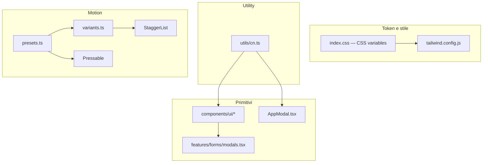
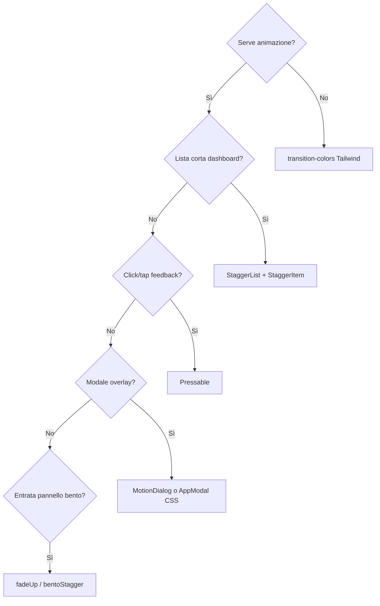

# Capitolo 5 — Sviluppare UI consistenti: Tailwind, componenti e Framer Motion

> **Obiettivo:** UI **pulita e croccante** — stessi token, stessi primitivi, micro-interazioni misurate.  
> Un Mid-Level non reinventa il bottone; compone ciò che esiste in `components/ui/` e `motion/`.

---

## Mappa del design system JEINS



| Cartella | Cosa ci metti |
|----------|----------------|
| 📁 `index.css` | token colore (`--surface`, `--ink`, …), classi `.card`, `.icon-btn` |
| 📁 `components/ui/` | Button, Input, Card, Modal, … — **riusabili** |
| 📁 `components/AppModal.tsx` | shell modale usata dalle Page CRUD |
| 📁 `features/forms/modals.tsx` | form dominio (cliente, progetto, …) |
| 📁 `motion/presets.ts` + `variants.ts` | tempi e varianti Framer **uniche** |
| 📁 `components/motion/` | wrapper (`StaggerList`, `Pressable`, `MotionDialog`) |

---

## 1. Token Tailwind — non inventare colori

📁 `gestionale-app/src/index.css`

```css
:root {
  --surface:        250 252 251;
  --ink:            12 20 16;
  --ink-muted:      55 72 64;
  --line:           214 226 220;
}
```

In JSX usa le classi mappate in Tailwind:

| Token | Classi tipiche |
|-------|----------------|
| Sfondo app | `bg-surface` |
| Testo | `text-ink`, `text-ink-muted`, `text-ink-subtle` |
| Bordi | `border-line`, `border-line/60` |
| Pannelli | `bg-surface-raised`, `card`, `bento-panel` |
| Errore | `text-rose-400` (messaggi API) |

❌ **Junior:** `style={{ backgroundColor: '#1a1a1a' }}` o `bg-gray-800` a caso.  
✅ **Mid-Level:** token JEINS → tema chiaro/scuro coerente senza duplicare palette.

---

## 2. `cn.ts` — classi dinamiche senza pasticci

📁 `gestionale-app/src/utils/cn.ts`

```ts
import { type ClassValue, clsx } from 'clsx';
import { twMerge } from 'tailwind-merge';

export function cn(...inputs: ClassValue[]) {
  return twMerge(clsx(inputs));
}
```

| Libreria | Ruolo |
|----------|--------|
| `clsx` | condizioni: `isActive && 'bg-primary-600'` |
| `tailwind-merge` | risolve conflitti: `p-4` + `p-2` → resta `p-2` |

### Junior vs Mid-Level

❌ **Junior — stringhe concatenate:**

```tsx
className={
  'px-4 py-2 rounded ' +
  (isActive ? 'bg-green-600 ' : 'bg-gray-200 ') +
  (disabled ? 'opacity-50 ' : '')
}
// Tailwind: ordine imprevedibile, p-4 e p-2 insieme, classi morte
```

✅ **Mid-Level — come nei componenti base:**

```tsx
import { cn } from '../../utils/cn';

<div
  className={cn(
    'flex items-center gap-2 rounded-xl border border-line/60',
    isActive && 'bg-surface-inset shadow-soft',
    disabled && 'opacity-50 pointer-events-none',
    className, // override dal chiamante
  )}
/>
```

**Regola:** ogni componente UI accetta `className?` e lo passa **ultimo** a `cn()` per estensioni locali senza forkare il file.

---

## 3. Riutilizzo obbligatorio — `components/ui/`

📁 Barrel: `components/ui/index.ts` — importa da lì quando possibile.

```tsx
import { Button, Card, Input, EmptyState } from '../components/ui';
```

### 3.1 Vietato riscrivere da zero

| Non fare | Usa invece |
|----------|------------|
| `<button className="...">` custom ovunque | `Button` / `IconButton` / `Pressable` |
| Overlay + pannello copiato | `AppModal` o `Modal` / `MotionDialog` |
| `<input className="border...">` ripetuto | `Input` + `FormField` |
| Tabella HTML grezza in ogni Page | `DataTable` se adatto |
| Spinner CSS homemade | `Button isLoading` o `Loading` |

### 3.2 `Button` — pattern canonico

📁 `components/ui/Button.tsx`

```tsx
<Button
  variant="primary"
  size="md"
  isLoading={create.isPending}
  disabled={!isValid}
  onClick={handleSubmit}
>
  Salva
</Button>
```

Varianti: `primary` | `secondary` | `ghost` | `danger` | `outline`.  
Stati loading e `disabled` sono **già** nel componente.

### 3.3 `Card` — dashboard e widget

```tsx
<Card title="Attività recenti" variant="panel" padding="md">
  <ActivityFeed />
</Card>
```

Varianti: `default` | `panel` | `outlined` | `filled` | `elevated`.  
Per bento dashboard: `variant="panel"` + classi `bento-panel` da `index.css`.

### 3.4 Modali — tre livelli (scegli quello giusto)

| Componente | Quando | Motion |
|------------|--------|--------|
| **`AppModal`** | Form CRUD nelle Page (`ClientsPage`, …) | CSS `animate-fade-in` + `.card` |
| **`Modal`** (`ui/Modal.tsx`) | Titolo, footer, focus trap, ESC — flussi complessi | CSS transition |
| **`MotionDialog`** | Overlay con `scaleIn` + `AnimatePresence` | Framer |

✅ **Mid-Level — Page (pattern reale):**

```tsx
<AppModal isOpen={addOpen} onClose={() => setAddOpen(false)}>
  <AddClientForm onSubmit={async data => { await create.mutateAsync(data); setAddOpen(false); }} />
</AppModal>
```

❌ **Junior:** nuovo `fixed inset-0 z-50` in ogni Page con z-index diverso e senza `aria-label` sulla X.

📁 Form dominio: `features/forms/modals.tsx` — **contenuto** del modale, non il guscio.

### 3.5 Form — composizione

```tsx
import { Input } from '../components/ui/Input';
import { Button } from '../components/ui/Button';

<Input label="Nome cliente" error={errors.name} fullWidth value={name} onChange={...} />
<Button type="submit" variant="primary" fullWidth isLoading={saving}>Salva</Button>
```

La Page tiene `isOpen`; il form non fa fetch ([Capitolo 7](./cap07-frontend-pages-hooks-ui.md)).

---

## 4. Micro-interazioni — standard JEINS

Filosofia da 📁 `motion/presets.ts`:

> *Tactile, minimal, consistent.*

Niente “circo” di animazioni; feedback **breve** e **prevedibile**.

### 4.1 Token motion (`presets.ts`)

```ts
export const DURATION = { instant: 0.12, fast: 0.18, normal: 0.28, slow: 0.42 };
export const STAGGER = { tight: 0.04, normal: 0.06, relaxed: 0.08 };
export const SPRING = {
  snap: { stiffness: 480, damping: 34, mass: 0.8 },  // bottoni, toggle
  panel: { stiffness: 320, damping: 30, mass: 0.9 }, // pannelli
  soft: { stiffness: 260, damping: 28, mass: 1 },    // enfasi / drag
};
```

**Non** copiare numeri magici in ogni file: importa da `presets.ts`.

### 4.2 Varianti (`variants.ts`)

| Variante | Uso |
|----------|-----|
| `fadeUp` | celle bento che entrano (`BentoCell`) |
| `fade` | backdrop modale |
| `scaleIn` | pannello modale (`MotionDialog`) |
| `listStagger` + `listItem` | liste (`StaggerList` / `StaggerItem`) |
| `bentoStagger` | griglia dashboard |
| `dropdown` | menu a comparsa |

Esempio dichiarativo:

```ts
export const fadeUp: Variants = {
  hidden: { opacity: 0, y: 8 },
  show: { opacity: 1, y: 0, transition: { duration: DURATION.normal, ease: EASE_OUT } },
};
```

❌ **Junior:** `animate={{ y: 50, opacity: 0 }}` con `transition: { duration: 2 }}` su ogni riga.  
✅ **Mid-Level:** variante condivisa + `useReducedMotion`.

### 4.3 `useReducedMotion` — obbligatorio

📁 `motion/useReducedMotion.ts` — rispetta `prefers-reduced-motion: reduce`.

`StaggerList` e `Pressable` **degradano** a `<div>` / `<button>` senza animazione.  
Ogni nuovo wrapper motion deve fare lo stesso.

---

## 5. `StaggerList` — liste che “respirano”

📁 `components/motion/StaggerList.tsx`

**Quando usarlo:**

- Liste **dashboard** con 5–20 voci (attività, timesheet) dove un fade sequenziale aiuta orientamento.
- **Non** su tabelle dati enormi (100+ righe) — costo DOM + motion inutile.

✅ **Mid-Level — da `ActivityFeed.tsx`:**

```tsx
import { StaggerList, StaggerItem } from '../motion/StaggerList';

<StaggerList className="space-y-4 max-h-[min(64vh,40rem)] overflow-y-auto">
  {items.map(item => (
    <StaggerItem key={item.id}>
      <ActivityRow item={item} />
    </StaggerItem>
  ))}
</StaggerList>
```

Regola: **figli diretti** di `StaggerList` devono essere `StaggerItem` (o `motion` con `variants={listItem}`).

❌ **Junior:** animare ogni `<tr>` di una DataTable con stagger → scroll lag.

---

## 6. `Pressable` — feedback tattile

📁 `components/motion/Pressable.tsx`

```tsx
/** Tactile press — subtle scale, no bounce circus. */
whileHover={{ scale: 1.01 }}
whileTap={{ scale: 0.98 }}
transition={SPRING.snap}
```

**Quando usarlo:**

- Icon rail, chip interattivi, card-clickable leggere.
- Sostituto di `motion.button` scritto a mano.

**Quando NON usarlo:**

- Azioni primarie form → `Button` (ha già stati hover/active CSS).
- Elementi non-button (usa `motion.div` + variant se serve).

📁 `IconRail.tsx` usa `SPRING` da presets per transizioni layout — stesso linguaggio motion.

❌ **Junior:** `whileTap={{ scale: 0.8, rotate: 5 }}` su ogni icona.  
✅ **Mid-Level:** scale 0.98–1.01, spring `snap`.

---

## 7. Decision tree animazioni



| Priorità | Azione |
|----------|--------|
| 1 | Preferisci CSS (`transition`, `animate-fade-in` in `index.css`) |
| 2 | Framer solo dove il team ha già wrapper |
| 3 | Mai animare layout che cambia spesso (altezza lista infinita) |

---

## 8. Junior vs Mid-Level — checklist PR UI

- [ ] Nessun hex / gray Tailwind random — solo token JEINS  
- [ ] `cn()` per classi condizionali  
- [ ] `Button` / `Input` / `Card` / `AppModal` riusati  
- [ ] Form in `features/forms/`, guscio modale standard  
- [ ] Motion da `presets` / `variants`, non numeri inline  
- [ ] `useReducedMotion` rispettato su nuovi wrapper  
- [ ] `StaggerList` solo liste corte; no stagger su tabelle massive  
- [ ] Focus visibile (`:focus-visible` in `index.css`) non rimosso  
- [ ] Modali nuove o form in modale: **tab order** (campi → azioni), ESC/chiusura coerente con `AppModal`/`Modal` — stessi criteri in [Cap. 9 — DoD PR](./cap09-pr-review-testing.md#91-definition-of-done-mid-level)

**Accessibilità minima JEINS:** non serve WCAG audit completo su ogni PR; serve che un utente da tastiera possa aprire la modale, compilare e chiudere senza trappole di focus.

---

## 9. Riferimenti

| Argomento | File |
|-----------|------|
| Teoria design system | [frontend Cap. 7](../frontend/07-design-system-e-componenti.md) |
| Page / View | [Capitolo 7](./cap07-frontend-pages-hooks-ui.md) |

---

*Capitolo 5 — v1 — UI JEINS — maggio 2026*
