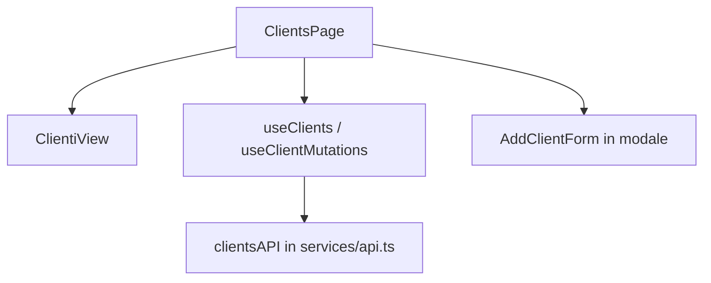

# Capitolo 7 — Frontend: Page, View, hooks (appendice)

> **A chi serve:** hai letto [Capitolo 1](./cap01-metodo-jeins-feature-end-to-end.md) e [Capitolo 2](./cap02-uccidere-useeffect-react-query.md) e ti serve un **promemoria** su come organizzare file React senza mischiare fetch e JSX.  
> **Teoria approfondita (trade-off Page/View):** [frontend Cap. 5](../frontend/05-pages-views-e-features.md)

---

## 7.1 Perché separare Page, View, Form e Hook

**Problema del neofita:** un solo file da 800 righe che fa tutto — fetch, permessi, tabella, modale, validazione. Diventa impossibile da revieware e da testare.

**Soluzione JEINS:** ogni file ha **un compito**. La Page è il “regista”; la View è il “palco”; l’hook è la “memoria dei dati remoti”.

| Layer | File esempio | Cosa ci metti | Cosa **non** ci metti |
|-------|--------------|---------------|------------------------|
| **Page** | `pages/ClientsPage.tsx` | `useClients()`, stato modali (`addOpen`), `useConflictUpdate`, `RequirePermission` locale, passaggio props alla View | 400 righe di markup tabella |
| **View** | `views/ClientiView.tsx` | Layout, tabella, bottoni che chiamano `onEdit(id)` | `fetch`, `useQuery`, `clientsAPI` |
| **Form** | `features/forms/modals.tsx` | Campi, validazione form, submit → callback `onSubmit` | Chiamate API dirette (la Page passa `mutate`) |
| **Hook dati** | `features/data/hooks.ts` | `useQuery` / `useMutation`, `queryKeys`, `invalidate` | JSX |



**Regola pratica:** se importi `clientsAPI` dentro una View, la review ti chiederà di spostare la chiamata nella Page o nell’hook.

---

## 7.2 Page — orchestrazione (esempio commentato)

❌ **Junior — anti-pattern:**

```tsx
export function ClientsPage() {
  const [clients, setClients] = useState([]);
  useEffect(() => {
    fetch('/api/clients').then(r => r.json()).then(setClients);
  }, []);
  return (
    <div>{/* tabella + modale + permessi tutto insieme */}</div>
  );
}
```

**Perché è sbagliato:** niente cache condivisa, niente refresh token, niente stati loading/error standard, impossibile riusare la lista altrove.

✅ **Mid-Level — `ClientsPage.tsx` (semplificato, come nel repo):**

```tsx
export function ClientsPage() {
    // 1) Dati remoti: SOLO tramite hook React Query
    const { data: clients = [], isLoading, error } = useClients();
    const { create, updateStatus, remove } = useClientMutations();

    // 2) Stato SOLO UI locale (modale aperta/chiusa, riga in edit)
    const [addOpen, setAddOpen] = useState(false);

    // 3) Stati obbligatori prima del render principale
    if (isLoading) return <p className="text-ink-muted">Caricamento clienti…</p>;
    if (error) return <p className="text-rose-400">{(error as Error).message}</p>;

    // 4) View “stupida”: riceve dati e callback
    return (
        <>
            <ClientiView
                clients={clients}
                onUpdateStatus={(id, status) => updateStatus.mutate({ id, status })}
                onOpenAdd={() => setAddOpen(true)}
            />
            <AppModal isOpen={addOpen} onClose={() => setAddOpen(false)}>
                <AddClientForm onSubmit={data => create.mutateAsync(data).then(() => setAddOpen(false))} />
            </AppModal>
        </>
    );
}
```

**Cosa imparare:** `useState` per la **lista clienti** non serve più — quella lista vive in React Query.

---

## 7.3 View — solo presentazione

La View espone un’interfaccia TypeScript chiara: cosa serve per disegnare, quali eventi espone al genitore.

```tsx
interface ClientiViewProps {
    clients: Client[];
    onEdit: (c: Client) => void;
    onDelete: (id: string) => void;
    onOpenAdd?: () => void;  // opzionale se il permesso non c’è
}
```

| Domanda | Risposta corretta |
|---------|-------------------|
| La View può chiamare `useClients()`? | **No** — duplichi fetch e cache |
| La View può nascondere un bottone se `onDelete` è `undefined`? | **Sì** — pattern `onDelete={canDelete ? handleDelete : undefined}` |
| La View decide il permesso RBAC? | **No** — la Page calcola `resolvePermissions` e passa callback o null |

---

## 7.4 Routing e permessi sulla route

📁 `gestionale-app/src/app/router.tsx`

**Passi per una nuova pagina `/foo`:**

1. Crea `pages/FooPage.tsx` e `views/FooView.tsx`.
2. Aggiungi route lazy:

```tsx
const FooPage = lazy(() => import('../pages/FooPage'));

<Route path="foo" element={
  <Guard perm="viewFoo">  {/* RequirePermission wrapper */}
    <FooPage />
  </Guard>
} />
```

3. Aggiungi voce menu in `IconRail` (o sidebar) con lo stesso `perm` — vedi [Capitolo 4](./cap04-auth-rbac-blindare-feature.md).

❌ **Junior:** pagina raggiungibile digitando URL ma voce menu nascosta → **buco UX e sicurezza percepita**.

❌ **Junior:** solo menu nascosto, route senza `Guard` → utente malintenzionato apre `/foo` comunque (la UI non basta).

---

## 7.5 Nuova pagina — checklist completa (ordine consigliato)

1. **Backend** pronto (Cap. 1) — altrimenti la Page non ha dati reali.
2. `types/models.ts` — interfaccia `Foo`.
3. `services/api.ts` — `fooAPI.getAll`, `create`, …
4. `lib/query/keys.ts` — `queryKeys.foo`.
5. `features/data/hooks.ts` (o `features/foo/hooks.ts` se dominio grande — vedi [Cap. 8 §8.5](./cap08-react-query-chiavi-cache.md#85-quando-estrarre-hook-di-dominio)).
6. `pages/FooPage.tsx` + `views/FooView.tsx`.
7. `router.tsx` + menu + permessi ([Cap. 4](./cap04-auth-rbac-blindare-feature.md)).
8. Stili da [Capitolo 5](./cap05-ui-design-system-tailwind-motion.md) — `Button`, `AppModal`, token Tailwind.

---

## 7.6 Stili — non inventare CSS ad hoc

- Token: `text-ink-muted`, `bg-surface`, `border-line` — definiti in `index.css` / `tailwind.config.js`.
- Componenti: import da `components/ui/` (`Button`, `Input`, `Card`).
- Classi condizionali: `cn()` da `utils/cn.ts`.

❌ **Junior:** `style={{ color: 'red' }}` su ogni errore — rompe tema chiaro/scuro e review.

---

*Capitolo 7 — v3 — appendice frontend esaustiva*
