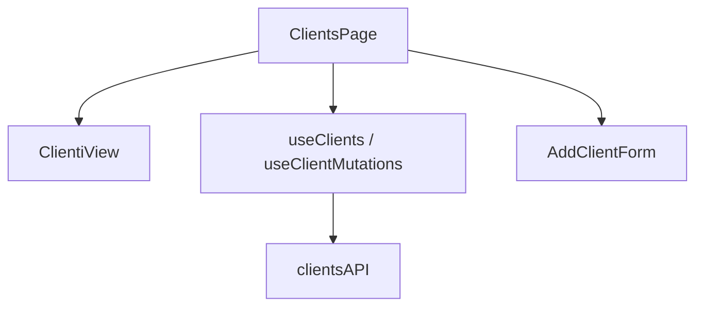

# Capitolo 7 — Frontend: Page, View, hooks (appendice)

> **Riferimento:** [frontend Cap. 5](../frontend/05-pages-views-e-features.md)

---

## 4.1 Separazione obbligatoria

| Layer | File esempio | Responsabilità |
|-------|--------------|----------------|
| **Page** | `pages/ClientsPage.tsx` | hook, stato modali, mutate, permessi locali |
| **View** | `views/ClientiView.tsx` | layout, tabelle, callback `onEdit` |
| **Form** | `features/forms/modals.tsx` | campi, validazione form |
| **Hook dati** | `features/data/hooks.ts` | React Query |



---

## 4.2 Junior vs Mid-Level — Page

❌ Junior — tutto in un file da 800 righe:

```tsx
export function ClientsPage() {
  const [clients, setClients] = useState([]);
  useEffect(() => { fetch('/api/clients').then(r => r.json()).then(setClients); }, []);
  return (
    <div>
      {/* 400 righe JSX + fetch inline */}
    </div>
  );
}
```

✅ Mid-Level — `ClientsPage.tsx` reale (semplificato):

```tsx
export function ClientsPage() {
    const { data: clients = [], isLoading, error } = useClients();
    const { create, updateStatus, remove } = useClientMutations();
    if (isLoading) return <p className="text-ink-muted">Caricamento clienti…</p>;
    if (error) return <p className="text-rose-400">{(error as Error).message}</p>;
    return (
        <ClientiView
            clients={clients}
            onUpdateStatus={(id, status) => updateStatus.mutate({ id, status })}
            onOpenAdd={() => setAddOpen(true)}
        />
    );
}
```

---

## 4.3 Junior vs Mid-Level — View

❌ Junior: `import { clientsAPI }` dentro la View.

✅ Mid-Level: la View **non** importa API; riceve solo dati e callback.

```tsx
interface ClientiViewProps {
    clients: Client[];
    onEdit: (c: Client) => void;
    onDelete: (id: string) => void;
}
```

---

## 4.4 Routing

📁 `app/router.tsx`

- Route lazy: `lazy(() => import('../pages/...'))`  
- Wrap con `<RequirePermission perm="viewClients">`  
- Layout: `AuthenticatedLayout` + `AppShell`

❌ Junior: nuova pagina senza `RequirePermission` → buco sicurezza UI. Vedi [Capitolo 4](./cap04-auth-rbac-blindare-feature.md).

---

## 4.5 Nuova pagina — passi

1. Crea `pages/FooPage.tsx` (pattern `ClientsPage`)  
2. Crea `views/FooView.tsx` (solo UI)  
3. Aggiungi route in `router.tsx` + voce menu in `IconRail` / sidebar se serve  
4. Hook + API ([Capitolo 2](./cap02-uccidere-useeffect-react-query.md))

---

## 4.6 Stili

- Usa token Tailwind del tema (`text-ink-muted`, `bg-surface`, …) — vedi `index.css` / `design-system/`  
- Componi da `components/ui/` — [Capitolo 5](./cap05-ui-design-system-tailwind-motion.md)  
- `cn()` da `utils/cn.ts` per classi condizionali

❌ Junior: `style={{ color: 'red' }}` inline ovunque.

---

*Capitolo 7 — v2*
