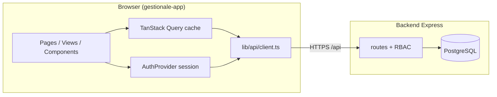
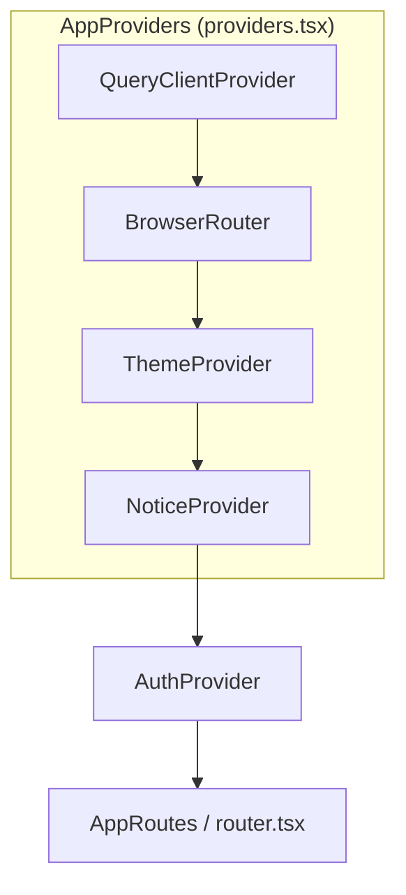
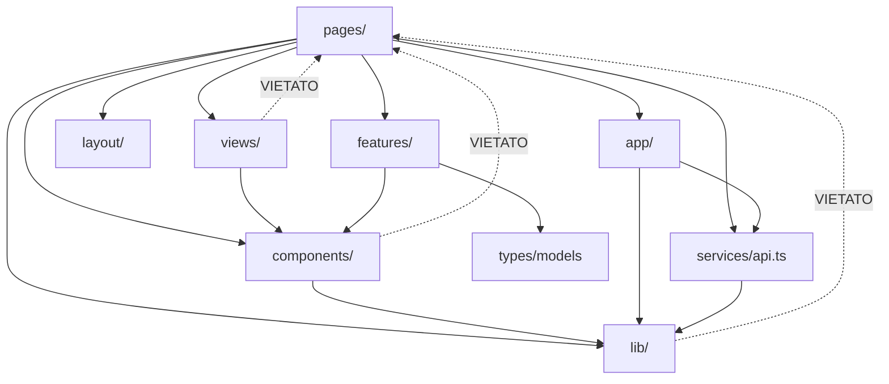
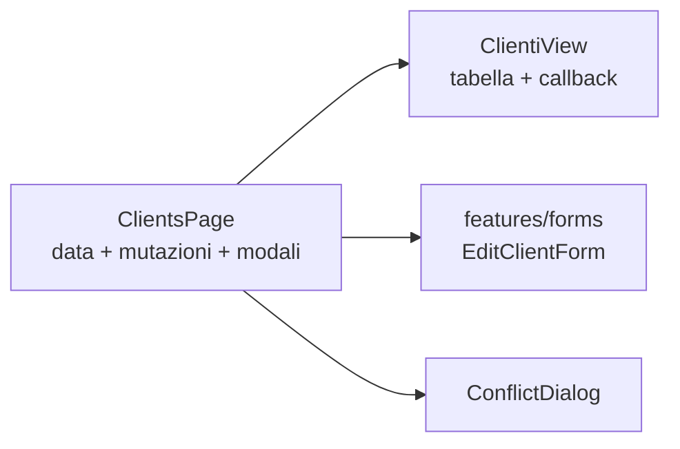
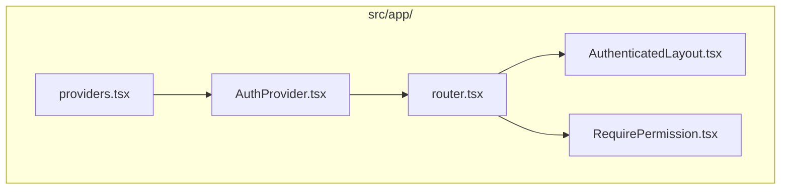
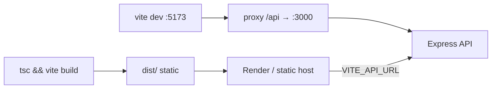
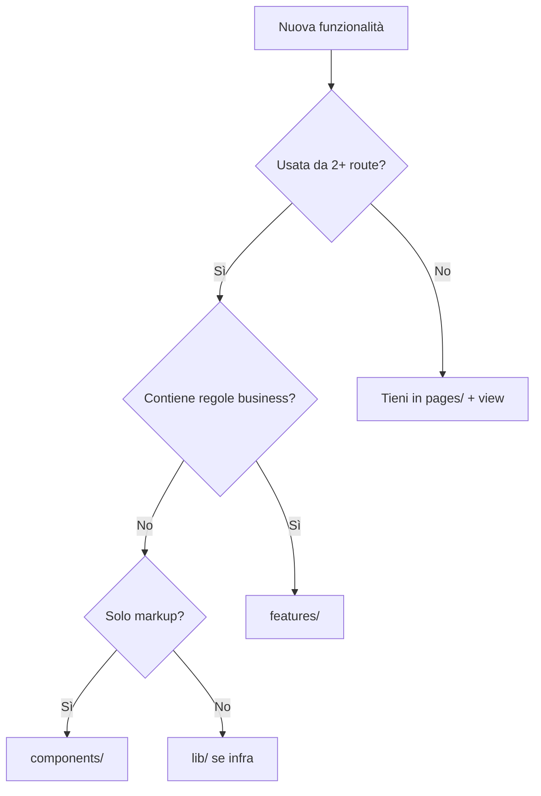
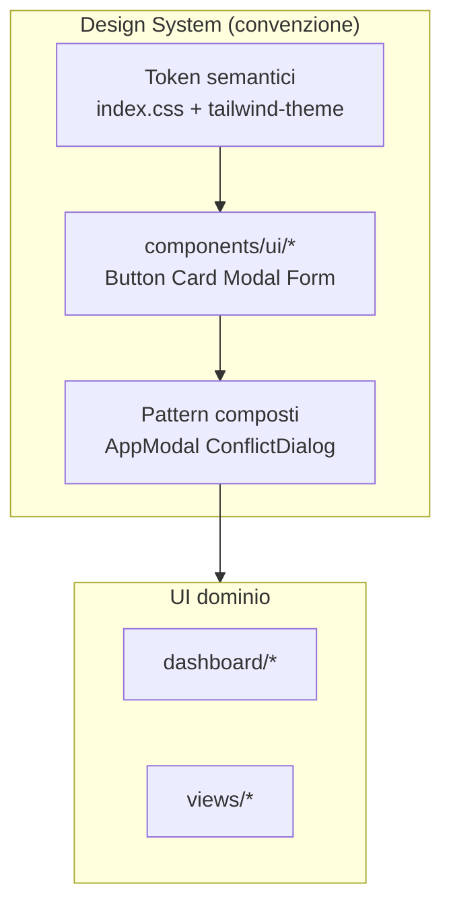

# Capitolo 1 — Architettura di base e scelte tecnologiche

📄 **Modulo 1** · `gestionale-app/`  
**Prerequisito:** saper leggere JSX/TS; non serve padroneggiare ogni hook React.  
**Obiettivo del capitolo:** capire *perché* il frontend è organizzato così, cosa succede se ignori le convenzioni, e come evitare che il codice diventi legacy incomprensibile dopo il tuo passaggio.

---

## 1.1 Visione architetturale

### Il problema che stiamo risolvendo

Il Gestionale JEINS non è un sito vetrina: è una **SPA amministrativa B2B** usata da persone con **ruoli diversi** (Socio, management, Tesoreria, area Commerciale) su **gli stessi dati** (clienti, progetti, contratti, calendario, task). Il frontend deve:

1. **Riflettere i permessi** senza affidarsi solo alla “buona volontà” dell’API (la UI nasconde; il backend blocca).
2. **Gestire stato remoto condiviso** con invalidazione coerente dopo le mutazioni.
3. **Sopravvivere a modifiche concorrenti** (versioning ottimistico → `409` → dialog di merge).
4. **Restare deployabile** come static assets dietro un API Express separato (Render: frontend static + backend Node).

> **Concetto chiave — Bounded context sul client**  
> Il browser non è “il database”. È una **superficie di orchestrazione**: composizione UI, cache, sessione, feedback errore. La source of truth dei dati resta PostgreSQL; la source of truth della *navigazione* è l’URL; la source of truth della *sessione* è il backend (cookie + refresh).

### Confini del sistema



| Dentro scope frontend | Fuori scope frontend |
|----------------------|---------------------|
| Layout, routing, permessi UI | Regole RBAC definitive (`backend/lib/roles.js`) |
| Cache e refetch dati | Migrazioni schema |
| Form, modali, Kanban, calendario | Email, job notturni, integrazioni esterne |
| Mock **solo** in development | Generazione PDF fatture lato server |

### Stile architetturale attuale

**SPA modulare a layer**, non micro-frontend, non design system pubblicato su npm.

- **Un solo bundle deployabile** (`dist/`) con **code splitting per route** (`React.lazy`).
- **Nessun SSR**: tutti gli utenti sono autenticati; SEO non è requisito.
- **Stato remoto centralizzato** in TanStack Query; **nessun Redux/Zustand globale** per i dati API.

> **Perché questo stile oggi è razionale**  
> Team piccolo, dominio coeso, deploy già spezzato FE/BE. Micro-frontend o monorepo Turborepo aggiungono complessità operativa senza risolvere un dolore attuale. La leva corretta è **confini di cartella e dipendenze unidirezionali**, non più repository.

### Segnali d’allarme (legacy in arrivo)

- Nuova pagina che chiama `fetch` direttamente invece di `apiCall` + Query.
- Logica “se ruolo === Socio” sparsa in 15 componenti invece di `resolvePermissions`.
- Componente da 400 righe che mescola tabella + API + modale + permessi.
- Import da `pages/` verso `pages/` (accoppiamento orizzontale).

---

## 1.2 Stack e motivazioni

### Stack effettivo

| Layer | Scelta | Ruolo nel progetto |
|-------|--------|-------------------|
| Runtime UI | **React 19** | Component model, concurrent features, ecosystem |
| Linguaggio | **TypeScript** (~5.9) | Contratti tra UI e `types/models.ts` |
| Build | **Vite 7** | Dev server veloce, bundle ESM, proxy `/api` |
| Routing | **React Router 7** | URL, layout annidati, lazy routes |
| Server state | **TanStack Query v5** | Cache, dedup, invalidazione, mutazioni |
| Styling | **Tailwind CSS 3** + token in `index.css` | Utility + semantica (`ink`, `surface`) |
| Motion | **Framer Motion 12** | Transizioni shell; sempre con `useReducedMotion` |
| DnD | **@dnd-kit** | Kanban dashboard |
| Icone | **lucide-react** | Set coerente, tree-shakeable |
| Test | **Vitest** + **Playwright** | Unit client HTTP; smoke E2E |

### Dal concetto al codice: Inversion of Control (IoC)

**Teoria:** non chiami tu il framework a ogni click; registri capacità (provider, router, query client) e il runtime le risolve.

**Pratica nel nostro stack:**

```tsx
// gestionale-app/src/main.tsx — un solo mount
createRoot(document.getElementById('app')!).render(
    <StrictMode>
        <App />
    </StrictMode>,
);
```

```tsx
// gestionale-app/src/App.tsx — composizione, non logica di business
export default function App() {
    return (
        <AppProviders>
            <AuthProvider>
                <AppRoutes />
            </AuthProvider>
        </AppProviders>
    );
}
```

`App.tsx` ha **tre righe di responsabilità**: avvolgere provider globali, sessione, routing. Se domani aggiungi analytics o i18n, li agganci qui — non in `ClientsPage.tsx`.

### Confronto: alternative scartate

| Alternativa | Attrattiva | Perché non l’abbiamo presa |
|-------------|-----------|---------------------------|
| **Next.js (App Router)** | SSR, RSC, file-based routing | App 100% dietro login; nessun SEO; API già su Express; duplicazione confini auth |
| **Redux / Zustand globale** | Stato prevedibile | 80% dello stato è **server state**; Query + `AuthProvider` bastano |
| **CSS Modules / styled-components** | Scope locale | Tailwind già adottato; team velocity su utility + token |
| **Monorepo UI package** | Design system riusabile | Un solo consumer (`gestionale-app`); costo publish/versioning non ripaga |
| **tRPC / GraphQL** | Tipi end-to-end | Backend REST già maturo; migrazione costosa |

> **Trade-off accettato**  
> REST + Query + tipi manuali in `models.ts` = **duplicazione schema** rispetto a tRPC. Lo paghiamo in refactor quando l’API cambia. Lo guadagniamo in **allineamento immediato** con il backend esistente e onboarding più lineare.

### Albero provider (ordine importa)



```tsx
// gestionale-app/src/app/providers.tsx
export function AppProviders({ children }: { children: ReactNode }) {
    return (
        <QueryClientProvider client={queryClient}>
            <BrowserRouter>
                <ThemeProvider>
                    <NoticeProvider>{children}</NoticeProvider>
                </ThemeProvider>
            </BrowserRouter>
        </QueryClientProvider>
    );
}
```

| Ordine | Motivo |
|--------|--------|
| Query **sopra** Router | Hook `useQuery` / `useMutation` disponibili in layout e pagine route |
| Router **sopra** Theme | `useNavigate`, `useLocation` ovunque sotto route |
| Auth **sotto** provider infrastrutturali | `AuthProvider` usa router + API; non wrappa Query |

**Errore classico:** mettere `AuthProvider` fuori da `BrowserRouter` e usare `useNavigate` nel login → runtime error.

---

## 1.3 Layering e regole di dipendenza

### Teoria: separazione per velocità di cambiamento

Le cartelle non sono “tipi di file”, sono **velocità di cambiamento**:

| Layer | Cambia quando… | Esempio |
|-------|----------------|---------|
| `lib/` | Cambia infrastruttura (HTTP, permessi, query keys) | `client.ts`, `permissions.ts` |
| `services/` | Cambia contratto REST | `api.ts` |
| `features/` | Cambia regola di business riusabile | `forms/modals.tsx` |
| `views/` | Cambia presentazione lista/scheda | `ClientiView.tsx` |
| `pages/` | Cambia wiring pagina (query + modali) | `ClientsPage.tsx` |
| `components/` | Cambia UI riusabile | `ui/Card.tsx`, `ConflictDialog` |

### Grafo dipendenze consentito



> **Regola d’oro**  
> `lib/` e `components/ui/` **non importano mai** da `pages/` o `views/`. Se succede, hai invertito la dipendenza e il riuso diventa impossibile.

### Pattern Page → View (destrutturazione senior)

**Problema complesso:** “schermata clienti con modifica, conflitti, eliminazione, permessi”.

**Decomposizione:**



| Pezzo | Responsabilità | Non deve |
|-------|----------------|----------|
| `ClientsPage` | `useClients`, `useClientMutations`, `useConflictUpdate`, stato modale | Renderizzare 200 righe di `<table>` |
| `ClientiView` | UI tabella, pulsanti, `onEdit(id)` | Chiamare `clientsAPI` |
| `EditClientForm` | Campi + `onSubmit(data)` | Sapere cos’è un 409 |

> **State colocation (teoria → pratica)**  
> **Teoria:** tieni lo stato il più vicino possibile a dove serve per cambiare la UI.  
> **Pratica:** `editClient` vive in `ClientsPage`, non in `AppShell`. La lista clienti in Query cache è **server state** (non in `useState`). Il form ha solo stato **draft** locale finché non submit.

### `services/api.ts` — façade, non “il dominio”

```ts
// Pattern: un oggetto per risorsa REST
export const clientsAPI = {
    getAll: () => apiCall('/api/clients'),
    update: (id: string, client: any) =>
        apiCall(`/api/clients/${id}`, { method: 'PUT', body: JSON.stringify(client) }),
};
```

**Perché una façade:**

- Un solo posto per cambiare path quando il backend versiona `/api/v2`.
- `apiCall` applica auth, refresh, mock, errori 409 **una volta**.

**Limite noto:** molti parametri sono ancora `any` — debito documentato; il Capitolo 11 tratta il piano di restringimento tipi.

---

## 1.4 Boundary `app/` — composizione root

La cartella `src/app/` è il **composition root** dell’applicazione React:

| File | Ruolo |
|------|--------|
| `providers.tsx` | Infrastruttura globale (Query, Router, Theme, Notice) |
| `AuthProvider.tsx` | Sessione utente, bootstrap, logout |
| `router.tsx` | Route tree, lazy loading, `RequirePermission` |
| `AuthenticatedLayout.tsx` | Shell autenticata, `Outlet`, utility views |
| `RequirePermission.tsx` | Guard capability-based |



**Perché non tutto in `App.tsx`?**

- `App.tsx` resta leggibile in 10 secondi per chi entra nel repo domani.
- `router.tsx` può crescere (nuove route) senza toccare il mount dei provider.
- Test e review: diff separati per “nuova route” vs “nuovo provider”.

> **Anti-pattern da evitare**  
> Mettere fetch clienti in `AuthProvider` “perché tanto c’è l’utente”. Il provider di sessione **ingrossa** e ogni logout/login invalida mentalmente mezzo app. Tieni Auth **magro**.

---

## 1.5 Build, ambienti e configurazione

### Pipeline mentale: da `npm run dev` a produzione



### Vite proxy e cookie di sessione

```ts
// gestionale-app/vite.config.ts
proxy: {
    '/api': {
        target: process.env.VITE_API_PROXY || 'http://localhost:3000',
        changeOrigin: true,
    },
},
```

| Ambiente | Chiamate API | Motivo |
|----------|--------------|--------|
| **Dev** | Same-origin `http://localhost:5173/api/...` | Cookie `httpOnly` inviati correttamente; niente CORS preflight su ogni form |
| **Prod** | `VITE_API_URL` assoluto (es. `https://api.tuodominio.it`) | Frontend su dominio statico diverso |

> **Trade-off cookie vs Bearer-only**  
> **Cookie httpOnly:** meno esposti a XSS che ruba token da `localStorage`. **Costo:** deploy e CORS devono essere coordinati con il backend (`FRONTEND_URL`, `credentials: 'include'`). Manteniamo anche `localStorage.token` come fallback legacy — da ridurre nel tempo, non da duplicare in nuove feature.

### Query client — defaults come policy di prodotto

```ts
// gestionale-app/src/lib/query/client.ts
export const queryClient = new QueryClient({
    defaultOptions: {
        queries: {
            staleTime: 30_000,
            retry: 1,
            refetchOnWindowFocus: import.meta.env.PROD,
        },
        mutations: { retry: 0 },
    },
});
```

| Opzione | Scelta | Effetto |
|---------|--------|---------|
| `staleTime: 30s` | Dati “freschi enough” per gestionale interno | Meno rifetch nervosi navigando tra tab |
| `refetchOnWindowFocus` solo in prod | Dev meno rumoroso | Utente in prod vede dati aggiornati tornando sulla tab |
| `mutations retry: 0` | PUT/POST non idempotenti | Eviti doppia creazione cliente su rete flaky |

### Variabili ambiente

| Variabile | Dove | Segreto? |
|-----------|------|----------|
| `VITE_API_URL` | Build prod | No — pubblica nel bundle |
| `VITE_API_PROXY` | Dev locale | No |
| `import.meta.env.PROD` | Branch mock, admin panel | No |

**Mai** mettere chiavi private nel prefisso `VITE_`: finiscono nel JavaScript scaricato dall’utente.

---

## 1.6 Strategia di modularizzazione futura

### Quando creare `features/nuovo-dominio/`

Segnali **tutti** veri:

1. Almeno **due pagine** usano la stessa logica (form + validazione + mapping API).
2. La logica non è “solo UI” (es. conflict update, permessi, mapping status).
3. Puoi descrivere il modulo in una frase senza dire “React”.

**Esempio già maturo:** `features/forms/modals.tsx` + `features/data/hooks.ts`.

### Quando restare in `components/`

- UI senza regola di business (Card, Badge, layout grid).
- Widget usato ovunque ma **senza** dipendenza da `services/api`.

### Quando **non** estrarre ancora

- Una sola pagina usa il codice → tienilo nella page finché non c’è il secondo consumer.
- Estrarre “per bellezza” crea cartelle con un file → indirection senza beneficio.



### Gerarchia Design System (alto livello)

Non abbiamo Storybook; abbiamo **convenzione + primitivi**.



| Livello | Modificabile da junior? | Review richiesta |
|---------|----------------------|------------------|
| Token (`ink`, `surface`) | Raramente | Senior — impatto globale |
| `components/ui/*` | Con attenzione | Senior se nuova API props |
| `views/` / `pages/` | Sì | Standard PR |

---

## Sintesi: cosa devi portarti via

| Domanda | Risposta corta |
|---------|----------------|
| Che architettura è? | SPA React + Vite, API REST separata, stato remoto in Query |
| Dove metto codice nuovo? | Page wiring → View presentazione → Feature se riuso business |
| Dove **non** metto fetch? | View, `ui/`, `lib/` |
| Perché non Next/Redux? | Nessun SSR; server state già risolto da Query |
| Cosa rovina il progetto? | Dipendenze invertite, provider obesi, permessi sparsi |

---

## Esercizio (30 minuti)

1. Apri `gestionale-app/src/pages/ClientsPage.tsx` e disegna su carta (o Excalidraw) le frecce: quali hook, quali figli, quali API.
2. Elenca **tre import** che violerebbero il grafo del §1.3 (es. `ClientiView` che importa `ClientsPage`).
3. Scrivi un paragrafo: *“Perché TanStack Query invece di `useEffect` + `useState` per la lista clienti?”* — massimo 8 righe, argomenti da cache/invalidazione/dedup.

**Criterio di superamento:** il paragrafo menziona almeno **invalidazione dopo mutazione** e **single source of truth** senza usare la parola “meglio”.

---

## Prossimo capitolo

→ **Modulo 2 — Routing, layout e esperienza applicativa** (`02-routing-layout-e-esperienza.md`, da redigere)

---

## Riferimenti rapidi

| Argomento | File |
|-----------|------|
| Indice manuale | `walkthrough/frontend/00-INDICE.md` |
| RBAC | `docs/RBAC.md` |
| Deploy / monorepo | `ARCHITETTURA.md` |
| Manuale backend (parallelo) | `walkthrough/BACKEND/00-INDICE.md` |
