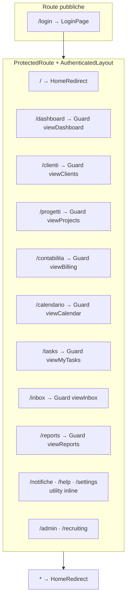
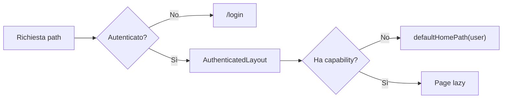
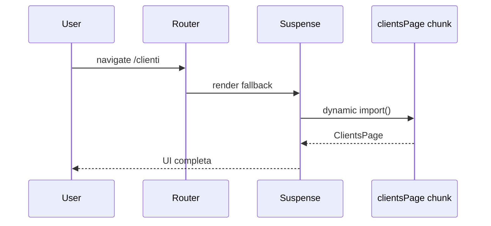
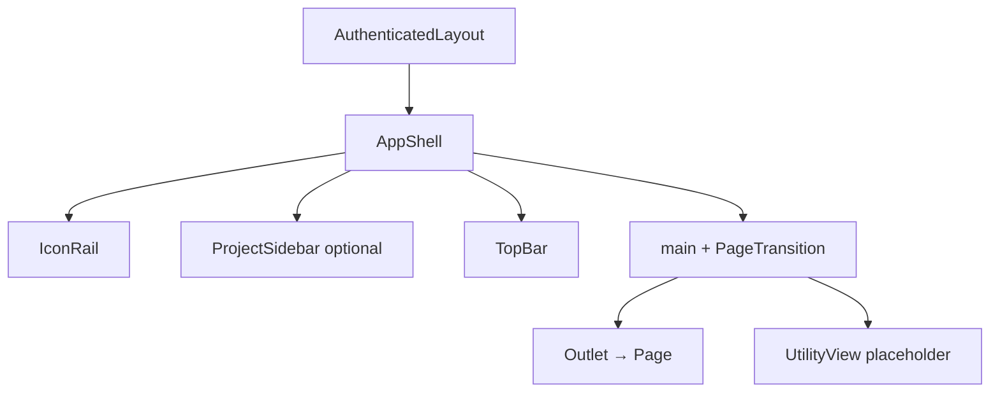
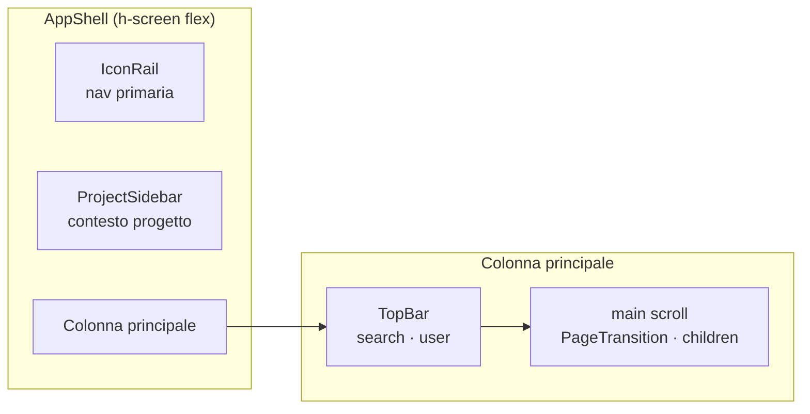
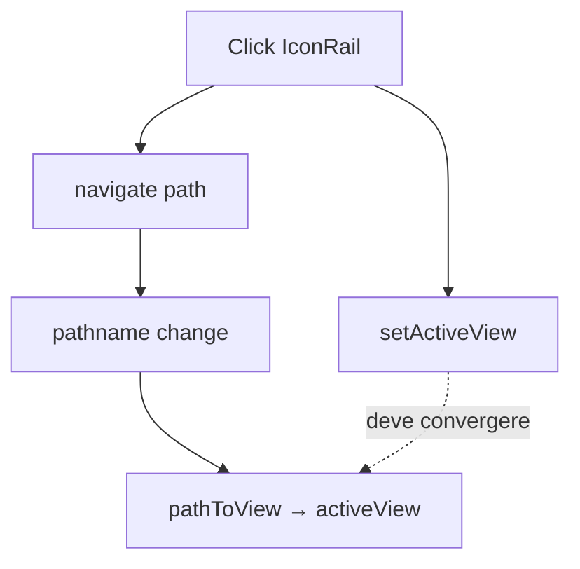
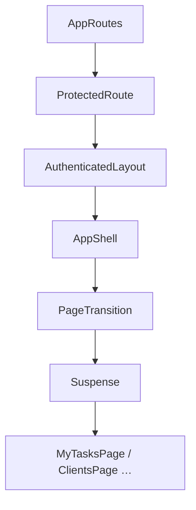

# Capitolo 2 — Routing, layout e esperienza applicativa

📄 **Modulo 2** · `gestionale-app/`  
**Prerequisito:** [Capitolo 1 — Architettura di base](./01-architettura-base-e-scelte-tecnologiche.md)  
**Obiettivo:** capire come l’utente *naviga*, come l’albero React *resta stabile* tra le pagine, e perché abbiamo **due meccanismi** (URL + shell) senza considerarlo debito tecnico da “sistemare un giorno”.

---

## 2.1 React Router 7 come sistema di navigazione

### Teoria: URL come source of truth della navigazione

In un’app amministrativa, la navigazione non è decorazione. Determina:

- **cosa può essere linkato** (bookmark, refresh, “indietro” del browser);
- **cosa viene montato** (quale page, quali hook, quali query);
- **cosa resta in cache** (layout parent, Query cache, progetto attivo in sidebar).

> **Concetto chiave — Declarative routing**  
> Dichiari *quali UI* corrispondono a *quali path*. Il router risolve il match e monta l’albero. Non tieni un `switch (screen)` manuale in `App.tsx` che cresce all’infinito.

### Albero route reale del progetto



Snippet di composizione (non lista completa — mostra il **pattern**):

```tsx
// gestionale-app/src/app/router.tsx
<Route element={<ProtectedRoute><AuthenticatedLayout /></ProtectedRoute>}>
    <Route index element={<HomeRedirect />} />
    <Route path="dashboard" element={
        <Guard perm="viewDashboard"><Lazy><DashboardPage /></Lazy></Guard>
    } />
    {/* … altre route con Guard + Lazy … */}
</Route>
```

### Perché layout route annidato (`AuthenticatedLayout`)

| Approccio | Pro | Contro |
|-----------|-----|--------|
| **Layout route** (scelta attuale) | Shell (rail, sidebar, topbar) **non si smonta** tra `/clienti` e `/progetti` | Layout deve restare “magro” |
| Ogni page include `<AppShell>` | Flessibile per pagine one-off | Duplicazione; stato shell perso al cambio pagina |
| Router senza layout + stato globale | Meno nesting | Progetto attivo / titolo / menu devono vivere in store globale |

> **Problema che previene a lungo termine**  
> Senza layout route, ogni sviluppatore re-importa la shell nella propria page e **re-fetcha** progetti utente a ogni click. Il layout annidato è **composition root della sessione autenticata**.

### `ProtectedRoute` vs `RequirePermission` — due guard, due domande



| Guard | Domanda | File |
|-------|---------|------|
| `ProtectedRoute` | “C’è una sessione valida?” | `router.tsx` |
| `RequirePermission` (`Guard`) | “Questa route è nel perimetro del ruolo?” | `RequirePermission.tsx` |

```tsx
// RequirePermission — redirect, non pagina errore vuota
if (!permissions[perm]) {
    return <Navigate to={defaultHomePath(user)} replace />;
}
```

**Perché redirect e non `<Forbidden />`:** per un gestionale interno, l’utente Socio che digita `/clienti` deve finire su **`/tasks`** (la sua home), non su uno schermo morto. Il backend comunque risponde `403` se qualcuno forza l’API.

### Alternative scartate

| Pattern | Perché non adottato |
|---------|---------------------|
| **Tab-only SPA** (nessun URL) | Refresh perde contesto; link impossibili |
| **Hash routing** (`#/clienti`) | URL brutti; meno necessario con static host moderno |
| **Next.js parallel routes** | Stack Vite SPA; backend separato |

---

## 2.2 Code splitting e lazy loading

### Teoria: caricare codice in proporzione all’intento

Un bundle unico con dashboard + Kanban + calendario + admin panel punisce **ogni** login, anche se l’utente Socio userà solo `MyTasks` + calendario.

### Pattern nel repo

```tsx
const ClientsPage = lazy(() =>
    import('../pages/ClientsPage').then(m => ({ default: m.ClientsPage }))
);

function Lazy({ children }: { children: React.ReactNode }) {
    return <Suspense fallback={<PageFallback />}>{children}</Suspense>;
}
```



| Scelta | Trade-off |
|--------|-----------|
| `lazy` per **pagine** | Chunk per dominio; primo click leggermente più lento |
| `LoginPage` **non** lazy | Primo paint login veloce; entry critica |
| `Suspense` per route, non globale | Fallback localizzato; evita blank screen totale |

> **Waterfall da evitare**  
> Non annidare `lazy` dentro `lazy` senza motivo. Non mettere fetch pesanti nel `fallback`. Se `/dashboard` sembra lenta, controlla **quantità di fetch in `DashboardView`** (Capitolo 4), non solo la dimensione del chunk.

### Named export + `.then(m => ({ default: m.X }))`

Le pages esportano **named** (`export function ClientsPage`). `React.lazy` vuole `default`. Il adapter nel `import()` è intenzionale: evita di convertire tutte le pages a `export default` solo per il router.

---

## 2.3 `AuthenticatedLayout` — orchestrazione della shell

### Responsabilità unica (destrutturazione senior)

**Problema:** “L’utente autenticato vede sempre rail, titolo, progetto attivo, e il contenuto già cambia per sezione.”

**Pezzi:**

| Pezzo | File | Fa |
|-------|------|-----|
| Orchestratore | `AuthenticatedLayout.tsx` | Deriva `activeView`, titolo, utility vs outlet |
| Shell visiva | `AppShell.tsx` | Composizione colonne |
| Contenuto | `Outlet` → `*Page.tsx` | Dominio |



### Dual outlet: pagine reali vs utility

Tre route (`notifiche`, `help`, `settings`) non hanno ancora una `*Page` dedicata. Il layout intercetta `activeView` e renderizza `UtilityView` **al posto** dell’`Outlet`:

```tsx
{utilityOutlet ?? <Outlet context={{ activeProjectId, user }} />}
```

| Strategia | Pro | Contro |
|-----------|-----|--------|
| **Utility inline nel layout** (attuale) | UX coerente subito; zero route vuote visibili | Layout conosce troppi “pseudo-moduli” |
| Route → `NotifichePage` vuota | Separazione pulita | Più file finché non c’è feature |

> **Regola per chi estende**  
> Se la sezione avrà API e stato propri, crea `pages/NotifichePage.tsx` e rimuovi il case da `utilityOutlet`. Il layout non deve diventare un secondo router.

### `Outlet` context — condivisione senza prop drilling globale

```tsx
// AuthenticatedLayout passa contesto
<Outlet context={{ activeProjectId, user }} />

// DashboardPage consuma
const { activeProjectId, user } = useOutletContext<{ ... }>();
```

**Teoria — State colocation + lifting minimo:**  
`activeProjectId` serve a **dashboard** e widget collegati al progetto selezionato in sidebar. Vive nel layout perché la **sidebar** è fratello dell’outlet, non antenato della page in un albero profondo.

**Limite:** solo le page sotto quell’`Outlet` possono leggere il context. Non usarlo come bus globale per clienti o contratti.

### Fetch progetti nel layout

```tsx
const { data: projects = [] } = useProjects({ enabled: permissions.viewProjects });
```

| Perché qui | Perché non in ogni page |
|------------|------------------------|
| Sidebar progetti è nel layout | Eviti N query duplicate |
| Socio senza `viewProjects` → `enabled: false` | Nessuna chiamata inutile / 403 |

---

## 2.4 `AppShell` — modello a tre colonne

### Information architecture



| Zona | Scopo cognitivo | Cambia tra route? |
|------|-----------------|-------------------|
| **IconRail** | “In quale modulo sono?” (clienti, task, …) | Evidenzia `activeView` |
| **ProjectSidebar** | “Su quale progetto sto lavorando?” (dashboard/kanban) | Stato `activeProjectId` |
| **TopBar** | Orientamento + azioni globali | Titolo da `VIEW_TITLES` |
| **main** | Lavoro vero | `Outlet` / utility |

### `showProjectSidebar` — layout adattivo al ruolo

```tsx
showProjectSidebar={permissions.viewProjects}
```

Un Socio **non** vede la colonna progetti: meno rumore, meno fetch. La shell non è monolitica — è **parametrica** rispetto alle capability (Capitolo 3 approfondisce i permessi).

> **Anti-pattern**  
> Nascondere la sidebar con `display: none` in CSS ma lasciare `useProjects()` attivo nella page figlia. Se non serve UI, disabilita la **query** (`enabled: false`), non solo il pixel.

---

## 2.5 Navigazione ibrida: URL + `activeView`

### Il problema invisibile

Abbiamo **due rappresentazioni** della “sezione corrente”:

1. **`location.pathname`** — source of truth del router (`/clienti`)
2. **`activeView`** — stringa derivata (`clienti`) per rail, titolo, switch utility

```tsx
function pathToView(pathname: string): string {
    const segment = pathname.replace(/^\//, '').split('/')[0] || 'dashboard';
    return segment === '' ? 'dashboard' : segment;
}
```

```tsx
// IconRail — doppio passo intenzionale
const go = (viewId: string) => {
    setActiveView(viewId);           // aggiorna shell immediata
    const path = VIEW_PATHS[viewId] || `/${viewId}`;
    if (location.pathname !== path) navigate(path);
};
```



### Perché non solo URL o solo stato?

| Solo URL | Solo `useState('activeView')` |
|----------|-------------------------------|
| Refresh/back corretti | Refresh **perde** sezione |
| Deep link nativi | Impossibile linkare `/clienti` |
| | Back browser incoerente |

**Ibrido attuale:** click menu chiama `setActiveView` **e** `navigate` — riduce flicker percepito su titolo/rail mentre il chunk lazy carica.

### Mappa `VIEW_PATHS` — contratto da mantenere

```tsx
const VIEW_PATHS: Record<string, string> = {
    clienti: '/clienti',
    dashboard: '/dashboard',
    // …
};
```

**Debito operativo:** aggiungi route in `router.tsx` **e** voce in `VIEW_PATHS` **e** item in `TOP_ITEMS` (IconRail) **e** voce in `VIEW_TITLES` (layout). Quattro punti — non è elegante, è **esplicito**. Un checklist in PR evita voci menu che non navigano.

> **Refactor futuro (non urgente)**  
> Derivare menu e titoli da un unico array `NAV_ITEMS: { id, path, title, perm }[]` generato una volta. Finché non lo fai, **non** inventare un quinto posto dove registrare la stessa voce.

---

## 2.6 Transizioni, motion e percezione performance

### `PageTransition` — remount controllato

```tsx
// gestionale-app/src/components/layout/PageTransition.tsx
export function PageTransition({ children }: { children: ReactNode }) {
    const { pathname } = useLocation();
    return (
        <div key={pathname} className="page-enter min-h-0">
            {children}
        </div>
    );
}
```

`key={pathname}` forza React a **smontare** il sotto-albero al cambio route → animazione CSS `page-enter` riparte.

| Pro | Contro |
|-----|--------|
| Transizione visiva chiara tra sezioni | Stato **locale** nella page si perde al cambio path (di solito desiderato) |
| Nessuna libreria motion sul main content | Remount può rieseguire effect in mount se non usi Query |

### Motion sulla rail (`layoutId`)

`IconRail` usa Framer `layoutId="rail-active"` per il pill attivo — **shared layout animation** dentro `LayoutGroup`.

```tsx
const reduced = useReducedMotion();
// … motion.span solo se !reduced
```

**Teoria — Progressive enhancement:**  
La navigazione deve funzionare **senza** animazione. `useReducedMotion` rispetta `prefers-reduced-motion` e preferenze utente.

### Albero di rendering semplificato (navigazione `/clienti` → `/tasks`)



Lo **shell branch** resta montato; cambia il sotto-albero sotto `Suspense` + `key` pathname.

---

## 2.7 Home per ruolo e route catch-all

```tsx
function HomeRedirect() {
    const { user } = useAuth();
    return <Navigate to={defaultHomePath(user)} replace />;
}
```

| Ruolo | Home | Motivo prodotto |
|-------|------|-----------------|
| Socio | `/tasks` | Unica area lavoro + scadenze |
| Management | `/dashboard` | Panoramica operativa |

`path="*"` ripete `HomeRedirect` — URL sconosciuti non lasciano schermo bianco.

---

## Sintesi — decisioni da difendere in review

| Decisione | Non è negoziabile perché… |
|-----------|---------------------------|
| Layout route autenticato | Shell e stato sidebar una volta sola |
| Lazy per pages | Bundle proporzionale al ruolo/percorso |
| Guard auth + guard perm | Superficie UI allineata al backend |
| URL + `activeView` sincronizzati | Link + menu + utility switch |
| Utility nel layout (temporaneo) | UX finché non esistono vere pages |
| `Outlet` context per `activeProjectId` | Accoppiamento dashboard ↔ sidebar |

---

## Segnali d’allarme (legacy in arrivo)

- Nuova voce menu senza route in `router.tsx`.
- Page che importa `AppShell` e bypassa `AuthenticatedLayout`.
- `navigate` solo da bottone interno senza aggiornare `activeView` (rail desincronizzata).
- Route sensibile senza `Guard perm="…"`.
- Layout che importa `clientsAPI` — sta diventando un “god component”.

---

## Esercizio (45 minuti)

1. **Traccia il percorso** di un click su “Clienti” nella rail: elenca file e funzioni in ordine (minimo 8 step).
2. **Proponi** un array unico `NAV_ITEMS` (tipo TypeScript) che sostituisca `VIEW_PATHS`, `TOP_ITEMS` e `VIEW_TITLES` — solo schema, non serve implementare.
3. Rispondi: *“Perché `DashboardPage` usa `useOutletContext` invece di props da `AuthenticatedLayout`?”* — massimo 6 righe.

**Criterio di superamento:** la risposta (3) menziona **posizione nell’albero** (layout vs page) e **accoppiamento stretto** con sidebar, non “perché è più comodo”.

---

## Prossimo capitolo

→ **Modulo 3 — Autenticazione, sessione e autorizzazione UI** (`03-autenticazione-sessione-e-permessi-ui.md`, da redigere)

---

## Riferimenti rapidi

| Argomento | File |
|-----------|------|
| Route tree | `gestionale-app/src/app/router.tsx` |
| Layout autenticato | `gestionale-app/src/app/AuthenticatedLayout.tsx` |
| Shell | `gestionale-app/src/layout/AppShell.tsx` |
| Nav primaria | `gestionale-app/src/layout/IconRail.tsx` |
| Guard capability | `gestionale-app/src/app/RequirePermission.tsx` |
| Home per ruolo | `gestionale-app/src/lib/permissions.ts` → `defaultHomePath` |
| Capitolo precedente | `walkthrough/frontend/01-architettura-base-e-scelte-tecnologiche.md` |
