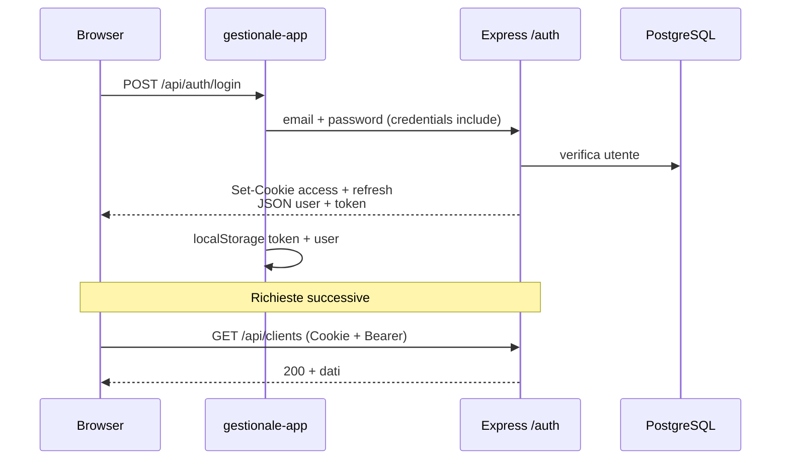
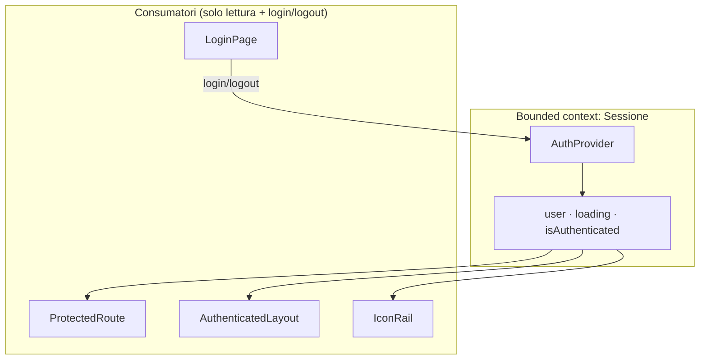
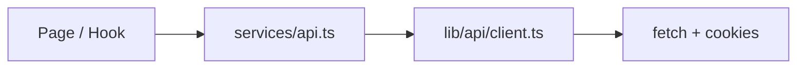
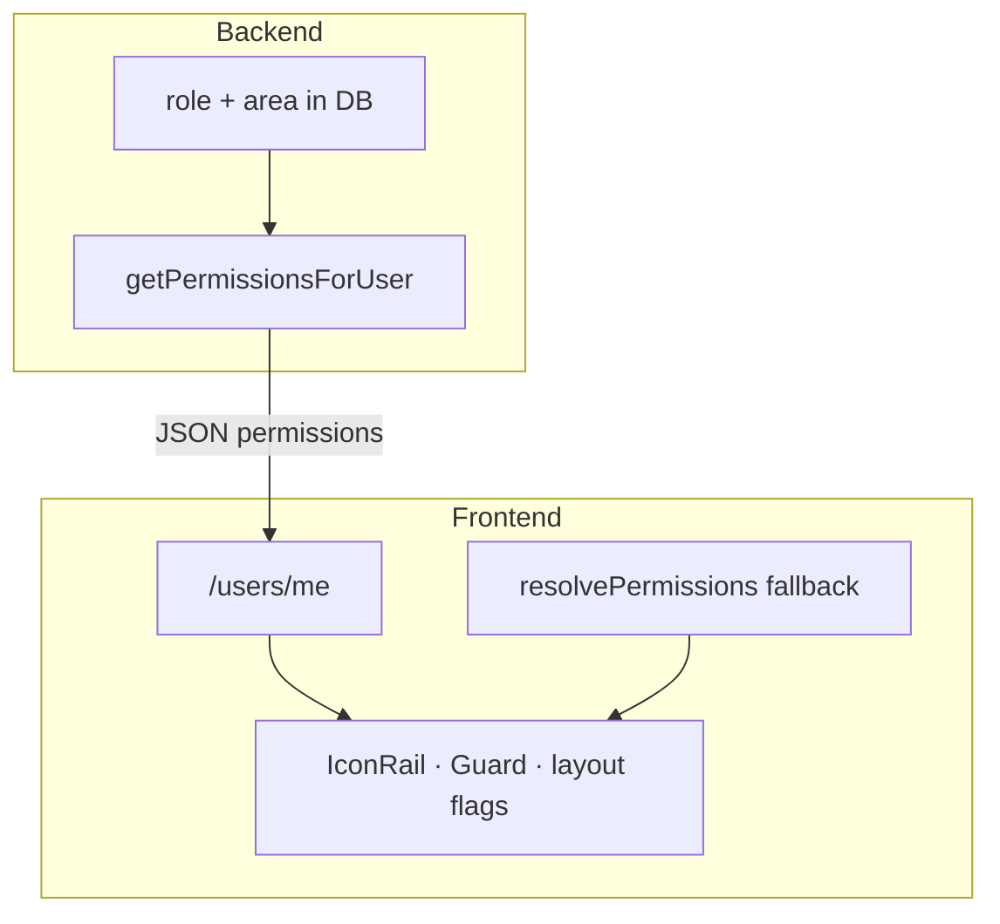
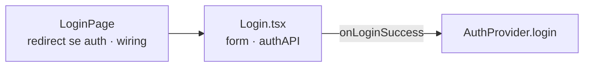
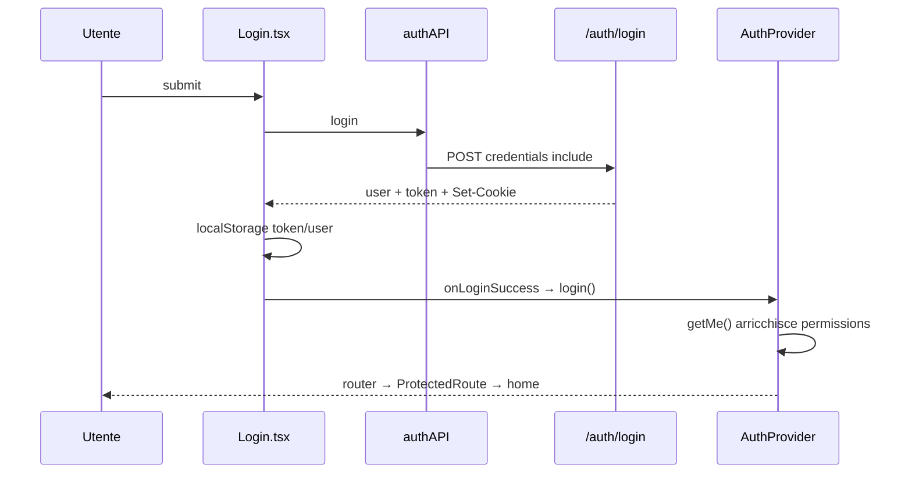

# Capitolo 3 — Autenticazione, sessione e autorizzazione UI

📄 **Modulo 3** · `gestionale-app/` + contratto con `backend/`  
**Prerequisito:** [Capitolo 2 — Routing e layout](./02-routing-layout-e-esperienza-applicativa.md)  
**Obiettivo:** capire come l’app **sa chi sei**, come **recupera la sessione** senza login continuo, e come **mostra solo ciò che ti compete** — senza confondere “UI carina” con “sicurezza”.

---

## 3.1 Modello di sessione

### Teoria: autenticazione ≠ autorizzazione

| Concetto | Domanda | Dove vive |
|----------|---------|-----------|
| **Autenticazione** | *Chi sei?* | Cookie, JWT, `AuthProvider` |
| **Autorizzazione** | *Cosa puoi fare?* | `user.permissions`, route `Guard`, API `403` |

> **Regola che devi incollare alla scrivania**  
> Il frontend che nasconde un bottone **non** sostituisce il backend. La UI evita errori e confusione; **PostgreSQL + middleware** sono l’arbitro finale.

### Architettura sessione nel nostro stack

Usiamo un modello **ibrido** voluto (transizione, non confusione):

1. **Cookie `httpOnly`** (`access_token`, `refresh_token`) — impostati dal backend al login.
2. **Bearer token** in `Authorization` — letto da `localStorage.token` per compatibilità e strumenti dev.
3. **`credentials: 'include'`** su ogni `fetch` — il browser invia i cookie su richieste same-site / CORS configurato.



Backend — emissione cookie:

```js
// backend/routes/auth.js — sendAuthSuccess
setAuthCookies(res, accessToken, refreshToken);
res.json({ user: toPublicUser(user), token: accessToken });
```

```js
// backend/lib/authCookies.js
const baseCookie = {
    httpOnly: true,
    secure: isProduction,
    sameSite: isProduction ? 'none' : 'lax',
    path: '/',
};
```

| Meccanismo | Pro | Contro / rischio |
|------------|-----|------------------|
| **Cookie httpOnly** | Non leggibile da `document.cookie` → meno esposto a XSS che ruba sessione | Richiede proxy dev (`vite` → `:3000`) e `FRONTEND_URL` in prod |
| **Bearer in localStorage** | Facile da debuggare; funziona se cookie bloccati in test | **Vulnerabile a XSS** se qualcuno inietta script nella pagina |
| **Doppio canale** | Rollout graduale; Postman/curl con header | Due fonti di verità da tenere sincronizzate |

> **Direzione a lungo termine**  
> Cookie come canale primario; `localStorage.token` come **legacy** da ridurre (non aggiungere nuove feature che dipendono solo dal Bearer). Ogni nuovo endpoint deve funzionare con **solo cookie** in prod.

### Ciclo di vita: bootstrap, refresh, logout

```mermaid
flowchart TD
    Start[App mount]
    V[GET /api/auth/verify]
    OK{200?}
    R[POST /api/auth/refresh]
    ROK{200?}
    User[setUser + /users/me]
    Clear[clearAuthSession]
    Login[/login]

    Start --> V
    V -->|Sì| User
    V -->|No| R
    R -->|Sì| User
    R -->|No| Clear --> Login

    subgraph apiCall["Durante navigazione"]
        API[apiCall 401/403]
        API --> TryRef[tryRefreshSession]
        TryRef -->|OK| Retry[retry request]
        TryRef -->|Fail| Evict[auth:unauthorized → /login]
    end
```

**Bootstrap** (`AuthProvider` al mount):

```tsx
// Flusso semplificato
await authAPI.verify();          // access cookie o Bearer
// fallisce →
await authAPI.refresh();         // refresh cookie
// fallisce →
clearAuthSession(); setUser(null);
```

**Refresh silenzioso** (`apiCall` su 401/403):

```ts
// gestionale-app/src/lib/api/client.ts
if (!retried && !endpoint.includes('/api/auth/login')) {
    const refreshed = await tryRefreshSession();
    if (refreshed) return apiCall(endpoint, options, fetchMock, true);
    notifyUnauthorized();
}
```

| Evento | Chi reagisce | Effetto UX |
|--------|--------------|------------|
| Access scaduto, refresh valido | `apiCall` | Utente non vede login |
| Refresh assente/scaduto | `notifyUnauthorized` | Redirect login |
| Logout esplicito | `authAPI.logout` + `clearAuthCookies` BE | Sessione chiusa entrambi i lati |

### Perché non “solo JWT in memoria” (React state)

| Solo memoria | Cookie + refresh |
|--------------|------------------|
| Perso al refresh F5 se non riscrivi da storage | Cookie sopravvive al reload |
| Nessun refresh rotation standard | Access corto (15m), refresh 7d (configurabile) |
| Tutto il carico su XSS protection FE | httpOnly sposta il segreto fuori da JS |

---

## 3.2 `AuthProvider` — bounded context della sessione

### Teoria: bounded context (DDD leggero sul client)

`AuthProvider` è il **unico posto** che decide:

- se esiste un utente corrente;
- se l’app è ancora in fase di bootstrap (`loading`);
- come entrare/uscire dalla sessione (`login`, `logout`, `refreshUser`).

Tutto il resto **consuma** `useAuth()` — non duplica verify.



### API del context — contratto stretto

```tsx
interface AuthContextValue {
    user: User | null;
    isAuthenticated: boolean;
    loading: boolean;
    login: (data: User & { token?: string }) => Promise<void>;
    logout: () => Promise<void>;
    refreshUser: () => Promise<void>;
}
```

| Metodo | Fa | Non fa |
|--------|-----|--------|
| `login` | Salva token opzionale, `getMe()`, aggiorna `user` | Non naviga (lo fa il chiamante o il router) |
| `logout` | `POST /logout`, clear storage, `navigate('/login')` | Non invalida Query cache (vedi nota sotto) |
| `refreshUser` | Riallinea profilo + `permissions` da `/users/me` | Non rifà login |

> **State colocation**  
> Lo stato `user` vive nel provider perché **decine** di componenti lo leggono. Non alzarlo in un global store generico: non c’è secondo consumer che beneficia di Zustand per tre campi.

### `resolveCurrentUser` — perché verify + getMe

Dopo login/verify ricevi un `user` minimale; subito dopo chiami **`usersAPI.getMe()`** per arricchire `permissions` e campi profilo.

```tsx
async function resolveCurrentUser(fallback: User): Promise<User> {
    try {
        return await usersAPI.getMe();
    } catch {
        return fallback;
    }
}
```

**Trade-off:** una richiesta in più al bootstrap. **Beneficio:** permessi UI allineati al backend (`permissions` nel JSON) senza duplicare tutta la matrice RBAC nel FE a ogni release.

### Event bus leggero: `auth:unauthorized`

```ts
export function notifyUnauthorized(): void {
    clearAuthSession();
    window.dispatchEvent(new CustomEvent('auth:unauthorized'));
}
```

```tsx
useEffect(() => {
    const onUnauthorized = () => {
        clearAuthSession();
        setUser(null);
        navigate('/login', { replace: true });
    };
    window.addEventListener('auth:unauthorized', onUnauthorized);
    return () => window.removeEventListener('auth:unauthorized', onUnauthorized);
}, [navigate]);
```

**Perché CustomEvent e non importare `AuthProvider` da `client.ts`?**

- `lib/api/client.ts` resta **sotto** `app/` nella dipendenza mentale (infrastruttura).
- Eviti dipendenza circolare Provider ↔ apiCall.

### Cosa **non** mettere mai in `AuthProvider`

- `useClients()`, `useProjects()` — diventa un god provider.
- Logica RBAC per singola azione (`if (role === 'Socio')`) — usa `resolvePermissions`.
- Modali globali non legate alla sessione.

---

## 3.3 `lib/api/client.ts` — il client HTTP unico

### Teoria: Inversion of Control sul transport

Le pages non implementano retry, timeout, cookie, 409. Passano da **`apiCall`** (via `services/api.ts`).



### Snippet — policy di una richiesta

```ts
const config: RequestInit = {
    ...options,
    credentials: 'include',
    headers: {
        'Content-Type': 'application/json',
        ...(token && { Authorization: `Bearer ${token}` }),
        ...options.headers,
    },
};
```

| Opzione | Perché |
|---------|--------|
| `credentials: 'include'` | Cookie httpOnly inviati automaticamente |
| `Authorization` opzionale | Fallback dev / client senza cookie |
| Timeout 30s | Evita hang infiniti su backend spento |
| `retried` flag | Un solo tentativo refresh per richiesta |

### Errori tipizzati oltre 401

```ts
if (response.status === 409 && error.error === 'CONCURRENT_MODIFICATION') {
    throw new ConcurrentModificationError(error.message || 'Conflitto', error);
}
```

Il client HTTP è anche il punto dove **conflitti di dominio** escono dal transport layer verso `useConflictUpdate` (Capitolo 6).

### Mock — isolati dalla sessione

```ts
if (import.meta.env.PROD) return false;
if (endpoint?.includes('/api/auth')) return false;
```

**Mai** mockare login in prod. **Mai** bypassare auth in `apiCall` per “testare più veloce”.

### `getApiUrl()` — tre fonti

```ts
localStorage.getItem('customApiUrl') ||
import.meta.env.VITE_API_URL ||
'http://localhost:3000';
```

| Fonte | Uso |
|-------|-----|
| `customApiUrl` | Pannello dev / diagnostica |
| `VITE_API_URL` | Build produzione |
| Default localhost | Dev senza env |

In dev con proxy Vite, `VITE_API_URL` può essere **vuoto** → same-origin `/api` (vedi Capitolo 1 §1.5).

---

## 3.4 RBAC sul frontend: capability, non ruoli sparsi

### Teoria: Role-Based vs Capability-Based UI

| Approccio | Codice tipico | Manutenzione |
|-----------|---------------|--------------|
| **Role sparsi** | `user.role === 'Socio'` in 20 file | Ogni nuovo ruolo = caccia al tesoro |
| **Capability** | `permissions.viewBilling` | Matrice centralizzata; UI dichiarativa |

> **Concetto chiave — UI capability mirror**  
> Il backend espone `user.permissions` (da `getPermissionsForUser` in `backend/lib/permissions.js`). Il frontend **preferisce** quel oggetto e usa `resolvePermissions()` solo come fallback se `/me` fallisce o dati sono vecchi in cache locale.

### Matrice business (semplificata)

| Capability | Socio | Management | Tesoreria / Commerciale |
|------------|-------|------------|-------------------------|
| `viewDashboard` | No | Sì | Sì |
| `viewClients` | No | Sì | Sì (se management) |
| `viewBilling` | No | No* | Sì |
| `viewMyTasks` | Sì | Sì | Sì |
| `viewCalendar` | Sì | Sì | Sì |
| `markCallAttendance` | Sì | Sì | Sì |
| `updateOwnWork` | Sì | Sì | Sì |

\*CDA senza area Commerciale **non** vede fatturato — il fatturato non è “tutto il management”.



### Implementazione FE — single resolver

```ts
// gestionale-app/src/lib/permissions.ts
export function resolvePermissions(user: User | null | undefined): UserPermissions {
    if (user?.permissions) {
        return user.permissions as UserPermissions;
    }
    // fallback derivato da role/area — deve restare allineato a backend/lib/permissions.js
    const socio = user?.role === 'Socio';
    // ...
}
```

| Strategia | Pro | Contro |
|-----------|-----|--------|
| **Server-driven permissions** | Una fonte di verità; deploy BE aggiorna capacità | Richiede `/me` aggiornato |
| **Solo fallback FE** | Funziona offline della cache user | Drift se le regole divergono |

**Processo anti-legacy:** quando cambi regole in `backend/lib/permissions.js`, aggiorna il fallback in `lib/permissions.ts` **nello stesso PR** o rimuovi il fallback e forza errore se `permissions` manca.

### Capability vs azione nel componente

| Livello | Esempio | Quando |
|---------|---------|--------|
| **Route** | `Guard perm="viewBilling"` | Intera pagina |
| **Nav** | `TOP_ITEMS.filter(p => permissions[p.perm])` | Voce menu |
| **Azione** | `permissions.manageClients && <button>Nuovo</button>` | Singolo bottone |

> **Non fare**  
> `permissions.viewClients` per nascondere il bottone “Nuovo cliente” ma dimenticare `manageClients` — l’utente non vede la pagina ma potrebbe ancora... no, la route è guardata. Per le **azioni dentro** una pagina condivisa, usa la capability **più stretta** (`manage*` vs `view*`).

---

## 3.5 `RequirePermission` e route guards

### Due linee di difesa (Capitolo 2 + questo)

```mermaid
flowchart LR
    R[Request /clienti]
    A{Sessione?}
    B{viewClients?}
    P[ClientsPage]

    R --> A
    A -->|No| L[/login]
    A -->|Sì| B
    B -->|No| H[defaultHomePath]
    B -->|Sì| P
```

```tsx
// gestionale-app/src/app/RequirePermission.tsx
if (!permissions[perm]) {
    return <Navigate to={defaultHomePath(user)} replace />;
}
```

| Scelta | Alternativa | Perché abbiamo scelto redirect |
|--------|-------------|-------------------------------|
| Redirect a home ruolo | Pagina 403 | Utente interno, meno frustrazione; URL “proibito” non resta bookmarkabile come errore |

### `defaultHomePath` — prodotto, non tecnica

```ts
export function defaultHomePath(user: User | null | undefined): string {
    const p = resolvePermissions(user);
    return p.isSocio ? '/tasks' : '/dashboard';
}
```

Allinea **home** al perimetro lavorativo: il Socio atterra sui propri task, non su una dashboard vuota o 403.

### Guard per route vs guard per azione

| Pattern | File | Caso |
|---------|------|------|
| Route guard | `router.tsx` + `RequirePermission` | Intere sezioni (contabilità, clienti) |
| Layout flag | `AuthenticatedLayout` | `showProjectSidebar`, `useProjects({ enabled })` |
| Component guard | Page/View | Pulsante “Elimina”, modale edit |

**Regola:** se la route è già protetta, non ripetere lo stesso `Guard` in profondità — ripeti solo per **azioni** più granulari della capability della route.

---

## 3.6 Menu e superficie esposta per ruolo

### Teoria: progressive disclosure

Mostrare solo le voci rilevanti **riduce errori 403** e supporto (“il bottone non funziona”). Non è sicurezza: è **UX + allineamento mentale**.

```tsx
// gestionale-app/src/layout/IconRail.tsx
const navItems = TOP_ITEMS.filter(item => permissions[item.perm]);
```

```mermaid
flowchart TB
    User[user + permissions]
    IR[IconRail filter]
    AL[AuthenticatedLayout flags]
    RT[router Guard]

    User --> IR
    User --> AL
    User --> RT

    IR -->|voci visibili| Nav[Scadenze · Task · …]
    AL -->|no viewProjects| NoSide[sidebar progetti off]
    RT -->|viewBilling false| Block[/contabilita redirect]
```

| Superficie | Meccanismo | Socio tipico |
|------------|------------|--------------|
| IconRail | `perm` su ogni item | Task, Scadenze, Impostazioni |
| ProjectSidebar | `showProjectSidebar={permissions.viewProjects}` | Nascosta |
| `useProjects` | `enabled: permissions.viewProjects` | Query non parte |
| Home `/` | `HomeRedirect` → `/tasks` | — |

### Esercizio mentale: aggiungere ruolo “Audit”

1. Backend: `getPermissionsForUser` + eventuali route.
2. Frontend: estendi `UserPermissions` + fallback `resolvePermissions`.
3. Una voce in `TOP_ITEMS` con `perm: 'viewReports'` (o nuova capability).
4. Route in `router.tsx` con `Guard`.

Se salti il passo 2, avrai **drift** tra ciò che il menu mostra e ciò che il backend permette.

---

## 3.7 Login e superficie non autenticata

### Separazione Page / Component



| File | Responsabilità |
|------|----------------|
| `LoginPage` | `loading`, redirect se già autenticato, chiama `login()` del provider |
| `Login.tsx` | UI form, `authAPI.login/register`, errori campo |

```tsx
// Login.tsx — dopo successo API
const response = await authAPI.login(email, password);
localStorage.setItem('token', response.token);
onLoginSuccess(response.user, response.token);
```

```tsx
// LoginPage.tsx
if (isAuthenticated) return <Navigate to="/dashboard" replace />;
```

> **Debito noto da correggere**  
> `LoginPage` reindirizza sempre a `/dashboard` se già autenticato. Dovrebbe usare `defaultHomePath(user)` come `HomeRedirect` — altrimenti il Socio finisce sulla dashboard management per un attimo. Segnala in PR se tocchi il login.

### Flusso login completo



### Register e `managerCode`

Registrazione con codice opzionale → ruolo elevato lato **backend** (`resolveRegistrationRole`). Il frontend **non** invia `role` nel body: previene auto-promozione a Admin via DevTools.

---

## Sintesi — il sistema in una frase

**Cookie portano la sessione, `apiCall` la rinnova o la espelle, `AuthProvider` tiene l’identità, `permissions` disegna la UI, il backend fa rispettare tutto.**

---

## Segnali d’allarme (legacy / incidenti)

| Sintomo | Causa probabile |
|---------|----------------|
| Login OK ma subito logout | Cookie non inviati (CORS, dominio, proxy mancante) |
| 403 su tutto dopo deploy | `VITE_API_URL` errato; cookie `SameSite=None` senza HTTPS |
| Socio vede menu ma click fallisce | Solo UI filtrata, API no — verifica backend |
| Permessi “vecchi” dopo cambio ruolo | `localStorage.user` stale — serve `refreshUser()` o re-login |
| `if (role === 'CDA')` sparso | Refactor verso `permissions.*` |

---

## Checklist PR (auth & permessi)

- [ ] Nuova route sensibile ha `Guard perm="…"`?
- [ ] Azione distruttiva usa `manage*` non solo `view*`?
- [ ] Regole aggiornate in BE **e** fallback FE (o solo server-driven)?
- [ ] Nessun secret in `VITE_*`?
- [ ] Mock non tocca `/api/auth` in prod?

---

## Esercizio (45 minuti)

1. Traccia **due** percorsi su carta: (A) refresh tab con sessione valida; (B) access scaduto con refresh valido. Indica quali endpoint vengono chiamati.
2. Elenca **tutte** le capability `true` per un utente `{ role: 'Socio', area: 'Marketing' }` usando `resolvePermissions`.
3. Proponi (in testo) come fissare `LoginPage` per usare `defaultHomePath` — 5 righe max, senza implementare.

**Criterio di superamento:** nel percorso (B) compaiono `tryRefreshSession` e `retried`, non un secondo login manuale.

---

## Prossimo capitolo

→ **Modulo 4 — State management e data flow** (`04-state-management-e-data-flow.md`, da redigere)

---

## Riferimenti rapidi

| Argomento | File |
|-----------|------|
| Sessione UI | `gestionale-app/src/app/AuthProvider.tsx` |
| HTTP + refresh | `gestionale-app/src/lib/api/client.ts` |
| Permessi UI | `gestionale-app/src/lib/permissions.ts` |
| Route guard | `gestionale-app/src/app/RequirePermission.tsx` |
| Cookie BE | `backend/lib/authCookies.js`, `backend/routes/auth.js` |
| Permessi BE | `backend/lib/permissions.js`, `docs/RBAC.md` |
| Capitolo precedente | `walkthrough/frontend/02-routing-layout-e-esperienza-applicativa.md` |
