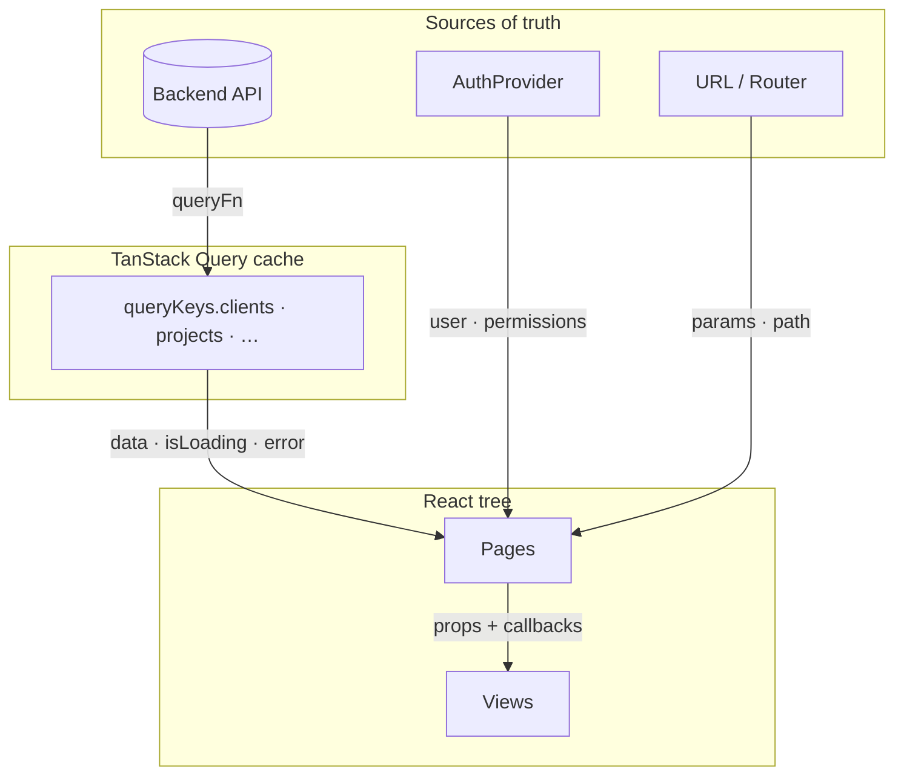
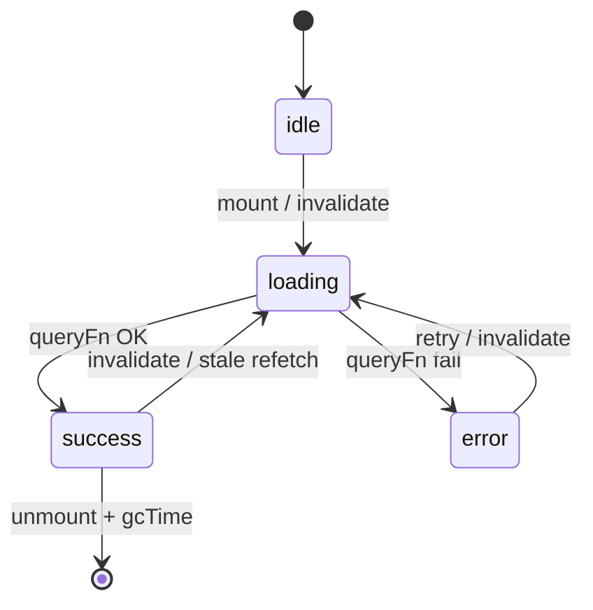
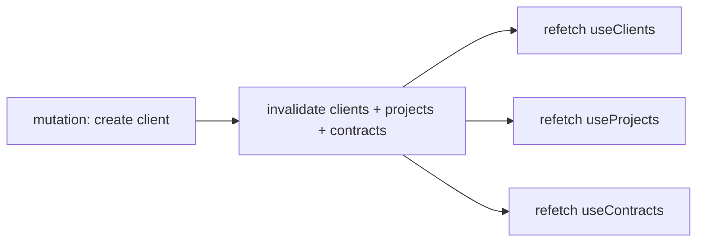
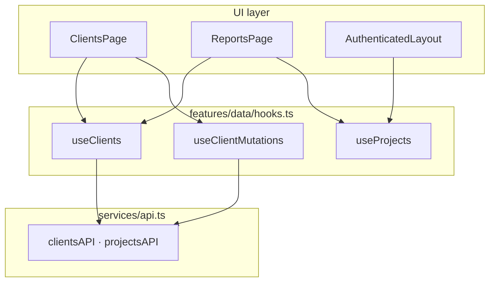
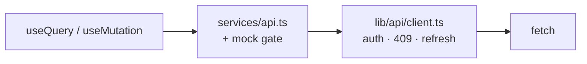
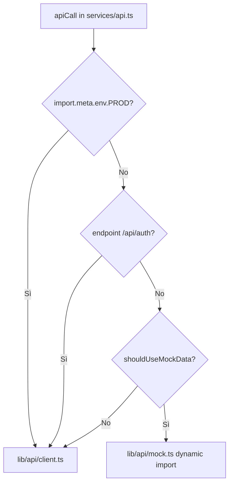
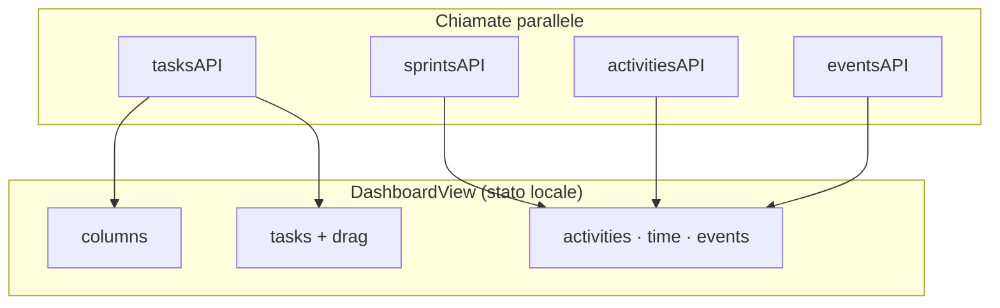
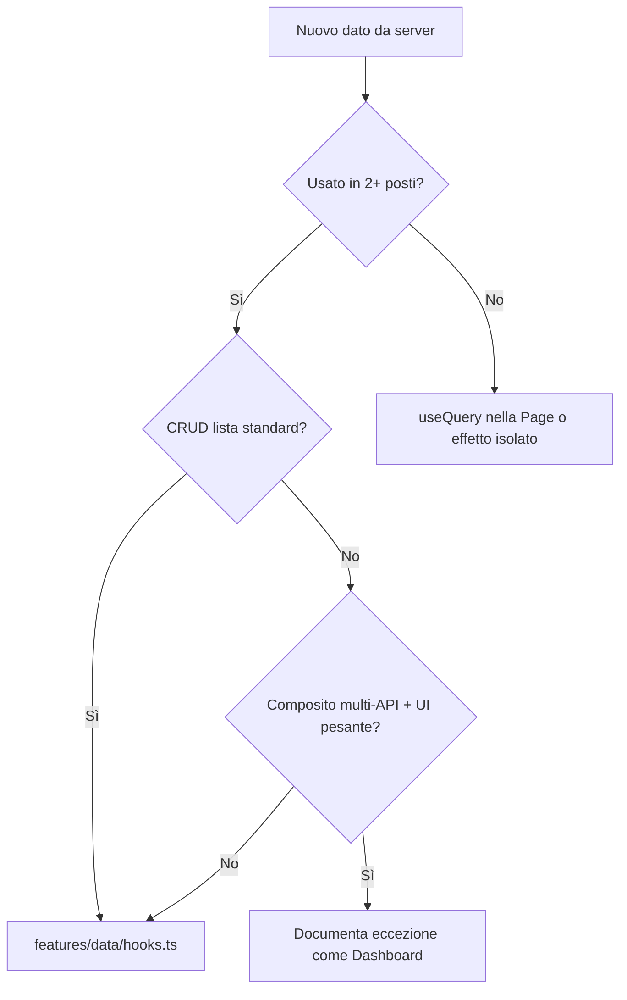

# Capitolo 4 — State management e data flow

📄 **Modulo 4** · `gestionale-app/`  
**Prerequisito:** [Capitolo 3 — Auth e permessi UI](./03-autenticazione-sessione-e-permessi-ui.md)  
**Obiettivo:** capire **dove vive ogni dato**, perché non abbiamo Redux, come Query evita il caos dei `useEffect`, e quando è lecito — o pericoloso — uscire dal pattern.

---

## 4.1 Tassonomia dello stato

### Teoria: non tutto è “stato globale”

Il primo errore del junior è trattare ogni `useState` come se fosse equivalente. In produzione distinguiamo **quattro famiglie** con regole diverse:

| Famiglia | Definizione | Esempi nel progetto | Chi è source of truth |
|--------|-------------|---------------------|------------------------|
| **Server state** | Dati che esistono sul backend e possono essere modificati da altri | Clienti, progetti, contratti | PostgreSQL via API |
| **Session state** | Identità e permessi della sessione corrente | `AuthProvider.user` | Backend auth + `/users/me` |
| **URL state** | Dove sei nell’app | `/clienti`, `activeProjectId` in sidebar | React Router + layout |
| **UI ephemeral** | Stato che muore con il componente o la modale | `addOpen`, draft form, drag Kanban locale | Componente stesso |

> **Concetto chiave — Server state ≠ cache React**  
> Mettere i clienti in `useState` dopo un fetch **non** li rende “stato UI”. Sono ancora server state, solo **mal gestiti**: niente dedup, niente invalidazione, niente loading/error standard.

### Unidirectional data flow (obiettivo)



**Flusso ideale su una page CRUD (es. clienti):**

1. `useClients()` legge dalla cache o fetcha.
2. La View renderizza `clients` e chiama `onUpdateStatus`.
3. La Page esegue `updateStatus.mutate`.
4. `onSuccess` → `invalidateQueries` → lista aggiornata.

Niente “ricalcola a mano” l’array in tre punti diversi.

### Dove **non** mettere server state

| Anti-pattern | Sintomo | Fix |
|--------------|---------|-----|
| `useEffect` + `fetch` + `setState` per liste CRUD | Duplicazione con Query sulla stessa route | `useX()` in `features/data/hooks.ts` |
| Copiare `clients` in context globale | Stale dopo mutazione altrove | Invalidazione Query |
| Prop drilling di 5 livelli per **dati** | Passi array giganti | Query hook nel consumer che serve |

**Eccezioni documentate** (§4.8): dashboard Kanban, inbox — ancora su `useEffect`; debito noto.

---

## 4.2 TanStack Query v5 — scelta e configurazione

### Teoria: async state management

React non sa “aspettare il server” nel render. Qualcosa deve gestire:

- stati `loading` / `error` / `success`;
- deduplicazione (stessa query montata due volte);
- refetch quando i dati sono obsoleti;
- aggiornamento dopo mutazioni.

TanStack Query è un **runtime per server state**, non un sostituto di Redux per tutto.

### Perché Query e non Redux / Zustand / solo `useEffect`

| Soluzione | Adatta a | Perché sì/no qui |
|-----------|----------|------------------|
| **TanStack Query** | Dati remoti, cache, mutazioni | ✅ 90% delle screen sono CRUD/liste |
| **Redux** | Stato client complesso condiviso da molte feature | ❌ Overhead; duplicherebbe la cache Query |
| **Zustand** | UI globale leggera (tema, wizard step) | ⚠️ Usiamo Context per tema/auth; non serve altro store |
| **React 19 `use` + Suspense** | RSC / streaming | ❌ SPA client-only Vite |
| **SWR** | Simile a Query | ⚠️ Equivalibile; Query già integrata con mutazioni |

> **Trade-off accettato**  
> Accettiamo dipendenza da `@tanstack/react-query` e convenzione hook per dominio. In cambio eliminiamo centinaia di righe di boilerplate `useEffect` identici.

### Configurazione globale — policy di prodotto

```ts
// gestionale-app/src/lib/query/client.ts
export const queryClient = new QueryClient({
    defaultOptions: {
        queries: {
            staleTime: 30_000,
            retry: 1,
            refetchOnWindowFocus: import.meta.env.PROD,
        },
        mutations: { retry: 0 },
    },
});
```

| Opzione | Valore | Effetto per l’utente del gestionale |
|---------|--------|-------------------------------------|
| `staleTime: 30s` | 30 secondi | Navigare clienti ↔ progetti non rifetcha ogni secondo |
| `retry: 1` | Un retry su errore transiente | Rete instabile: una ripetizione, poi errore |
| `refetchOnWindowFocus` | Solo in prod | Tornare sulla tab aggiorna dati (utile in ufficio) |
| `mutations retry: 0` | Nessun retry | Evita doppio POST cliente |

### Ciclo di vita di una query (mental model)



### Hook minimo

```ts
export function useClients() {
    return useQuery({
        queryKey: queryKeys.clients,
        queryFn: () => clientsAPI.getAll() as Promise<Client[]>,
    });
}
```

La Page consuma:

```tsx
const { data: clients = [], isLoading, error } = useClients();
```

| Campo | Uso |
|-------|-----|
| `data` | Lista (default `[]` evita null check ovunque) |
| `isLoading` | Primo fetch senza cache |
| `error` | Messaggio UI |
| `isFetching` | (opzionale) refetch in background — utile per indicatori sottili |

### `enabled` — query condizionate ai permessi

```ts
export function useProjects(options?: { enabled?: boolean }) {
    return useQuery({
        queryKey: queryKeys.projects,
        queryFn: () => projectsAPI.getAll() as Promise<Project[]>,
        enabled: options?.enabled !== false,
    });
}
```

```tsx
// AuthenticatedLayout — Socio senza viewProjects
useProjects({ enabled: permissions.viewProjects });
```

**Perché:** eviti GET `/api/projects` che finirebbe in `403` e rumore in console. La cache non parte = comportamento corretto.

---

## 4.3 Query keys e invalidazione

### Teoria: la cache è un dizionario, non un cassetto unico

TanStack Query identifica ogni fetch con una **query key** serializzabile (array/json). Stessa key → stessa entry in cache → **dedup** automatico se due componenti montano `useClients()` insieme.

### Registry centralizzato

```ts
// gestionale-app/src/lib/query/keys.ts
export const queryKeys = {
    clients: ['clients'] as const,
    client: (id: string) => ['clients', id] as const,
    projects: ['projects'] as const,
    contracts: ['contracts'] as const,
    tasks: (filters: Record<string, string | undefined>) => ['tasks', filters] as const,
    events: (filters: Record<string, string | undefined>) => ['events', filters] as const,
    // …
};
```

| Regola | Esempio |
|--------|---------|
| Lista | `['clients']` |
| Dettaglio | `['clients', id]` |
| Lista filtrata | `['tasks', { projectId }]` — oggetto nel key |

> **Convenzione**  
> Mai stringhe magiche sparse (`['client']` vs `['clients']`). Un typo = cache orphan e UI che non si aggiorna mai.

### Invalidazione dopo mutazione

```ts
const invalidate = () => {
    qc.invalidateQueries({ queryKey: queryKeys.clients });
    qc.invalidateQueries({ queryKey: queryKeys.projects });
    qc.invalidateQueries({ queryKey: queryKeys.contracts });
};
```



**Perché invalidazione incrociata?**

- Cliente eliminato → progetti e contratti collegati spariscono dal backend.
- Creare progetto può toccare conteggi in dashboard/report che leggono più liste.

| Strategia | Pro | Contro |
|-----------|-----|--------|
| **Invalidate ampia** (attuale) | Sempre coerente; mentale semplice | Più richieste di rete |
| **Invalidate chirurgica** | Meno traffico | Facile dimenticare una dipendenza → UI stale |
| **Optimistic + setQueryData** | UI istantanea | Complesso con 409 e relazioni |

Per un gestionale interno con team piccolo, **invalidate ampia** è la scelta pragmatica. Rivedila quando le liste diventano pesanti (paginazione server-side).

### Invalidazione manuale dalla Page (conflict flow)

```tsx
// ClientsPage — dopo merge conflitto
const refresh = () => qc.invalidateQueries({ queryKey: queryKeys.clients });
```

`useConflictUpdate` non invalida da solo: la Page passa `onSuccess` che chiama `refresh`. **Colocation:** la page sa quali liste toccano il dominio “clienti”.

---

## 4.4 `features/data/hooks.ts` — API del dominio dati

### Teoria: Repository pattern sul client

`features/data/hooks.ts` è il **confine** tra UI e trasporto HTTP:

- le Pages importano `useClients`, non `clientsAPI` direttamente (idealmente);
- le mutazioni sono raggruppate per aggregato (`useProjectMutations`).



### Pattern `useXMutations`

```ts
export function useClientMutations() {
    const qc = useQueryClient();
    const invalidate = () => { /* … */ };

    const updateStatus = useMutation({
        mutationFn: ({ id, status }) => clientsAPI.updateStatus(id, status),
        onSuccess: invalidate,
    });

    return { create, update, updateStatus, remove };
}
```

| Pezzo | Responsabilità |
|-------|----------------|
| `mutationFn` | Solo chiamata API pura |
| `onSuccess` | Effetto cache (invalidate) |
| Return object | API stabile per la Page (`mutate`, `isPending`) |

**Page resta sottile:**

```tsx
onUpdateStatus={(id, status) => updateStatus.mutate({ id, status })}
```

### Quando aggiungere un nuovo hook

| Crea `useNuovoDominio()` se… | Chiama API nella Page se… |
|------------------------------|---------------------------|
| ≥2 consumer (page + report + layout) | Prototipo usa-e-getta una tantum |
| Lista + mutazioni ripetute | Logica non riusata |
| Vuoi testare dominio in isolamento | — |

### Gap attuale (onestà per chi subentra)

Non **tutto** passa da `features/data/hooks.ts`:

| Area | Stato dati | File |
|------|------------|------|
| Clienti / Progetti / Contratti | ✅ Query hooks | `hooks.ts` |
| Reports | ✅ Riusa `useClients` ecc. | `ReportsPage.tsx` |
| Inbox | ❌ `useEffect` + `useState` | `InboxPage.tsx` |
| Dashboard | ❌ `useEffect` + `useState` | `DashboardView.tsx` |
| MyTasks | ❌ `useEffect` | `MyTasks.tsx` |

Il Capitolo 4 descrive il **pattern target**; §4.8 documenta le eccezioni da migrare.

---

## 4.5 Mutazioni e optimistic updates

### Stato attuale: pessimistic UI

Flusso standard:

1. Utente clicca “Salva”.
2. `mutate` → attende risposta server.
3. `onSuccess` → invalidate → refetch → UI aggiornata.

| Pro | Contro |
|-----|--------|
| Semplice; allineato al server | Latenza percepita su rete lenta |
| Conflitti 409 gestiti prima di mostrare dati falsi | Kanban drag sembra “pesante” |

### Dove l’optimistic update avrebbe senso

**Kanban** (`DashboardView.handleMoveTask`): aggiorna già `setTasks` localmente prima/durante API move — è **optimistic UI manuale** senza Query.

```tsx
// Pattern attuale (semplificato): stato locale + API
setTasks(prev => { /* riordina colonne */ });
await tasksAPI.move(taskId, { columnId, position });
```

| Approccio | Rischio |
|-----------|---------|
| Optimistic locale (`useState`) | Desync se API fallisce — serve rollback |
| `useMutation` + `onMutate` + `setQueryData` | Migliore con `queryKeys.tasks` — **non ancora implementato** |

> **Con 409 (conflitti)**  
> L’optimistic update su entità versionate (clienti) è **pericoloso** senza strategia di rollback. Meglio pessimistic + `ConflictDialog` (Capitolo 6).

### `isPending` — feedback submit

```tsx
<button disabled={create.isPending}>Salva</button>
```

Non implementato ovunque — miglioramento UX incrementale, non bloccante architettura.

---

## 4.6 `services/api.ts` — façade REST

### Teoria: nascondere HTTP dietro un vocabolario di dominio

Le Pages non dovrebbero costruire URL o parsare status code. Parlano **`clientsAPI.update`**.

```ts
// services/api.ts — strato intermedio
async function apiCall(endpoint: string, options: RequestInit = {}) {
    if (!import.meta.env.PROD && shouldUseMockData(section, endpoint)) {
        const mock = await loadMock();
        return mock(endpoint, options);
    }
    return httpCall(endpoint, options); // lib/api/client.ts
}
```



| Livello | Conosce |
|---------|---------|
| `hooks.ts` | Nomi dominio (`getAll`, `updateStatus`) |
| `api.ts` | Path REST, mock dev, delega transport |
| `client.ts` | Cookie, token, retry, errori rete |

### Perché due file (`api.ts` + `client.ts`)

- **Testabilità:** `client.test.ts` testa transport senza mock gigante.
- **Mock:** `api.ts` decide *se* mockare; `mock.ts` decide *cosa* restituire.
- **Auth:** `client.ts` non importa mock → login sempre reale in dev (salvo override esplicito).

### Debito: `any` su payload

```ts
create: (client: any) => apiCall('/api/clients', { … })
```

**Perché esiste:** velocità iniziale. **Costo:** refactor API non guidato dal compilatore. Piano: tipi `CreateClientPayload` in `types/models.ts` o Zod inferiti dal backend.

### Eccezione: conflict update dalla Page

```tsx
updateFn: payload => clientsAPI.update(editClient!.id, payload),
```

La Page passa ancora `clientsAPI` diretto per il flusso 409 — accoppiamento stretto. Accettabile finché `useConflictUpdate` resta generico; alternativa futura: `useClientUpdate()` mutation dedicata.

---

## 4.7 Mock in development

### Teoria: simulare il backend senza mentire alla produzione

Il mock serve a:

- sviluppare UI quando PostgreSQL non gira;
- demo dashboard con dati ricchi;
- testare stati (liste vuote, errori) senza seed DB.

**Non** deve mai essere il default in produzione.

### Catena di attivazione



```ts
// lib/api/client.ts
export function shouldUseMockData(section?: ApiSection, endpoint?: string): boolean {
    if (import.meta.env.PROD) return false;
    if (endpoint?.includes('/api/auth')) return false;
    // localStorage useMockData + mockDataSections per sezione
}
```

| Gate | Motivo |
|------|--------|
| `PROD` hard off | Zero rischio dati falsi in Render |
| Auth esclusa | Login sempre vero |
| Per-sezione (`clients`, `projects`, …) | Puoi avere clienti mock e progetti reali |

### Import dinamico

```ts
const mod = await import('../lib/api/mock');
mockFn = mod.getMockData;
```

**Perché:** il bundle di produzione **non** include il mock (tree-shake del branch morto + chunk separato non caricato).

### Controllo da `/admin` (dev)

Pannello admin imposta `localStorage.useMockData` e `mockDataSections`. Documenta nel README interno: **prima di debuggare “il server non salva”**, controlla se il mock è attivo.

---

## 4.8 Stato locale “complesso” — eccezioni (Dashboard, Inbox, Tasks)

### Teoria: quando Query non è ancora arrivata

Query eccelle su **risorse lista/dettaglio** con key stabili. La dashboard è un **composito**:

- 6+ endpoint in parallelo;
- stato UI pesante (drag Kanban, colonne, date picker);
- fallback demo in dev se array vuoti.

### `DashboardView` — fetch orchestrato a mano

```tsx
useEffect(() => {
    const [colsRaw, tasksRaw, sprint, acts, sum, evs, users] = await Promise.all([
        activeProjectId ? safe(tasksAPI.getColumns(activeProjectId), []) : [],
        safe(tasksAPI.getAll(activeProjectId ? { projectId: activeProjectId } : {}), []),
        // …
    ]);
    setTasks(/* con mockTasks in dev se vuoto */);
}, [activeProjectId]);
```



| Perché non è ancora Query | Cosa servirebbe per migrare |
|-------------------------|----------------------------|
| `queryKeys.tasks` con filtro `projectId` | Hook `useDashboardBundle(projectId)` |
| Optimistic drag locale | `useMutation` move + rollback |
| Widget con fallback mock | `placeholderData` o flag dev separato |

**Regola per chi modifica la dashboard:** non copiare questo pattern su nuove pagine CRUD. **Usalo solo** dove il composito multi-endpoint è giustificato e documentato.

### `InboxPage` — due `useEffect` a cascata

```tsx
useEffect(() => { messagesAPI.getChats()… }, []);
useEffect(() => { messagesAPI.getMessages(activeChatId)… }, [activeChatId]);
```

Candidato naturale a:

- `useQuery({ queryKey: queryKeys.chats })`
- `useQuery({ queryKey: ['messages', activeChatId], enabled: !!activeChatId })`

### `ReportsPage` — esempio **corretto**

```tsx
const { data: clients = [] } = useClients();
const { data: projects = [] } = useProjects();
const { data: contracts = [] } = useContracts();
// derive stats client-side
```

Nessun fetch duplicato: riusa cache già popolata da altre route (se visitate) o fetcha una volta. **Pattern da imitare** per report e KPI.

### Albero rendering dati (ClientsPage — target)

```mermaid
flowchart TB
    QC[(QueryClient cache)]
    UC[useClients]
    UCM[useClientMutations]
    CP[ClientsPage]
    CV[ClientiView]

    QC <--> UC
    UCM -->|invalidate| QC
    CP --> UC
    CP --> UCM
    CP -->|clients[] props| CV
```

---

## Sintesi — decision tree per il prossimo sviluppatore



---

## Segnali d’allarme

| Sintomo | Causa probabile |
|---------|----------------|
| Lista non si aggiorna dopo save | Dimenticata `invalidate` o typo query key |
| Doppio fetch identico in Network | Due `useEffect` + `useQuery` sulla stessa risorsa |
| Dati fantasma in prod | Mock attivo per errore — impossibile in PROD via codice |
| Stale dopo tab switch | `staleTime` + no refetch — comportamento atteso; forza invalidate se serve |
| 403 su fetch Socio | Query senza `enabled: false` |

---

## Checklist PR (data layer)

- [ ] Lista CRUD usa `useQuery` / hook in `features/data/`?
- [ ] Mutazione invalida tutte le query dipendenti?
- [ ] Nuova key in `queryKeys.ts`?
- [ ] Nessun `fetch` diretto in `views/`?
- [ ] Mock non toccato per auth?
- [ ] Se `useEffect` fetch: commento **perché** non Query ancora?

---

## Esercizio (50 minuti)

1. Apri DevTools → Network, vai su Clienti, poi Progetti. Annota se `/api/clients` viene richiamato due volte e spiega perché Query potrebbe deduplicare.
2. Aggiungi su carta una query key `['inbox', 'chats']` e disegna invalidate dopo `sendMessage`.
3. Confronta in 8 righe `ReportsPage` vs `InboxPage`: quale rispetta meglio il server state pattern e perché.

**Criterio:** la risposta (1) menziona **stessa query key** o **staleTime**, non solo “cache del browser”.

---

## Prossimo capitolo

→ **Modulo 5 — Pattern di pagina: Pages, Views e Features** (`05-pages-views-e-features.md`, da redigere)

---

## Riferimenti rapidi

| Argomento | File |
|-----------|------|
| Query client | `gestionale-app/src/lib/query/client.ts` |
| Query keys | `gestionale-app/src/lib/query/keys.ts` |
| Domain hooks | `gestionale-app/src/features/data/hooks.ts` |
| API façade | `gestionale-app/src/services/api.ts` |
| HTTP + mock gate | `gestionale-app/src/lib/api/client.ts` |
| Mock data | `gestionale-app/src/lib/api/mock.ts` |
| Esempio target | `gestionale-app/src/pages/ClientsPage.tsx` |
| Esempio derive | `gestionale-app/src/pages/ReportsPage.tsx` |
| Eccezione | `gestionale-app/src/components/dashboard/DashboardView.tsx` |
| Capitolo precedente | `walkthrough/frontend/03-autenticazione-sessione-e-permessi-ui.md` |
