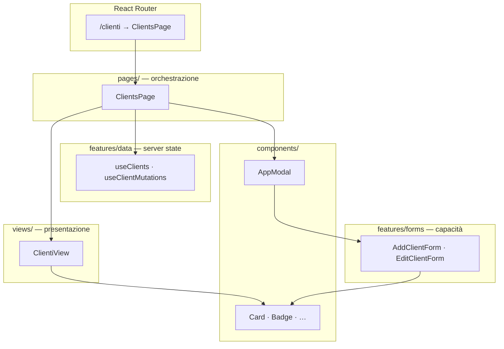
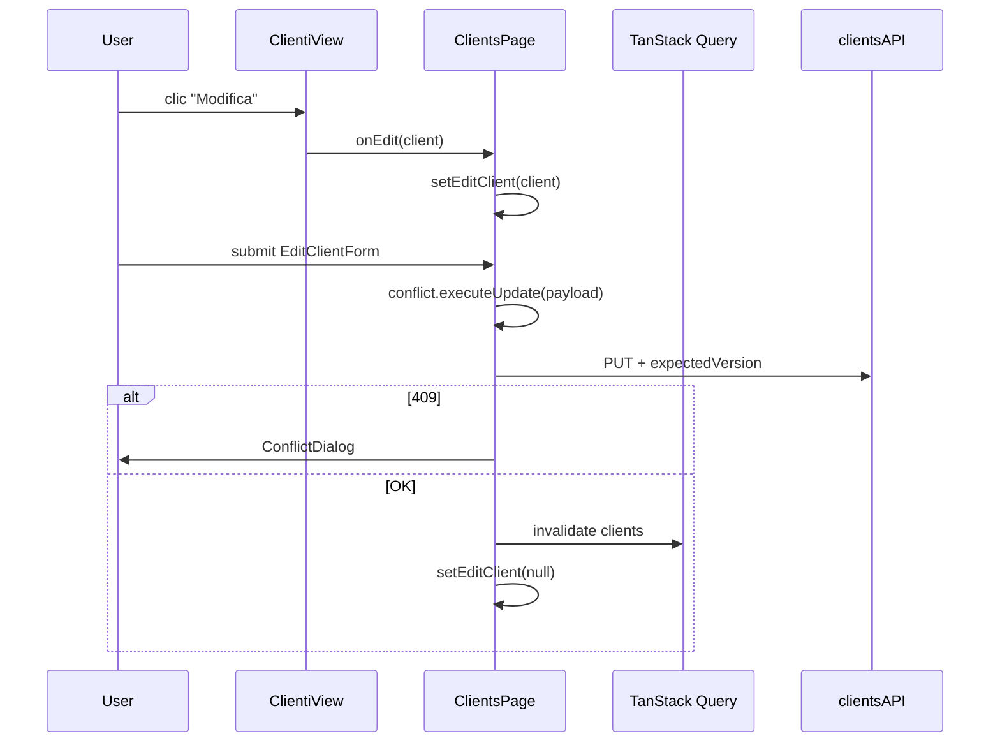
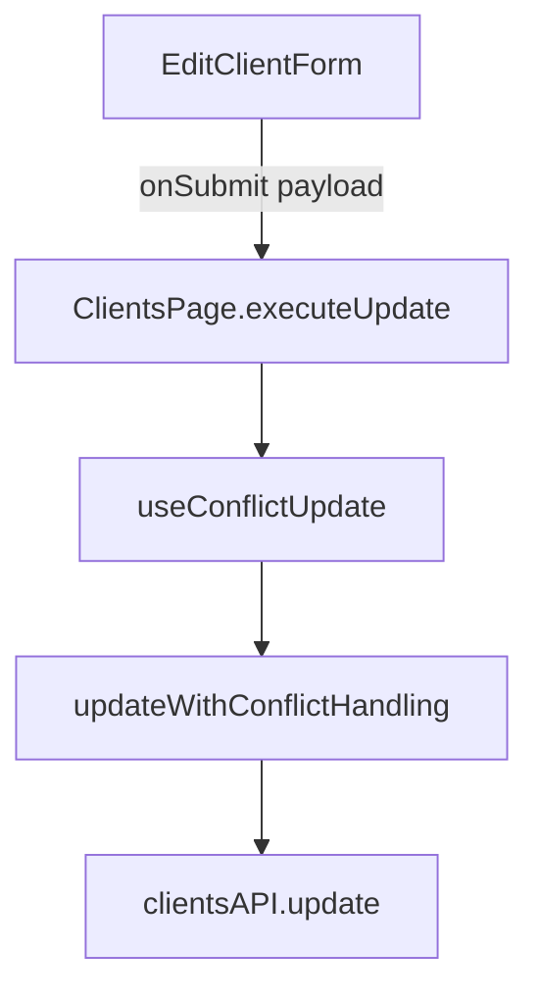
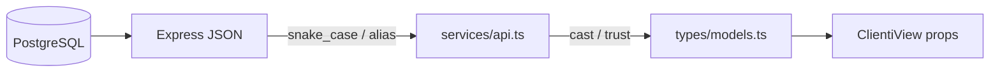
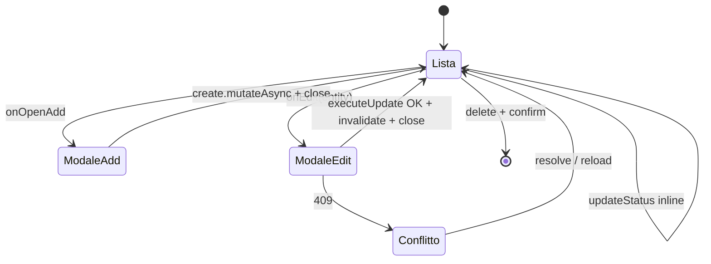
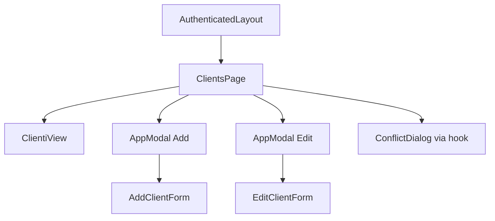

# Capitolo 5 — Pattern di pagina: Pages, Views e Features

📄 **Modulo 5** · `gestionale-app/`  
**Prerequisito:** [Capitolo 4 — State management e data flow](./04-state-management-e-data-flow.md)  
**Obiettivo:** imparare a **scomporre una schermata CRUD** in strati con responsabilità fisse — così che nuove entità (es. “Fornitori”) non diventino file da 800 righe che mescolano fetch, tabelle e form.

---

## 5.0 Il problema che questo modulo risolve

Un junior tende a mettere tutto in un componente `Clienti.tsx`: `useQuery`, tabella, modale, `fetch`, validazione, toast. Funziona per una demo; in un gestionale con **clienti, progetti, contratti, permessi e conflitti 409** diventa legacy in sei mesi.

La nostra risposta non è un framework interno pesante, ma **tre cartelle con contratti impliciti**:

| Strato | Cartella | Domanda che risponde |
|--------|----------|----------------------|
| **Page** | `src/pages/` | *Come collego route, dati, modali e side-effect?* |
| **View** | `src/views/` | *Come mostro la lista e invoco azioni senza sapere da dove arrivano i dati?* |
| **Feature** | `src/features/` | *Quale capacità di dominio riuso su più page?* (form, hook dati) |

Sotto tutto: **`components/ui/`** (primitivi) e **`components/`** (widget più grandi, es. `Calendar`, `DashboardView`).



---

## 5.1 Page = composizione e wiring

### Teoria: Inversion of Control (IoC)

**Inversion of Control** significa: il componente “figlio” non decide *come* eseguire un’azione, riceve un **callback** dalla parte che ha il contesto (Page con Query, permessi, API).

- La **View** non chiama `clientsAPI.update`.
- La **Page** passa `onEdit={setEditClient}` e `onUpdateStatus={(id, status) => updateStatus.mutate({ id, status })}`.

> **Concetto chiave — La Page è il composition root della route**  
> Tutto ciò che dipende da “siamo su `/clienti`”, da cache Query, da modale aperta, da conflitto 409, **vive nella Page**. La View resta ignorante del trasporto HTTP.

### Teoria: State colocation

Lo **stato UI effimero** (modale aperta, riga in edit) va **il più vicino possibile a dove serve**, non in Context globale.

| Stato | Dove | Perché |
|-------|------|--------|
| `addOpen`, `editClient` | `ClientsPage` | Solo questa route apre quelle modali |
| Lista `clients` | TanStack Query | Condivisa con Reports, Projects |
| Draft form | `EditClientForm` | Muore con la modale |

Spostare `editClient` in Zustand aggiungerebbe complessità senza benefici: nessun altro componente deve aprire “modifica cliente X” senza passare dalla Page.

### Anatomia di `ClientsPage` — template aureo

```tsx
// pages/ClientsPage.tsx — struttura ripetuta su Billing / Projects
export function ClientsPage() {
    const qc = useQueryClient();
    const { data: clients = [], isLoading, error } = useClients();
    const { create, updateStatus, remove } = useClientMutations();
    const [addOpen, setAddOpen] = useState(false);
    const [editClient, setEditClient] = useState<Client | null>(null);

    const conflict = useConflictUpdate({ /* … */ onSuccess: () => { refresh(); setEditClient(null); } });

    if (isLoading) return <p>…</p>;
    if (error) return <p>…</p>;

    return (
        <>
            <ClientiView clients={clients} onEdit={setEditClient} … />
            <AppModal isOpen={addOpen}>…<AddClientForm onSubmit={…} /></AppModal>
            <AppModal isOpen={!!editClient}>…<EditClientForm onSubmit={…} /></AppModal>
            {conflict.ConflictModal}
        </>
    );
}
```



### Responsabilità Page — checklist mentale

| ✅ Page fa | ❌ Page non fa |
|-----------|----------------|
| `useClients` / mutazioni | Markup tabella dettagliato |
| Stato modali (`addOpen`, `editX`) | Classi Tailwind per ogni cella |
| `useConflictUpdate` + invalidate | `openNotice` su click riga (quello è View) |
| Loading/error **route-level** | Logica di rendering badge/status |
| Orchestrazione multi-entità (es. crea cliente + progetto) | — |

### Page “sottili” — eccezione legittima

Non ogni route è un CRUD a tre strati:

```tsx
// DashboardPage.tsx — solo bridge verso layout context
export function DashboardPage() {
    const { activeProjectId, user } = useOutletContext();
    return <DashboardView activeProjectId={activeProjectId} currentUser={user} />;
}
```

| Page | Pattern | Motivo |
|------|---------|--------|
| `ClientsPage`, `ProjectsPage`, `BillingPage` | Page + View + Feature | CRUD standard |
| `DashboardPage`, `CalendarPage` | Page → componente monolitico | Composito UI / dominio non ancora estratto in View |
| `ReportsPage` | Page senza View dedicata | Solo derive stats + card — potrebbe diventare `ReportsView` |
| `AdminPage` | Guard prod + `AdminPanel` | Tooling dev, non prodotto |

**Regola:** se aggiungi una **nuova lista anagrafica**, usa il template CRUD (§5.5). Non copiare `DashboardView` per una tabella clienti.

### Orchestrazione cross-entità — `ProjectsPage`

La Page può contenere **regole di business** che non appartengono alla View:

```tsx
// Creazione progetto: risolve clientId da nome o crea cliente al volo
const addProject = async (data: Record<string, unknown>) => {
    let clientId = data.clientId as string | undefined;
    const typedName = String(data.clientName || '').trim();
    if (!clientId && typedName) {
        const match = clients.find(c => c.name.trim().toLowerCase() === typedName.toLowerCase());
        if (match) clientId = match.id;
        else {
            const newClient = await clientMutations.create.mutateAsync({ name: typedName });
            clientId = newClient.id;
        }
    }
    await projectMutations.create.mutateAsync({ name: data.name, clientId, … });
    setAddOpen(false);
};
```

| Alternativa | Pro | Contro |
|-------------|-----|--------|
| Logica in **Page** (attuale) | Visibile nel composition root; View resta stupida | Page più lunga |
| Logica in **`features/projects/createProject.ts`** | Testabile, riusabile | Overhead finché c’è un solo caller |
| Logica in **View** | — | ❌ View non deve conoscere `clientMutations` |

Quando la stessa orchestrazione serve in 2+ posti → estrai in `features/`.

### Trade-off: Page da 70 vs 200 righe

| Approccio | Quando |
|-----------|--------|
| Page compatta (~70 righe) | CRUD simmetrico (Clients, Billing) |
| Page più lunga | Orchestrazione (Projects), più modali, derive `getClientName` |

**Limite pratico:** se superi ~150 righe senza nuova entità, estrai hook locale `useClientsPageState()` **nella stessa cartella** `pages/` — non spostare fetch nella View.

---

## 5.2 View = presentazione e interazione pura

### Teoria: Container / Presentational (evoluzione moderna)

Il pattern classico React separava **Container** (dati) e **Presentational** (UI). Oggi i Container sono spesso le **Page** + TanStack Query; le **View** sono presentational con **callback tipizzati**.

```tsx
interface ClientiViewProps {
    clients: Client[];
    onUpdateStatus: (id: string, status: string) => void;
    onEdit: (client: Client) => void;
    onDelete: (id: string) => void;
    onOpenAdd: () => void;
}
```

```mermaid
flowchart LR
    subgraph View["ClientiView — no import da services/api"]
        T[Tabella]
        B[Badge stato]
        Sel[select onChange]
    end

    subgraph Props["Solo props"]
        D[clients: Client[]]
        CB[onUpdateStatus · onEdit · …]
    end

    D --> T
    CB --> Sel
    Sel -->|onUpdateStatus(id, status)| Page["ClientsPage"]
```

### Cosa la View **può** fare

| Consentito | Esempio in repo |
|------------|-----------------|
| Rendering, layout, empty state | Riga “Nessun cliente…” |
| Mapping visivo (tone badge, icone) | `statusTone`, `CLIENT_STATUS_OPTIONS` |
| Feedback UX locale | `openNotice` al click riga (placeholder scheda) |
| `useState` **solo UI** | `ProgettiView`: expand/collapse todo |

### Cosa la View **non** deve fare

| Vietato | Perché |
|---------|--------|
| `import { clientsAPI }` | Rompe testabilità e riuso |
| `useQuery` / `useMutation` | Duplica ownership dati (Cap. 4) |
| `useAuth` per permessi granulari | Meglio props `canDelete` dalla Page (futuro) |
| Chiusura modale dopo save | La Page conosce `onSuccess` e invalidate |

> **Perché `openNotice` in View è accettabile**  
> È UX pura (“dettaglio in arrivo”), non mutazione server. Se domani la scheda cliente esiste, la Page passerà `onRowClick(client)` e navigherà a `/clienti/:id`.

### Testabilità e Storybook (potenziale)

Con props esplicite puoi montare:

```tsx
<ClientiView
    clients={fixtureClients}
    onEdit={action('edit')}
    …
/>
```

Senza mock di Query, router o cookie. **Costo evitato:** ogni test E2E per verificare che il badge “Attivo” sia verde.

### `getClientName` — derive nella Page, display nella View

```tsx
// ProjectsPage
const getClientName = (id: string) => clients.find(c => c.id === id)?.name || 'N/A';

<ProgettiView getClientName={getClientName} … />
```

La View **non** importa `useClients` solo per un nome: riceve una funzione. Alternativa futura: arricchire `Project` con `clientName` lato API o `select` nel hook — finché la lista clienti è già in cache, il delegate è economico.

### Duplicazione opzioni stato — debito documentato

`CLIENT_STATUS_OPTIONS` compare in `ClientiView` e in `features/forms/modals.tsx`.

| Fix | Trade-off |
|-----|-----------|
| Esportare da `features/forms/modals.tsx` o `constants/domains.ts` | Single source of truth |
| Lasciare duplicato | Rischio disallineamento label select vs tabella |

Per nuove entità: **una sola costante** condivisa tra View e Form.

---

## 5.3 Feature = capacità riusabile

### Teoria: feature ≠ “qualsiasi cartella grande”

Nel nostro repo **`features/`** significa: *modulo di dominio frontend* che può essere importato da più page senza trascinare una route.

Oggi:

| Sotto-cartella | Contenuto |
|----------------|-----------|
| `features/data/hooks.ts` | Server state (Cap. 4) |
| `features/forms/modals.tsx` | Form ADD/EDIT clienti, progetti, contratti |

### Form come feature — `expectedVersion` nel payload

```tsx
// EditClientForm — draft locale + contratto verso Page
const submit = (e: React.FormEvent) => {
    e.preventDefault();
    onSubmit({ ...data, expectedVersion: client.version });
};
```



| Pezzo | Ruolo |
|-------|-------|
| **Form** | Validazione minima, stato campi, allega `expectedVersion` |
| **Page** | Collega `onSubmit` a `conflict.executeUpdate` |
| **Hook** | Gestisce 409 e `ConflictModal` |
| **FormField / FormSelect** | Primitivi inline in `modals.tsx` (candidati a `components/ui/` in Modulo 7) |

### Feature vs `components/`

| Metti in `features/` se… | Metti in `components/` se… |
|---------------------------|----------------------------|
| Conosce tipi dominio (`Client`, `Contract`) | Agnostico dal dominio (`Card`, `Modal`) |
| Contiene regole form business (opzioni area, stati) | Riutilizzabile in marketing site |
| Usato da 2+ page del gestionale | Widget singolo (Calendar, Kanban) |

`AppModal` resta in `components/` — shell generica. Il **contenuto** è feature form.

### Costanti dominio esportate

```tsx
export const AREA_OPTIONS = ['CDA', 'Marketing', 'IT', 'Commerciale'];
export const CLIENT_STATUS_OPTIONS = [ … ];
```

**Perché in feature e non in View:** i form e (idealmente) le select in tabella devono condividere lo stesso vocabolario backend.

### Quando spezzare `modals.tsx`

Il file è ~300+ righe. Soglie pragmatiche:

| Dimensione | Azione |
|------------|--------|
| Nuova entità (2 form) | Aggiungi in fondo finché resta leggibile |
| >400 righe o 3+ entità | `features/forms/clients.tsx`, `projects.tsx`, `contracts.tsx` + `index.ts` re-export |

Non creare `features/forms/` per un singolo campo — **YAGNI**.

---

## 5.4 Anti-corruption layer verso i tipi

### Teoria: il frontend non è il database

`types/models.ts` è il **contratto TypeScript** verso la UI, non lo schema SQL. Serve a:

- dare forma alle props View;
- documentare campi opzionali (`contactPerson?`);
- esporre `version?` per locking ottimistico.

```ts
export interface Client {
    id: string;
    name: string;
    status: string;
    version?: number;
    // …
}
```



### Perché `Record<string, unknown>` nei submit

```tsx
onSubmit: (data: Record<string, unknown>) => void
```

| Motivo | Costo |
|--------|-------|
| Form e API evolvevano velocemente | Nessun autocomplete sui campi submit |
| Un solo tipo per Add + Edit parziali | Errori typo solo a runtime |

**Direzione miglioramento:** `UpdateClientPayload` con `Pick<Client, 'name' | 'email' | …> & { expectedVersion?: number }`.

### `version` e `expectedVersion`

| Campo | Dove | Significato |
|-------|------|-------------|
| `client.version` | Modello da GET | Revisione corrente server |
| `expectedVersion` | Body PUT | “Aggiorna solo se ancora quella revisione” |

Il Form **non** interpreta il 409: passa la versione; la Page + `useConflictUpdate` gestiscono il dialog (dettaglio Modulo 6).

### Campi opzionali vs UI required

`EditClientForm` richiede `name` e `email` in UI; il tipo li ha come obbligatori su `Client` ma opzionali su create parziale. **Disallineamento intenzionale** tra validazione form e tipo — documentare se il backend accetta create senza phone.

### Anti-pattern

| Pattern | Rischio |
|---------|---------|
| Usare `any` ovunque nei form | Stesso problema, peggio |
| Duplicare interfacce in ogni file | Drift tra View e API |
| Parsare JSON a mano in View | Parsing appartiene a boundary (`api.ts` / zod futuro) |

---

## 5.5 Flusso CRUD tipo “scheda anagrafica”

### Template ripetuto (clienti → progetti → contratti)

Le tre page CRUD sono **isomorfe**. Copia la struttura, non il testo.



### Checklist — nuova entità `Fornitore`

| # | Task | File |
|---|------|------|
| 1 | Modello `Supplier` + `version?` | `types/models.ts` |
| 2 | `suppliersAPI` | `services/api.ts` |
| 3 | `queryKeys.suppliers` + `useSuppliers` / mutations | `features/data/hooks.ts` |
| 4 | `AddSupplierForm` / `EditSupplierForm` | `features/forms/modals.tsx` (o file dedicato) |
| 5 | `FornitoriView` (props callback) | `views/FornitoriView.tsx` |
| 6 | `SuppliersPage` wiring | `pages/SuppliersPage.tsx` |
| 7 | Route + `Guard` + menu | `router.tsx`, `IconRail`, `VIEW_PATHS`, titoli (Cap. 2) |
| 8 | Permesso backend + `permissions` | `docs/RBAC.md`, backend route |
| 9 | Edit con conflitto | `useConflictUpdate` + `expectedVersion` se PUT versionato |

### Confronto delle tre implementazioni

| Aspetto | ClientsPage | ProjectsPage | BillingPage |
|---------|-------------|--------------|-------------|
| View | `ClientiView` | `ProgettiView` | `ContabilitaView` |
| Query | `useClients` | `useClients` + `useProjects` | + `useContracts` |
| Mutazioni inline | `updateStatus` | + todo | `updateStatus` |
| Edit | `useConflictUpdate` | idem | idem |
| Orchestrazione extra | — | `addProject` + create client | `getProjectName` |

### Albero di rendering — route `/clienti`



### Mutazioni “veloci” vs modale

| Azione | Canale | Perché |
|--------|--------|--------|
| Cambio stato da select in tabella | `updateStatus.mutate` diretto | Campo singolo, no version dialog |
| Modifica anagrafica completa | Modale + `executeUpdate` | Più campi + `expectedVersion` |

Non aprire la modale per ogni PATCH — UX più pesante del necessario.

---

## Alternative considerate (e scartate)

| Pattern | Perché non adottato come standard |
|---------|-----------------------------------|
| **Un componente per route** | Nessuna separazione test/UI; file enormi |
| **View con `useQuery` interno** | Doppio fetch, invalidate fragile |
| **Form dentro View** | View non riusabile; modale accoppiata alla tabella |
| **React Hook Form ovunque** | Non introdotto; form controllati semplici bastano per CRUD attuale |
| **Next.js Server Components** | Stack Vite SPA client-only |

---

## Segnali d’allarme in code review

| Diff | Verdetto |
|------|----------|
| `import … from services/api` in `views/` | ❌ Sposta in Page o hook |
| `useQuery` in `views/` | ❌ |
| Nuova lista senza `*View.tsx` | ⚠️ Giustificare (es. report minimale) |
| Form con `fetch` interno | ❌ |
| Page che renderizza 400 righe di JSX tabella | ❌ Estrai View |
| `expectedVersion` dimenticato in Edit | ❌ 409 silenziosi o sovrascrittura |

---

## Esercizio (45 minuti)

1. Disegna su carta l’albero di rendering di `ProjectsPage` (View, 2 modali, hook conflitto, da dove arriva `clients`).
2. Elenca **cinque** responsabilità di `ClientsPage` e **cinque** che devono restare in `ClientiView`.
3. Proposta: dove metteresti la logica `addProject` se domani anche `BillingPage` deve “crea cliente se non esiste”? (risposta attesa: `features/projects/` o simile, non View).

**Criterio di superamento:** la risposta (2) non include “mostra la tabella” nella Page né “chiama API” nella View.

---

## Prossimo capitolo

→ **Modulo 6 — Concorrenza, integrità dati e UX di errore** (`06-concorrenza-integrita-e-errori.md`, da redigere): `updateWithConflictHandling`, `ConflictDialog`, toast, doppio submit.

---

## Riferimenti rapidi

| Argomento | File |
|-----------|------|
| Page template | `gestionale-app/src/pages/ClientsPage.tsx` |
| View template | `gestionale-app/src/views/ClientiView.tsx` |
| Form feature | `gestionale-app/src/features/forms/modals.tsx` |
| Data hooks | `gestionale-app/src/features/data/hooks.ts` |
| Conflitti (wiring) | `gestionale-app/src/hooks/useConflictUpdate.tsx` |
| Modale shell | `gestionale-app/src/components/AppModal.tsx` |
| Tipi dominio | `gestionale-app/src/types/models.ts` |
| Page sottile | `gestionale-app/src/pages/DashboardPage.tsx` |
| Capitolo precedente | `walkthrough/frontend/04-state-management-e-data-flow.md` |
