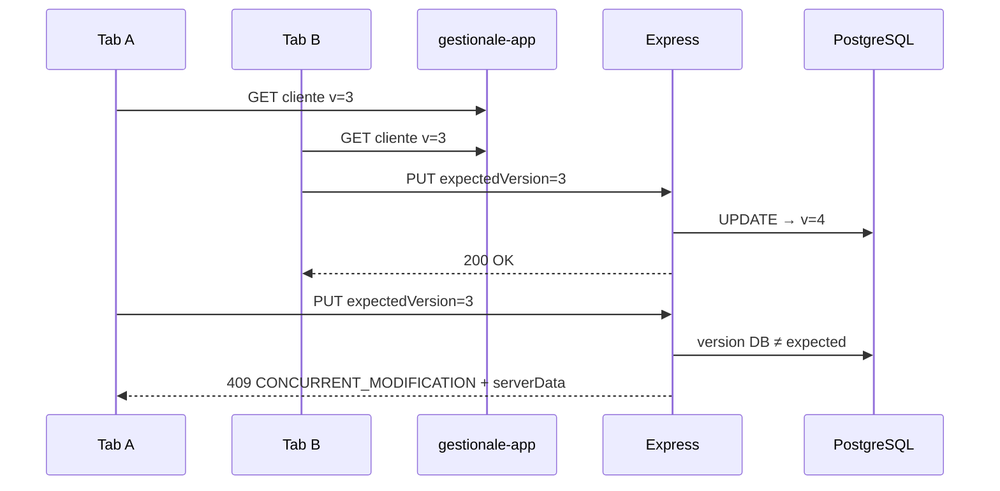
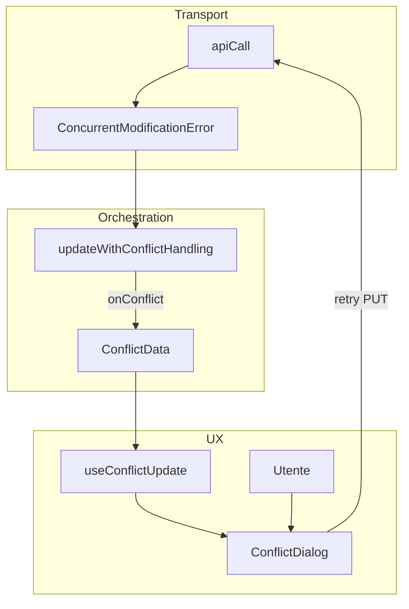
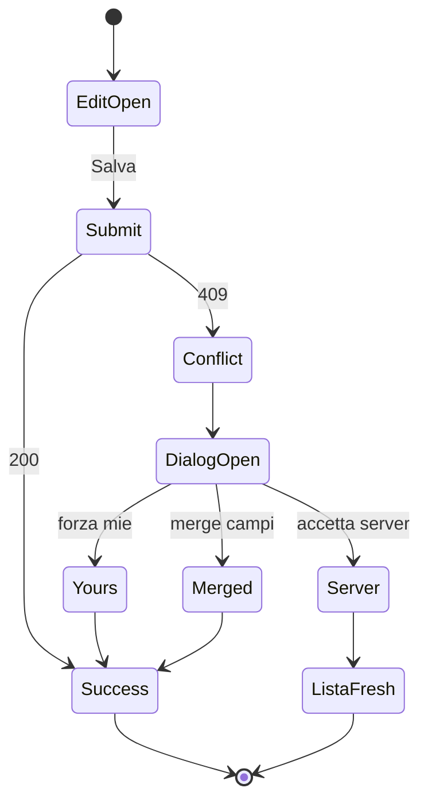
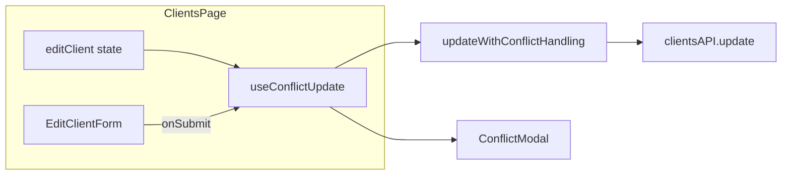
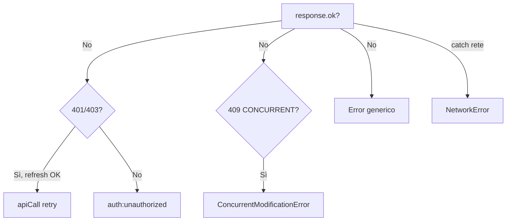
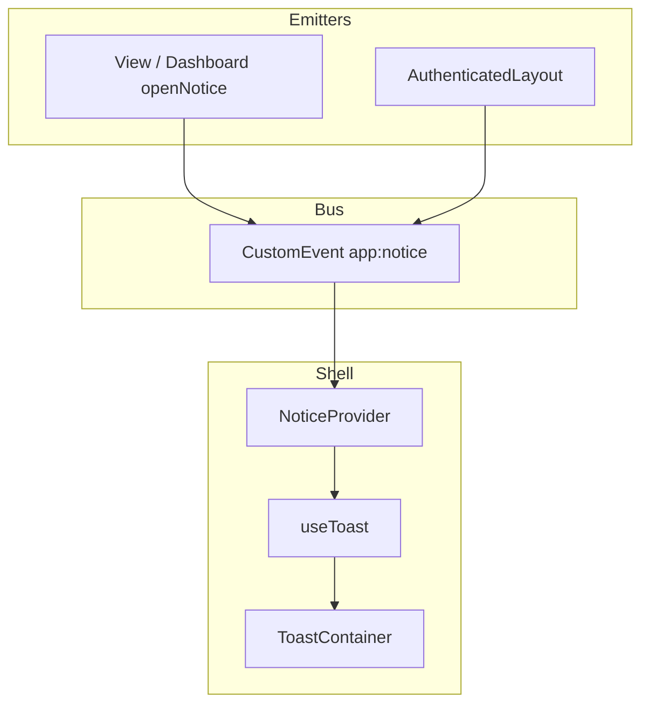
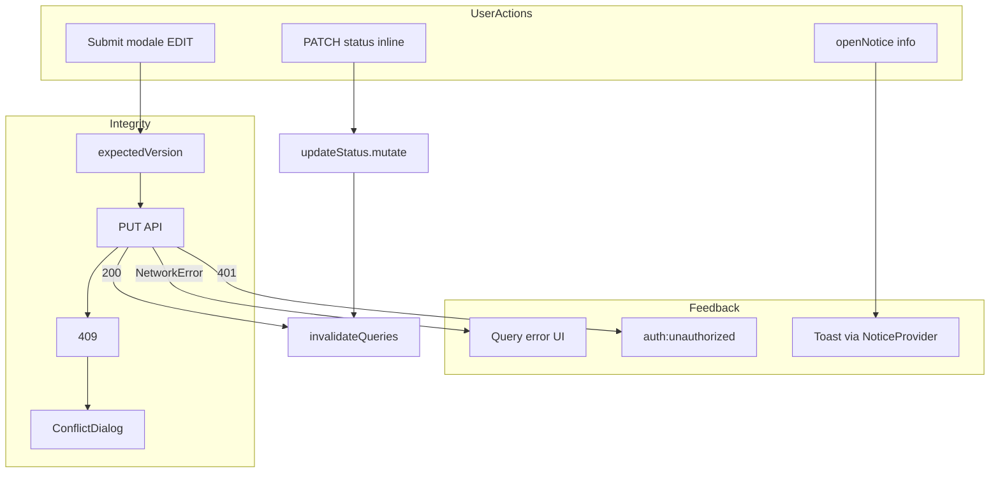

# Capitolo 6 — Concorrenza, integrità dati e UX di errore

📄 **Modulo 6** · `gestionale-app/` + contratto `backend/`  
**Prerequisito:** [Capitolo 5 — Pages, Views e Features](./05-pages-views-e-features.md)  
**Obiettivo:** capire **perché** due utenti che salvano lo stesso cliente non devono sovrascriversi in silenzio, come il frontend traduce un **409** in scelta consapevole, e come separare **errori di rete**, **permessi** e **feedback informativo** (toast) senza confondere l’utente.

---

## 6.1 Problema: modifiche simultanee

### Teoria: lost update

Scenario classico:

1. Utente A apre modale “Modifica Cliente X” (`version = 3`).
2. Utente B salva una modifica → server passa a `version = 4`.
3. Utente A salva ancora con `expectedVersion: 3`.
4. Senza protezione: **last-write-wins** — le modifiche di B spariscono.

In un gestionale con più soci, commerciali e segreteria sullo stesso anagrafico, questo non è un edge case: è il **caso normale** in orari di punta.



### Soluzione scelta: optimistic locking (versione)

| Approccio | Meccanismo | Pro | Contro |
|-----------|------------|-----|--------|
| **Last-write-wins** | Nessun controllo | Semplice | Perdita dati silenziosa |
| **Pessimistic lock** | “Blocca record” finché A non chiude | Forte | UX pesante, timeout, tab chiuse |
| **Optimistic lock** | `version` + `expectedVersion` | Scalabile, stateless HTTP | Richiede UI conflitto su 409 |
| **ETag / If-Match** | Header HTTP | Standard REST | Meno esplicito nel body JSON attuale |

> **Concetto chiave — Il server è arbitro, il client è interprete**  
> PostgreSQL incrementa `version` a ogni UPDATE riuscito. Il frontend **non** decide se c’è conflitto: riceve **409** e guida l’utente.

### Contratto backend (esempio clienti)

```js
// backend/routes/clients.js — estratto
if (expectedVersion !== undefined && currentVersion !== expectedVersion) {
    return res.status(409).json({
        error: 'CONCURRENT_MODIFICATION',
        message: 'Il cliente è stato modificato da un altro utente.',
        currentVersion,
        expectedVersion,
        serverData: serverData.rows[0],
    });
}
```

Stessa logica su **progetti** e **contratti** (`projects.js`, `contracts.js`). Eventi hanno 409 per altri motivi (es. RSVP) — non confonderli con il locking anagrafico.

### Modello frontend

```ts
// types/models.ts
export interface Client {
    // …
    version?: number;
}
```

| Campo | Direzione | Significato |
|-------|-----------|-------------|
| `version` | Server → FE (GET) | Revisione attuale |
| `expectedVersion` | FE → Server (PUT) | “Aggiorna solo se sei ancora a questa revisione” |

Se `expectedVersion` **non** viene inviato, il backend può aggiornare senza check (comportamento legacy / PATCH status) — per **edit modale completo** invialo sempre.

### Due tab dello stesso utente

Il conflitto non richiede due persone diverse: due finestre sullo stesso browser sono sufficienti. Il flusso 409 è identico — anzi, è il test manuale più rapido in QA.

---

## 6.2 `updateWithConflictHandling` e `ConflictDialog`

### Teoria: boundary tra trasporto e UX

Separiamo tre livelli:

| Livello | File | Ruolo |
|---------|------|-------|
| **Transport** | `lib/api/client.ts` | `fetch` → `ConcurrentModificationError` |
| **Orchestrazione** | `utils/updateWithConflictHandling.ts` | Try/catch, costruisce `ConflictData`, callback |
| **UX** | `components/ConflictDialog.tsx` | Scelta umana: tue / server / merge |



### Transport — da HTTP a errore tipizzato

```ts
// lib/api/client.ts
if (response.status === 409 && error.error === 'CONCURRENT_MODIFICATION') {
    throw new ConcurrentModificationError(
        error.message || 'Conflitto di modifica',
        error,
    );
}
```

**Perché una classe dedicata e non `if (status === 409)` ovunque?**

- Un solo punto di parsing JSON errore.
- `error.name === 'ConcurrentModificationError'` è stabile nel catch.
- `conflictData` porta `serverData` per il dialog senza re-fetch immediato.

### Orchestrazione — `updateWithConflictHandling`

```ts
const dataWithVersion = currentVersion !== undefined
    ? { ...updateData, expectedVersion: currentVersion }
    : updateData;

return await updateFunction(dataWithVersion, currentVersion);
```

| Scelta | Trade-off |
|--------|-----------|
| Helper puro (no React) | Testabile, riusabile da hook o script |
| Rilancia `ConcurrentModificationError` dopo `onConflict` | Il chiamante può ignorare 409 se ha già aperto il dialog |
| `originalData` opzionale | Senza snapshot iniziale, merge automatico è limitato (§ sotto) |

### `conflictResolver` — merge intelligente (parziale)

`analyzeConflict(yourChanges, serverData, originalData?)` classifica campi in:

- **mergeable** — solo tu o solo server hanno cambiato rispetto all’originale;
- **conflicting** — entrambi hanno cambiato lo stesso campo in modo diverso.

```ts
// Senza originalData → tutti i campi modificati sono “conflittuali”
if (!originalData) {
    Object.keys(yourChanges).forEach(key => {
        if (key !== 'version' && key !== 'id' && key !== 'createdAt') {
            conflictingFields.push(key);
        }
    });
}
```

> **Debito documentato**  
> Oggi le Page **non** passano `originalData` a `updateWithConflictHandling`. Il dialog mostra poco merge automatico; l’utente sceglie soprattutto **tue modifiche** vs **versione server**. Miglioramento futuro: snapshot al `setEditClient(client)`.

### `ConflictDialog` — tre risoluzioni

| Risoluzione | Effetto |
|-------------|---------|
| **yours** | Re-PUT con `expectedVersion = serverVersion` corrente (forza le tue modifiche sulla base aggiornata) |
| **server** | Scarta le tue; chiudi modale e `invalidate` (ricarica lista) |
| **merged** | PUT con `analysis.mergedData` + `expectedVersion` server |



### Trade-off: dialog esplicito vs last-write-wins

| | Dialog 409 | Last-write-wins |
|--|------------|-----------------|
| Integrità | ✅ Nessuna sovrascrittura silenziosa | ❌ |
| UX | Interruzione, richiede comprensione | Seamless finché non perdi dati |
| Implementazione | BE + FE + test | Minima |
| Adatto a | Anagrafiche, contratti, importi | Log low-stakes (preferenze UI) |

**Perché non optimistic update sulla lista?** Con 409, mostrare in tabella dati “finti” prima della risposta peggiora il conflitto: l’utente crede di aver vinto mentre il server ha già rifiutato.

### Styling `ConflictDialog`

Il componente usa ancora palette **bianca/grigia** (`bg-white`), non i token `surface` / `ink` del design system (Modulo 7). Funzionale ma visivamente disallineato — refactor cosmetico, non logica.

---

## 6.3 `useConflictUpdate` — hook di composizione Page

### Teoria: incapsulare stato del flusso conflitto

La Page non deve tenere `conflictOpen`, `conflictData`, `pendingPayload` a mano su tre entità. Il hook espone:

- `executeUpdate(payload, version?)` — da collegare a `onSubmit` del form;
- `ConflictModal` — JSX da renderizzare accanto alle modali.

```tsx
// pages/ClientsPage.tsx — pattern ripetuto su Projects / Billing
const conflict = useConflictUpdate<Record<string, unknown>>({
    entityType: 'cliente',
    entityId: editClient?.id || '',
    currentVersion: editClient?.version,
    updateFn: payload => clientsAPI.update(editClient!.id, payload),
    onSuccess: () => {
        refresh();
        setEditClient(null);
    },
});

<EditClientForm onSubmit={data => conflict.executeUpdate(data, editClient.version)} />
{conflict.ConflictModal}
```



### Doppio passaggio di `expectedVersion`

1. `EditClientForm` include `expectedVersion: client.version` nel payload.
2. `updateWithConflictHandling` può aggiungere `expectedVersion` da `currentVersion`.

Ridondante ma innocuo se allineati. **Fonte di verità al submit:** `executeUpdate(data, editClient.version)` — la versione al momento dell’apertura modale, non un draft obsoleto.

### Gestione errori nel hook

```ts
} catch (e: unknown) {
    if ((e as Error).name !== 'ConcurrentModificationError') throw e;
}
```

- **409 gestito:** dialog aperto, nessun throw verso la Page → niente crash.
- **Altri errori** (rete, 500, 403): propagano → la Page dovrebbe mostrarli (oggi spesso solo messaggio generico o console — §6.4).

### Retry dopo risoluzione

`handleResolve` chiama di nuovo `updateFn(finalPayload)` **senza** passare di nuovo da `updateWithConflictHandling`. Il payload include già `expectedVersion` aggiornato alla revisione server.

| Risoluzione | `expectedVersion` nel retry |
|-------------|----------------------------|
| yours / merged | `serverVersion` dal `conflictData` |
| server | Nessun PUT — solo refresh lista |

### Estendere a nuova entità

Checklist:

1. Backend PUT con check `version` + 409 + `serverData`.
2. `ConcurrentModificationError` già globale in `client.ts`.
3. `useConflictUpdate({ entityType: '…', updateFn, onSuccess })` nella Page.
4. Form EDIT con `expectedVersion` nel submit.
5. Aggiungere label in `formatFieldName` se nuovi campi.

`entityType: 'task'` è previsto nel tipo ma il Kanban oggi non usa ancora questo hook — coerenza futura.

---

## 6.4 Error boundaries, toast e strategia errori

### Teoria: non tutti gli errori sono uguali

| Classe | Esempio | Risposta UX attesa |
|--------|---------|-------------------|
| **Rete / timeout** | Backend spento, `Failed to fetch` | Messaggio chiaro + URL; no logout |
| **Auth** | 401 dopo refresh fallito | `auth:unauthorized` → logout |
| **Autorizzazione** | 403 su route | Messaggio “accesso negato”; Guard ha già nascosto menu |
| **Conflitto** | 409 `CONCURRENT_MODIFICATION` | Dialog dedicato |
| **Validazione** | Form: email mancante | Blocco submit in form |
| **Validazione server** | 400 body | Toast o testo sotto campo (poco usato oggi) |
| **Informativo** | Feature “in arrivo” | Toast info, nessun errore |

Confondere 403 con “errore di rete” o mostrare `alert()` per ogni fallimento è debito UX che questo modulo vuole prevenire.

### Mappa errori nel client HTTP



```ts
// Rete — messaggio esplicito con URL backend
const networkError = new Error(
    `Impossibile raggiungere il backend.${isTimeout ? ' Timeout.' : ''} URL: ${getApiUrl()}`,
);
networkError.name = 'NetworkError';
```

**Perché `NetworkError` dedicato:** le Page CRUD mostrano `(error as Error).message` su Query — l’utente vede subito se Vite proxy o Render URL è sbagliato.

### Error boundaries — stato nel repo

**Non esiste** un `ErrorBoundary` React globale oggi. Un crash in render di un figlio può far cadere tutta l’app.

| Opzione | Quando introdurla |
|---------|-------------------|
| Boundary per route (`/dashboard`) | Isola widget sperimentali (Kanban) |
| Boundary root in `providers.tsx` | Fallback “Ricarica app” |

Finché non c’è: **non lanciare errori in render**; gestire fallimenti async in stati `error` / toast.

### Toast — `useToast` + `NoticeProvider`



```ts
// utils/notice.ts — bus leggero, zero import React nei widget
export function openNotice(title: string, message?: string) {
    window.dispatchEvent(
        new CustomEvent('app:notice', { detail: { title, message: message ?? '' } }),
    );
}
```

```tsx
// app/NoticeProvider.tsx
window.addEventListener('app:notice', onNotice);
info(message, 4200); // tipo info, ~4s
```

| Pattern | Pro | Contro |
|---------|-----|--------|
| **Event bus `app:notice`** | View/Kanban non importano Context | Globale, difficile da tipizzare in strict mode |
| **Context `useToast` diretto** | Tipizzato, testabile | Accoppia ogni componente al provider |
| **`alert()`** | Zero codice | Blocca thread, non accessibile, fuori brand |

> **Regola pratica**  
> - **Info / placeholder feature** → `openNotice` (toast info).  
> - **Operazione riuscita** → `success()` (quando collegato — oggi poco usato sulle mutazioni).  
> - **Fallimento save / rete** → `error()` o testo inline sulla Page.

`NoticeProvider` è montato in `app/providers.tsx` sotto `QueryClientProvider` — i toast sopravvivono ai refetch ma non alla navigazione esterna (SPA ok).

### Auth globale vs errore pagina

```ts
// client.ts
window.dispatchEvent(new CustomEvent('auth:unauthorized'));
```

```tsx
// AuthProvider ascolta e fa logout
window.addEventListener('auth:unauthorized', onUnauthorized);
```

**Separazione:** 401 su API protetta ≠ errore nella tabella clienti. Il primo è **sessione scaduta**; il secondo potrebbe essere 403 area sbagliata — non forzare logout.

### Dove oggi **manca** feedback uniforme

| Area | Comportamento attuale | Miglioramento |
|------|----------------------|---------------|
| Mutazione CRUD OK | Solo invalidate, nessun toast | `success('Cliente aggiornato')` opzionale |
| Mutazione fail | Throw non catturato in Page | `catch` + `error()` |
| Dashboard move task | `console.error` | Toast error |
| `ConflictDialog` | UI separata | ✅ |

Non è obbligatorio toast su ogni save — ma **errori** devono essere visibili, non solo in console.

---

## 6.5 Idempotenza e doppio submit

### Teoria: stesso click, due richieste

Cause comuni:

- doppio click su “Salva”;
- Enter + click;
- rete lenta → utente ripete submit.

Senza guardrail:

- due POST → due clienti duplicati (se il backend non deduplica);
- due PUT → secondo può 409 (meno grave) o sovrascrivere (senza version).

### Stato attuale nel repo

| Meccanismo | Presente? |
|------------|-----------|
| `mutations: { retry: 0 }` in QueryClient | ✅ |
| `disabled={create.isPending}` sui form | ❌ non sistematico |
| `type="submit"` + `preventDefault` una volta | ✅ nei form feature |
| Idempotency-Key header | ❌ |

```ts
// lib/query/client.ts — le mutazioni non ripetono da sole
mutations: { retry: 0 },
```

**Perché retry 0 sulle mutazioni:** un retry automatico su POST può **duplicare** side-effect. Corretto per integrità; non sostituisce il disable del bottone.

### Pattern consigliato (da applicare progressivamente)

```tsx
<button
    type="submit"
    disabled={create.isPending || update.isPending}
    className="btn-primary"
>
    {create.isPending ? 'Salvataggio…' : 'Salva Cliente'}
</button>
```

```tsx
// Page — evita doppia apertura modale durante mutate
const onSubmit = async (data) => {
    await create.mutateAsync(data);
    setAddOpen(false);
};
```

`mutateAsync` in `async` handler: il form resta in submit finché la promise non risolve — **mitigazione parziale** senza `isPending` visibile.

### Conflitto 409 e doppio submit

Se l’utente clicca “Salva” due volte prima della risposta:

- due PUT con stessa `expectedVersion` → primo 200, secondo può 409 → dialog — **accettabile**.
- Meglio comunque disabilitare submit finché `executeUpdate` è in flight (miglioramento su `useConflictUpdate`: stato `isUpdating`).

### Idempotenza lato server (consapevolezza FE)

Il frontend **non** implementa chiavi idempotenti. Se il dominio lo richiede (pagamenti, fatture), il contratto va definito nel backend; il FE invierà header solo dopo specifica API.

### Kanban / dashboard — caso speciale

`handleMoveTask` aggiorna `useState` locale poi chiama API. Doppio drag rapido può desincronizzare — rollback non automatico (Cap. 4). Non usare lo stesso pattern per anagrafiche versionate.

---

## Architettura complessiva — diagramma unico



---

## Alternative considerate

| Scelta | Alternativa | Perché non adottata |
|--------|-------------|---------------------|
| 409 + dialog | Sempre refetch prima di save | Non evita race tra fetch e save |
| `useConflictUpdate` | Logica inline in ogni Page | Triplicazione su 3 entità |
| `openNotice` event bus | Solo Context | Troppi leaf profondi (Kanban, View) |
| Nessun ErrorBoundary | Crashlytics only | Budget; da aggiungere con fallback UX |
| Merge senza `originalData` | CRDT / OT | Overkill per form anagrafica |

---

## Segnali d’allarme in code review

| Diff | Verdetto |
|------|----------|
| `catch {}` vuoto su save | ❌ |
| PUT edit senza `expectedVersion` su entità versionata | ❌ |
| Trattare 409 come `alert('Errore')` | ❌ Usa flusso conflitto |
| `openNotice` per errori API | ❌ Usa toast error o inline |
| `mutate` senza gestione errore in Page | ⚠️ |
| Doppio POST senza disable / idempotency | ⚠️ |

---

## Esercizio (60 minuti)

1. Apri due tab su `/clienti`, modifica lo stesso cliente in entrambe, salva A poi B. Documenta status HTTP e cosa mostra `ConflictDialog`.
2. Spegni il backend, ricarica `/clienti`: quale `error.name` vedi in React Query? Perché il messaggio include l’URL?
3. Proposta: dove aggiungeresti `originalData` nel flusso `ClientsPage` per abilitare merge automatico in `analyzeConflict`?
4. Aggiungi (anche solo su carta) `disabled={create.isPending}` a `AddClientForm` — quali props servono dalla Page?

**Criterio:** la risposta (3) cita **snapshot al momento di `setEditClient`**, non il valore dopo invalidate.

---

## Prossimo capitolo

→ **Modulo 7 — Design system, styling e componentizzazione** (`07-design-system-e-componenti.md`, da redigere): token Tailwind, `components/ui/`, allineamento visivo di `ConflictDialog`.

---

## Riferimenti rapidi

| Argomento | File |
|-----------|------|
| Errore 409 transport | `gestionale-app/src/lib/api/client.ts` |
| Helper update | `gestionale-app/src/utils/updateWithConflictHandling.ts` |
| Merge analysis | `gestionale-app/src/utils/conflictResolver.ts` |
| Dialog UI | `gestionale-app/src/components/ConflictDialog.tsx` |
| Hook Page | `gestionale-app/src/hooks/useConflictUpdate.tsx` |
| Toast | `gestionale-app/src/hooks/useToast.ts`, `components/ui/Toast.tsx` |
| Notice bus | `gestionale-app/src/utils/notice.ts`, `app/NoticeProvider.tsx` |
| Backend 409 | `backend/routes/clients.js` (e projects, contracts) |
| Capitolo precedente | `walkthrough/frontend/05-pages-views-e-features.md` |
