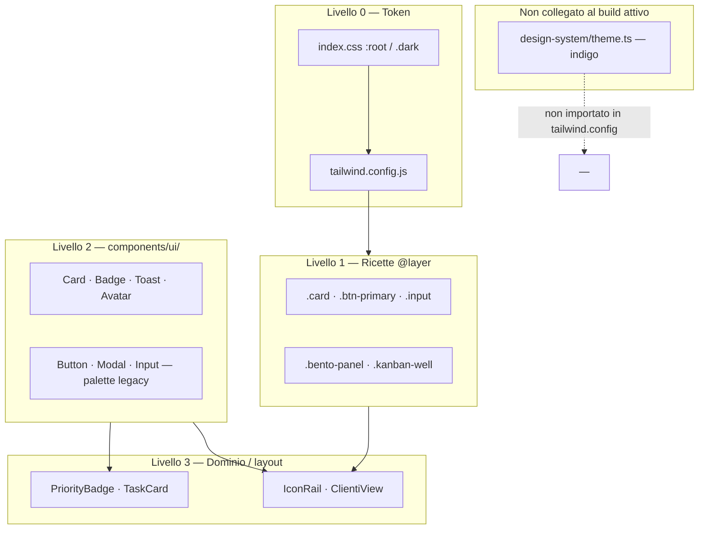
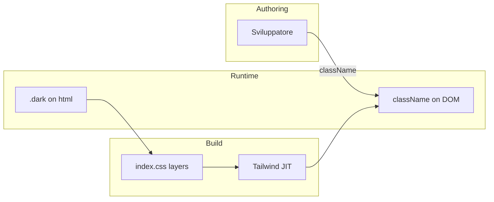
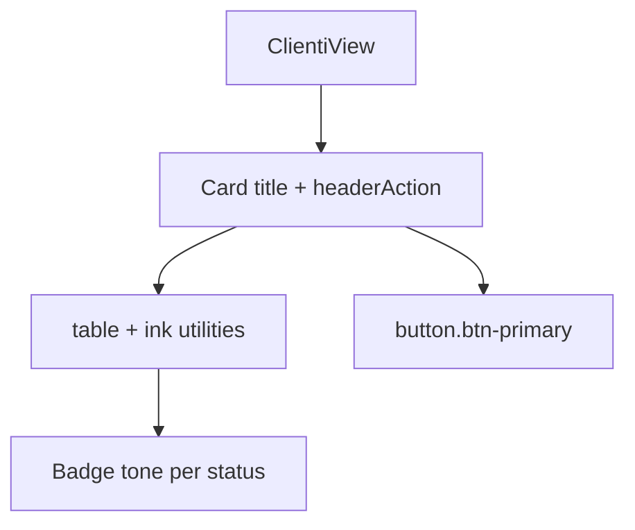
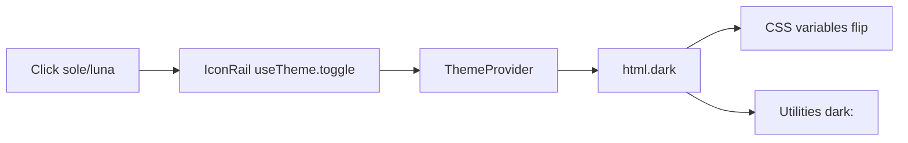
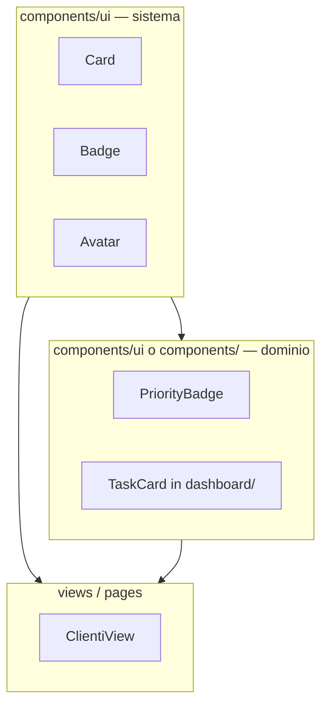
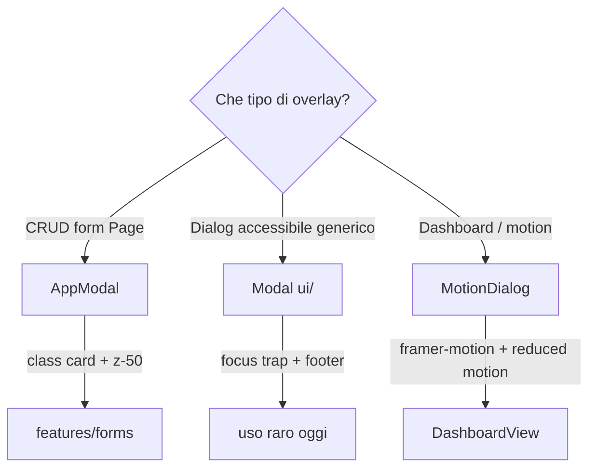
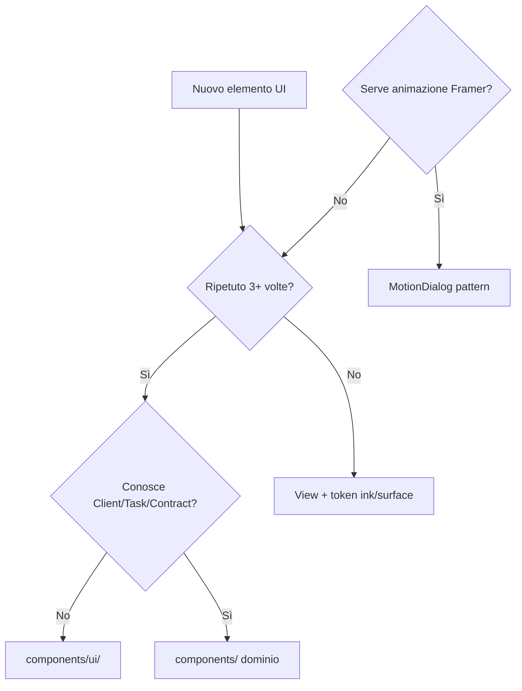

# Capitolo 7 — Design system, styling e componentizzazione

📄 **Modulo 7** · `gestionale-app/`  
**Prerequisito:** [Capitolo 6 — Concorrenza e UX di errore](./06-concorrenza-integrita-e-errori.md)  
**Obiettivo:** capire **come mantenere coerenza visiva** senza Storybook enterprise, quando estrarre un primitivo in `components/ui/`, e perché nel repo convivono **due linguaggi visivi** (token `ink`/`surface` vs componenti `primary-*` legacy) — così non aggiungi un terzo per errore.

---

## 7.0 Gerarchia visiva del progetto



> **Concetto chiave — Design system ≠ cartella `design-system/`**  
> Il sistema **vivo** è `index.css` + `tailwind.config.js` + primitivi usati nelle View. I file in `src/design-system/` sono **bozza storica** (palette indigo) non montata nel build Tailwind attuale.

---

## 7.1 Filosofia del design system interno

### Teoria: pragmatic design system

Un design system in produzione può essere:

| Modello | Esempio | Noi |
|---------|---------|-----|
| **Documentato + Storybook** | Material, Radix docs | ❌ Non ancora |
| **Token + primitivi + convenzioni** | Molte SaaS interne | ✅ |
| **Solo utility Tailwind** | Prototipi rapidi | Parziale (Views + form) |

**Perché non Storybook subito:** team piccolo, iterazione layout dashboard prioritaria. Il costo di Storybook si ripaga quando i primitivi sono **stabili** — oggi parte del catalogo `ui/` non è allineato al tema verde (§7.2).

### Tre regole per non creare legacy visivo

1. **Token semantici prima del colore hex** — `text-ink-muted`, non `text-gray-500` (rompe il dark mode).
2. **Un modo per i bottoni principali** — preferire `.btn-primary` finché `Button` non usa `brand-*`.
3. **Primitivo solo se ripetuto ≥3 volte** con stessa API — altrimenti composizione `Card` + classi.

### Quando creare un nuovo file in `components/ui/`

| Crea primitivo se… | Resta in View / `@layer` se… |
|--------------------|------------------------------|
| API stabile (variant, size, a11y) | Markup usato una sola volta |
| Usato in Views + dashboard + layout | Stile legato a una griglia (bento) |
| Deve sopravvivere al cambio tema | Esperimento visivo |

### Quando **non** è `components/ui/`

| Collocazione | Esempio |
|--------------|---------|
| `components/dashboard/` | Kanban, widget bento |
| `views/` | Tabella clienti con callback |
| `features/forms/` | Campi legati a dominio |
| `layout/` | IconRail, TopBar |

---

## 7.2 Tailwind + token semantici

### Teoria: design token e tema

I **token** separano “cosa significa” dal “valore in pixel”:

- `--ink` = testo principale (cambia tra light/dark)
- `--brand-600` = azione primaria (scala fissa)

```css
/* index.css — semantic surfaces */
:root {
  --surface:        250 252 251;
  --surface-raised: 255 255 255;
  --ink:            12 20 16;
  --line:           214 226 220;
}
.dark {
  --surface:        8 11 10;
  --ink:            236 244 240;
  /* … */
}
```

```js
// tailwind.config.js — bridge verso classi Tailwind
ink: {
  DEFAULT: 'rgb(var(--ink) / <alpha-value>)',
  muted:   'rgb(var(--ink-muted) / <alpha-value>)',
},
surface: {
  DEFAULT: 'rgb(var(--surface) / <alpha-value>)',
  raised:  'rgb(var(--surface-raised) / <alpha-value>)',
},
```

**Perché `rgb(var(--x) / <alpha-value>)`:** un token, opacità in utility (`bg-surface/80`), tema con `class="dark"` su `<html>`.

### `@layer components` — ricette condivise

Oltre alle utility, `index.css` definisce **ricette** riusate ovunque:

| Classe | Ruolo |
|--------|-------|
| `.card` | Pannello raised, bordo `line`, `shadow-soft` |
| `.btn-primary` | CTA gradient brand (identità JEINS) |
| `.input` | Campo form allineato al tema |
| `.icon-btn` | Azioni compatte in header/tabelle |
| `.chip` | Base per `Badge` |
| `.bento-panel` | Dashboard grid |



### Trade-off: utility-first vs CSS modules

| | Tailwind + `@layer` (scelta) | CSS modules |
|--|------------------------------|-------------|
| Coerenza tema | Token centralizzati | File per componente |
| Bundle | JIT, solo classi usate | Scoped locale |
| Refactor | Safelist per `@apply` | Più isolamento |
| Curva | Alta su classi lunghe | Bassa per junior CSS |

**Safelist in `tailwind.config.js`:** classi usate **solo** dentro `@apply` in `index.css` non compaiono nel scan JSX — senza safelist spariscono in produzione.

### `design-system/theme.ts` — secondo sistema (non attivo)

```ts
// design-system/theme.ts — estratto
primary: { 600: '#4f46e5' }, // indigo, NON brand verde
```

`tailwind-theme.ts` esporta estensioni che **non** sono importate in `tailwind.config.js`.

| Sistema | Palette | Stato |
|---------|---------|-------|
| **Attivo** | Verde `brand-*`, semantic `ink`/`surface` | Produzione CRUD + layout |
| **Legacy file** | Indigo `primary` in `theme.ts` | Documentazione / futuro merge |
| **`Button.tsx`** | Classi `primary-600` | **Disallineato** — scala non in config |

> **Azione consigliata (non bloccante onboarding)**  
> O rimuovi/aggiorni `Button` e `Input` verso `brand-*`, o collega `theme.ts` al config — **non** introdurre un terzo stile nei nuovi file.

### Gradienti e accent dashboard

`backgroundImage`: `grad-brand`, `grad-cyan`, … — per hero, metriche, rail attivo. Gli **accent** (`accent.pink`, `accent.cyan`) servono stati e chart, non testo body.

---

## 7.3 Primitivi UI

### Teoria: API di un primitivo

Un primitivo espone:

- **varianti** limitate (enum, non stringa libera);
- **stati** (`disabled`, `isLoading`);
- **accessibilità minima** (`aria-*`, focus visible globale in `index.css`);
- **`className` escape hatch** via `cn()`.

### `Card` — allineato al sistema attivo

```tsx
// components/ui/Card.tsx — usa .card e token ink
variantStyles = {
  default: 'card',
  panel: 'bento-panel',
  outlined: 'border border-line/60 bg-surface-raised rounded-2xl',
};
```

| Prop | Uso |
|------|-----|
| `title` / `subtitle` / `headerAction` | Widget tipo lista clienti |
| `padding="none"` | Tabelle full-bleed dentro card |
| `variant="panel"` | Dashboard bento |

**Views CRUD** (`ClientiView`, `ProgettiView`, `ContabilitaView`) usano quasi sempre `Card` + `Badge` — pattern da replicare.

### `Badge` — toni semantici, non colori raw

```tsx
tone: 'violet' | 'cyan' | 'emerald' | … 
// mappa a bg-brand-500/15, text-brand-300, border-brand-500/30
```

**Perché `tone` e non `color="green"`:** il tono comunica **categoria visiva** (stato commerciale, priorità) senza legare a un hex che non esiste in dark.

### `Button` / `Modal` / `Input` — catalogo parziale

Esportati da `components/ui/index.ts`, ma **poco usati** nelle page CRUD attuali (preferenza `btn-primary`).

| Componente | A11y presente | Allineamento tema |
|------------|---------------|-------------------|
| `Button` | `aria-busy`, focus ring | ❌ `primary-*` assente in config |
| `Modal` | focus trap, ESC, restore focus | Palette legacy |
| `Input` / `Select` | label/error props | `neutral-*` + `primary-*` |
| `Toast` | auto-dismiss | ✅ `brand` / `error` token |

**Quando usare `Modal` vs `AppModal`:** vedi §7.7.

### `Toast` + shell globale

Integrato con `NoticeProvider` (Cap. 6): varianti `success | error | warning | info` con bordi semantici `error-900`, `brand-950`, ecc.

### Form: due livelli

| Livello | Dove | Esempio |
|---------|------|---------|
| Primitivo generico | `components/ui/Form.tsx` | `FormField`, `FormGroup` |
| Campi feature | `features/forms/modals.tsx` | `FormField` locale + `.input` implicito via classi |

I modali CRUD usano **form feature** + `className="btn-primary"` — non il componente `<Button variant="primary">`.

### Albero rendering — lista clienti



---

## 7.4 `cn()` e composizione classi

### Teoria: conflitti tra classi Tailwind

`clsx` concatena condizionali; **`tailwind-merge`** risolve collisioni (`p-4` + `p-2` → vince l’ultima significativa).

```ts
// utils/cn.ts
export function cn(...inputs: ClassValue[]) {
  return twMerge(clsx(inputs));
}
```

| Senza `twMerge` | Con `twMerge` |
|-----------------|---------------|
| `cn('p-4', 'p-2')` → entrambe, comportamento indefinito | `p-2` vince |
| Override variant su `Card` fragile | `className` prop sicura |

**Regola:** in primitivi `components/ui/*` usa sempre `cn()` per `className` esterna. Nelle View, stringhe semplici sono accettabili se non sovrascrivi lo stesso axis (padding vs padding).

### Anti-pattern

```tsx
// ❌ fragile
className={`card ${isActive ? 'border-brand-500' : ''} ${className}`}

// ✅
className={cn('card', isActive && 'border-brand-500', className)}
```

---

## 7.5 Tema chiaro / scuro

### Teoria: `class` strategy

`darkMode: 'class'` in Tailwind: il tema non segue solo `prefers-color-scheme`, ma la scelta utente (persistita).

```tsx
// theme/ThemeProvider.tsx
useEffect(() => {
  if (theme === 'dark') root.classList.add('dark');
  else root.classList.remove('dark');
  localStorage.setItem('gestionale.theme', theme);
}, [theme]);
```

| Scelta | Perché |
|--------|--------|
| Default **`dark`** | Dashboard “product” nasce per scuro |
| `localStorage` | Preferenza sopravvive al refresh |
| Toggle in **`IconRail`** | Sempre raggiungibile, non sepolto in settings |



### Implicazioni per componenti

| Area | Nota |
|------|------|
| Testo | `text-ink`, `text-ink-muted` — mai `text-gray-700` fisso |
| Superfici | `bg-surface-raised` per card |
| Input datetime | `color-scheme: dark` in `.dark` (index.css) |
| Chart / badge | Opacità `/15` su accent — leggibili su entrambi i temi |
| `ConflictDialog` | Ancora `bg-white` — **fuori tema** (Cap. 6) |

### `ThemeToggle` vs IconRail

Esiste `components/ui/ThemeToggle.tsx`; la shell usa il toggle integrato nella rail. Un solo entry point evita doppia logica — riusa `useTheme()` ovunque.

### Contrasto e focus

Focus globale:

```css
:focus-visible {
  outline: 2px solid rgb(26 122 85 / 0.55);
}
```

Non sostituisce audit WCAG su ogni componente — ma garantisce **un** anello coerente su elementi nativi e bottoni custom.

---

## 7.6 Componenti “dominio” vs “sistema”

### Teoria: bounded context nel UI kit

| Tipo | Conosce il dominio? | Esempio |
|------|---------------------|---------|
| **Sistema (primitivo)** | No | `Button`, `Card`, `Avatar` |
| **Dominio (specialized)** | Sì | `PriorityBadge`, `TaskCard` |
| **Feature widget** | Sì + layout complesso | `KanbanBoard` |



### `PriorityBadge` — specializzazione corretta

```tsx
priority: 'Bassa' | 'Media' | 'Alta'  // tipo dominio Task
```

**Perché non un `Badge tone` generico in Kanban:** la mappa priorità → colore è **regola business** ripetuta in board e card; centralizzarla evita tre copie di classi emerald/amber/rose.

### Regole di naming e collocazione

| Nome | Dove |
|------|------|
| `Button`, `Modal` | `components/ui/` |
| `PriorityBadge` | `components/ui/` ok (piccolo, riusabile) |
| `TaskCard`, `KanbanBoard` | `components/dashboard/` |
| `ClientiView` | `views/` |

**Test:** se il componente ha senso **senza** conoscere “cliente” o “task”, è sistema; altrimenti dominio o view.

### `Avatar` / `AvatarGroup`

Sistema puro: iniziali, size `sm|md`, colori derivati dal nome. Usato in `ClientiView`, `TopBar` — nessuna dipendenza da API.

---

## 7.7 Modali: `AppModal` vs `Modal` vs `MotionDialog`

### Tre astrazioni, tre contesti



| | `AppModal` | `Modal` (`ui/`) | `MotionDialog` |
|--|------------|-----------------|----------------|
| **Usato da** | Clients, Projects, Billing | Potenziale generico | Dashboard |
| **Stile** | `.card`, token app | Stile legacy/indigo | Panel passato via `className` |
| **Motion** | `animate-fade-in` CSS | Minima | Framer + `useReducedMotion` |
| **A11y** | `aria-label` chiudi | ESC, focus restore | `role="dialog"`, backdrop button |
| **z-index** | 50 | — | 70 |

### Perché non unificare domani

| Unificare tutto in `Modal` | Costo |
|----------------------------|-------|
| Allineare stile a `card` + tema | Refactor ConflictDialog, Admin modali inline |
| Motion opzionale | API più complessa (`motion?: boolean`) |
| CRUD non ha bisogno Framer | Peso bundle |

**Criterio pratico oggi:**

- **Nuova modale CRUD** → `AppModal` + contenuto form.
- **Overlay dashboard con animazione** → `MotionDialog` o estensione con `prefers-reduced-motion`.
- **Non** copiare markup modale inline (AdminPanel ha modali proprie — debito).

### `ConflictDialog` — quarta variante

Fuori dal design system (grigi tailwind generici). Refactor = wrappare contenuto in `AppModal` o portare classi `surface`/`ink` — priorità media dopo funzionalità.

---

## Sintesi decisionale — stile in un nuovo file



---

## Alternative considerate

| Scelta | Alternativa | Perché non (ora) |
|--------|-------------|------------------|
| Token CSS + `@layer` | Solo shadcn copy-paste | shadcn non adottato; tema custom JEINS |
| `btn-primary` global | Solo `<Button>` | Migrazione incompleta |
| Storybook | Figma handoff | Costo maintenance |
| CSS-in-JS (styled-components) | — | Tailwind già everywhere |
| Un modal | Radix Dialog ovunque | Dipendenza + refactor largo |

---

## Segnali d’allarme in code review

| Diff | Verdetto |
|------|----------|
| `text-gray-600` su sfondo `surface` | ⚠️ Usa `ink-muted` |
| Nuovo `primary-500` senza scala in config | ❌ |
| Hex inline per sfondo card | ⚠️ Usa `card` o `surface-raised` |
| Primitivo `ui/` che importa `services/api` | ❌ È dominio |
| Quarto tipo modale custom | ⚠️ Estendi AppModal o Modal |
| `@apply` senza safelist se classe unica in css | ❌ Build prod rotta |

---

## Esercizio (50 minuti)

1. Apri `/clienti` in light e dark: elenca 5 classi token (`ink`, `surface`, `line`, `brand`) visibili nel DOM.
2. Confronta `Button.tsx` variant `primary` con `.btn-primary` in `index.css`: quale è effettivamente usato in `AddClientForm`?
3. Proposta: come rifattorizzeresti `ConflictDialog` in 3 bullet (token, shell, z-index) senza cambiare logica 409?
4. Disegna dove metteresti un nuovo componente `StatusSelect` riusato in Clienti e Progetti.

**Criterio:** (4) risposta `features/forms` o `components/ui` con motivazione **dominio vs sistema**.

---

## Prossimo capitolo

→ **Modulo 8 — Motion, interazione avanzata e accessibilità** (`08-motion-e-accessibilita.md`, da redigere): `BentoCell`, `useReducedMotion`, coerenza con `MotionDialog`.

---

## Riferimenti rapidi

| Argomento | File |
|-----------|------|
| Token CSS | `gestionale-app/src/index.css` |
| Tailwind extend | `gestionale-app/tailwind.config.js` |
| Tema React | `gestionale-app/src/theme/ThemeProvider.tsx` |
| `cn()` | `gestionale-app/src/utils/cn.ts` |
| Primitivi | `gestionale-app/src/components/ui/` |
| Barrel export | `gestionale-app/src/components/ui/index.ts` |
| Modale CRUD | `gestionale-app/src/components/AppModal.tsx` |
| Modale motion | `gestionale-app/src/components/motion/MotionDialog.tsx` |
| Legacy DS file | `gestionale-app/src/design-system/theme.ts` |
| Capitolo precedente | `walkthrough/frontend/06-concorrenza-integrita-e-errori.md` |
